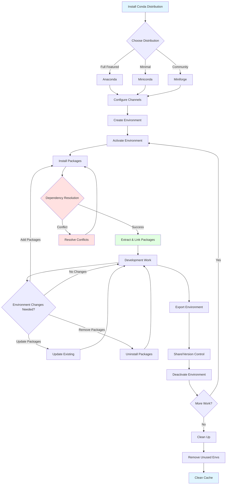

# Conda: Deep Dive & Best Practices

## Introduction

Conda is a cross-platform, language-agnostic package manager and environment management system that revolutionized how developers manage software dependencies. Originally developed to solve package management challenges faced by Python data scientists, Conda has become the de facto standard for managing complex scientific computing environments. This comprehensive guide explores Conda from foundational concepts to advanced optimization techniques, empowering you to build reproducible, isolated, and production-ready development environments.

---

## Table 1: Conda Ecosystem Terminology Mapping

Different tools and contexts use varying terminology for similar concepts. This table maps equivalent terms across the Conda ecosystem:

| Standard Term | Alternative Names | Context/Usage |
|--------------|-------------------|---------------|
| **Environment** | Virtual Environment, Isolated Environment, Sandbox, Workspace | All conda contexts |
| **Package** | Library, Module, Distribution, Bundle | Universal package management |
| **Channel** | Repository, Package Source, Feed, Registry | Package distribution |
| **Dependency Resolution** | Dependency Solving, SAT Solving, Constraint Satisfaction | Package installation |
| **Environment Activation** | Environment Switching, Context Switching, Env Loading | Working with environments |
| **Lock File** | Explicit Spec, Environment Snapshot, Freeze File | Reproducibility |
| **Base Environment** | Root Environment, System Environment, Default Environment | Conda installation |
| **Prefix** | Environment Path, Install Location, Target Directory | Environment storage location |
| **Materialized Environment** | Concrete Environment, Installed Environment, Disk Environment | Physical environment on disk |
| **Abstract Specification** | Loose Spec, Requirements, Dependencies List | High-level requirements |
| **Explicit Specification** | Pinned Spec, Lock Spec, Frozen Requirements | Exact versions specified |
| **Package Metadata** | Package Info, Manifest, Recipe | Package description |
| **Binary Package** | Pre-compiled Package, Built Package, Wheel (pip context) | Ready-to-install format |
| **Solver** | Dependency Solver, SAT Solver, Constraint Solver | libsolv, libmamba |
| **Cross-platform** | Multi-platform, Platform-agnostic, OS-independent | Works on multiple OSes |

---

## Table 2: Hierarchical Conda Ecosystem Structure

This table organizes Conda concepts from high-level abstractions to specific implementations:

| Level | Category | Term | Parent Concept | Description |
|-------|----------|------|----------------|-------------|
| **L1** | Ecosystem | Conda Ecosystem | - | Complete package/environment management system |
| **L2** | Distributions | Anaconda | Conda Ecosystem | Full-featured distribution (~500 packages) |
| **L2** | Distributions | Miniconda | Conda Ecosystem | Minimal installer (conda + Python) |
| **L2** | Distributions | Miniforge | Conda Ecosystem | Community-driven, conda-forge default |
| **L2** | Distributions | Mambaforge | Conda Ecosystem | Miniforge + Mamba (deprecated, use Miniforge) |
| **L2** | Tools | Conda | Conda Ecosystem | Original package manager (Python-based) |
| **L2** | Tools | Mamba | Conda Ecosystem | Fast C++ reimplementation of Conda |
| **L2** | Tools | Micromamba | Conda Ecosystem | Standalone static binary, no Python dependency |
| **L3** | Conda Components | Package Manager | Conda | Installs/updates/removes packages |
| **L3** | Conda Components | Environment Manager | Conda | Creates/manages isolated environments |
| **L3** | Conda Components | Dependency Solver | Conda | Resolves package dependencies (SAT solver) |
| **L3** | Conda Components | Configuration System | Conda | .condarc settings |
| **L4** | Package Management | Installation | Package Manager | Downloads and extracts packages |
| **L4** | Package Management | Update | Package Manager | Upgrades packages to newer versions |
| **L4** | Package Management | Removal | Package Manager | Uninstalls packages |
| **L4** | Package Management | Search | Package Manager | Queries available packages |
| **L4** | Package Management | Rollback | Package Manager | Reverts to previous state |
| **L4** | Environment Operations | Create | Environment Manager | Initialize new environment |
| **L4** | Environment Operations | Activate | Environment Manager | Switch to environment |
| **L4** | Environment Operations | Deactivate | Environment Manager | Exit environment |
| **L4** | Environment Operations | Clone | Environment Manager | Duplicate environment |
| **L4** | Environment Operations | Remove | Environment Manager | Delete environment |
| **L4** | Environment Operations | Export | Environment Manager | Save environment spec |
| **L4** | Environment Operations | Import | Environment Manager | Recreate from spec |
| **L5** | Channels | defaults | Package Sources | Anaconda's official channel |
| **L5** | Channels | conda-forge | Package Sources | Community-maintained channel (20K+ packages) |
| **L5** | Channels | bioconda | Package Sources | Bioinformatics packages |
| **L5** | Channels | pytorch | Package Sources | PyTorch and related packages |
| **L5** | Channels | nvidia | Package Sources | NVIDIA CUDA packages |
| **L5** | Channels | Custom/Private | Package Sources | Organization-specific channels |
| **L5** | Solver Backends | Classic Solver | Dependency Solver | Original Python-based solver |
| **L5** | Solver Backends | libmamba | Dependency Solver | C++ solver (Conda 23.10+) |
| **L5** | Solver Backends | libsolv | Dependency Solver | Used by Mamba/Micromamba |
| **L6** | Package Formats | .conda | Binary Format | Modern compressed format (conda-package 1.0) |
| **L6** | Package Formats | .tar.bz2 | Binary Format | Legacy compressed format |
| **L6** | Package Formats | noarch | Package Type | Platform-independent packages |
| **L6** | Package Formats | Platform-specific | Package Type | OS/architecture-specific builds |
| **L6** | Configuration | .condarc | Config Files | User/system configuration |
| **L6** | Configuration | environment.yml | Config Files | Environment specification |
| **L6** | Configuration | conda-meta/ | Config Files | Environment metadata directory |
| **L7** | Reproducibility | Loose Spec | Specifications | Version ranges (numpy>=1.20) |
| **L7** | Reproducibility | Pinned Spec | Specifications | Exact versions (numpy==1.20.3) |
| **L7** | Reproducibility | Explicit Spec | Specifications | URL + hash (full reproducibility) |
| **L7** | Reproducibility | Lock Files | Specifications | conda-lock, poetry-lock |
| **L7** | Package Types | Python Packages | Language Specific | Python libraries |
| **L7** | Package Types | R Packages | Language Specific | R libraries (r-base, r-*) |
| **L7** | Package Types | System Libraries | Language Specific | C/C++ libraries, compilers |
| **L7** | Package Types | Data Science Tools | Domain Specific | ML, data analysis tools |
| **L7** | Package Types | DevOps Tools | Domain Specific | CI/CD, deployment tools |

---

## Conda Lifecycle and Workflow

Understanding the typical workflow helps organize your package and environment management strategy.

### Complete Conda Lifecycle



---

## Phase 1: Conda Installation and Setup

### 1.1 Choosing the Right Distribution

**Comparison of Conda Distributions:**

| Feature | Anaconda | Miniconda | Miniforge | Micromamba |
|---------|----------|-----------|-----------|------------|
| **Size** | ~3 GB | ~60 MB | ~100 MB | ~13 MB |
| **Pre-installed Packages** | ~500 | ~10 | ~10 | 0 |
| **Default Channel** | defaults (Anaconda) | defaults | conda-forge | conda-forge |
| **Package Manager** | Conda | Conda | Conda/Mamba | Micromamba |
| **Python Dependency** | Yes | Yes | Yes | No |
| **Best For** | Beginners, Desktop | CI/CD, Servers | Open-source, Community | Containers, CI/CD |
| **License** | Free/Commercial Terms | BSD | BSD | BSD |
| **Update Frequency** | Moderate | Frequent | Frequent | Frequent |

**Recommendation:**
- **Learning/Desktop**: Miniforge (best balance of features and performance)
- **Production/CI/CD**: Micromamba (minimal, fast, no Python dependency)
- **Enterprise** (with license): Anaconda (support and curation)
- **Legacy systems**: Miniconda (if avoiding conda-forge)

### 1.2 Installing Miniforge (Recommended)

**Linux/macOS:**

```bash
# Download Miniforge installer
wget https://github.com/conda-forge/miniforge/releases/latest/download/Miniforge3-Linux-x86_64.sh

# Verify checksum (optional but recommended)
sha256sum Miniforge3-Linux-x86_64.sh

# Install
bash Miniforge3-Linux-x86_64.sh

# Follow prompts:
# - Accept license
# - Choose installation location (default: ~/miniforge3)
# - Initialize conda (recommended: yes)

# Reload shell
source ~/.bashrc  # or ~/.zshrc for zsh
```

**macOS (Apple Silicon M1/M2/M3):**

```bash
# Download ARM64 version
wget https://github.com/conda-forge/miniforge/releases/latest/download/Miniforge3-MacOSX-arm64.sh

bash Miniforge3-MacOSX-arm64.sh
```

**Windows:**

```powershell
# Download from: https://github.com/conda-forge/miniforge/releases/latest
# Run: Miniforge3-Windows-x86_64.exe
# Follow GUI installer prompts
```

### 1.3 Installing Micromamba (For Containers/CI)

```bash
# Linux/macOS - single command install
curl -Ls https://micro.mamba.pm/api/micromamba/linux-64/latest | tar -xvj bin/micromamba

# Move to PATH
sudo mv bin/micromamba /usr/local/bin/

# Initialize shell
micromamba shell init -s bash -p ~/micromamba

# Reload shell
source ~/.bashrc
```

### 1.4 Post-Installation Configuration

**Essential Configuration (.condarc):**

```bash
# Open/create configuration file
conda config --show-sources  # View current config

# Set strict channel priority (IMPORTANT)
conda config --set channel_priority strict

# Add conda-forge channel (if using Miniconda)
conda config --add channels conda-forge

# Disable auto-activation of base environment
conda config --set auto_activate_base false

# Set environment location
conda config --append envs_dirs ~/my-envs

# Enable solver (Conda 23.10+)
conda config --set solver libmamba

# View all settings
conda config --show
```

**Recommended .condarc settings:**

```yaml
# ~/.condarc
channels:
  - conda-forge
  - defaults

channel_priority: strict
auto_activate_base: false
auto_update_conda: false
show_channel_urls: true
solver: libmamba  # Use fast C++ solver (Conda 23.10+)

# Environment locations
envs_dirs:
  - ~/.conda/envs
  - ~/my-projects/envs

# Package cache
pkgs_dirs:
  - ~/.conda/pkgs

# Default packages to install in new environments
create_default_packages:
  - pip
  - ipython
```

---

## Phase 2: Understanding Conda Concepts

### 2.1 Environments: Isolation and Independence

**What is a Conda Environment?**

A conda environment is an isolated directory containing:
- A specific Python version (or other interpreters)
- A collection of packages and their dependencies
- Environment-specific configuration
- Separate `PATH` and library settings

**Why Use Environments?**

```python
# Problem without environments
# Project A needs numpy 1.19
# Project B needs numpy 1.23
# Both installed in system Python = CONFLICT!

# Solution with environments
# project-a-env: Python 3.8 + numpy 1.19
# project-b-env: Python 3.10 + numpy 1.23
# No conflicts!
```

**Environment Best Practices:**

1. **One environment per project**
2. **Keep base environment minimal** (only conda/mamba)
3. **Use descriptive names** (project-ml, data-analysis-2024)
4. **Document environments** (export to YAML)
5. **Avoid installing in base** (always create new environment)

### 2.2 Packages: Binary Distributions

**Conda Package Structure:**

```
package-name-version-build.conda
│
├── info/
│   ├── index.json       # Package metadata
│   ├── files            # List of installed files
│   ├── paths.json       # File paths and types
│   └── recipe/          # Build recipe (if included)
│
└── pkg/                 # Actual package files
    ├── lib/             # Libraries
    ├── bin/             # Executables
    ├── include/         # Headers
    └── site-packages/   # Python modules
```

**Conda vs Pip Packages:**

| Feature | Conda | Pip |
|---------|-------|-----|
| **Language Support** | Any (Python, R, C++, Java) | Python only |
| **Binary Dependencies** | Yes (includes C libraries) | Limited |
| **Dependency Solver** | SAT solver (comprehensive) | Basic resolver |
| **Platform** | Cross-platform optimized | Primarily source-based |
| **System Libraries** | Included in package | Requires system install |
| **Virtual Environments** | Built-in | Requires virtualenv/venv |
| **Package Format** | .conda, .tar.bz2 | .whl, .tar.gz |
| **Best For** | Data science, scientific computing | Pure Python packages |

### 2.3 Channels: Package Repositories

**Channel Hierarchy:**

```
Highest Priority
    │
    ├── Your Private Channel
    ├── conda-forge
    ├── bioconda
    └── defaults (Anaconda)
    │
Lowest Priority
```

**Major Channels:**

1. **defaults** (Anaconda Inc.)
   - Curated, tested packages
   - Commercial use restrictions (as of 2024)
   - ~7,500 packages
   - Optimized for stability

2. **conda-forge** (Community)
   - 20,000+ packages
   - Fully open-source
   - Rapid updates
   - Community-driven
   - **RECOMMENDED** for most users

3. **bioconda**
   - 10,000+ bioinformatics packages
   - Requires conda-forge
   - Specialized for life sciences

4. **pytorch**, **nvidia**, **intel**
   - Vendor-specific optimized packages
   - GPU/accelerated computing

**Channel Configuration:**

```bash
# View current channels
conda config --show channels

# Add channel (appends to list)
conda config --add channels conda-forge

# Remove channel
conda config --remove channels defaults

# Set channel priority
conda config --set channel_priority strict  # RECOMMENDED

# Channel priority modes:
# - strict: Only use highest priority channel for each package
# - flexible: Mix packages from different channels (can cause conflicts)
```

### 2.4 Dependency Resolution: The SAT Solver

**How Conda Resolves Dependencies:**

Conda uses a Boolean Satisfiability (SAT) solver to find a valid combination of package versions.

**Example Scenario:**

```
You want to install: pandas

Conda analyzes:
pandas 2.0.0 requires:
  - numpy >= 1.20.3
  - python >= 3.8
  - pytz >= 2020.1

numpy 1.24.0 requires:
  - python >= 3.8, <3.12

Your environment has:
  - python 3.11

Solver determines:
  ✓ python 3.11 (compatible with all)
  ✓ numpy 1.24.0 (compatible)
  ✓ pandas 2.0.0 (compatible)
  ✓ pytz 2023.3 (latest compatible)
```

**When Solver Fails:**

```bash
# Error message example
UnsatisfiableError: The following specifications were found to be incompatible:
  - package-a -> requires python 2.7
  - package-b -> requires python >= 3.8

# Resolution strategies:
# 1. Relax version constraints
# 2. Use different package versions
# 3. Create separate environments
# 4. Check channel priorities
```

---

## Phase 3: Creating and Managing Environments

### 3.1 Creating Environments

**Basic Environment Creation:**

```bash
# Create empty environment
conda create -n myenv

# Create with specific Python version
conda create -n myenv python=3.10

# Create with multiple packages
conda create -n data-sci python=3.10 numpy pandas matplotlib

# Create with specific package versions
conda create -n myenv python=3.10 numpy=1.24 pandas>=2.0

# Create from environment.yml
conda env create -f environment.yml

# Create with custom location (prefix)
conda create --prefix ./envs/myenv python=3.10
```

**Advanced Creation Options:**

```bash
# Install all packages at once (RECOMMENDED)
conda create -n myenv \
  python=3.10 \
  numpy=1.24 \
  pandas=2.0 \
  scikit-learn=1.3 \
  jupyter \
  matplotlib

# Specify channels during creation
conda create -n myenv -c conda-forge python=3.10 pandas

# Clone existing environment
conda create -n myenv-copy --clone myenv

# Create without default packages
conda create -n myenv --no-default-packages python=3.10

# Dry run (see what would be installed)
conda create -n myenv python=3.10 numpy --dry-run
```

### 3.2 Activating and Deactivating Environments

**Activation:**

```bash
# Activate environment
conda activate myenv

# Verify activation (prompt changes)
# (myenv) user@machine:~$

# Check active environment
conda info --envs  # Active environment marked with *

# Check Python location
which python
# Output: /home/user/miniforge3/envs/myenv/bin/python
```

**Deactivation:**

```bash
# Deactivate current environment
conda deactivate

# Return to base environment
# (base) user@machine:~$

# Completely exit conda
conda deactivate
# (if base was active, deactivates base too)
```

**Activation Best Practices:**

```bash
# For HPC/shared systems, use source activate (legacy but stable)
source activate myenv

# For scripts, use full path
/path/to/envs/myenv/bin/python script.py

# For cron jobs, activate within script
#!/bin/bash
source ~/miniforge3/etc/profile.d/conda.sh
conda activate myenv
python my_script.py
```

### 3.3 Listing and Inspecting Environments

```bash
# List all environments
conda env list
# or
conda info --envs

# Output example:
# base                     /home/user/miniforge3
# myenv                 *  /home/user/miniforge3/envs/myenv
# data-sci                 /home/user/miniforge3/envs/data-sci

# Get environment details
conda info

# List packages in active environment
conda list

# List packages in specific environment
conda list -n myenv

# Search for specific package
conda list numpy

# Show package details
conda search numpy --info

# Check environment size
du -sh ~/miniforge3/envs/myenv
```

### 3.4 Removing Environments

```bash
# Remove environment by name
conda env remove -n myenv

# Remove environment by prefix
conda env remove --prefix ./envs/myenv

# Force removal (ignore errors)
conda env remove -n myenv --yes

# Remove environment and clear cache
conda env remove -n myenv
conda clean --all
```

---

## Phase 4: Package Management

### 4.1 Installing Packages

**Basic Installation:**

```bash
# Install single package
conda install numpy

# Install multiple packages
conda install numpy pandas matplotlib

# Install specific version
conda install numpy=1.24.0

# Install with version constraint
conda install "numpy>=1.20,<1.25"

# Install from specific channel
conda install -c conda-forge geopandas

# Install into specific environment
conda install -n myenv numpy

# Install with dependencies from file
conda install --file requirements.txt
```

**Best Practices for Installation:**

```bash
# RECOMMENDED: Install all packages at once
conda install package1 package2 package3 package4

# AVOID: Installing one at a time
conda install package1
conda install package2  # May cause dependency conflicts
conda install package3
conda install package4

# Use mamba for faster installation (if available)
mamba install numpy pandas scikit-learn

# Specify build string for reproducibility
conda install numpy=1.24.0=py310h1234567_0
```

### 4.2 Updating Packages

```bash
# Update single package
conda update numpy

# Update all packages in environment
conda update --all

# Update conda itself
conda update -n base conda

# Update specific package to latest in channel
conda update -c conda-forge numpy

# Update with constraints
conda update numpy --no-pin

# Dry run (see what would be updated)
conda update --all --dry-run
```

### 4.3 Removing Packages

```bash
# Remove single package
conda remove numpy

# Remove multiple packages
conda remove numpy pandas

# Remove from specific environment
conda remove -n myenv numpy

# Remove package and its dependencies (if not needed by others)
conda remove --force numpy

# Remove all packages (keep environment)
conda remove -n myenv --all
```

### 4.4 Searching for Packages

```bash
# Search for package
conda search pandas

# Search in specific channel
conda search -c conda-forge geopandas

# Search with wildcards
conda search "pandas*"

# Get detailed package info
conda search pandas --info

# Check if package is installed
conda list | grep numpy

# Find which package provides a file
conda search */bin/python
```

---

## Phase 5: Reproducibility and Sharing

### 5.1 Environment Specification Files

**environment.yml (Recommended):**

```yaml
# environment.yml
name: myproject
channels:
  - conda-forge
  - defaults
dependencies:
  - python=3.10
  - numpy=1.24
  - pandas>=2.0
  - matplotlib
  - scikit-learn
  - pip
  - pip:
    - some-pip-only-package==1.2.3
```

**Creating from environment.yml:**

```bash
# Create environment from file
conda env create -f environment.yml

# Create with different name
conda env create -f environment.yml -n different-name

# Update existing environment from file
conda env update -f environment.yml --prune
# --prune removes packages not in file
```

### 5.2 Exporting Environments

**Export Methods:**

```bash
# 1. Export to YAML (cross-platform, loose versions)
conda env export --name myenv > environment.yml

# 2. Export without builds (more portable)
conda env export --name myenv --no-builds > environment.yml

# 3. Export only explicitly installed packages
conda env export --from-history > environment.yml

# 4. Export with pip packages
conda env export --name myenv > environment.yml

# 5. Explicit spec (exact reproducibility, platform-specific)
conda list --explicit > spec-file.txt
```

**Comparison of Export Methods:**

| Method | Portability | Reproducibility | Use Case |
|--------|-------------|-----------------|----------|
| `--from-history` | High | Low | Sharing across platforms |
| `--no-builds` | Medium | Medium | Similar platforms |
| Default export | Low | High | Same platform/architecture |
| `--explicit` | Very Low | Highest | Exact replication, same OS |

**Example Exports:**

```yaml
# environment.yml (from-history)
name: myenv
channels:
  - conda-forge
dependencies:
  - python=3.10
  - numpy
  - pandas

# environment.yml (default)
name: myenv
channels:
  - conda-forge
dependencies:
  - python=3.10.8=h12345_0_cpython
  - numpy=1.24.0=py310h23456_0
  - pandas=2.0.0=py310h34567_0
  - pip:
    - requests==2.28.1
```

```txt
# spec-file.txt (explicit)
# This file may be used to create an environment using:
# $ conda create --name <env> --file <this file>
# platform: linux-64
@EXPLICIT
https://conda.anaconda.org/conda-forge/linux-64/python-3.10.8-h1234567_0_cpython.conda#abc123
https://conda.anaconda.org/conda-forge/linux-64/numpy-1.24.0-py310h234567_0.conda#def456
```

### 5.3 Recreating Environments

```bash
# From environment.yml
conda env create -f environment.yml

# From explicit spec
conda create --name myenv --file spec-file.txt

# From requirements.txt (pip-style)
conda create --name myenv --file requirements.txt

# Verify recreation
conda list --name myenv
```

---

## Phase 6: Advanced Environment Management

### 6.1 Environment Variables

```bash
# Set environment variables for specific environment
conda env config vars set VAR_NAME=value -n myenv

# Set multiple variables
conda env config vars set \
  API_KEY=abc123 \
  DATABASE_URL=postgres://localhost/db \
  -n myenv

# List environment variables
conda env config vars list -n myenv

# Unset environment variable
conda env config vars unset VAR_NAME -n myenv

# Variables are activated/deactivated with environment
conda activate myenv
echo $VAR_NAME  # Output: value
conda deactivate
echo $VAR_NAME  # Output: (empty)
```

**Activation/Deactivation Scripts (Advanced):**

```bash
# Create activation script
mkdir -p $CONDA_PREFIX/etc/conda/activate.d
cat > $CONDA_PREFIX/etc/conda/activate.d/env_vars.sh << 'EOF'
#!/bin/bash
export OLD_PATH=$PATH
export PATH=/custom/path:$PATH
export MY_VAR=value
EOF

# Create deactivation script
mkdir -p $CONDA_PREFIX/etc/conda/deactivate.d
cat > $CONDA_PREFIX/etc/conda/deactivate.d/env_vars.sh << 'EOF'
#!/bin/bash
export PATH=$OLD_PATH
unset MY_VAR
EOF

# Make executable
chmod +x $CONDA_PREFIX/etc/conda/activate.d/env_vars.sh
chmod +x $CONDA_PREFIX/etc/conda/deactivate.d/env_vars.sh
```

### 6.2 Managing Multiple Python Versions

```bash
# Create environments with different Python versions
conda create -n py38 python=3.8
conda create -n py39 python=3.9
conda create -n py310 python=3.10
conda create -n py311 python=3.11
conda create -n py312 python=3.12

# Switch between versions
conda activate py38
python --version  # Python 3.8.x

conda activate py311
python --version  # Python 3.11.x

# Install same package in different Python versions
conda install -n py38 numpy
conda install -n py311 numpy
```

### 6.3 Pinning Packages

**Prevent Package Updates:**

```bash
# In environment directory, create pinned file
echo "numpy ==1.24.0" >> $CONDA_PREFIX/conda-meta/pinned
echo "pandas >=2.0,<2.1" >> $CONDA_PREFIX/conda-meta/pinned

# Now updates will respect pins
conda update --all  # numpy stays at 1.24.0

# Override pins temporarily
conda update numpy --no-pin

# Example pinned file
# $CONDA_PREFIX/conda-meta/pinned
numpy ==1.24.0
pandas >=2.0,<2.1
python 3.10.*
```

### 6.4 Environment Stacking and Composition

```bash
# Base environment with common tools
conda create -n base-tools python=3.10 pip ipython

# Project-specific environment extending base
conda create -n project1 --clone base-tools
conda install -n project1 numpy pandas matplotlib

# Another project with different packages
conda create -n project2 --clone base-tools
conda install -n project2 scikit-learn tensorflow
```

---

## Phase 7: Conda and Pip Integration

### 7.1 When to Use Conda vs Pip

**Decision Tree:**

```
Need to install package?
│
├─ Available in conda-forge? → Use conda
│
├─ Pure Python package? → Can use either
│   ├─ Has C extensions? → Prefer conda
│   └─ Simple Python code? → Either works
│
├─ Requires system libraries? → Use conda
│
└─ Only on PyPI? → Use pip
```

### 7.2 Best Practices for Mixing Conda and Pip

**Recommended Workflow:**

```bash
# 1. Create environment with conda
conda create -n myenv python=3.10

# 2. Activate environment
conda activate myenv

# 3. Install conda packages FIRST
conda install numpy pandas scipy scikit-learn

# 4. THEN install pip packages
pip install package-only-on-pypi

# 5. Export both conda and pip dependencies
conda env export > environment.yml
```

**Why This Order Matters:**

```bash
# WRONG ORDER (pip first, then conda)
conda create -n myenv python=3.10
conda activate myenv
pip install numpy pandas  # pip installed versions
conda install scipy       # conda may REPLACE pip packages!

# RIGHT ORDER (conda first, then pip)
conda create -n myenv python=3.10
conda activate myenv
conda install numpy pandas scipy  # All from conda
pip install special-package       # Only pip-exclusive packages
```

**Including Pip Packages in environment.yml:**

```yaml
name: myenv
channels:
  - conda-forge
dependencies:
  - python=3.10
  - numpy=1.24
  - pandas>=2.0
  - scikit-learn
  - pip
  - pip:
    # Packages only available on PyPI
    - transformers==4.30.0
    - datasets
    - wandb
```

### 7.3 Handling Conflicts Between Conda and Pip

```bash
# Check which package manager installed what
conda list

# Output shows source:
# numpy    1.24.0    py310h123_0    conda-forge
# pandas   2.0.0     py310h456_0    pypi

# If conflicts arise, reinstall via conda
pip uninstall numpy
conda install numpy

# Or create fresh environment
conda create -n fresh-env python=3.10
conda activate fresh-env
conda install numpy pandas scipy  # Only conda packages
```

---

## Phase 8: Performance Optimization

### 8.1 Using Mamba for Speed

**Installing Mamba:**

```bash
# In base environment
conda install -n base mamba

# Or install Miniforge (includes mamba)
# Miniforge comes with mamba pre-installed

# Verify installation
mamba --version
```

**Using Mamba:**

```bash
# Replace 'conda' with 'mamba' in commands
mamba create -n myenv python=3.10 numpy pandas
mamba install scikit-learn
mamba update --all

# Speed comparison:
# conda install: 2-10 minutes
# mamba install: 10-60 seconds
# Speedup: 10-100x faster
```

**Why Mamba is Faster:**

| Feature | Conda | Mamba |
|---------|-------|-------|
| **Implementation** | Python | C++ |
| **Solver** | Classic/libmamba | libsolv |
| **Parallel Downloads** | No | Yes |
| **Dependency Resolution** | Slower | Much faster |
| **Memory Usage** | Higher | Lower |
| **Compatibility** | Full | 99.9% |

### 8.2 Using Micromamba for CI/CD

**Micromamba Advantages:**

- **No Python dependency** (static binary)
- **Extremely small** (~13 MB)
- **Fast** (same solver as Mamba)
- **Perfect for Docker** and CI/CD pipelines

**Docker Example with Micromamba:**

```dockerfile
FROM ubuntu:22.04

# Install micromamba
RUN curl -Ls https://micro.mamba.pm/api/micromamba/linux-64/latest | tar -xvj bin/micromamba && \
    mv bin/micromamba /usr/local/bin/

# Setup shell
ENV MAMBA_ROOT_PREFIX=/opt/conda
ENV MAMBA_EXE=/usr/local/bin/micromamba

# Create environment from file
COPY environment.yml /tmp/environment.yml
RUN micromamba create -y -f /tmp/environment.yml

# Activate environment in shell
SHELL ["micromamba", "run", "-n", "myenv", "/bin/bash", "-c"]

# Your application
COPY app.py /app/
WORKDIR /app

CMD ["micromamba", "run", "-n", "myenv", "python", "app.py"]
```

**GitHub Actions with Micromamba:**

```yaml
name: CI
on: [push]

jobs:
  test:
    runs-on: ubuntu-latest
    steps:
      - uses: actions/checkout@v3
      
      - name: Setup Micromamba
        uses: mamba-org/setup-micromamba@v1
        with:
          micromamba-version: latest
          environment-file: environment.yml
          cache-environment: true
      
      - name: Run tests
        run: |
          micromamba run -n myenv pytest tests/
```

### 8.3 Conda Configuration for Speed

```bash
# Enable libmamba solver (Conda 23.10+)
conda config --set solver libmamba

# Disable safety checks (faster but riskier)
conda config --set safety_checks disabled

# Use strict channel priority (faster resolution)
conda config --set channel_priority strict

# Increase download timeout
conda config --set remote_connect_timeout_secs 30
conda config --set remote_read_timeout_secs 120

# Disable update notifications
conda config --set notify_outdated_conda false

# Parallel downloads (experimental)
conda config --set default_threads 8
```

---

## Phase 9: Cleaning and Maintenance

### 9.1 Cleaning Package Cache

```bash
# View cache size
conda info

# Output shows:
# package cache : /home/user/.conda/pkgs
#                 12.5 GB

# Remove unused packages
conda clean --packages

# Remove tarballs (keep extracted packages)
conda clean --tarballs

# Remove index cache
conda clean --index-cache

# Remove all (packages, tarballs, cache)
conda clean --all

# Dry run (see what would be removed)
conda clean --all --dry-run

# Force clean without confirmation
conda clean --all --yes
```

### 9.2 Managing Disk Space

```bash
# Check environment sizes
du -sh ~/miniforge3/envs/*

# Output:
# 1.2G    /home/user/miniforge3/envs/data-sci
# 850M    /home/user/miniforge3/envs/ml-project
# 2.3G    /home/user/miniforge3/envs/old-project

# Remove old/unused environments
conda env remove -n old-project

# Check package cache
du -sh ~/.conda/pkgs
# Output: 8.5G

# Clean after removing environments
conda clean --all
```

### 9.3 Verifying Environment Integrity

```bash
# Verify packages
conda list --explicit

# Check for broken packages
conda list --revisions

# Rollback to previous state
conda install --revision 5

# Verify environment can be activated
conda activate myenv
python -c "import numpy; print(numpy.__version__)"
conda deactivate

# Validate environment.yml
conda env create -f environment.yml --dry-run
```

---

## Phase 10: Troubleshooting Common Issues

### 10.1 Solving Dependency Conflicts

**Problem: Unsatisfiable Dependencies**

```bash
# Error message
UnsatisfiableError: The following specifications were found to be incompatible with each other:
  - package-a -> python >=3.9
  - package-b -> python <3.9
```

**Solutions:**

```bash
# 1. Relax version constraints
conda install package-a package-b  # Let conda choose versions

# 2. Use specific compatible versions
conda install "package-a<2.0" "package-b>=1.5"

# 3. Try different channels
conda install -c conda-forge package-a package-b

# 4. Install in separate environments
conda create -n env-a package-a
conda create -n env-b package-b

# 5. Use mamba (better solver)
mamba install package-a package-b

# 6. Check package compatibility
conda search package-a --info
```

### 10.2 Channel Priority Issues

**Problem: Mixed Channel Conflicts**

```bash
# Bad configuration (flexible priority)
conda config --set channel_priority flexible

# Installs mix of packages from different channels
# Can cause incompatibilities
```

**Solution:**

```bash
# Use strict channel priority
conda config --set channel_priority strict

# Rebuild environment
conda create -n newenv --clone oldenv
conda activate newenv
conda update --all
```

### 10.3 Environment Activation Problems

**Problem: Command Not Found**

```bash
$ conda activate myenv
-bash: conda: command not found
```

**Solutions:**

```bash
# 1. Initialize conda for your shell
conda init bash  # or zsh, fish, etc.
source ~/.bashrc

# 2. Use source activate (legacy)
source ~/miniforge3/etc/profile.d/conda.sh
source activate myenv

# 3. Add conda to PATH
export PATH="$HOME/miniforge3/bin:$PATH"

# 4. Verify conda installation
which conda
~/miniforge3/bin/conda --version
```

**Problem: Wrong Python Version**

```bash
$ conda activate myenv
$ which python
/usr/bin/python  # System Python, not conda!
```

**Solution:**

```bash
# Check if environment activated correctly
echo $CONDA_DEFAULT_ENV  # Should show 'myenv'

# Verify conda prefix
echo $CONDA_PREFIX
# Should show: /home/user/miniforge3/envs/myenv

# If wrong, deactivate and reactivate
conda deactivate
conda activate myenv

# Check Python path again
which python
# Should show: /home/user/miniforge3/envs/myenv/bin/python
```

### 10.4 Package Installation Failures

**Problem: HTTP Errors**

```bash
CondaHTTPError: HTTP 000 CONNECTION FAILED
```

**Solutions:**

```bash
# 1. Check internet connection
ping conda.anaconda.org

# 2. Use different channel mirror
conda config --add channels https://mirrors.tuna.tsinghua.edu.cn/anaconda/pkgs/free/

# 3. Increase timeout
conda config --set remote_connect_timeout_secs 60
conda config --set remote_read_timeout_secs 180

# 4. Use proxy (if behind firewall)
conda config --set proxy_servers.http http://proxy.company.com:8080
conda config --set proxy_servers.https https://proxy.company.com:8080

# 5. Disable SSL verification (last resort, insecure)
conda config --set ssl_verify false
```

**Problem: Corrupted Package Cache**

```bash
CondaError: ClobberError: Package 'numpy' is corrupted
```

**Solution:**

```bash
# Remove corrupted package
conda clean --packages

# Reinstall
conda install numpy --force-reinstall
```

---

## Phase 11: Best Practices and Patterns

### 11.1 Project Structure with Conda

```
my-project/
├── environment.yml          # Conda environment specification
├── requirements.txt         # Pip requirements (if any)
├── README.md               # Include environment setup instructions
├── setup.py or pyproject.toml  # Package configuration
├── src/                    # Source code
│   └── my_package/
├── tests/                  # Test files
├── notebooks/              # Jupyter notebooks
├── data/                   # Data files
└── docs/                   # Documentation

# Include in README.md:
# Setup Environment
# ```bash
# conda env create -f environment.yml
# conda activate my-project
# ```
```

**Sample environment.yml for Data Science Project:**

```yaml
name: my-ds-project
channels:
  - conda-forge
  - defaults
dependencies:
  # Core
  - python=3.10
  - pip
  
  # Data manipulation
  - numpy=1.24
  - pandas=2.0
  - scipy=1.10
  
  # Machine learning
  - scikit-learn=1.3
  - xgboost
  - lightgbm
  
  # Deep learning
  - pytorch::pytorch
  - pytorch::torchvision
  
  # Visualization
  - matplotlib
  - seaborn
  - plotly
  
  # Jupyter
  - jupyter
  - ipykernel
  - jupyterlab
  
  # Development
  - pytest
  - black
  - flake8
  - mypy
  
  # Pip-only packages
  - pip:
    - transformers
    - datasets
    - wandb
```

### 11.2 Environment Naming Conventions

```bash
# Good naming patterns:
project-name                 # Simple project name
project-name-py310          # Include Python version
project-name-dev            # Development environment
project-name-prod           # Production environment
project-name-test           # Testing environment
data-analysis-2024          # Include year
ml-research-v2              # Include version

# Avoid:
env                         # Too generic
myenv                       # Not descriptive
test                        # Conflicts with 'test' command
```

### 11.3 Multi-Environment Workflows

**Development/Testing/Production Pattern:**

```bash
# Development environment (latest packages, dev tools)
conda create -f environment-dev.yml

# Testing environment (pinned versions)
conda create -f environment-test.yml

# Production environment (explicit versions)
conda create -f environment-prod.yml
```

```yaml
# environment-dev.yml
name: myproject-dev
channels:
  - conda-forge
dependencies:
  - python=3.10
  - numpy
  - pandas
  - pytest
  - black
  - ipython

# environment-prod.yml
name: myproject-prod
channels:
  - conda-forge
dependencies:
  - python=3.10.8=h12345_0
  - numpy=1.24.0=py310h23456_0
  - pandas=2.0.0=py310h34567_0
  # Pinned versions for reproducibility
```

### 11.4 Documentation Best Practices

**Include in README.md:**

```markdown
## Environment Setup

### Prerequisites
- Miniforge or Miniconda installed
- 5 GB free disk space

### Quick Start
```bash
# Create environment
conda env create -f environment.yml

# Activate environment
conda activate myproject

# Verify installation
python -c "import numpy; print(numpy.__version__)"
```

### Alternative: Using Mamba (Faster)
```bash
mamba env create -f environment.yml
```

### Updating Environment
```bash
conda env update -f environment.yml --prune
```

### Troubleshooting
If you encounter dependency conflicts:
```bash
# Use mamba for better solver
mamba env create -f environment.yml

# Or create from scratch
conda env remove -n myproject
conda env create -f environment.yml
```
```

---

## Phase 12: Advanced Topics

### 12.1 Building Custom Packages

**Creating a Conda Package:**

```yaml
# meta.yaml (in recipe directory)
package:
  name: mypackage
  version: "1.0.0"

source:
  url: https://github.com/user/mypackage/archive/v1.0.0.tar.gz
  sha256: abc123...

build:
  number: 0
  script: python -m pip install . -vv

requirements:
  host:
    - python
    - pip
  run:
    - python
    - numpy >=1.20
    - pandas >=1.3

test:
  imports:
    - mypackage
  commands:
    - pytest tests/

about:
  home: https://github.com/user/mypackage
  license: MIT
  summary: "My awesome package"
```

**Building the Package:**

```bash
# Install conda-build
conda install conda-build

# Build package
conda build recipe/

# Upload to anaconda.org (if public)
anaconda upload /path/to/package.tar.bz2

# Install from local build
conda install --use-local mypackage
```

### 12.2 Private Conda Channels

**Setting Up Private Channel:**

```bash
# Option 1: Local directory channel
mkdir -p /path/to/conda-channel/linux-64
mkdir -p /path/to/conda-channel/noarch

# Build and copy packages
conda build recipe/
cp /path/to/built/package.tar.bz2 /path/to/conda-channel/linux-64/

# Index channel
conda index /path/to/conda-channel

# Use channel
conda install -c file:///path/to/conda-channel mypackage

# Option 2: Anaconda Enterprise
# Upload to private anaconda.org channel

# Option 3: Artifactory/Nexus
# Configure as conda channel
conda config --add channels https://artifactory.company.com/conda
```

### 12.3 Conda-Lock for Reproducibility

**Why Use Conda-Lock:**

Traditional `environment.yml` allows version ranges, which can lead to different package versions over time. Conda-lock creates fully pinned lock files for exact reproducibility.

**Installing Conda-Lock:**

```bash
conda install -c conda-forge conda-lock
# or
pip install conda-lock
```

**Creating Lock Files:**

```bash
# Generate lock file from environment.yml
conda-lock -f environment.yml

# Output: conda-lock.yml (multi-platform lock file)

# Generate platform-specific lock files
conda-lock -f environment.yml -p linux-64 -p osx-64 -p win-64

# Create environment from lock file
conda-lock install -n myenv conda-lock.yml

# Or render to explicit format
conda-lock render -p linux-64
# Creates: conda-linux-64.lock

# Install from rendered lock
conda create -n myenv --file conda-linux-64.lock
```

**Example conda-lock.yml:**

```yaml
# Automatically generated by conda-lock
# DO NOT EDIT THIS FILE MANUALLY
version: 1
metadata:
  sources:
    - environment.yml
package:
  - name: numpy
    version: 1.24.0
    build: py310h12345_0
    url: https://conda.anaconda.org/.../numpy-1.24.0-py310h12345_0.conda
    hash:
      sha256: abc123...
    platform: linux-64
```

### 12.4 Conda in Production

**Docker with Conda:**

```dockerfile
# Dockerfile with Miniforge
FROM continuumio/miniconda3:latest

# Install mamba for speed
RUN conda install -n base -c conda-forge mamba

# Copy environment file
COPY environment.yml /tmp/environment.yml

# Create environment
RUN mamba env create -f /tmp/environment.yml

# Activate environment in shell
SHELL ["conda", "run", "-n", "myenv", "/bin/bash", "-c"]

# Copy application
COPY . /app
WORKDIR /app

# Run application
CMD ["conda", "run", "-n", "myenv", "python", "app.py"]
```

**Optimized Docker with Micromamba:**

```dockerfile
FROM ubuntu:22.04

# Install micromamba
RUN apt-get update && apt-get install -y curl && \
    curl -Ls https://micro.mamba.pm/api/micromamba/linux-64/latest | tar -xvj -C /usr/local bin/micromamba

# Copy environment and create
COPY environment.yml /tmp/
RUN micromamba create -y -f /tmp/environment.yml

# Run with activated environment
CMD ["micromamba", "run", "-n", "myenv", "python", "-c", "print('Hello')"]

# This image is much smaller (~200MB vs ~2GB with Miniconda)
```

---

## Performance Benchmarks

### Installation Speed Comparison

| Tool | Time to Install (100 packages) | Memory Usage |
|------|-------------------------------|--------------|
| conda (classic solver) | 8-15 minutes | 500 MB |
| conda (libmamba solver) | 1-3 minutes | 300 MB |
| mamba | 30-90 seconds | 250 MB |
| micromamba | 30-90 seconds | 150 MB |

### Solver Performance

$
\text{Speedup} = \frac{\text{Time}_{\text{conda classic}}}{\text{Time}_{\text{mamba}}} \approx 10-20\times
$

**Example Benchmark:**

```
Environment: 50 packages with complex dependencies

Conda classic solver:
  Solving environment: 8m 23s
  Installing packages: 2m 15s
  Total: 10m 38s

Mamba:
  Solving environment: 32s
  Installing packages: 1m 8s
  Total: 1m 40s

Speedup: 6.4x
```

---

## Conda Command Cheat Sheet

### Environment Management

```bash
# Create
conda create -n env_name python=3.10
conda env create -f environment.yml

# Activate/Deactivate
conda activate env_name
conda deactivate

# List
conda env list
conda info --envs

# Remove
conda env remove -n env_name

# Export
conda env export > environment.yml
conda env export --from-history > environment.yml

# Clone
conda create -n new_env --clone old_env
```

### Package Management

```bash
# Install
conda install package_name
conda install package_name=version
conda install -c channel_name package_name

# Update
conda update package_name
conda update --all

# Remove
conda remove package_name

# Search
conda search package_name
conda search package_name --info

# List
conda list
conda list package_name
```

### Configuration

```bash
# View config
conda config --show
conda config --show-sources

# Set values
conda config --set key value
conda config --add channels channel_name
conda config --remove channels channel_name

# Channel priority
conda config --set channel_priority strict
```

### Maintenance

```bash
# Clean
conda clean --all
conda clean --packages
conda clean --tarballs

# Info
conda info
conda info --envs

# Update conda
conda update -n base conda
```

---

## Best Practices Summary

### ✅ DO

1. **Use Miniforge** for new installations (community-driven, conda-forge default)
2. **Keep base environment minimal** (only conda/mamba)
3. **Create environment per project** (isolation is key)
4. **Use `environment.yml`** for reproducibility
5. **Install all packages at once** (better dependency resolution)
6. **Use conda for conda packages** (conda-forge channel)
7. **Enable libmamba solver** (Conda 23.10+) or use Mamba
8. **Set strict channel priority** (avoid mixing channels)
9. **Export with `--from-history`** (cross-platform compatibility)
10. **Document environment setup** in README

### ❌ DON'T

1. **Install packages in base** (keep it clean)
2. **Mix pip before conda** (conda first, then pip)
3. **Use flexible channel priority** (causes conflicts)
4. **Install packages one-by-one** (inefficient solving)
5. **Forget to activate environment** (check `which python`)
6. **Use generic names** (env, test, myenv)
7. **Skip environment files** (hard to reproduce)
8. **Ignore disk space** (clean cache regularly)
9. **Use sudo with conda** (unnecessary and dangerous)
10. **Update base frequently** (stability > latest)

---

## Troubleshooting Decision Tree

```
Problem encountered?
│
├─ Installation too slow?
│   └─ Use Mamba or enable libmamba solver
│
├─ Dependency conflict?
│   ├─ Try Mamba (better solver)
│   ├─ Relax version constraints
│   ├─ Check channel priority (use strict)
│   └─ Create fresh environment
│
├─ Package not found?
│   ├─ Check conda-forge channel
│   ├─ Search with: conda search package_name
│   └─ Use pip if not in conda
│
├─ Environment not activating?
│   ├─ Run: conda init bash
│   ├─ Reload shell: source ~/.bashrc
│   └─ Check PATH: echo $PATH
│
├─ Disk space issues?
│   ├─ Clean cache: conda clean --all
│   ├─ Remove old environments
│   └─ Check sizes: du -sh ~/miniforge3/envs/*
│
└─ Something else?
    └─ Check: conda info
        conda list --revisions
        conda install --revision N (rollback)
```

---

## Conclusion

Conda has evolved from a Python package manager into a comprehensive cross-platform environment and package management system. Understanding its lifecycle, from installation through environment management to optimization, is crucial for modern data science and software development workflows.

**Key Takeaways:**

1. **Choose the right distribution** - Miniforge for most users, Micromamba for containers
2. **Environments are essential** - One per project, keep base minimal
3. **Solver matters** - Use libmamba or Mamba for 10-20x speed improvement
4. **Reproducibility requires discipline** - Export environments, use lock files
5. **Channel configuration is critical** - Strict priority, prefer conda-forge
6. **Conda and pip can coexist** - Conda first, then pip
7. **Maintenance prevents problems** - Regular cleaning, verification

By following the best practices outlined in this guide and understanding the complete conda lifecycle, you'll be equipped to manage complex software dependencies efficiently, create reproducible environments, and avoid common pitfalls that plague development workflows.

---

## References

<a href="https://docs.conda.io/projects/conda/en/latest/" target="_blank">Conda Official Documentation</a>

<a href="https://conda.io/projects/conda/en/latest/user-guide/index.html" target="_blank">Conda User Guide</a>

<a href="https://github.com/conda-forge/miniforge" target="_blank">Miniforge GitHub Repository</a>

<a href="https://mamba.readthedocs.io/en/latest/" target="_blank">Mamba Documentation</a>

<a href="https://mamba.readthedocs.io/en/latest/user_guide/micromamba.html" target="_blank">Micromamba User Guide</a>

<a href="https://conda-forge.org/docs/user/introduction.html" target="_blank">conda-forge Documentation</a>

<a href="https://docs.conda.io/projects/conda-build/en/latest/" target="_blank">Conda Build Documentation</a>

<a href="https://github.com/conda/conda-lock" target="_blank">conda-lock GitHub Repository</a>

<a href="https://docs.conda.io/projects/conda/en/latest/user-guide/tasks/manage-environments.html" target="_blank">Managing Environments - Official Guide</a>

<a href="https://www.anaconda.com/blog/understanding-conda-and-pip" target="_blank">Understanding Conda and Pip</a>

<a href="https://docs.conda.io/projects/conda/en/latest/user-guide/configuration/use-condarc.html" target="_blank">Conda Configuration (.condarc)</a>

<a href="https://conda.io/projects/conda/en/latest/user-guide/concepts/channels.html" target="_blank">Conda Channels Explained</a>

---

*Last Updated: November 10, 2025*
