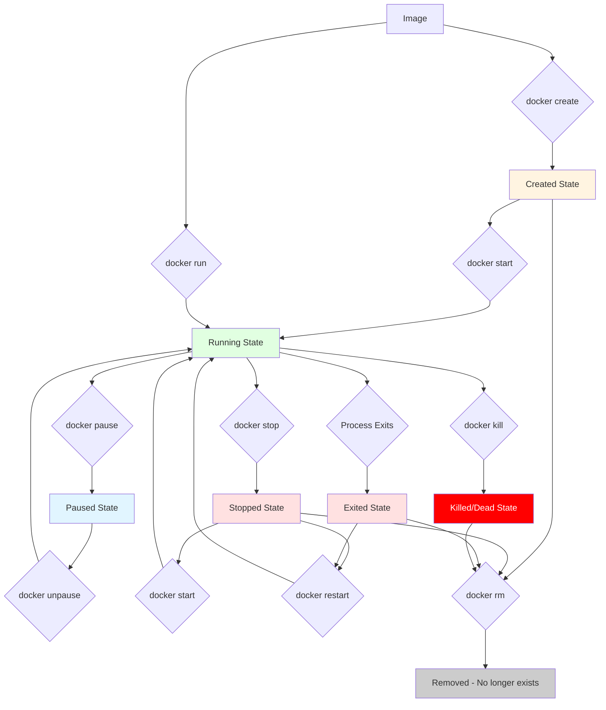

# Docker Technologies: Deep Dive & Best Practices

## Introduction

Docker has revolutionized software development and deployment by introducing lightweight, portable, and consistent containerization. Unlike traditional virtual machines that virtualize hardware, Docker containers virtualize at the operating system level, sharing the host OS kernel while maintaining complete application isolation. This makes containers significantly faster to start, more resource-efficient, and easier to deploy across different environments—from development laptops to cloud production servers. This comprehensive guide explores Docker from fundamental concepts to advanced orchestration techniques, empowering you to build, deploy, and manage containerized applications with confidence.

---

## Table 1: Docker Ecosystem Terminology Mapping

Different contexts and platforms use varying terminology for similar Docker concepts:

| Standard Term | Alternative Names | Context/Usage |
|--------------|-------------------|---------------|
| **Container** | Container Instance, Running Container, Application Container | Core Docker concept |
| **Image** | Container Image, Docker Image, Base Image, Template | Immutable template |
| **Dockerfile** | Build File, Container Definition, Image Recipe | Build instructions |
| **Registry** | Container Registry, Image Repository, Docker Hub | Image storage/distribution |
| **Volume** | Persistent Storage, Data Volume, Named Volume | Data persistence |
| **Bind Mount** | Host Mount, Directory Mount, Volume Mount | Host filesystem access |
| **Network** | Container Network, Virtual Network, Bridge Network | Container connectivity |
| **Layer** | Image Layer, Filesystem Layer, Union Layer | Image composition |
| **Tag** | Image Tag, Version Label, Build Tag | Image versioning |
| **Build Context** | Source Context, Build Directory | Build input files |
| **Multi-stage Build** | Staged Build, Phased Build, Builder Pattern | Build optimization |
| **Compose** | Docker Compose, Stack Definition, Multi-container App | Multi-container orchestration |
| **Service** | Container Service, Replicated Service, Swarm Service | Scalable container group |
| **Stack** | Application Stack, Service Stack, Compose Stack | Full application definition |
| **Orchestration** | Container Orchestration, Cluster Management | Multi-host management |
| **Pod** | Container Group, Atomic Unit (Kubernetes) | Kubernetes concept |
| **Deployment** | Rolling Update, Release, Rollout | Update strategy |
| **Health Check** | Liveness Probe, Readiness Check, Status Check | Container monitoring |
| **Entrypoint** | Entry Command, Start Command, Init Process | Container startup |
| **CMD** | Default Command, Run Command | Container execution |
| **Daemon** | Docker Engine, dockerd, Container Runtime | Background service |

---

## Table 2: Hierarchical Docker Ecosystem Structure

This table organizes Docker concepts from high-level abstractions to specific implementations:

| Level | Category | Term | Parent Concept | Description |
|-------|----------|------|----------------|-------------|
| **L1** | Ecosystem | Containerization | - | Complete container technology ecosystem |
| **L2** | Platform | Docker | Containerization | Complete container platform |
| **L2** | Platform | Kubernetes (K8s) | Containerization | Container orchestration system |
| **L2** | Platform | Podman | Containerization | Daemonless container engine |
| **L2** | Platform | containerd | Containerization | Container runtime |
| **L3** | Docker Components | Docker Engine | Docker | Core runtime and orchestration |
| **L3** | Docker Components | Docker CLI | Docker | Command-line interface |
| **L3** | Docker Components | Docker Compose | Docker | Multi-container tool |
| **L3** | Docker Components | Docker Swarm | Docker | Native clustering/orchestration |
| **L3** | Docker Components | Docker Hub | Docker | Public registry service |
| **L4** | Engine Components | Docker Daemon (dockerd) | Docker Engine | Background service |
| **L4** | Engine Components | containerd | Docker Engine | High-level container runtime |
| **L4** | Engine Components | runc | Docker Engine | Low-level container runtime |
| **L4** | Engine Components | Docker API | Docker Engine | REST API |
| **L5** | Core Objects | Images | Docker Daemon | Immutable templates |
| **L5** | Core Objects | Containers | Docker Daemon | Running instances |
| **L5** | Core Objects | Networks | Docker Daemon | Virtual networks |
| **L5** | Core Objects | Volumes | Docker Daemon | Persistent storage |
| **L6** | Container States | Created | Containers | Initial state, not running |
| **L6** | Container States | Running | Containers | Active execution |
| **L6** | Container States | Paused | Containers | Suspended execution |
| **L6** | Container States | Stopped | Containers | Gracefully terminated |
| **L6** | Container States | Exited | Containers | Completed execution |
| **L6** | Container States | Dead | Containers | Unable to remove |
| **L7** | Image Components | Layers | Images | Filesystem changes |
| **L7** | Image Components | Manifest | Images | Image configuration |
| **L7** | Image Components | Config | Images | Container runtime config |
| **L7** | Image Components | Tags | Images | Version identifiers |
| **L8** | Build Instructions | FROM | Dockerfile | Base image selection |
| **L8** | Build Instructions | RUN | Dockerfile | Execute build commands |
| **L8** | Build Instructions | COPY | Dockerfile | Copy files to image |
| **L8** | Build Instructions | ADD | Dockerfile | Copy files (advanced) |
| **L8** | Build Instructions | WORKDIR | Dockerfile | Set working directory |
| **L8** | Build Instructions | ENV | Dockerfile | Environment variables |
| **L8** | Build Instructions | EXPOSE | Dockerfile | Document ports |
| **L8** | Build Instructions | CMD | Dockerfile | Default command |
| **L8** | Build Instructions | ENTRYPOINT | Dockerfile | Entry command |
| **L8** | Build Instructions | VOLUME | Dockerfile | Declare mount points |
| **L8** | Build Instructions | ARG | Dockerfile | Build-time variables |
| **L8** | Build Instructions | LABEL | Dockerfile | Add metadata |
| **L9** | Volume Types | Named Volumes | Volumes | Docker-managed volumes |
| **L9** | Volume Types | Anonymous Volumes | Volumes | Unnamed volumes |
| **L9** | Volume Types | Bind Mounts | Volumes | Host directory mounts |
| **L9** | Volume Types | tmpfs Mounts | Volumes | In-memory filesystems |
| **L10** | Network Types | Bridge | Networks | Default network driver |
| **L10** | Network Types | Host | Networks | Use host network stack |
| **L10** | Network Types | Overlay | Networks | Multi-host networks |
| **L10** | Network Types | Macvlan | Networks | Physical network assignment |
| **L10** | Network Types | None | Networks | Disabled networking |
| **L11** | Security | Namespaces | Container Isolation | Process, network, mount isolation |
| **L11** | Security | Cgroups | Container Isolation | Resource limitation |
| **L11** | Security | Capabilities | Container Isolation | Linux capabilities |
| **L11** | Security | Seccomp | Container Isolation | System call filtering |
| **L11** | Security | AppArmor | Container Isolation | Mandatory access control |

---

## Docker Container Lifecycle

Understanding the container lifecycle is crucial for effective container management and troubleshooting.

### Complete Container Lifecycle



---

## Phase 1: Docker Architecture

### 1.1 Understanding Docker Architecture

Docker uses a client-server architecture with three main components:

```
┌─────────────────────────────────────────────┐
│          Docker Client (docker CLI)         │
│                                             │
│  docker build, run, pull, push, etc.       │
└──────────────┬──────────────────────────────┘
               │ REST API
               │
┌──────────────▼──────────────────────────────┐
│          Docker Daemon (dockerd)            │
│                                             │
│  ┌─────────────────────────────────┐       │
│  │      Images  Containers          │       │
│  │      Networks Volumes             │       │
│  └─────────────────────────────────┘       │
└──────────────┬──────────────────────────────┘
               │
      ┌────────┴────────┐
      │                 │
┌─────▼──────┐  ┌──────▼──────┐
│ containerd │  │   Registry  │
│            │  │ (Docker Hub)│
│  ┌──────┐  │  └─────────────┘
│  │ runc │  │
│  └──────┘  │
└────────────┘
```

**Components Explained:**

1. **Docker Client**: Command-line tool users interact with
2. **Docker Daemon**: Background service managing Docker objects
3. **containerd**: High-level container runtime
4. **runc**: Low-level runtime that actually runs containers
5. **Registry**: Stores and distributes images

### 1.2 How Docker Differs from Virtual Machines

**Virtual Machine Architecture:**

```
┌──────────────────────────────────────┐
│    Application    │    Application   │
│    ────────────   │    ────────────  │
│    Libraries      │    Libraries     │
│    ────────────   │    ────────────  │
│    Guest OS       │    Guest OS      │
└──────────┬───────────────┬───────────┘
           │               │
     ┌─────▼───────────────▼──────┐
     │      Hypervisor            │
     └────────────┬────────────────┘
                  │
     ┌────────────▼────────────────┐
     │      Host Operating System   │
     └────────────┬────────────────┘
                  │
     ┌────────────▼────────────────┐
     │      Physical Hardware       │
     └─────────────────────────────┘
```

**Docker Container Architecture:**

```
┌──────────────────────────────────────┐
│ Container 1   │ Container 2          │
│ ────────────  │ ────────────         │
│ App + Libs    │ App + Libs           │
└──────┬────────────────┬──────────────┘
       │                │
  ┌────▼────────────────▼─────┐
  │   Docker Engine           │
  └────────────┬───────────────┘
               │
  ┌────────────▼───────────────┐
  │   Host Operating System     │
  └────────────┬───────────────┘
               │
  ┌────────────▼───────────────┐
  │   Physical Hardware         │
  └────────────────────────────┘
```

**Key Differences:**

| Aspect | Virtual Machine | Docker Container |
|--------|----------------|------------------|
| **Startup Time** | Minutes | Seconds |
| **Disk Size** | GBs (full OS) | MBs (app + libs) |
| **Performance** | Slower (hardware virtualization) | Near-native |
| **Isolation** | Complete (hardware level) | Process level |
| **Resource Usage** | Heavy (full OS per VM) | Lightweight (shared kernel) |
| **Portability** | Medium (hypervisor-dependent) | High (run anywhere) |

---

## Phase 2: Docker Installation and Setup

### 2.1 Installing Docker

**Linux (Ubuntu/Debian):**

```bash
# Update package index
sudo apt-get update

# Install prerequisites
sudo apt-get install \
    ca-certificates \
    curl \
    gnupg \
    lsb-release

# Add Docker's official GPG key
sudo mkdir -p /etc/apt/keyrings
curl -fsSL https://download.docker.com/linux/ubuntu/gpg | sudo gpg --dearmor -o /etc/apt/keyrings/docker.gpg

# Set up repository
echo \
  "deb [arch=$(dpkg --print-architecture) signed-by=/etc/apt/keyrings/docker.gpg] https://download.docker.com/linux/ubuntu \
  $(lsb_release -cs) stable" | sudo tee /etc/apt/sources.list.d/docker.list > /dev/null

# Install Docker Engine
sudo apt-get update
sudo apt-get install docker-ce docker-ce-cli containerd.io docker-buildx-plugin docker-compose-plugin

# Verify installation
sudo docker run hello-world
```

**macOS:**

```bash
# Download Docker Desktop for Mac
# https://www.docker.com/products/docker-desktop

# Or use Homebrew
brew install --cask docker
```

**Windows:**

```powershell
# Download Docker Desktop for Windows
# https://www.docker.com/products/docker-desktop

# Requires WSL 2 backend for best performance
```

### 2.2 Post-Installation Configuration

**Add User to Docker Group (Linux):**

```bash
# Add your user to docker group
sudo usermod -aG docker $USER

# Log out and back in for changes to take effect
# Or run:
newgrp docker

# Verify
docker run hello-world  # Should work without sudo
```

**Configure Docker Daemon:**

```bash
# Edit daemon config
sudo nano /etc/docker/daemon.json
```

```json
{
  "log-driver": "json-file",
  "log-opts": {
    "max-size": "10m",
    "max-file": "3"
  },
  "storage-driver": "overlay2",
  "default-address-pools": [
    {
      "base": "172.30.0.0/16",
      "size": 24
    }
  ]
}
```

```bash
# Restart Docker
sudo systemctl restart docker

# Verify configuration
docker info
```

---

## Phase 3: Working with Docker Images

### 3.1 Understanding Docker Images

A Docker image is a lightweight, standalone, executable package that includes everything needed to run an application: code, runtime, system tools, libraries, and settings.

**Image Layers:**

```
Image: myapp:latest
├─ Layer 5: COPY app files        (New)
├─ Layer 4: RUN npm install       (New)
├─ Layer 3: COPY package.json     (New)
├─ Layer 2: WORKDIR /app          (Shared)
├─ Layer 1: FROM node:18-alpine   (Shared)
└─ Layer 0: Base (Alpine Linux)   (Shared)
```

**Key Concepts:**

- **Immutable**: Once created, layers never change
- **Shareable**: Multiple images can share same base layers
- **Cacheable**: Speeds up builds and saves disk space
- **Union Filesystem**: Layers stack to form complete filesystem

### 3.2 Image Commands

**Pulling Images:**

```bash
# Pull from Docker Hub (default registry)
docker pull nginx

# Pull specific version
docker pull nginx:1.25-alpine

# Pull from specific registry
docker pull gcr.io/my-project/my-image:v1.0

# Pull all tags
docker pull --all-tags ubuntu

# View pulled images
docker images
docker image ls

# Output:
# REPOSITORY   TAG       IMAGE ID       CREATED        SIZE
# nginx        latest    a72860cb9589   2 weeks ago    143MB
# node         18-alpine e1a7e2f1e8d3   3 weeks ago    172MB
```

**Searching Images:**

```bash
# Search Docker Hub
docker search nginx

# Search with filters
docker search --filter stars=100 --filter is-official=true nginx

# Limit results
docker search --limit 5 python
```

**Inspecting Images:**

```bash
# Detailed image information
docker inspect nginx:latest

# View image layers
docker history nginx:latest

# Output shows each layer:
# IMAGE          CREATED       CREATED BY                                      SIZE
# a72860cb9589   2 weeks ago   CMD ["nginx" "-g" "daemon off;"]                0B
# <missing>      2 weeks ago   EXPOSE 80                                       0B
# <missing>      2 weeks ago   COPY file:...                                  10.5MB
```

**Removing Images:**

```bash
# Remove single image
docker rmi nginx:latest
docker image rm nginx:latest

# Remove by IMAGE ID
docker rmi a72860cb9589

# Force remove (even if containers using it)
docker rmi -f nginx:latest

# Remove multiple images
docker rmi nginx:latest node:18-alpine

# Remove unused images
docker image prune

# Remove all unused images (not just dangling)
docker image prune -a

# Remove with filter
docker image prune -a --filter "until=24h"
```

**Tagging Images:**

```bash
# Tag image with new name
docker tag nginx:latest myregistry/nginx:v1.0

# Tag for multiple registries
docker tag myapp:latest localhost:5000/myapp:latest
docker tag myapp:latest gcr.io/myproject/myapp:v1.0
docker tag myapp:latest docker.io/username/myapp:latest

# Best practice: semantic versioning
docker tag myapp:latest myapp:1.2.3
docker tag myapp:latest myapp:1.2
docker tag myapp:latest myapp:1
docker tag myapp:latest myapp:latest
```

**Saving and Loading Images:**

```bash
# Save image to tar file
docker save nginx:latest > nginx.tar
docker save -o nginx.tar nginx:latest

# Save multiple images
docker save -o images.tar nginx:latest node:18-alpine

# Load image from tar
docker load < nginx.tar
docker load -i nginx.tar

# Export container as image (flattens layers)
docker export container_name > container.tar

# Import from tar
docker import container.tar myimage:latest
```

---

## Phase 4: Container Lifecycle Management

### 4.1 Container States

**State Diagram:**

```
[Image] --create--> [Created] --start--> [Running]
                                   |
                                   ├--pause--> [Paused] --unpause--> [Running]
                                   |
                                   ├--stop--> [Stopped] --start--> [Running]
                                   |
                                   ├--exit--> [Exited]
                                   |
                                   └--kill--> [Dead]

All states except [Image] --rm--> [Removed]
```

### 4.2 Creating Containers

```bash
# Create container (doesn't start it)
docker create --name my-nginx nginx:latest

# Create with options
docker create \
  --name web-server \
  --hostname webserver01 \
  -p 8080:80 \
  -e ENVIRONMENT=production \
  -v /data:/usr/share/nginx/html \
  --restart unless-stopped \
  nginx:latest

# View created containers
docker ps -a
```

### 4.3 Running Containers

**Basic Run:**

```bash
# Run and create container
docker run nginx

# Run in detached mode (background)
docker run -d nginx

# Run with name
docker run -d --name web-server nginx

# Run interactively
docker run -it ubuntu bash

# Run and remove after exit
docker run --rm ubuntu echo "Hello World"
```

**Common Options:**

```bash
# Complete example
docker run -d \
  --name production-web \
  --hostname prod-web-01 \
  -p 8080:80 \
  -p 8443:443 \
  -e "TZ=America/New_York" \
  -e "APP_ENV=production" \
  -v /var/log/nginx:/var/log/nginx \
  -v $(pwd)/html:/usr/share/nginx/html:ro \
  --restart unless-stopped \
  --memory="512m" \
  --cpus="1.5" \
  --network my-network \
  --label="app=web" \
  --label="version=1.0" \
  nginx:latest
```

### 4.4 Managing Running Containers

**Starting and Stopping:**

```bash
# Start stopped container
docker start my-nginx

# Start multiple containers
docker start container1 container2 container3

# Stop container (SIGTERM, then SIGKILL after grace period)
docker stop my-nginx

# Stop with custom timeout (default 10s)
docker stop -t 30 my-nginx

# Restart container
docker restart my-nginx

# Restart with timeout
docker restart -t 5 my-nginx
```

**Pausing and Resuming:**

```bash
# Pause container (freezes all processes)
docker pause my-nginx

# Unpause container
docker unpause my-nginx

# Use case: Temporarily free resources without losing state
```

**Killing Containers:**

```bash
# Forcefully kill (SIGKILL)
docker kill my-nginx

# Send specific signal
docker kill --signal=SIGTERM my-nginx
docker kill --signal=SIGHUP my-nginx
```

### 4.5 Listing Containers

```bash
# List running containers
docker ps

# List all containers
docker ps -a

# List with custom format
docker ps --format "table {{.ID}}\t{{.Names}}\t{{.Status}}\t{{.Ports}}"

# List container IDs only
docker ps -q

# List with size
docker ps -s

# Filter containers
docker ps --filter "status=running"
docker ps --filter "name=web"
docker ps --filter "label=app=nginx"
docker ps --filter "exited=0"  # Successfully exited
```

### 4.6 Container Logs

```bash
# View logs
docker logs my-nginx

# Follow logs (like tail -f)
docker logs -f my-nginx

# Show timestamps
docker logs -t my-nginx

# Show last N lines
docker logs --tail 100 my-nginx

# Show logs since timestamp
docker logs --since 2025-11-10T15:00:00 my-nginx

# Show logs in last X time
docker logs --since 30m my-nginx
docker logs --since 2h my-nginx

# Combination
docker logs -f --tail 50 --since 10m my-nginx
```

### 4.7 Executing Commands in Containers

```bash
# Execute command
docker exec my-nginx ls /etc

# Interactive shell
docker exec -it my-nginx bash
docker exec -it my-nginx sh  # For Alpine

# Execute as different user
docker exec -u root my-nginx whoami

# Execute with environment variable
docker exec -e VAR=value my-nginx env

# Execute in specific working directory
docker exec -w /app my-nginx pwd
```

### 4.8 Copying Files

```bash
# Copy from container to host
docker cp my-nginx:/etc/nginx/nginx.conf ./nginx.conf

# Copy from host to container
docker cp ./config.json my-nginx:/app/config.json

# Copy directory
docker cp my-nginx:/var/log/nginx ./logs/

# Copy with archive mode (preserve permissions)
docker cp -a my-nginx:/app/data ./backup/
```

### 4.9 Inspecting Containers

```bash
# Full inspection
docker inspect my-nginx

# Get specific field (Go template)
docker inspect --format='{{.State.Status}}' my-nginx
docker inspect --format='{{.NetworkSettings.IPAddress}}' my-nginx
docker inspect --format='{{json .Config.Env}}' my-nginx | jq

# Get multiple fields
docker inspect --format='{{.Name}} {{.State.Status}} {{.RestartCount}}' my-nginx
```

### 4.10 Removing Containers

```bash
# Remove stopped container
docker rm my-nginx

# Force remove running container
docker rm -f my-nginx

# Remove multiple containers
docker rm container1 container2 container3

# Remove all stopped containers
docker container prune

# Remove with filter
docker container prune --filter "until=24h"

# Remove all containers (dangerous!)
docker rm -f $(docker ps -aq)
```

### 4.11 Container Statistics

```bash
# Real-time stats for all containers
docker stats

# Stats for specific containers
docker stats my-nginx my-app

# Display once (no streaming)
docker stats --no-stream

# Format output
docker stats --format "table {{.Name}}\t{{.CPUPerc}}\t{{.MemUsage}}\t{{.NetIO}}"
```

---

## Phase 5: Building Docker Images with Dockerfile

### 5.1 Dockerfile Basics

A Dockerfile is a text file containing instructions to build a Docker image.

**Simple Dockerfile:**

```dockerfile
# syntax=docker/dockerfile:1

# Base image
FROM node:18-alpine

# Set working directory
WORKDIR /app

# Copy files
COPY package*.json ./

# Install dependencies
RUN npm install --production

# Copy application
COPY . .

# Expose port
EXPOSE 3000

# Default command
CMD ["node", "server.js"]
```

### 5.2 Dockerfile Instructions

**FROM - Base Image:**

```dockerfile
# Official image
FROM node:18-alpine

# Specific version
FROM node:18.17.1-alpine3.18

# Multi-arch image
FROM --platform=linux/amd64 node:18-alpine

# Multiple stages (covered later)
FROM node:18 AS builder
FROM nginx:alpine AS runtime
```

**WORKDIR - Working Directory:**

```dockerfile
# Set working directory (creates if doesn't exist)
WORKDIR /app

# All subsequent commands run in /app
# RUN, CMD, COPY, ADD, ENTRYPOINT use this directory
```

**COPY vs ADD:**

```dockerfile
# COPY - Preferred for copying files
COPY package.json /app/
COPY src/ /app/src/

# ADD - Has extra features (avoid unless needed)
ADD https://example.com/file.tar.gz /app/  # Can fetch URLs
ADD archive.tar.gz /app/  # Auto-extracts archives

# Best practice: Use COPY unless you need ADD's features
```

**RUN - Execute Commands:**

```dockerfile
# Shell form (runs in /bin/sh -c)
RUN npm install

# Exec form (doesn't invoke shell)
RUN ["npm", "install"]

# Multiple commands (bad - creates multiple layers)
RUN apt-get update
RUN apt-get install -y curl
RUN apt-get clean

# Multiple commands (good - single layer)
RUN apt-get update && \
    apt-get install -y curl && \
    apt-get clean && \
    rm -rf /var/lib/apt/lists/*

# Install Python dependencies
RUN pip install --no-cache-dir -r requirements.txt
```

**ENV - Environment Variables:**

```dockerfile
# Set environment variables
ENV NODE_ENV=production
ENV PORT=3000

# Multiple variables
ENV NODE_ENV=production \
    PORT=3000 \
    LOG_LEVEL=info

# Use in commands
RUN echo "Node environment: $NODE_ENV"
```

**ARG - Build Arguments:**

```dockerfile
# Define build argument
ARG NODE_VERSION=18
ARG BUILD_DATE

# Use in FROM
FROM node:${NODE_VERSION}-alpine

# Use in RUN
RUN echo "Build date: ${BUILD_DATE}"

# ARG vs ENV:
# ARG: Available only during build
# ENV: Available during build AND runtime

# Build with arguments:
# docker build --build-arg NODE_VERSION=20 --build-arg BUILD_DATE=$(date) .
```

**EXPOSE - Document Ports:**

```dockerfile
# Document which ports the container listens on
EXPOSE 3000
EXPOSE 8080 8443

# This is documentation only - doesn't actually publish ports
# Use -p flag when running: docker run -p 3000:3000 myapp
```

**VOLUME - Declare Mount Points:**

```dockerfile
# Declare volume mount points
VOLUME /data
VOLUME ["/var/log", "/var/db"]

# Creates anonymous volume if not specified at runtime
# Better to use named volumes: docker run -v mydata:/data myapp
```

**USER - Set User:**

```dockerfile
# Create non-root user (security best practice)
RUN addgroup -g 1001 -S appuser && \
    adduser -u 1001 -S appuser -G appuser

# Switch to non-root user
USER appuser

# All subsequent commands run as appuser
# Can switch back: USER root
```

**CMD vs ENTRYPOINT:**

```dockerfile
# CMD - Default command (can be overridden)
CMD ["node", "server.js"]
# Override: docker run myimage npm start

# ENTRYPOINT - Always runs (not easily overridden)
ENTRYPOINT ["node"]
CMD ["server.js"]
# Default: node server.js
# Override CMD: docker run myimage app.js → node app.js

# ENTRYPOINT + CMD pattern (recommended)
ENTRYPOINT ["python", "app.py"]
CMD ["--port", "8000"]
# Default: python app.py --port 8000
# Override: docker run myimage --port 9000

# Shell form vs Exec form
CMD node server.js          # Shell form: /bin/sh -c "node server.js"
CMD ["node", "server.js"]   # Exec form: Direct execution (preferred)
```

**HEALTHCHECK - Container Health:**

```dockerfile
# Define health check
HEALTHCHECK --interval=30s --timeout=3s --start-period=30s --retries=3 \
  CMD curl -f http://localhost:3000/health || exit 1

# Disable health check
HEALTHCHECK NONE

# Options:
# --interval=DURATION (default: 30s)
# --timeout=DURATION (default: 30s)
# --start-period=DURATION (default: 0s)
# --retries=N (default: 3)
```

**LABEL - Add Metadata:**

```dockerfile
# Add metadata
LABEL maintainer="dev@example.com"
LABEL version="1.0"
LABEL description="My application"

# Multiple labels
LABEL org.opencontainers.image.version="1.0.0" \
      org.opencontainers.image.authors="Your Name" \
      org.opencontainers.image.title="My App" \
      org.opencontainers.image.description="Application description"
```

**ONBUILD - Trigger Instructions:**

```dockerfile
# Execute when image is used as base
ONBUILD COPY . /app
ONBUILD RUN npm install

# Use case: Creating base images for team
```

### 5.3 Building Images

```bash
# Basic build
docker build -t myapp:latest .

# Build with custom Dockerfile
docker build -t myapp:latest -f Dockerfile.prod .

# Build with build arguments
docker build --build-arg NODE_VERSION=20 --build-arg ENV=production -t myapp:latest .

# Build with no cache
docker build --no-cache -t myapp:latest .

# Build with target stage (multi-stage)
docker build --target production -t myapp:latest .

# Build with progress output
docker build --progress=plain -t myapp:latest .

# Build with specific platform
docker build --platform linux/amd64 -t myapp:latest .

# Multi-platform build (BuildKit)
docker buildx build --platform linux/amd64,linux/arm64 -t myapp:latest .
```

### 5.4 Multi-Stage Builds

Multi-stage builds reduce image size by separating build and runtime environments.

**Problem: Large Image**

```dockerfile
# Single-stage (results in large image ~1GB)
FROM node:18
WORKDIR /app
COPY package*.json ./
RUN npm install  # Includes dev dependencies
COPY . .
RUN npm run build
CMD ["node", "dist/server.js"]
```

**Solution: Multi-Stage Build**

```dockerfile
# syntax=docker/dockerfile:1

# Stage 1: Build stage
FROM node:18 AS builder
WORKDIR /app
COPY package*.json ./
RUN npm ci --only=production
COPY . .
RUN npm run build

# Stage 2: Runtime stage
FROM node:18-alpine AS production
WORKDIR /app

# Copy only production dependencies and built app
COPY --from=builder /app/node_modules ./node_modules
COPY --from=builder /app/dist ./dist
COPY --from=builder /app/package.json ./

# Run as non-root user
RUN addgroup -g 1001 -S nodejs && \
    adduser -u 1001 -S nodejs -G nodejs
USER nodejs

EXPOSE 3000
CMD ["node", "dist/server.js"]

# Result: Image size reduced from ~1GB to ~150MB
```

**Python Multi-Stage Example:**

```dockerfile
# Stage 1: Build
FROM python:3.11 AS builder
WORKDIR /app
COPY requirements.txt .
RUN pip install --user --no-cache-dir -r requirements.txt

# Stage 2: Runtime
FROM python:3.11-slim
WORKDIR /app

# Copy installed packages from builder
COPY --from=builder /root/.local /root/.local
COPY . .

# Add installed packages to PATH
ENV PATH=/root/.local/bin:$PATH

USER nobody
CMD ["python", "app.py"]
```

**Go Multi-Stage Example:**

```dockerfile
# Stage 1: Build
FROM golang:1.21 AS builder
WORKDIR /app
COPY go.mod go.sum ./
RUN go mod download
COPY . .
RUN CGO_ENABLED=0 GOOS=linux go build -a -installsuffix cgo -o main .

# Stage 2: Runtime (scratch - smallest possible)
FROM scratch
COPY --from=builder /app/main /main
EXPOSE 8080
ENTRYPOINT ["/main"]

# Result: Image size ~10MB (just the binary!)
```

---

## Phase 6: Docker Volumes and Data Persistence

### 6.1 Understanding Data Persistence

Containers are ephemeral—data is lost when container is removed. Volumes solve this.

**Three Types of Mounts:**

```
1. Named Volume (Managed by Docker)
   Host: /var/lib/docker/volumes/mydata/_data
   Container: /app/data

2. Bind Mount (Direct host mapping)
   Host: /home/user/myapp/data
   Container: /app/data

3. tmpfs Mount (In-memory, not persisted)
   Host: RAM
   Container: /tmp
```

### 6.2 Named Volumes

```bash
# Create named volume
docker volume create mydata

# List volumes
docker volume ls

# Inspect volume
docker volume inspect mydata

# Use volume in container
docker run -d --name app -v mydata:/app/data nginx

# Multiple containers can share volume
docker run -d --name app1 -v shared:/data nginx
docker run -d --name app2 -v shared:/data nginx

# Remove volume
docker volume rm mydata

# Remove all unused volumes
docker volume prune

# Backup volume
docker run --rm -v mydata:/data -v $(pwd):/backup alpine tar czf /backup/mydata-backup.tar.gz -C /data .

# Restore volume
docker run --rm -v mydata:/data -v $(pwd):/backup alpine tar xzf /backup/mydata-backup.tar.gz -C /data
```

### 6.3 Bind Mounts

```bash
# Bind mount (absolute path required)
docker run -d -v /home/user/app:/app nginx

# Or use $(pwd) for current directory
docker run -d -v $(pwd)/html:/usr/share/nginx/html nginx

# Read-only bind mount
docker run -d -v $(pwd)/config:/etc/nginx:ro nginx

# Bind mount with specific file
docker run -d -v $(pwd)/nginx.conf:/etc/nginx/nginx.conf:ro nginx

# Using --mount (more explicit, recommended)
docker run -d \
  --mount type=bind,source=$(pwd)/html,target=/usr/share/nginx/html \
  nginx
```

### 6.4 tmpfs Mounts

```bash
# Create tmpfs mount (stored in host memory)
docker run -d --tmpfs /tmp nginx

# With size limit
docker run -d --tmpfs /tmp:size=100m nginx

# Using --mount
docker run -d \
  --mount type=tmpfs,destination=/tmp,tmpfs-size=100m \
  nginx

# Use case: Sensitive data that shouldn't touch disk
```

### 6.5 Volume Best Practices

```dockerfile
# Dockerfile
FROM postgres:15

# Declare volume mount point
VOLUME ["/var/lib/postgresql/data"]

# This creates anonymous volume if not specified at runtime
```

```bash
# Best practices:
# 1. Use named volumes for persistence
docker run -d -v postgres-data:/var/lib/postgresql/data postgres:15

# 2. Use bind mounts for development (hot reload)
docker run -d -v $(pwd)/src:/app/src node:18

# 3. Use tmpfs for temporary data
docker run -d --tmpfs /tmp redis:alpine

# 4. Backup important volumes regularly
docker run --rm -v mydata:/data -v $(pwd):/backup alpine tar czf /backup/backup.tar.gz -C /data .

# 5. Use volume drivers for advanced scenarios
docker volume create --driver local --opt type=nfs --opt o=addr=192.168.1.1 --opt device=:/path/to/dir nfs-volume
```

---

## Phase 7: Docker Networking

### 7.1 Network Types

**Bridge Network (Default):**

```bash
# Create bridge network
docker network create my-bridge

# Run containers on bridge
docker run -d --name web --network my-bridge nginx
docker run -d --name app --network my-bridge node

# Containers can communicate by name
# From app container: curl http://web
```

**Host Network:**

```bash
# Use host network stack
docker run -d --network host nginx

# Container shares host's network
# No port mapping needed
# Less isolation
```

**Overlay Network (Multi-host):**

```bash
# Create overlay network (Swarm mode)
docker network create --driver overlay my-overlay

# Spans multiple Docker hosts
# Used in Swarm/Kubernetes
```

**Macvlan Network:**

```bash
# Create macvlan network
docker network create -d macvlan \
  --subnet=192.168.1.0/24 \
  --gateway=192.168.1.1 \
  -o parent=eth0 \
  my-macvlan

# Assigns MAC address to container
# Appears as physical device on network
```

**None Network:**

```bash
# No networking
docker run -d --network none nginx

# Complete network isolation
```

### 7.2 Network Commands

```bash
# Create network
docker network create my-network

# List networks
docker network ls

# Inspect network
docker network inspect my-network

# Connect container to network
docker network connect my-network my-container

# Disconnect container from network
docker network disconnect my-network my-container

# Remove network
docker network rm my-network

# Remove all unused networks
docker network prune
```

### 7.3 Container Communication

```bash
# Create custom network
docker network create app-network

# Run database
docker run -d --name db --network app-network postgres:15

# Run app (can access db by name)
docker run -d --name app --network app-network \
  -e DATABASE_HOST=db \
  myapp:latest

# From app container:
# curl http://db:5432  # Works!
```

### 7.4 Port Mapping

```bash
# Map container port to host
docker run -d -p 8080:80 nginx
# Host 8080 → Container 80

# Map specific host IP
docker run -d -p 127.0.0.1:8080:80 nginx

# Map random host port
docker run -d -p 80 nginx
# Use docker ps to see assigned port

# Map multiple ports
docker run -d -p 8080:80 -p 8443:443 nginx

# Map UDP port
docker run -d -p 53:53/udp dns-server

# Map port range
docker run -d -p 8000-8010:8000-8010 myapp
```

---

## Phase 8: Docker Compose

### 8.1 Understanding Docker Compose

Docker Compose is a tool for defining and running multi-container applications.

**docker-compose.yml:**

```yaml
version: '3.8'

services:
  # Web application
  web:
    build: ./web
    ports:
      - "8080:80"
    environment:
      - DATABASE_URL=postgres://db:5432/myapp
    depends_on:
      - db
    networks:
      - app-network
    volumes:
      - ./web/src:/app/src
    restart: unless-stopped

  # Database
  db:
    image: postgres:15-alpine
    environment:
      POSTGRES_DB: myapp
      POSTGRES_USER: user
      POSTGRES_PASSWORD: password
    volumes:
      - postgres-data:/var/lib/postgresql/data
    networks:
      - app-network
    restart: unless-stopped

  # Cache
  redis:
    image: redis:7-alpine
    networks:
      - app-network
    restart: unless-stopped

networks:
  app-network:
    driver: bridge

volumes:
  postgres-data:
```

### 8.2 Compose Commands

```bash
# Start services
docker-compose up

# Start in detached mode
docker-compose up -d

# Build and start
docker-compose up --build

# Start specific services
docker-compose up web db

# Stop services
docker-compose stop

# Stop and remove containers
docker-compose down

# Stop and remove everything (including volumes)
docker-compose down -v

# View logs
docker-compose logs
docker-compose logs -f web

# List containers
docker-compose ps

# Execute command in service
docker-compose exec web bash

# Scale services
docker-compose up -d --scale web=3

# Restart services
docker-compose restart

# View configuration
docker-compose config
```

### 8.3 Advanced Compose Features

**Environment Variables:**

```yaml
# docker-compose.yml
services:
  web:
    environment:
      - NODE_ENV=${NODE_ENV:-production}
      - API_KEY=${API_KEY}
    env_file:
      - .env
      - .env.production
```

```bash
# .env file
NODE_ENV=development
API_KEY=secret123
DATABASE_URL=postgres://localhost/myapp
```

**Extends and Multiple Compose Files:**

```yaml
# docker-compose.base.yml
services:
  web:
    build: .
    environment:
      - NODE_ENV=production

# docker-compose.override.yml (automatically used)
services:
  web:
    environment:
      - DEBUG=true
    volumes:
      - ./src:/app/src

# docker-compose.prod.yml
services:
  web:
    environment:
      - NODE_ENV=production
    restart: always
```

```bash
# Use multiple compose files
docker-compose -f docker-compose.yml -f docker-compose.prod.yml up -d
```

**Health Checks:**

```yaml
services:
  web:
    image: nginx
    healthcheck:
      test: ["CMD", "curl", "-f", "http://localhost"]
      interval: 30s
      timeout: 10s
      retries: 3
      start_period: 40s
```

**Dependencies with Conditions:**

```yaml
services:
  app:
    depends_on:
      db:
        condition: service_healthy
      redis:
        condition: service_started

  db:
    image: postgres:15
    healthcheck:
      test: ["CMD-SHELL", "pg_isready -U postgres"]
      interval: 10s
      timeout: 5s
      retries: 5
```

---

## Phase 9: Docker Best Practices

### 9.1 Dockerfile Best Practices

**✅ DO:**

```dockerfile
# 1. Use specific base image versions
FROM node:18.17.1-alpine3.18  # Good
# NOT: FROM node:latest  # Bad

# 2. Use .dockerignore
# Create .dockerignore file:
# node_modules
# .git
# .env
# *.md

# 3. Minimize layers - combine RUN commands
RUN apt-get update && \
    apt-get install -y curl git && \
    apt-get clean && \
    rm -rf /var/lib/apt/lists/*

# 4. Order instructions by change frequency (cache optimization)
FROM node:18-alpine
WORKDIR /app
COPY package*.json ./      # Changes less frequently
RUN npm ci
COPY . .                   # Changes more frequently
RUN npm run build
CMD ["node", "dist/server.js"]

# 5. Use multi-stage builds
FROM node:18 AS builder
# ... build steps ...
FROM node:18-alpine
COPY --from=builder /app/dist ./dist

# 6. Run as non-root user
RUN addgroup -S appuser && adduser -S appuser -G appuser
USER appuser

# 7. Use COPY instead of ADD
COPY src/ /app/src/  # Preferred
# ADD only when needed for tar extraction or URL fetch

# 8. Leverage build cache
COPY package.json package-lock.json ./
RUN npm ci  # Cached unless package files change
COPY . .    # Invalidates cache only for source changes

# 9. Use specific WORKDIR
WORKDIR /app  # Creates directory if doesn't exist

# 10. Use exec form for CMD and ENTRYPOINT
CMD ["node", "server.js"]  # Good - exec form
# NOT: CMD node server.js   # Bad - shell form
```

**❌ DON'T:**

```dockerfile
# 1. Don't use latest tags
FROM node:latest  # Bad - unpredictable

# 2. Don't install unnecessary packages
RUN apt-get install -y build-essential python3 vim emacs  # Bloated

# 3. Don't create many layers
RUN apt-get update
RUN apt-get install curl
RUN apt-get install git
RUN apt-get clean  # Each RUN creates a layer

# 4. Don't put secrets in Dockerfile
ENV API_KEY=secret123  # Bad - visible in image history
# Use: docker run -e API_KEY=secret123

# 5. Don't run as root
USER root  # Security risk
# Always: USER appuser

# 6. Don't ignore .dockerignore
# Without .dockerignore, entire context sent to daemon

# 7. Don't use ADD when COPY works
ADD . /app/  # Unclear intent
COPY . /app/  # Clear and simple
```

### 9.2 Security Best Practices

**Image Security:**

```bash
# 1. Use official images
FROM node:18-alpine  # Official Node.js image

# 2. Scan images for vulnerabilities
docker scan myapp:latest

# 3. Use minimal base images
FROM alpine:3.18  # 5MB
# vs
FROM ubuntu:22.04  # 77MB

# 4. Keep images updated
docker pull node:18-alpine  # Get security updates

# 5. Use content trust
export DOCKER_CONTENT_TRUST=1
docker pull nginx:latest  # Verifies signature
```

**Container Security:**

```bash
# 1. Run as non-root
docker run --user 1000:1000 myapp

# 2. Use read-only filesystem
docker run --read-only myapp

# 3. Drop unnecessary capabilities
docker run --cap-drop=ALL --cap-add=NET_BIND_SERVICE myapp

# 4. Limit resources
docker run --memory=512m --cpus=1.0 myapp

# 5. Use security options
docker run --security-opt=no-new-privileges myapp

# 6. Set resource constraints
docker run \
  --memory=1g \
  --memory-swap=1g \
  --cpus=2.0 \
  --pids-limit=100 \
  myapp
```

**Secrets Management:**

```bash
# Don't hardcode secrets
# Bad: ENV PASSWORD=secret123

# Use environment variables at runtime
docker run -e PASSWORD=secret123 myapp

# Use Docker secrets (Swarm mode)
echo "my_secret_password" | docker secret create db_password -
docker service create --secret db_password postgres

# Use external secret managers
# - HashiCorp Vault
# - AWS Secrets Manager
# - Azure Key Vault
# - Google Secret Manager
```

### 9.3 Performance Optimization

**Build Performance:**

```dockerfile
# 1. Order by change frequency
COPY package*.json ./
RUN npm ci  # Cached if packages unchanged
COPY . .    # Runs only if source changed

# 2. Use .dockerignore
# Reduces build context size

# 3. Use BuildKit
# Enable: export DOCKER_BUILDKIT=1
# Parallel builds, better caching

# 4. Use multi-stage builds
FROM node:18 AS deps
COPY package*.json ./
RUN npm ci

FROM node:18 AS builder
COPY --from=deps /app/node_modules ./node_modules
COPY . .
RUN npm run build

FROM node:18-alpine
COPY --from=builder /app/dist ./dist
```

**Runtime Performance:**

```bash
# 1. Use minimal images
docker pull node:18-alpine  # 172MB
# vs
docker pull node:18  # 910MB

# 2. Clean up in same layer
RUN apt-get update && \
    apt-get install -y curl && \
    apt-get clean && \
    rm -rf /var/lib/apt/lists/*  # Cleanup in same layer

# 3. Use volumes for data
docker run -v data:/app/data myapp  # Persistent storage

# 4. Optimize logging
docker run --log-driver=json-file --log-opt max-size=10m --log-opt max-file=3 myapp

# 5. Set restart policies
docker run --restart=unless-stopped myapp
```

### 9.4 Monitoring and Logging

```bash
# View container stats
docker stats

# View logs
docker logs -f --tail 100 myapp

# Export logs
docker logs myapp > app.log 2>&1

# Configure logging driver
docker run --log-driver=syslog --log-opt syslog-address=tcp://192.168.1.100:514 myapp

# Log rotation
docker run \
  --log-driver=json-file \
  --log-opt max-size=10m \
  --log-opt max-file=3 \
  myapp

# Health checks
docker inspect --format='{{.State.Health.Status}}' myapp

# Events
docker events --filter 'container=myapp'

# System info
docker system df  # Disk usage
docker system info  # System information
docker system events  # Real-time events
```

---

## Phase 10: Docker in Production

### 10.1 Production Deployment Patterns

**Single Host Deployment:**

```bash
# Use Docker Compose
docker-compose -f docker-compose.prod.yml up -d

# With health checks and restart policies
```

**Multi-Host Orchestration:**

```bash
# Docker Swarm
docker swarm init
docker stack deploy -c docker-compose.yml myapp

# Kubernetes
kubectl apply -f deployment.yaml
kubectl apply -f service.yaml
```

### 10.2 High Availability

**Docker Swarm Example:**

```yaml
# docker-compose.prod.yml
version: '3.8'

services:
  web:
    image: myapp:latest
    deploy:
      replicas: 3
      update_config:
        parallelism: 1
        delay: 10s
      restart_policy:
        condition: on-failure
        max_attempts: 3
      resources:
        limits:
          cpus: '0.5'
          memory: 512M
        reservations:
          cpus: '0.25'
          memory: 256M
    ports:
      - "80:80"
    networks:
      - webnet

networks:
  webnet:
```

```bash
# Deploy to swarm
docker stack deploy -c docker-compose.prod.yml myapp

# Scale service
docker service scale myapp_web=5

# Update service
docker service update --image myapp:v2 myapp_web

# Rolling update (zero downtime)
docker service update --image myapp:v2 --update-parallelism 1 --update-delay 10s myapp_web
```

### 10.3 Backup and Disaster Recovery

```bash
# Backup volumes
docker run --rm \
  -v mydata:/data \
  -v $(pwd):/backup \
  alpine \
  tar czf /backup/mydata-$(date +%Y%m%d).tar.gz -C /data .

# Backup database
docker exec postgres pg_dump -U user mydb > backup-$(date +%Y%m%d).sql

# Restore volume
docker run --rm \
  -v mydata:/data \
  -v $(pwd):/backup \
  alpine \
  tar xzf /backup/mydata-20250111.tar.gz -C /data

# Export images
docker save myapp:latest > myapp-latest.tar

# Import images
docker load < myapp-latest.tar
```

### 10.4 CI/CD Integration

**GitHub Actions Example:**

```yaml
name: Docker Build and Push

on:
  push:
    branches: [ main ]

jobs:
  build:
    runs-on: ubuntu-latest
    steps:
      - uses: actions/checkout@v3
      
      - name: Set up Docker Buildx
        uses: docker/setup-buildx-action@v2
      
      - name: Login to DockerHub
        uses: docker/login-action@v2
        with:
          username: ${{ secrets.DOCKERHUB_USERNAME }}
          password: ${{ secrets.DOCKERHUB_TOKEN }}
      
      - name: Build and push
        uses: docker/build-push-action@v4
        with:
          context: .
          push: true
          tags: username/myapp:latest,username/myapp:${{ github.sha }}
          cache-from: type=registry,ref=username/myapp:latest
          cache-to: type=inline
```

---

## Phase 11: Troubleshooting

### 11.1 Common Issues and Solutions

**Problem: Container Exits Immediately**

```bash
# Check logs
docker logs container_name

# Run interactively to debug
docker run -it myimage sh

# Check if process exits successfully
docker inspect --format='{{.State.ExitCode}}' container_name
```

**Problem: Cannot Connect to Container**

```bash
# Check if container is running
docker ps

# Check port mappings
docker port container_name

# Check networks
docker network inspect bridge

# Test connectivity
docker exec container_name ping other_container
```

**Problem: Out of Disk Space**

```bash
# Check disk usage
docker system df

# Clean up
docker system prune -a  # Remove all unused objects
docker volume prune     # Remove unused volumes
docker image prune -a   # Remove unused images
```

**Problem: Build Cache Issues**

```bash
# Build without cache
docker build --no-cache -t myapp .

# Clear build cache
docker builder prune -a
```

### 11.2 Debugging Techniques

```bash
# 1. Inspect container
docker inspect container_name

# 2. View logs with timestamps
docker logs -t container_name

# 3. Execute shell in running container
docker exec -it container_name sh

# 4. Run container with different command
docker run -it --entrypoint sh myimage

# 5. Check resource usage
docker stats container_name

# 6. View container processes
docker top container_name

# 7. Copy files for inspection
docker cp container_name:/app/config.json ./config.json

# 8. View network details
docker network inspect bridge

# 9. Check health status
docker inspect --format='{{json .State.Health}}' container_name | jq

# 10. View events
docker events --filter container=container_name
```

---

## Docker Command Reference

### Essential Commands

```bash
# Images
docker pull image:tag
docker build -t name:tag .
docker images
docker rmi image:tag
docker tag source target

# Containers
docker run [options] image
docker ps [-a]
docker start container
docker stop container
docker restart container
docker rm container
docker exec -it container command

# Volumes
docker volume create name
docker volume ls
docker volume rm name
docker volume inspect name

# Networks
docker network create name
docker network ls
docker network rm name
docker network connect network container

# System
docker system df
docker system prune
docker info
docker version

# Compose
docker-compose up [-d]
docker-compose down
docker-compose logs [-f]
docker-compose ps
docker-compose exec service command
```

---

## Conclusion

Docker has transformed how we build, ship, and run applications by providing lightweight, portable, and consistent containerization. Mastering Docker requires understanding not just the commands, but the underlying architecture, best practices, and production deployment strategies.

**Key Takeaways:**

1. **Containers vs VMs** - Containers share kernel, faster and lighter
2. **Images are immutable** - Built from layers, cached for efficiency
3. **Dockerfile optimization** - Order matters, minimize layers, use multi-stage
4. **Data persistence** - Use volumes for stateful data
5. **Networking** - Containers communicate via networks
6. **Security first** - Run as non-root, scan images, manage secrets properly
7. **Docker Compose** - Multi-container orchestration made easy
8. **Production ready** - Health checks, restart policies, resource limits
9. **Monitor and log** - Essential for troubleshooting
10. **Continuous improvement** - Keep images updated, optimize regularly

By following the practices outlined in this guide and understanding the complete Docker ecosystem, you'll be equipped to containerize applications efficiently, deploy them reliably, and manage them at scale in production environments.

---

## References

<a href="https://docs.docker.com/" target="_blank">Docker Official Documentation</a>

<a href="https://docs.docker.com/engine/reference/builder/" target="_blank">Dockerfile Reference</a>

<a href="https://docs.docker.com/compose/" target="_blank">Docker Compose Documentation</a>

<a href="https://docs.docker.com/develop/dev-best-practices/" target="_blank">Docker Development Best Practices</a>

<a href="https://docs.docker.com/engine/security/" target="_blank">Docker Security</a>

<a href="https://docs.docker.com/storage/volumes/" target="_blank">Docker Volumes</a>

<a href="https://docs.docker.com/network/" target="_blank">Docker Networking</a>

<a href="https://docs.docker.com/engine/swarm/" target="_blank">Docker Swarm</a>

<a href="https://www.docker.com/blog/intro-guide-to-dockerfile-best-practices/" target="_blank">Dockerfile Best Practices Guide</a>

<a href="https://github.com/docker/awesome-compose" target="_blank">Awesome Docker Compose Examples</a>

---

*Last Updated: November 11, 2025*
