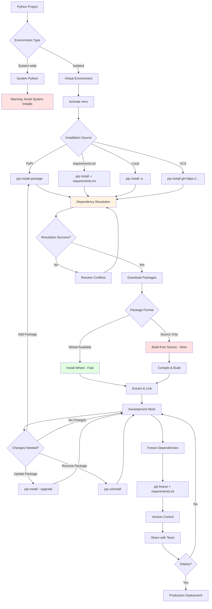

# Pip: Deep Dive & Best Practices

## Introduction

**Pip** (recursive acronym for "Pip Installs Packages") is the standard package management system for Python, enabling developers to install and manage software packages from the Python Package Index (PyPI) and other repositories. Since Python 3.4 and 2.7.9, pip has been included with Python installations, making it an essential tool for every Python developer. This comprehensive guide explores pip from foundational concepts to advanced dependency management strategies, empowering you to build reproducible, secure, and production-ready Python applications.

---

## Table 1: Pip Ecosystem Terminology Mapping

Different contexts and documentation use varying terminology for similar pip operations and concepts:

| Standard Term | Alternative Names | Context/Usage |
|--------------|-------------------|---------------|
| **Package Installation** | Package Deployment, Library Installation, Module Installation | Core pip operation |
| **Dependencies** | Requirements, Prerequisites, Dependents, Transitive Dependencies | Package relationships |
| **Requirements File** | Dependency File, Pinned Requirements, Lock File | Dependency specification |
| **Version Pinning** | Version Locking, Freezing Dependencies, Fixed Versioning | Reproducibility practice |
| **Virtual Environment** | venv, Virtualenv, Isolated Environment, Python Environment | Isolation mechanism |
| **Wheel** | Built Distribution, Binary Package, Pre-compiled Package | Modern package format |
| **Source Distribution** | sdist, Source Package, Tarball | Legacy package format |
| **Upgrade** | Update, Refresh, Version Bump | Package version change |
| **Uninstall** | Remove, Delete, Purge | Package removal |
| **PyPI** | Python Package Index, Cheese Shop, Package Repository | Primary package source |
| **Index** | Repository, Package Source, Registry | Package storage location |
| **Editable Install** | Development Mode, -e Install, Link Install | Development installation |
| **User Install** | User Site, Local Install, --user Installation | Per-user installation |
| **System-wide Install** | Global Install, System Site | System-level installation |
| **Constraints File** | Version Constraints, Dependency Constraints | Installation limits |
| **Hash Checking** | Integrity Verification, Package Verification, Checksum Validation | Security practice |
| **Dependency Resolution** | Version Solving, Dependency Solver, Compatibility Check | Finding compatible versions |

---

## Table 2: Hierarchical Pip Ecosystem Structure

This table organizes pip concepts from high-level abstractions to specific implementations:

| Level | Category | Term | Parent Concept | Description |
|-------|----------|------|----------------|-------------|
| **L1** | Ecosystem | Python Packaging | - | Complete package management ecosystem |
| **L2** | Tools | pip | Python Packaging | Standard package installer |
| **L2** | Tools | setuptools | Python Packaging | Package building and distribution |
| **L2** | Tools | wheel | Python Packaging | Built distribution format |
| **L2** | Repositories | PyPI | Python Packaging | Python Package Index |
| **L2** | Repositories | Test PyPI | Python Packaging | Testing repository |
| **L2** | Repositories | Private Index | Python Packaging | Organization-specific repositories |
| **L3** | pip Components | Installer | pip | Downloads and installs packages |
| **L3** | pip Components | Dependency Resolver | pip | Finds compatible package versions |
| **L3** | pip Components | Downloader | pip | Fetches packages from repositories |
| **L3** | pip Components | Cache Manager | pip | Manages local package cache |
| **L3** | pip Components | Configuration System | pip | pip.conf / pip.ini settings |
| **L4** | Installation Types | From PyPI | Installer | Default installation source |
| **L4** | Installation Types | From VCS | Installer | Git, SVN, Mercurial sources |
| **L4** | Installation Types | From Local Path | Installer | File system sources |
| **L4** | Installation Types | From URL | Installer | Direct URL installation |
| **L4** | Installation Types | Editable Mode | Installer | Development installations |
| **L5** | Package Formats | Wheel (.whl) | Distribution Formats | Pre-compiled binary package |
| **L5** | Package Formats | Source Distribution (.tar.gz) | Distribution Formats | Source code package |
| **L5** | Package Formats | Egg (.egg) | Distribution Formats | Legacy format (deprecated) |
| **L5** | Wheel Types | Pure Python Wheel | Wheel | Platform-independent |
| **L5** | Wheel Types | Platform Wheel | Wheel | OS/architecture-specific |
| **L5** | Wheel Types | Universal Wheel | Wheel | Python 2 and 3 compatible |
| **L6** | Operations | install | Core Commands | Add package to environment |
| **L6** | Operations | uninstall | Core Commands | Remove package from environment |
| **L6** | Operations | freeze | Core Commands | Output installed packages |
| **L6** | Operations | list | Core Commands | Show installed packages |
| **L6** | Operations | show | Core Commands | Display package information |
| **L6** | Operations | search | Core Commands | Query PyPI for packages |
| **L6** | Operations | download | Core Commands | Fetch packages without installing |
| **L6** | Operations | wheel | Core Commands | Build wheels from requirements |
| **L7** | Version Specifiers | == (Exact) | Version Constraints | Exact version match |
| **L7** | Version Specifiers | >= (Minimum) | Version Constraints | Minimum version |
| **L7** | Version Specifiers | <= (Maximum) | Version Constraints | Maximum version |
| **L7** | Version Specifiers | ~= (Compatible) | Version Constraints | Compatible release |
| **L7** | Version Specifiers | != (Exclusion) | Version Constraints | Exclude specific version |
| **L7** | Version Specifiers | === (Arbitrary) | Version Constraints | Arbitrary equality |
| **L7** | Installation Locations | site-packages | Install Targets | System Python packages |
| **L7** | Installation Locations | User Site | Install Targets | ~/.local/lib/pythonX.Y/site-packages |
| **L7** | Installation Locations | Virtual Environment | Install Targets | Isolated environment packages |
| **L7** | Installation Locations | --target | Install Targets | Custom directory |
| **L8** | Requirements Files | requirements.txt | Specification Files | Main dependencies |
| **L8** | Requirements Files | requirements-dev.txt | Specification Files | Development dependencies |
| **L8** | Requirements Files | requirements-test.txt | Specification Files | Testing dependencies |
| **L8** | Requirements Files | requirements-prod.txt | Specification Files | Production dependencies |
| **L8** | Requirements Files | constraints.txt | Specification Files | Version constraints only |
| **L8** | Security | Hash Checking | Verification | SHA256 package verification |
| **L8** | Security | Trusted Hosts | Verification | SSL/TLS verification bypass |
| **L8** | Security | Index URLs | Verification | Repository authentication |

---

## Pip Package Management Lifecycle

Understanding the typical workflow helps organize your package management strategy and debugging process.

### Complete Pip Workflow



---

## Phase 1: Understanding Pip Fundamentals

### 1.1 What is Pip?

Pip is Python's package installer that:
- Installs packages from PyPI and other sources
- Manages package dependencies automatically
- Handles package upgrades and removals
- Maintains installed package information
- Works with virtual environments
- Supports multiple Python versions

**Why Pip?**

```python
# Without pip: Manual installation nightmare
# 1. Download package source
# 2. Extract archive
# 3. Read INSTALL.txt
# 4. python setup.py install
# 5. Manually install dependencies
# 6. Repeat for each dependency
# 7. Version conflicts? Good luck!

# With pip: Simple and automatic
# pip install requests
# Done! All dependencies handled automatically
```

### 1.2 Verifying Pip Installation

```bash
# Check if pip is installed
pip --version
# Output: pip 24.0 from /path/to/python/site-packages/pip (python 3.10)

# Alternative: Use python -m pip (RECOMMENDED)
python -m pip --version
python3 -m pip --version  # For systems with multiple Python versions

# Why use 'python -m pip'?
# - Ensures you're using pip from the correct Python version
# - Avoids PATH issues
# - Works consistently across platforms
```

**If pip is not installed:**

```bash
# Method 1: Bootstrap pip (official method)
python -m ensurepip --default-pip

# Method 2: get-pip.py (if ensurepip fails)
curl https://bootstrap.pypa.io/get-pip.py -o get-pip.py
python get-pip.py

# Linux: Install via package manager
sudo apt-get install python3-pip  # Debian/Ubuntu
sudo dnf install python3-pip      # Fedora
sudo yum install python3-pip      # RHEL/CentOS

# Verify installation
python -m pip --version
```

### 1.3 Upgrading Pip

```bash
# Upgrade pip itself (IMPORTANT for security and features)
python -m pip install --upgrade pip

# User-level upgrade (if no admin rights)
python -m pip install --user --upgrade pip

# Check for outdated packages
python -m pip list --outdated

# Specific version
python -m pip install pip==24.0
```

---

## Phase 2: Basic Package Operations

### 2.1 Installing Packages

**Simple Installation:**

```bash
# Install latest version
python -m pip install requests

# Install specific version
python -m pip install requests==2.28.0

# Install minimum version
python -m pip install "requests>=2.28.0"

# Install version range
python -m pip install "requests>=2.28.0,<3.0.0"

# Install compatible release (recommended)
python -m pip install "requests~=2.28.0"  # Allows 2.28.x but not 2.29.x

# Multiple packages at once
python -m pip install requests numpy pandas matplotlib
```

**Installation Options:**

```bash
# Upgrade if already installed
python -m pip install --upgrade requests

# Force reinstall (even if already satisfied)
python -m pip install --force-reinstall requests

# Don't install dependencies
python -m pip install --no-deps requests

# User installation (no admin required)
python -m pip install --user requests

# Install to specific directory
python -m pip install --target=/custom/path requests

# Quiet mode (minimal output)
python -m pip install --quiet requests

# Verbose mode (detailed output)
python -m pip install --verbose requests
```

### 2.2 Installing from Different Sources

**From PyPI (Default):**

```bash
python -m pip install package_name
```

**From Test PyPI:**

```bash
python -m pip install --index-url https://test.pypi.org/simple/ package_name
```

**From Git Repository:**

```bash
# From main/master branch
python -m pip install git+https://github.com/user/repo.git

# From specific branch
python -m pip install git+https://github.com/user/repo.git@develop

# From specific tag/release
python -m pip install git+https://github.com/user/repo.git@v1.0.0

# From specific commit
python -m pip install git+https://github.com/user/repo.git@abc1234

# SSH instead of HTTPS
python -m pip install git+ssh://git@github.com/user/repo.git
```

**From Local Directory:**

```bash
# From local directory (copies files)
python -m pip install /path/to/package

# Editable install (links to source - for development)
python -m pip install -e /path/to/package

# From current directory
python -m pip install -e .

# Why use editable install?
# - Changes to source code are immediately effective
# - No need to reinstall after each change
# - Perfect for development workflow
```

**From URL:**

```bash
# Direct package URL
python -m pip install https://github.com/user/repo/archive/main.zip

# Wheel file URL
python -m pip install https://example.com/packages/package-1.0-py3-none-any.whl
```

**From Local Archive:**

```bash
# From wheel file
python -m pip install package-1.0-py3-none-any.whl

# From tarball
python -m pip install package-1.0.tar.gz
```

### 2.3 Uninstalling Packages

```bash
# Uninstall single package
python -m pip uninstall requests

# Uninstall multiple packages
python -m pip uninstall requests numpy pandas

# Uninstall without confirmation
python -m pip uninstall -y requests

# Uninstall from requirements file
python -m pip uninstall -r requirements.txt

# Note: Pip does NOT automatically uninstall dependencies!
# Orphaned dependencies remain installed
```

### 2.4 Listing and Inspecting Packages

**List Installed Packages:**

```bash
# List all installed packages
python -m pip list

# Output format:
# Package    Version
# ---------- -------
# pip        24.0
# requests   2.28.0
# numpy      1.24.0

# List in requirements format
python -m pip list --format=freeze

# List outdated packages
python -m pip list --outdated

# List only local packages (exclude global)
python -m pip list --local

# List user-installed packages only
python -m pip list --user
```

**Show Package Details:**

```bash
# Detailed information about a package
python -m pip show requests

# Output includes:
# Name: requests
# Version: 2.28.0
# Summary: Python HTTP for Humans.
# Home-page: https://requests.readthedocs.io
# Author: Kenneth Reitz
# License: Apache 2.0
# Location: /path/to/site-packages
# Requires: charset-normalizer, idna, urllib3, certifi
# Required-by: some-other-package

# Show package files
python -m pip show --files requests
```

**Search PyPI (Deprecated as of pip 21.0):**

```bash
# pip search is disabled due to PyPI infrastructure limitations
# Alternative: Search on https://pypi.org
# Or use: pip_search package (third-party)
```

---

## Phase 3: Requirements Files

### 3.1 Understanding Requirements Files

Requirements files are text files that list packages to install, typically named `requirements.txt`.

**Basic requirements.txt:**

```
# requirements.txt
requests
numpy
pandas
matplotlib
```

**With Version Specifiers:**

```
# requirements.txt
requests==2.28.0       # Exact version
numpy>=1.20.0          # Minimum version
pandas~=1.5.0          # Compatible release (1.5.x)
matplotlib>=3.5,<4.0   # Version range
scipy!=1.8.0           # Exclude specific version
```

### 3.2 Creating Requirements Files

**Method 1: Manual Creation (Recommended for Libraries)**

```
# requirements.txt
# Direct dependencies only
requests>=2.28.0
numpy>=1.20.0
pandas>=1.5.0
```

**Method 2: pip freeze (Recommended for Applications)**

```bash
# Generate requirements with exact versions
python -m pip freeze > requirements.txt

# Output includes ALL installed packages:
# certifi==2022.12.7
# charset-normalizer==3.0.1
# idna==3.4
# numpy==1.24.0
# pandas==1.5.3
# python-dateutil==2.8.2
# pytz==2022.7
# requests==2.28.2
# six==1.16.0
# urllib3==1.26.14
```

**Method 3: pip freeze with filter (Best Practice)**

```bash
# Freeze only packages from requirements.txt
python -m pip freeze --requirement requirements.txt > requirements-lock.txt

# This preserves comments and excludes unrelated packages
```

### 3.3 Installing from Requirements Files

```bash
# Install all packages from requirements file
python -m pip install -r requirements.txt

# Upgrade all packages in requirements file
python -m pip install --upgrade -r requirements.txt

# Force reinstall
python -m pip install --force-reinstall -r requirements.txt

# Install without dependencies (trust requirements file is complete)
python -m pip install --no-deps -r requirements.txt
```

### 3.4 Advanced Requirements File Syntax

**Comments and Organization:**

```
# requirements.txt

# Web framework
Flask==2.3.0
flask-cors==4.0.0

# Database
SQLAlchemy==2.0.0
psycopg2-binary==2.9.5

# Data processing
numpy==1.24.0
pandas==2.0.0

# Testing (optional)
pytest==7.2.0  # Only needed for development
```

**Environment Markers:**

```
# Install package only on specific platforms
pywin32==305; sys_platform == 'win32'
python-magic==0.4.27; sys_platform == 'linux'

# Python version specific
dataclasses==0.8; python_version < '3.7'
typing-extensions>=4.0.0; python_version < '3.10'

# Combined conditions
cryptography==39.0.0; platform_machine != 'arm64' and sys_platform == 'darwin'
```

**Including Other Requirements Files:**

```
# requirements.txt
-r requirements-base.txt
-r requirements-prod.txt

# This allows composing requirements from multiple files
```

**Using Constraints Files:**

```
# constraints.txt - Only controls versions, doesn't trigger install
numpy==1.24.0
pandas==2.0.0

# requirements.txt
numpy  # Will install numpy 1.24.0 due to constraints
pandas  # Will install pandas 2.0.0 due to constraints

# Install command
python -m pip install -r requirements.txt -c constraints.txt
```

---

## Phase 4: Version Pinning and Dependency Management

### 4.1 Understanding Version Pinning

**The Problem:**

```python
# requirements.txt (no pinning)
requests
numpy
pandas

# Installation on Day 1:
# requests==2.28.0
# numpy==1.24.0
# pandas==2.0.0
# Everything works!

# Installation on Day 90:
# requests==2.29.0  # Breaking changes!
# numpy==1.25.0     # API changes!
# pandas==2.1.0     # New bugs!
# Application breaks in production!
```

**The Solution: Version Pinning**

```
# requirements.txt (pinned)
requests==2.28.0
numpy==1.24.0
pandas==2.0.0

# Now installations are predictable and reproducible
```

### 4.2 Version Specifier Operators

| Operator | Name | Example | Meaning |
|----------|------|---------|---------|
| `==` | Exact Match | `requests==2.28.0` | Exactly version 2.28.0 |
| `!=` | Exclusion | `numpy!=1.23.0` | Any version except 1.23.0 |
| `>=` | Greater or Equal | `pandas>=2.0.0` | 2.0.0 or higher |
| `<=` | Less or Equal | `scipy<=1.10.0` | 1.10.0 or lower |
| `>` | Greater Than | `matplotlib>3.5.0` | Higher than 3.5.0 |
| `<` | Less Than | `pillow<10.0.0` | Lower than 10.0.0 |
| `~=` | Compatible Release | `django~=4.2.0` | >=4.2.0, <4.3.0 |
| `===` | Arbitrary Equality | `package===2.0.post1` | Exact string match |

**Compatible Release Operator (~=):**

The `~=` operator is powerful for semantic versioning:

```
# ~= version matching
package~=1.4.2  # Equivalent to: >=1.4.2, ==1.4.*
package~=1.4    # Equivalent to: >=1.4, ==1.*

# Examples:
requests~=2.28.0  # Allows 2.28.1, 2.28.2, but NOT 2.29.0
django~=4.2       # Allows 4.2.1, 4.2.2, but NOT 4.3.0
```

**Combining Operators:**

```
# Multiple constraints
numpy>=1.20.0,<2.0.0      # Between 1.20.0 and 2.0.0
pandas>=1.5.0,!=1.5.2     # 1.5.0 or higher, except 1.5.2
scipy>=1.8.0,<1.11.0,!=1.9.0  # Range with exclusion
```

### 4.3 Pinning Strategies

**Strategy 1: Pin Direct Dependencies (Library Development)**

```
# requirements.txt
# Pin only what you directly use
requests~=2.28.0
numpy~=1.24.0
pandas~=2.0.0

# Allows compatible updates
# Good for libraries published to PyPI
```

**Strategy 2: Pin Everything (Application Deployment)**

```
# requirements.txt
# Generated with: pip freeze
certifi==2022.12.7
charset-normalizer==3.0.1
idna==3.4
numpy==1.24.0
pandas==1.5.3
python-dateutil==2.8.2
pytz==2022.7
requests==2.28.2
six==1.16.0
urllib3==1.26.14

# Completely reproducible
# Good for production applications
```

**Strategy 3: Two-File Approach (Best Practice)**

```
# requirements.in (direct dependencies, loose)
requests>=2.28.0
numpy>=1.20.0
pandas>=1.5.0

# requirements.txt (generated, pinned)
# This file is auto-generated from requirements.in
# DO NOT EDIT MANUALLY
#
certifi==2022.12.7
charset-normalizer==3.0.1
idna==3.4
numpy==1.24.0
pandas==1.5.3
python-dateutil==2.8.2
pytz==2022.7
requests==2.28.2
six==1.16.0
urllib3==1.26.14
```

### 4.4 Using pip-tools for Better Dependency Management

**Installing pip-tools:**

```bash
python -m pip install pip-tools
```

**Creating requirements.in:**

```
# requirements.in
requests
numpy>=1.20
pandas>=1.5
```

**Compiling to requirements.txt:**

```bash
# Generate pinned requirements.txt
pip-compile requirements.in

# Update to latest compatible versions
pip-compile --upgrade requirements.in

# Generate with hashes for security
pip-compile --generate-hashes requirements.in

# Output to different file
pip-compile requirements.in --output-file=requirements-prod.txt
```

**Syncing environment:**

```bash
# Install exactly what's in requirements.txt
# Removes packages not in the file
pip-sync requirements.txt

# Sync multiple files
pip-sync requirements.txt dev-requirements.txt
```

---

## Phase 5: Virtual Environments

### 5.1 Why Virtual Environments?

**The Problem:**

```python
# System Python installation
Project A needs: django==3.2
Project B needs: django==4.2

# Conflict! Can only have one version installed
# Installing django==4.2 breaks Project A
# Installing django==3.2 breaks Project B
```

**The Solution: Virtual Environments**

```python
# Isolated environments
project-a-env/: django==3.2 ✓
project-b-env/: django==4.2 ✓

# No conflicts! Each project has its own packages
```

### 5.2 Creating Virtual Environments

**Using venv (Built-in, Python 3.3+):**

```bash
# Create virtual environment
python -m venv myenv

# Directory structure created:
# myenv/
# ├── bin/ (or Scripts/ on Windows)
# │   ├── python
# │   ├── pip
# │   └── activate
# ├── include/
# ├── lib/
# │   └── python3.10/
# │       └── site-packages/
# └── pyvenv.cfg

# Create with specific Python version
python3.10 -m venv myenv
python3.11 -m venv myenv

# Create without pip (install later)
python -m venv --without-pip myenv

# Create with system site-packages access
python -m venv --system-site-packages myenv
```

**Using virtualenv (Third-party, more features):**

```bash
# Install virtualenv
python -m pip install virtualenv

# Create environment
virtualenv myenv

# With specific Python
virtualenv -p python3.10 myenv
virtualenv -p /usr/bin/python3.11 myenv

# Without pip
virtualenv --no-pip myenv

# With system packages
virtualenv --system-site-packages myenv
```

### 5.3 Activating and Deactivating

**Activation:**

```bash
# Linux/macOS
source myenv/bin/activate

# Windows Command Prompt
myenv\Scripts\activate.bat

# Windows PowerShell
myenv\Scripts\Activate.ps1

# After activation, prompt changes:
# (myenv) user@machine:~$

# Verify activation
which python      # Should point to myenv/bin/python
python --version
pip --version     # Should point to myenv pip
```

**Deactivation:**

```bash
# From any shell
deactivate

# Prompt returns to normal:
# user@machine:~$
```

### 5.4 Virtual Environment Best Practices

```bash
# 1. Always use virtual environments (never install to system Python)
python -m venv venv  # Common name

# 2. Add venv to .gitignore
echo "venv/" >> .gitignore
echo "*.pyc" >> .gitignore
echo "__pycache__/" >> .gitignore

# 3. Document environment setup in README.md
# ## Setup
# ```bash
# python -m venv venv
# source venv/bin/activate
# pip install -r requirements.txt
# ```

# 4. Use consistent naming
# Common names: venv, .venv, env, virtualenv

# 5. Don't commit virtual environment to version control
# Commit requirements.txt instead

# 6. Recreate environments when needed
rm -rf venv
python -m venv venv
source venv/bin/activate
pip install -r requirements.txt
```

---

## Phase 6: Package Formats and Wheels

### 6.1 Understanding Package Formats

**Source Distribution (sdist):**

```
package-1.0.tar.gz
│
├── setup.py          # Build instructions
├── README.md
├── LICENSE
└── package/
    ├── __init__.py
    └── module.py

# Installation:
# 1. Extract archive
# 2. Read setup.py
# 3. Compile extensions (if any)
# 4. Install files
# Time: Slow (compilation required)
```

**Wheel Distribution:**

```
package-1.0-py3-none-any.whl
│
├── package/
│   ├── __init__.py
│   └── module.py
└── package-1.0.dist-info/
    ├── METADATA
    ├── WHEEL
    ├── RECORD
    └── top_level.txt

# Installation:
# 1. Extract wheel
# 2. Copy files to site-packages
# Time: Fast (pre-compiled)
```

### 6.2 Wheel Naming Convention

**Wheel filename format:**

```
{distribution}-{version}(-{build})?-{python}-{abi}-{platform}.whl

Examples:
numpy-1.24.0-cp310-cp310-macosx_11_0_arm64.whl
├─ numpy: Package name
├─ 1.24.0: Version
├─ cp310: CPython 3.10
├─ cp310: ABI tag
└─ macosx_11_0_arm64: Platform (macOS ARM)

requests-2.28.0-py3-none-any.whl
├─ requests: Package name
├─ 2.28.0: Version
├─ py3: Python 3.x
├─ none: No ABI requirement
└─ any: Any platform (pure Python)
```

**Wheel Types:**

| Type | Python Tag | ABI Tag | Platform Tag | Description |
|------|-----------|---------|--------------|-------------|
| **Pure Python** | py3 | none | any | No compiled code, any platform |
| **Universal** | py2.py3 | none | any | Python 2 & 3 compatible |
| **Platform** | cp310 | cp310 | linux_x86_64 | Compiled, OS-specific |

### 6.3 Advantages of Wheels

| Feature | Source Distribution | Wheel |
|---------|-------------------|-------|
| **Install Speed** | Slow (must compile) | Fast (pre-compiled) |
| **Reliability** | Requires build tools | No build tools needed |
| **Size** | Smaller | Larger |
| **Portability** | Source is portable | Binary is platform-specific |
| **Security** | Can inspect source | Pre-compiled (trust required) |

### 6.4 Building and Using Wheels

**Building Wheels:**

```bash
# Install wheel package
python -m pip install wheel

# Build wheel for current project
python setup.py bdist_wheel

# Modern approach (using build)
python -m pip install build
python -m build

# Output:
# dist/
# ├── package-1.0-py3-none-any.whl
# └── package-1.0.tar.gz

# Build wheels for all requirements
pip wheel -r requirements.txt -w wheelhouse/

# Install from wheel directory
python -m pip install --no-index --find-links=wheelhouse/ package_name
```

---

## Phase 7: Configuration and Customization

### 7.1 Pip Configuration Files

**Configuration File Locations (Priority Order):**

1. **Command Line Options** (highest priority)
2. **Environment Variables** (`PIP_*`)
3. **User Config File**
   - Linux/macOS: `~/.config/pip/pip.conf`
   - Windows: `%APPDATA%\pip\pip.ini`
   - Legacy: `~/.pip/pip.conf`
4. **Global Config File**
   - Linux: `/etc/pip.conf`
   - macOS: `/Library/Application Support/pip/pip.conf`
   - Windows: `C:\ProgramData\pip\pip.ini`
5. **Site Config File** (lowest priority)

**Creating Configuration File:**

```bash
# View current configuration
python -m pip config list

# View configuration from all sources
python -m pip config list -v

# Set configuration value
python -m pip config set global.index-url https://pypi.org/simple

# Edit configuration file
python -m pip config edit
```

### 7.2 Common Configuration Options

**pip.conf / pip.ini:**

```ini
[global]
# Default index URL
index-url = https://pypi.org/simple

# Additional package indexes
extra-index-url = https://pypi.org/simple
                  https://test.pypi.org/simple

# Trusted hosts (bypass SSL - use cautiously)
trusted-host = pypi.org
               test.pypi.org

# Default timeout
timeout = 60

# Disable version check
disable-pip-version-check = true

# Cache directory
cache-dir = /custom/cache/path

[install]
# Always use user scheme
user = true

# Don't ask for confirmation
no-input = true

# Ignore installed packages
ignore-installed = false

# Default upgrade behavior
upgrade = false

# Find links (local directories or URLs)
find-links = /path/to/local/wheels
             https://custom-repo.com/packages

[list]
# Default list format
format = columns

[freeze]
# Exclude these packages from freeze output
exclude = pip setuptools wheel
```

### 7.3 Using Environment Variables

```bash
# Set index URL
export PIP_INDEX_URL=https://pypi.org/simple

# Set extra index URL
export PIP_EXTRA_INDEX_URL=https://test.pypi.org/simple

# Set timeout
export PIP_TIMEOUT=60

# Disable cache
export PIP_NO_CACHE_DIR=1

# Set cache directory
export PIP_CACHE_DIR=/custom/cache

# Require virtual environment
export PIP_REQUIRE_VIRTUALENV=true

# Default upgrade
export PIP_UPGRADE=true

# Use in command (all caps, prefix with PIP_)
PIP_INDEX_URL=https://custom.pypi.org/simple python -m pip install package
```

### 7.4 Per-Project Configuration

**pip.conf in Project Root:**

```bash
# Create project-specific config
mkdir -p .pip
cat > .pip/pip.conf << 'EOF'
[global]
index-url = https://pypi.org/simple
timeout = 60

[install]
find-links = ./wheelhouse
no-index = false
EOF

# Use project config
python -m pip install --config-file=.pip/pip.conf package
```

---

## Phase 8: Security Best Practices

### 8.1 Hash Checking

**Why Use Hash Checking?**

Hash checking ensures package integrity and prevents tampering:

```bash
# Generate requirements with hashes
python -m pip freeze > requirements.txt
python -m pip hash requirements.txt > requirements-hashed.txt

# Or use pip-tools
pip-compile --generate-hashes requirements.in

# requirements.txt with hashes:
requests==2.28.0 \
    --hash=sha256:abc123def456... \
    --hash=sha256:def456abc123...
certifi==2022.12.7 \
    --hash=sha256:ghi789jkl012...
```

**Installing with Hash Verification:**

```bash
# Install with hash checking
python -m pip install --require-hashes -r requirements.txt

# Any hash mismatch will fail installation
# Error: THESE PACKAGES DO NOT MATCH THE HASHES FROM THE REQUIREMENTS FILE
```

### 8.2 Restricting Package Sources

```bash
# Install only from local wheel directory (no PyPI access)
python -m pip install --no-index --find-links=./wheelhouse package

# Require PyPI packages to be signed (future feature)
# Currently not available, use hash checking instead

# Use only specified indexes
python -m pip install --index-url https://pypi.org/simple --no-index package
```

### 8.3 Verifying Package Authenticity

```bash
# Check package information
python -m pip show requests

# Verify package contents
python -m pip show --files requests | head -20

# Download package without installing (for inspection)
python -m pip download requests --no-deps

# Check for known vulnerabilities (requires safety)
python -m pip install safety
safety check
safety check -r requirements.txt

# Audit dependencies
python -m pip install pip-audit
pip-audit
```

### 8.4 Secure Configuration

```ini
# ~/.config/pip/pip.conf
[global]
# Always require hashes
require-hashes = true

# Require virtual environment
require-virtualenv = true

# Prefer binary packages (faster, less attack surface)
prefer-binary = true

# Don't allow package index to be overridden
no-index = true
index-url = https://pypi.org/simple

[install]
# Only install from trusted sources
trusted-host = pypi.org
               pypi.python.org
               files.pythonhosted.org

# Verify SSL certificates
cert = /path/to/custom/cert.pem
client-cert = /path/to/client/cert.pem
```

---

## Phase 9: Troubleshooting Common Issues

### 9.1 Permission Errors

**Problem: Permission Denied**

```bash
$ python -m pip install requests
ERROR: Could not install packages due to an OSError: 
[Errno 13] Permission denied: '/usr/local/lib/python3.10/site-packages/...'
```

**Solutions:**

```bash
# Solution 1: Use virtual environment (RECOMMENDED)
python -m venv venv
source venv/bin/activate
python -m pip install requests

# Solution 2: User installation
python -m pip install --user requests

# Solution 3: Use sudo (NOT RECOMMENDED - security risk)
sudo python -m pip install requests  # Avoid this!

# Solution 4: Fix ownership (if you own the directory)
sudo chown -R $USER:$USER /path/to/python
```

### 9.2 Dependency Conflicts

**Problem: Conflicting Dependencies**

```bash
$ python -m pip install packageA packageB
ERROR: Cannot install packageA and packageB because these package 
versions have conflicting dependencies.
  packageA requires numpy>=1.20,<1.24
  packageB requires numpy>=1.24
```

**Solutions:**

```bash
# Solution 1: Check compatible versions
python -m pip install packageA packageB --dry-run

# Solution 2: Install one package at a time
python -m pip install packageA
python -m pip install packageB  # Will upgrade numpy if possible

# Solution 3: Use compatible versions manually
python -m pip install "packageA>=2.0" "packageB>=1.5"

# Solution 4: Use separate environments
python -m venv env-a
source env-a/bin/activate
pip install packageA

python -m venv env-b
source env-b/bin/activate
pip install packageB

# Solution 5: Use pip's dependency resolver (pip 20.3+)
python -m pip install --use-feature=fast-deps packageA packageB
```

### 9.3 SSL Certificate Errors

**Problem: SSL Verification Failed**

```bash
$ python -m pip install requests
WARNING: Retrying (Retry(total=4, ...)) after connection broken by 
'SSLError(SSLCertVerificationError(...))'
```

**Solutions:**

```bash
# Solution 1: Update certificates
# macOS
python -m pip install --upgrade certifi

# Linux
sudo apt-get install ca-certificates
sudo update-ca-certificates

# Solution 2: Use trusted host (temporary, less secure)
python -m pip install --trusted-host pypi.org \
                      --trusted-host files.pythonhosted.org \
                      requests

# Solution 3: Use custom certificate
python -m pip install --cert=/path/to/cert.pem requests

# Solution 4: Configure permanently
python -m pip config set global.cert /path/to/cert.pem
```

### 9.4 Network and Proxy Issues

**Problem: Connection Timeout**

```bash
$ python -m pip install requests
ERROR: Operation timed out
```

**Solutions:**

```bash
# Solution 1: Increase timeout
python -m pip install --timeout=300 requests

# Solution 2: Use proxy
python -m pip install --proxy=http://proxy.company.com:8080 requests

# Solution 3: Set proxy permanently
export HTTP_PROXY=http://proxy.company.com:8080
export HTTPS_PROXY=http://proxy.company.com:8080
python -m pip install requests

# Or in pip.conf
[global]
proxy = http://proxy.company.com:8080
timeout = 300

# Solution 4: Use mirror
python -m pip install --index-url https://pypi.tuna.tsinghua.edu.cn/simple requests
```

### 9.5 Build Failures

**Problem: Compilation Error**

```bash
$ python -m pip install some-package
Building wheels for collected packages: some-package
  error: Microsoft Visual C++ 14.0 is required
  ERROR: Failed building wheel for some-package
```

**Solutions:**

```bash
# Solution 1: Install pre-built wheel
python -m pip install --only-binary :all: some-package

# Solution 2: Install build dependencies
# Windows: Install Visual C++ Build Tools
# Linux: sudo apt-get install python3-dev build-essential
# macOS: xcode-select --install

# Solution 3: Use conda (includes compiled packages)
conda install some-package

# Solution 4: Download pre-built wheel from unofficial source
# https://www.lfd.uci.edu/~gohlke/pythonlibs/
python -m pip install downloaded_wheel.whl

# Solution 5: Install from conda-forge (via pip)
python -m pip install --index-url https://pypi.anaconda.org/conda-forge/simple some-package
```

### 9.6 Corrupted Cache

**Problem: Package Corruption**

```bash
$ python -m pip install requests
ERROR: Could not install packages due to an OSError: 
File not valid: /path/to/cache/requests-2.28.0-py3-none-any.whl
```

**Solutions:**

```bash
# Solution 1: Clear pip cache
python -m pip cache purge

# Solution 2: Install without cache
python -m pip install --no-cache-dir requests

# Solution 3: Remove specific cached package
python -m pip cache remove requests

# Solution 4: Check cache info
python -m pip cache info
python -m pip cache list
```

---

## Phase 10: Advanced Techniques

### 10.1 Editable Installs for Development

**Development Workflow:**

```bash
# Project structure
myproject/
├── setup.py or pyproject.toml
├── mypackage/
│   ├── __init__.py
│   └── module.py
└── tests/

# Install in editable mode
cd myproject
python -m pip install -e .

# Now changes to mypackage/ are immediately effective
# No need to reinstall after each change

# With extras (optional dependencies)
python -m pip install -e ".[dev,test]"

# From subdirectory
python -m pip install -e ./subproject

# Uninstall editable package
python -m pip uninstall mypackage
```

**setup.py for Editable Install:**

```python
# setup.py
from setuptools import setup, find_packages

setup(
    name='mypackage',
    version='0.1.0',
    packages=find_packages(),
    install_requires=[
        'requests>=2.28.0',
        'numpy>=1.20.0',
    ],
    extras_require={
        'dev': [
            'pytest>=7.0.0',
            'black>=22.0.0',
            'flake8>=4.0.0',
        ],
        'test': [
            'pytest>=7.0.0',
            'pytest-cov>=3.0.0',
        ],
    },
)
```

### 10.2 Using Multiple Package Indexes

```bash
# Install from primary index
python -m pip install requests

# Install from additional index
python -m pip install --extra-index-url https://test.pypi.org/simple test-package

# Install different packages from different indexes
python -m pip install \
    --index-url https://pypi.org/simple \
    --extra-index-url https://custom.pypi.org/simple \
    requests custom-package

# Configure multiple indexes permanently
python -m pip config set global.index-url https://pypi.org/simple
python -m pip config set global.extra-index-url "https://test.pypi.org/simple https://custom.pypi.org/simple"
```

**In requirements.txt:**

```
--index-url https://pypi.org/simple
--extra-index-url https://test.pypi.org/simple
--extra-index-url https://custom.pypi.org/simple

requests>=2.28.0
custom-package>=1.0.0
```

### 10.3 Downloading Packages for Offline Installation

```bash
# Download packages to directory
python -m pip download -r requirements.txt -d ./packages/

# Download with dependencies
python -m pip download --dest ./packages/ requests

# Download platform-specific wheels
python -m pip download --platform linux_x86_64 --python-version 310 --only-binary :all: -d ./packages/ numpy

# Install from downloaded packages (offline)
python -m pip install --no-index --find-links=./packages/ -r requirements.txt

# Create portable wheelhouse
python -m pip wheel -r requirements.txt -w wheelhouse/
tar -czf wheelhouse.tar.gz wheelhouse/

# On target machine
tar -xzf wheelhouse.tar.gz
python -m pip install --no-index --find-links=wheelhouse/ -r requirements.txt
```

### 10.4 Installing from Git Subdirectories

```bash
# Install from subdirectory in git repo
python -m pip install git+https://github.com/user/repo.git#subdirectory=packages/subpkg

# With specific branch and subdirectory
python -m pip install git+https://github.com/user/repo.git@develop#subdirectory=packages/subpkg

# Multiple subdirectories in requirements.txt
git+https://github.com/user/repo.git@v1.0#subdirectory=pkg1
git+https://github.com/user/repo.git@v1.0#subdirectory=pkg2
```

### 10.5 Using pip with Docker

**Dockerfile Best Practices:**

```dockerfile
FROM python:3.10-slim

# Set working directory
WORKDIR /app

# Copy requirements first (layer caching)
COPY requirements.txt .

# Install dependencies
RUN pip install --no-cache-dir --upgrade pip && \
    pip install --no-cache-dir -r requirements.txt

# Copy application code
COPY . .

# Run application
CMD ["python", "app.py"]
```

**Optimized Multi-stage Build:**

```dockerfile
# Build stage
FROM python:3.10 AS builder

WORKDIR /app
COPY requirements.txt .

# Create wheel directory
RUN pip install --no-cache-dir --upgrade pip && \
    pip wheel --no-cache-dir --wheel-dir /app/wheels -r requirements.txt

# Runtime stage
FROM python:3.10-slim

WORKDIR /app

# Copy wheels from builder
COPY --from=builder /app/wheels /wheels
COPY requirements.txt .

# Install from wheels (much faster)
RUN pip install --no-cache-dir --upgrade pip && \
    pip install --no-cache-dir --no-index --find-links=/wheels -r requirements.txt && \
    rm -rf /wheels

COPY . .

CMD ["python", "app.py"]
```

---

## Phase 11: Best Practices Summary

### 11.1 Development Workflow Best Practices

**✅ DO:**

1. **Always use virtual environments**
   ```bash
   python -m venv venv
   source venv/bin/activate
   ```

2. **Use `python -m pip` instead of `pip`**
   ```bash
   python -m pip install package  # Ensures correct pip
   ```

3. **Pin dependencies for applications**
   ```bash
   pip freeze > requirements.txt
   ```

4. **Use ranges for libraries**
   ```
   # setup.py or pyproject.toml
   install_requires=['requests>=2.28.0,<3.0.0']
   ```

5. **Separate dev and prod dependencies**
   ```
   requirements.txt          # Production
   requirements-dev.txt      # Development
   requirements-test.txt     # Testing
   ```

6. **Install all dependencies at once**
   ```bash
   pip install package1 package2 package3  # Better resolver
   ```

7. **Use hash checking for security**
   ```bash
   pip-compile --generate-hashes requirements.in
   ```

8. **Keep pip updated**
   ```bash
   python -m pip install --upgrade pip
   ```

9. **Document installation steps**
   ```markdown
   ## Setup
   python -m venv venv
   source venv/bin/activate
   pip install -r requirements.txt
   ```

10. **Use `.gitignore` for environments**
    ```
    venv/
    __pycache__/
    *.pyc
    *.pyo
    ```

**❌ DON'T:**

1. **Install to system Python**
   ```bash
   sudo pip install package  # Breaks system packages!
   ```

2. **Mix conda and pip carelessly**
   ```bash
   # Use conda first, then pip if needed
   ```

3. **Use `pip search` (deprecated)**
   ```bash
   # Use https://pypi.org instead
   ```

4. **Forget to activate environment**
   ```bash
   which python  # Always verify
   ```

5. **Commit virtual environment to git**
   ```bash
   # Commit requirements.txt, not venv/
   ```

6. **Use loose dependencies in applications**
   ```
   requests  # BAD - version will drift
   requests==2.28.0  # GOOD - pinned
   ```

7. **Install packages one by one**
   ```bash
   pip install pkg1  # Inefficient
   pip install pkg2  # dependency solving
   pip install pkg3
   ```

8. **Ignore security warnings**
   ```bash
   # Always investigate and update
   ```

9. **Use --user in virtual environments**
   ```bash
   # Unnecessary and confusing
   ```

10. **Disable SSL without understanding risks**
    ```bash
    pip install --trusted-host pypi.org pkg  # Security risk
    ```

### 11.2 Project Structure Recommendations

```
project/
├── README.md                    # Setup instructions
├── .gitignore                   # Ignore venv, __pycache__
├── requirements.txt             # Pinned production dependencies
├── requirements-dev.txt         # Development dependencies
├── requirements-test.txt        # Testing dependencies
├── setup.py or pyproject.toml   # Package metadata
├── venv/                        # Virtual environment (not in git)
├── src/                         # Source code
│   └── mypackage/
│       ├── __init__.py
│       └── module.py
├── tests/                       # Test files
│   └── test_module.py
└── docs/                        # Documentation
```

### 11.3 Requirements File Organization

**requirements.in (Source):**

```
# Web framework
flask>=2.3.0

# Database
sqlalchemy>=2.0.0
psycopg2-binary>=2.9.0

# Data processing
numpy>=1.20.0
pandas>=1.5.0

# Utilities
python-dotenv>=1.0.0
```

**requirements.txt (Generated):**

```bash
# Generate with pip-tools
pip-compile requirements.in

# Or use pip freeze
pip install -r requirements.in
pip freeze > requirements.txt
```

**requirements-dev.txt:**

```
# Include base requirements
-r requirements.txt

# Development tools
pytest>=7.0.0
pytest-cov>=3.0.0
black>=22.0.0
flake8>=4.0.0
mypy>=0.991
ipython>=8.0.0
```

---

## Phase 12: Performance Optimization

### 12.1 Speeding Up Installation

```bash
# Use binary packages (wheels) only
python -m pip install --only-binary :all: package

# Disable pip version check
python -m pip install --disable-pip-version-check package

# Use faster resolver
python -m pip install --use-feature=fast-deps package

# Parallel downloads (pip 22.2+)
python -m pip install package1 package2 package3

# Use local wheel cache
python -m pip install --find-links=./wheelhouse package

# Pre-build wheels for requirements
pip wheel -r requirements.txt -w wheelhouse/
pip install --no-index --find-links=wheelhouse/ -r requirements.txt
```

### 12.2 Reducing Disk Usage

```bash
# Clear cache
python -m pip cache purge

# Install without caching
python -m pip install --no-cache-dir package

# Check cache size
python -m pip cache info

# Remove specific package from cache
python -m pip cache remove numpy

# Check installed package sizes
pip list --format=freeze | xargs pip show | grep -E 'Name|Location|Size'
```

### 12.3 Optimizing Docker Builds

```dockerfile
# Use pip cache mount (Docker BuildKit)
# syntax=docker/dockerfile:1
FROM python:3.10

WORKDIR /app
COPY requirements.txt .

# Cache pip packages between builds
RUN --mount=type=cache,target=/root/.cache/pip \
    pip install -r requirements.txt

COPY . .
CMD ["python", "app.py"]
```

**Build command:**

```bash
DOCKER_BUILDKIT=1 docker build -t myapp .
```

---

## Mathematical Concepts in Dependency Resolution

### Dependency Resolution as Constraint Satisfaction Problem

Pip's dependency resolver solves a Boolean Satisfiability (SAT) problem:

$
\text{Find versions } V_1, V_2, ..., V_n \text{ such that:}
$

$
\bigwedge_{i=1}^{n} \text{Constraints}(V_i) = \text{True}
$

**Example:**

Given:
- Package A requires B >= 1.0, < 2.0
- Package A requires C >= 2.0
- Package B 1.5 requires C >= 1.5, < 2.5
- Package C has versions 1.8, 2.0, 2.1, 2.5

**Solution Space:**

$
A \land (B \geq 1.0 \land B < 2.0) \land (C \geq 2.0) \land (C \geq 1.5 \land C < 2.5)
$

**Valid Solution:**

- B = 1.5 (satisfies 1.0 ≤ B < 2.0)
- C = 2.1 (satisfies C ≥ 2.0 and 1.5 ≤ C < 2.5)

---

## Pip Command Reference

### Essential Commands

```bash
# Installation
python -m pip install package
python -m pip install package==1.0.0
python -m pip install -r requirements.txt
python -m pip install -e .
python -m pip install --upgrade package

# Uninstallation
python -m pip uninstall package
python -m pip uninstall -r requirements.txt
python -m pip uninstall -y package

# Information
python -m pip show package
python -m pip list
python -m pip list --outdated
python -m pip freeze

# Cache
python -m pip cache info
python -m pip cache list
python -m pip cache remove package
python -m pip cache purge

# Download
python -m pip download package
python -m pip download -r requirements.txt -d ./packages

# Wheel
python -m pip wheel package
python -m pip wheel -r requirements.txt -w wheelhouse/

# Configuration
python -m pip config list
python -m pip config set key value
python -m pip config edit

# Help
python -m pip help
python -m pip help install
python -m pip --version
```

---

## Conclusion

Pip is an essential tool for Python development, providing powerful package management capabilities. Mastering pip requires understanding not just the commands, but also the ecosystem of virtual environments, dependency resolution, security practices, and optimization techniques.

**Key Takeaways:**

1. **Always use virtual environments** - Isolation prevents conflicts
2. **Pin dependencies appropriately** - Applications need exact versions, libraries need ranges
3. **Use `python -m pip`** - Ensures correct pip version
4. **Leverage requirements files** - Document and reproduce environments
5. **Prefer wheels over source** - Faster, more reliable installations
6. **Enable hash checking** - Security and integrity verification
7. **Keep pip updated** - Bug fixes and new features
8. **Understand dependency resolution** - Debug conflicts effectively
9. **Use pip-tools** - Better dependency management workflow
10. **Follow best practices** - Maintainable, reproducible projects

By following the practices outlined in this guide and understanding the complete pip lifecycle, you'll be equipped to manage Python dependencies efficiently, create reproducible environments, and avoid common pitfalls in Python project development.

---

## References

<a href="https://pip.pypa.io/en/stable/" target="_blank">Pip Official Documentation</a>

<a href="https://pip.pypa.io/en/stable/user_guide/" target="_blank">Pip User Guide</a>

<a href="https://pip.pypa.io/en/stable/reference/" target="_blank">Pip Command Reference</a>

<a href="https://pip.pypa.io/en/stable/topics/dependency-resolution/" target="_blank">Dependency Resolution in Pip</a>

<a href="https://packaging.python.org/en/latest/" target="_blank">Python Packaging User Guide</a>

<a href="https://pypi.org/" target="_blank">Python Package Index (PyPI)</a>

<a href="https://peps.python.org/pep-0508/" target="_blank">PEP 508 – Dependency Specification</a>

<a href="https://peps.python.org/pep-0440/" target="_blank">PEP 440 – Version Identification</a>

<a href="https://peps.python.org/pep-0427/" target="_blank">PEP 427 – The Wheel Binary Package Format</a>

<a href="https://pip-tools.readthedocs.io/en/latest/" target="_blank">pip-tools Documentation</a>

<a href="https://virtualenv.pypa.io/en/latest/" target="_blank">virtualenv Documentation</a>

<a href="https://docs.python.org/3/library/venv.html" target="_blank">venv — Creation of Virtual Environments</a>

---

*Last Updated: November 11, 2025*
