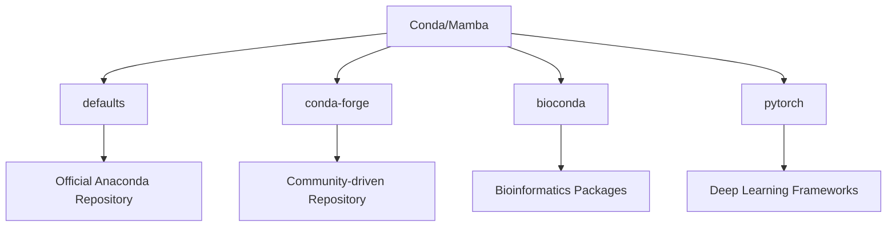

## 📚 Introduction & Overview

Environment management is the foundation of reproducible data science and machine learning projects. This comprehensive guide covers everything you need to know about Conda and Mamba, from basic installation to production deployment.

### What are Conda and Mamba?

**Conda** is an open-source package and environment management system that:
- Manages packages and dependencies across multiple languages (Python, R, C++)
- Creates isolated environments to prevent dependency conflicts
- Works across Windows, macOS, and Linux
- Handles complex dependency resolution

**Mamba** is a reimplementation of Conda that:
- Uses parallel downloading for faster package installation
- Implements faster dependency resolution using libsolv
- Acts as a drop-in replacement for Conda (same commands)
- Significantly reduces installation time (up to 10-20x faster)

### Why Environment Management Matters

> **Without proper environment management:**
> - Dependency conflicts break projects
> - "It works on my machine" syndrome
> - Difficult collaboration and reproduction
> - Version mismatches cause subtle bugs
{: .prompt-warning }

### Conda vs Mamba: Quick Comparison

| Feature | Conda | Mamba |
|---------|-------|-------|
| **Speed** | Moderate (slower for large environments) | Fast (10-20x faster) |
| **Dependency Resolution** | SAT solver (slower) | libsolv (optimized) |
| **Parallel Downloads** | No | Yes |
| **Command Compatibility** | Native | 100% compatible |
| **Memory Usage** | Lower | Slightly higher |
| **Maturity** | Very stable | Stable and production-ready |
| **Best Use Case** | Simple environments, legacy | Large environments, speed-critical |

### Prerequisites

- Basic command-line knowledge
- Administrator/sudo access for installation
- 5-10 GB free disk space
- Internet connection for package downloads

---

## 🔧 Installation Guide

### Option 1: Miniconda + Mamba (Recommended)

This approach installs lightweight Miniconda first, then adds Mamba for speed.

#### Step 1: Download Miniconda

**For Linux/macOS:**

```bash
# Download latest Miniconda (Python 3.11)
wget https://repo.anaconda.com/miniconda/Miniconda3-latest-Linux-x86_64.sh

# For macOS
wget https://repo.anaconda.com/miniconda/Miniconda3-latest-MacOSX-x86_64.sh
# OR for Apple Silicon (M1/M2)
wget https://repo.anaconda.com/miniconda/Miniconda3-latest-MacOSX-arm64.sh
```

**For Windows (PowerShell):**

```powershell
# Download using PowerShell
Invoke-WebRequest -Uri "https://repo.anaconda.com/miniconda/Miniconda3-latest-Windows-x86_64.exe" -OutFile "Miniconda3-latest-Windows-x86_64.exe"
```

#### Step 2: Install Miniconda

**Linux/macOS:**

```bash
# Make installer executable
chmod +x Miniconda3-latest-*.sh

# Run installer
bash Miniconda3-latest-*.sh

# Follow prompts:
# - Accept license terms
# - Confirm installation location (default: ~/miniconda3)
# - Allow conda init to modify shell profile
```

**Expected Output:**
```
Welcome to Miniconda3 py311_23.11.0-2

In order to continue the installation process, please review the license
agreement.
Please, press ENTER to continue
>>> [ENTER]
...
Do you accept the license terms? [yes|no]
>>> yes
...
Miniconda3 will now be installed into this location:
/home/username/miniconda3
...
installation finished.
Do you wish the installer to initialize Miniconda3
by running conda init? [yes|no]
>>> yes
```

**Windows:**

```powershell
# Run installer GUI
.\Miniconda3-latest-Windows-x86_64.exe

# Or silent installation
Start-Process -FilePath ".\Miniconda3-latest-Windows-x86_64.exe" -ArgumentList "/S /D=C:\Users\YourUsername\miniconda3" -Wait
```

#### Step 3: Verify Conda Installation

```bash
# Restart terminal or source profile
source ~/.bashrc  # Linux
source ~/.zshrc   # macOS with zsh

# Verify installation
conda --version
# Expected: conda 23.11.0

conda info
```

**Expected Output:**
```
     active environment : base
    active env location : /home/username/miniconda3
            shell level : 1
       user config file : /home/username/.condarc
 populated config files : 
          conda version : 23.11.0
    conda-build version : not installed
         python version : 3.11.5.final.0
                 platform : linux-64
               user-agent : conda/23.11.0
                  UID:GID : 1000:1000
```

#### Step 4: Install Mamba

> **Why Mamba?** Installing large data science environments with conda can take 10-30 minutes. Mamba reduces this to 1-3 minutes through parallel processing and optimized dependency resolution.
{: .prompt-tip }

```bash
# Install Mamba in base environment
conda install -n base -c conda-forge mamba -y
```

**Expected Output:**
```
Collecting package metadata (current_repodata.json): done
Solving environment: done

## Package Plan ##

  environment location: /home/username/miniconda3

  added / updated specs:
    - mamba

The following packages will be downloaded:

    package                    |            build
    ---------------------------|-----------------
    libmamba-1.5.5             |       h8c36c16_0         1.5 MB  conda-forge
    libmambapy-1.5.5           |   py311h8c36c16_0         251 KB  conda-forge
    mamba-1.5.5                |   py311h3072747_0          58 KB  conda-forge
    ------------------------------------------------------------
                                           Total:         1.8 MB

Downloading and Extracting Packages:
...
Preparing transaction: done
Verifying transaction: done
Executing transaction: done
```

#### Step 5: Verify Mamba Installation

```bash
# Check Mamba version
mamba --version
# Expected: mamba 1.5.5
#          conda 23.11.0

# Test Mamba
mamba info
```

### Option 2: Mambaforge (All-in-One)

Mambaforge includes both Conda and Mamba pre-configured with conda-forge.

```bash
# Download Mambaforge
wget https://github.com/conda-forge/miniforge/releases/latest/download/Mambaforge-Linux-x86_64.sh

# Install
bash Mambaforge-Linux-x86_64.sh

# Verify
mamba --version
conda --version
```

> **Mambaforge Advantage:** Pre-configured with conda-forge as default channel, includes Mamba out of the box.
{: .prompt-info }

---

## ⚙️ Initial Configuration

### Understanding Channels

**Channels** are repositories where Conda/Mamba download packages from.



### Configure Channels

**Why conda-forge?** It has more packages, faster updates, and better community support than defaults channel.

```bash
# Add conda-forge channel
conda config --add channels conda-forge

# Set strict channel priority (recommended)
conda config --set channel_priority strict
```

**Expected Output:**
```bash
# View configuration
conda config --show channels

# Output:
channels:
  - conda-forge
  - defaults
```

**What is strict channel priority?**
- Prevents mixing packages from different channels
- Reduces conflicts and unexpected behavior
- Prioritizes packages from higher-priority channels

### Additional Configuration Options

```bash
# Always show channel URLs
conda config --set show_channel_urls true

# Use libmamba solver (faster)
conda config --set solver libmamba

# Always assume yes for prompts (use with caution)
conda config --set always_yes false  # Keep false for safety

# Set default packages for new environments
conda config --add create_default_packages pip
conda config --add create_default_packages ipykernel

# View all configuration
conda config --show
```

**View .condarc file:**
```bash
cat ~/.condarc
```

**Sample .condarc:**
```yaml
channels:
  - conda-forge
  - defaults
channel_priority: strict
show_channel_urls: true
solver: libmamba
create_default_packages:
  - pip
  - ipykernel
```

---

## 🌍 Creating Your First Environment

### Why Use Separate Environments?

> **Analogy:** Think of environments like separate toolboxes. Your carpentry toolbox doesn't contain plumbing tools. Similarly, your deep learning project doesn't need web scraping packages.
{: .prompt-tip }

**Benefits:**
- ✅ Isolation prevents conflicts
- ✅ Easy experimentation without breaking working code
- ✅ Different projects can use different Python versions
- ✅ Reproducible environments for collaboration

### Basic Environment Creation

**Using Conda:**
```bash
# Create environment with Python 3.11
conda create -n dsml_env python=3.11 -y
```

**Using Mamba (Faster):**
```bash
# Same command, much faster execution
mamba create -n dsml_env python=3.11 -y
```

**Expected Output:**
```
Collecting package metadata (current_repodata.json): done
Solving environment: done

## Package Plan ##

  environment location: /home/username/miniconda3/envs/dsml_env

  added / updated specs:
    - python=3.11


The following NEW packages will be INSTALLED:

  _libgcc_mutex      conda-forge/linux-64::_libgcc_mutex-0.1-conda_forge
  _openmp_mutex      conda-forge/linux-64::_openmp_mutex-4.5-2_gnu
  bzip2              conda-forge/linux-64::bzip2-1.0.8-hd590300_5
  ca-certificates    conda-forge/linux-64::ca-certificates-2023.11.17-hbcca054_0
  ld_impl_linux-64   conda-forge/linux-64::ld_impl_linux-64-2.40-h41732ed_0
  libffi             conda-forge/linux-64::libffi-3.4.2-h7f98852_5
  libgcc-ng          conda-forge/linux-64::libgcc-ng-13.2.0-h807b86a_3
  libgomp            conda-forge/linux-64::libgomp-13.2.0-h807b86a_3
  libnsl             conda-forge/linux-64::libnsl-2.0.1-hd590300_0
  libsqlite          conda-forge/linux-64::libsqlite-3.44.0-h2797004_0
  libuuid            conda-forge/linux-64::libuuid-2.38.1-h0b41bf4_0
  libzlib            conda-forge/linux-64::libzlib-1.2.13-hd590300_5
  ncurses            conda-forge/linux-64::ncurses-6.4-h59595ed_2
  openssl            conda-forge/linux-64::openssl-3.2.0-hd590300_1
  pip                conda-forge/noarch::pip-23.3.1-pyhd8ed1ab_0
  python             conda-forge/linux-64::python-3.11.6-hab00c5b_0_cpython
  readline           conda-forge/linux-64::readline-8.2-h8228510_1
  setuptools         conda-forge/noarch::setuptools-68.2.2-pyhd8ed1ab_0
  tk                 conda-forge/linux-64::tk-8.6.13-noxft_h4845f30_101
  tzdata             conda-forge/noarch::tzdata-2023c-h71feb2d_0
  wheel              conda-forge/noarch::wheel-0.42.0-pyhd8ed1ab_0
  xz                 conda-forge/linux-64::xz-5.2.6-h166bdaf_0

Preparing transaction: done
Verifying transaction: done
Executing transaction: done
```

### Create Environment with Specific Python Version

```bash
# Specific major.minor version
conda create -n dsml_env python=3.11 -y
mamba create -n dsml_env python=3.11 -y

# Specific major.minor.patch version
conda create -n dsml_env python=3.11.5 -y
mamba create -n dsml_env python=3.11.5 -y

# With initial packages
conda create -n dsml_env python=3.11 numpy pandas jupyter -y
mamba create -n dsml_env python=3.11 numpy pandas jupyter -y
```

### Create Environment from Specific Channel

```bash
# From conda-forge
conda create -n dsml_env -c conda-forge python=3.11 -y
mamba create -n dsml_env -c conda-forge python=3.11 -y

# From multiple channels
conda create -n bio_env -c conda-forge -c bioconda python=3.11 biopython -y
```

### List All Environments

```bash
# List environments
conda env list
# OR
conda info --envs
```

**Expected Output:**
```
# conda environments:
#
base                  *  /home/username/miniconda3
dsml_env                 /home/username/miniconda3/envs/dsml_env
```

The `*` indicates the currently active environment.

---

## 🔄 Environment Activation & Deactivation

### Activate Environment

```bash
# Activate the environment
conda activate dsml_env
# OR
mamba activate dsml_env  # Same behavior
```

**Your prompt will change:**
```bash
# Before activation
user@machine:~$

# After activation
(dsml_env) user@machine:~$
```

### Verify Active Environment

```bash
# Check which Python is being used
which python
# Expected: /home/username/miniconda3/envs/dsml_env/bin/python

# Check Python version
python --version
# Expected: Python 3.11.6

# Check environment name
echo $CONDA_DEFAULT_ENV
# Expected: dsml_env

# Detailed environment info
conda info
```

### Deactivate Environment

```bash
# Return to base environment
conda deactivate

# Your prompt changes back
(base) user@machine:~$
```

> **Important:** Never install packages in the base environment. Always create and use project-specific environments!
{: .prompt-danger }

---

## 📦 Package Installation - Core Data Science Stack

Now let's build a complete data science environment step by step.

### Scientific Computing Foundation

**NumPy & SciPy:**
```bash
# Activate environment first
conda activate dsml_env

# Install scientific computing packages
conda install numpy scipy -y
# OR (faster)
mamba install numpy scipy -y
```

**Expected Output:**
```
Collecting package metadata (current_repodata.json): done
Solving environment: done

Package Plan:
  added / updated specs:
    - numpy
    - scipy

The following NEW packages will be INSTALLED:

  libblas            conda-forge/linux-64::libblas-3.9.0-20_linux64_openblas
  libcblas           conda-forge/linux-64::libcblas-3.9.0-20_linux64_openblas
  libgfortran-ng     conda-forge/linux-64::libgfortran-ng-13.2.0-h69a702a_3
  libgfortran5       conda-forge/linux-64::libgfortran5-13.2.0-ha4646dd_3
  liblapack          conda-forge/linux-64::liblapack-3.9.0-20_linux64_openblas
  libopenblas        conda-forge/linux-64::libopenblas-0.3.25-pthreads_h413a1c8_0
  numpy              conda-forge/linux-64::numpy-1.26.2-py311h64a7726_0
  scipy              conda-forge/linux-64::scipy-1.11.4-py311h64a7726_0

Downloading and Extracting Packages:
...
Executing transaction: done
```

### Data Manipulation

**Pandas & Polars:**
```bash
# Traditional: Pandas
conda install pandas -y
mamba install pandas -y

# Modern alternative: Polars (faster for large datasets)
conda install polars -y
mamba install polars -y
```

**Verify installation:**
```bash
python -c "import pandas; print(f'Pandas version: {pandas.__version__}')"
python -c "import polars; print(f'Polars version: {polars.__version__}')"
```

### Data Visualization

**Matplotlib, Seaborn, Plotly:**
```bash
# Static visualization
conda install matplotlib seaborn -y
mamba install matplotlib seaborn -y

# Interactive visualization
conda install plotly bokeh -y
mamba install plotly bokeh -y
```

**Performance Comparison:**
```bash
# Conda (slower)
time conda install matplotlib seaborn plotly -y
# Typical time: 2-3 minutes

# Mamba (faster)
time mamba install matplotlib seaborn plotly -y
# Typical time: 20-30 seconds
```

### Machine Learning

**Scikit-learn & Gradient Boosting Libraries:**
```bash
# Core ML library
conda install scikit-learn -y
mamba install scikit-learn -y

# Gradient boosting frameworks
conda install xgboost lightgbm catboost -y
mamba install xgboost lightgbm catboost -y
```

> **Pro Tip:** Install all related packages together for faster dependency resolution:
> ```bash
> mamba install scikit-learn xgboost lightgbm catboost -y
> ```
{: .prompt-tip }

### Deep Learning Frameworks

**PyTorch:**
```bash
# CPU version
conda install pytorch torchvision torchaudio cpuonly -c pytorch -y
mamba install pytorch torchvision torchaudio cpuonly -c pytorch -y

# CUDA 11.8 version (for NVIDIA GPUs)
conda install pytorch torchvision torchaudio pytorch-cuda=11.8 -c pytorch -c nvidia -y
mamba install pytorch torchvision torchaudio pytorch-cuda=11.8 -c pytorch -c nvidia -y
```

**TensorFlow:**
```bash
# TensorFlow with Keras
conda install tensorflow keras -y
mamba install tensorflow keras -y

# For M1/M2 Macs (Apple Silicon)
conda install tensorflow -c apple -y
```

**Verify GPU Support:**
```bash
# PyTorch
python -c "import torch; print(f'CUDA available: {torch.cuda.is_available()}')"

# TensorFlow
python -c "import tensorflow as tf; print(f'GPU devices: {tf.config.list_physical_devices(\"GPU\")}')"
```

### Jupyter Ecosystem

```bash
# Complete Jupyter stack
conda install jupyter jupyterlab notebook ipykernel -y
mamba install jupyter jupyterlab notebook ipykernel -y

# Register kernel for Jupyter
python -m ipykernel install --user --name dsml_env --display-name "Python (DSML)"
```

**Expected Output:**
```
Installed kernelspec dsml_env in /home/username/.local/share/jupyter/kernels/dsml_env
```

**Launch JupyterLab:**
```bash
jupyter lab
# Opens in browser at http://localhost:8888
```

---

## 📊 Statistical & Advanced Analytics

### Statistical Modeling

```bash
# Statistical libraries
conda install statsmodels scipy pingouin -y
mamba install statsmodels scipy pingouin -y
```

### Time Series Analysis

```bash
# Prophet (Facebook's forecasting tool)
conda install prophet -y
mamba install prophet -y

# Statistical forecasting
conda install statsforecast -y
mamba install statsforecast -y

# Traditional ARIMA and more
conda install pmdarima -y
mamba install pmdarima -y
```

### Bayesian Statistics

```bash
# PyMC for Bayesian modeling
conda install pymc3 arviz -y
mamba install pymc3 arviz -y
```

**Example verification:**
```bash
python << EOF
import statsmodels.api as sm
import prophet
import pymc3
print("✓ Statistical packages installed successfully")
EOF
```

---

## 🔄 Data Processing & ETL

### Database Connectors

```bash
# SQL databases
conda install sqlalchemy psycopg2 pymongo -y
mamba install sqlalchemy psycopg2 pymongo -y

# Additional database drivers
conda install mysql-connector-python pymssql -y
mamba install mysql-connector-python pymssql -y
```

### Big Data Processing

```bash
# Apache Spark
conda install pyspark -y
mamba install pyspark -y

# Dask for parallel computing
conda install dask dask-ml distributed -y
mamba install dask dask-ml distributed -y

# Ray for distributed computing
conda install ray -c conda-forge -y
mamba install ray -c conda-forge -y
```

### File Format Handlers

```bash
# Excel files
conda install openpyxl xlrd xlsxwriter -y
mamba install openpyxl xlrd xlsxwriter -y

# HDF5 and other formats
conda install pytables h5py -y
mamba install pytables h5py -y

# Parquet and Arrow
conda install pyarrow fastparquet -y
mamba install pyarrow fastparquet -y
```

### Web Scraping & APIs

```bash
# HTTP requests and web scraping
conda install requests beautifulsoup4 selenium scrapy -y
mamba install requests beautifulsoup4 selenium scrapy -y

# API clients
conda install httpx aiohttp -y
mamba install httpx aiohttp -y
```

---

## 🗣️ Natural Language Processing

### Core NLP Libraries

```bash
# Install NLP packages
conda install nltk spacy gensim -y
mamba install nltk spacy gensim -y
```

### Download Language Models

```bash
# Download spaCy English model
python -m spacy download en_core_web_sm
python -m spacy download en_core_web_lg  # Larger, more accurate

# Download NLTK data
python -m nltk.downloader popular
python -m nltk.downloader punkt
python -m nltk.downloader stopwords
python -m nltk.downloader wordnet
```

**Expected Output:**
```
[nltk_data] Downloading package popular to /home/username/nltk_data...
[nltk_data]   Package popular is already up-to-date!
✔ Download and installation successful
You can now load the package via spacy.load('en_core_web_sm')
```

### Transformer Models

```bash
# Hugging Face Transformers
conda install transformers tokenizers datasets -c huggingface -y
mamba install transformers tokenizers datasets -c huggingface -y

# SentenceTransformers for embeddings
pip install sentence-transformers
```

**Verify installation:**
```bash
python << EOF
from transformers import pipeline
classifier = pipeline("sentiment-analysis")
result = classifier("I love this guide!")
print(result)
EOF
```

---

## 👁️ Computer Vision

### Core CV Libraries

```bash
# OpenCV and image processing
conda install opencv pillow scikit-image -y
mamba install opencv pillow scikit-image -y
```

### Advanced CV & Augmentation

```bash
# Data augmentation
conda install albumentations imgaug -y
mamba install albumentations imgaug -y

# Additional tools
conda install imageio tifffile -y
mamba install imageio tifffile -y
```

**Test OpenCV:**
```bash
python -c "import cv2; print(f'OpenCV version: {cv2.__version__}')"
```

---

## 🛠️ Development Tools

### Code Quality & Formatting

```bash
# Code formatters
conda install black isort autopep8 -y
mamba install black isort autopep8 -y

# Linters
conda install flake8 pylint -y
mamba install flake8 pylint -y

# Type checking
conda install mypy -y
mamba install mypy -y
```

**Usage examples:**
```bash
# Format code
black your_script.py
isort your_script.py

# Check code quality
flake8 your_script.py
pylint your_script.py
mypy your_script.py
```

### Testing Frameworks

```bash
# pytest and extensions
conda install pytest pytest-cov pytest-xdist pytest-mock hypothesis -y
mamba install pytest pytest-cov pytest-xdist pytest-mock hypothesis -y
```

**Run tests:**
```bash
# Run all tests
pytest tests/

# With coverage report
pytest --cov=src tests/

# Parallel execution
pytest -n auto tests/
```

### Documentation

```bash
# Sphinx documentation generator
conda install sphinx sphinx_rtd_theme -y
mamba install sphinx sphinx_rtd_theme -y

# Initialize docs
sphinx-quickstart docs/
```

### Pre-commit Hooks

```bash
# Install pre-commit
conda install pre-commit -y
mamba install pre-commit -y

# Setup in repository
pre-commit install

# Sample .pre-commit-config.yaml
cat > .pre-commit-config.yaml << 'EOF'
repos:
  - repo: https://github.com/psf/black
    rev: 23.11.0
    hooks:
      - id: black
  - repo: https://github.com/pycqa/isort
    rev: 5.12.0
    hooks:
      - id: isort
  - repo: https://github.com/pycqa/flake8
    rev: 6.1.0
    hooks:
      - id: flake8
EOF
```

---

## 🚀 MLOps & Experiment Tracking

### Experiment Tracking

```bash
# MLflow for experiment tracking
conda install mlflow -y
mamba install mlflow -y

# Weights & Biases
conda install wandb -c conda-forge -y
mamba install wandb -c conda-forge -y

# TensorBoard
conda install tensorboard -y
mamba install tensorboard -y
```

**Start MLflow UI:**
```bash
mlflow ui --host 0.0.0.0 --port 5000
# Access at http://localhost:5000
```

### Model Serving

```bash
# FastAPI for model APIs
conda install fastapi uvicorn pydantic -y
mamba install fastapi uvicorn pydantic -y

# Additional serving tools
pip install bentoml
pip install seldon-core
```

**Create simple API:**
```python
# app.py
from fastapi import FastAPI
import pickle

app = FastAPI()

@app.get("/predict")
def predict(data: dict):
    # Load model and predict
    return {"prediction": 0.95}
```

**Run API:**
```bash
uvicorn app:app --reload --host 0.0.0.0 --port 8000
```

### Containerization Helpers

```bash
# Docker Python client
conda install docker-py -y
mamba install docker-py -y
```

---

## 📦 Installing from PyPI (pip)

Sometimes packages aren't available in Conda repositories. Here's how to safely use pip within Conda environments.

### Best Practices for pip in Conda

> **Important:** Always install pip itself via conda before using it!
{: .prompt-warning }

```bash
# Install pip in the environment
conda install pip -y

# Now safe to use pip
pip install package_name
```

### Common pip-only Packages

```bash
# Feature engineering
pip install category_encoders
pip install feature-engine

# Hyperparameter optimization
pip install optuna
pip install hyperopt

# Model interpretability
pip install shap
pip install lime
pip install interpret

# Data validation
pip install great_expectations
pip install pandera

# Version control for data
pip install dvc

# UI frameworks
pip install streamlit
pip install gradio
pip install dash
```

### List pip-installed Packages

```bash
# Show only pip packages
conda list | grep pypi

# Or use pip
pip list --format=freeze
```

### Mixed Installation Example

```bash
# Conda packages first
mamba install numpy pandas scikit-learn -y

# Then pip packages
pip install optuna shap streamlit
```

---

## 🔍 Package Information & Inspection

### Search for Packages

```bash
# Search in all channels
conda search numpy
mamba search numpy

# Search in specific channel
conda search -c conda-forge numpy

# Show detailed info
conda search --info numpy
```

**Expected Output:**
```
Loading channels: done
# Name                       Version           Build  Channel
numpy                         1.24.0  py311h64a7726_0  conda-forge
numpy                         1.24.1  py311h64a7726_0  conda-forge
numpy                         1.26.2  py311h64a7726_0  conda-forge
```

### Package Details

```bash
# Show package information
conda info numpy
mamba info numpy

# Show dependencies
mamba repoquery depends numpy

# Show dependency tree
mamba repoquery depends --tree numpy

# Show what depends on a package (reverse dependencies)
mamba repoquery whoneeds numpy
```

### List Installed Packages

```bash
# List all packages
conda list
mamba list

# List specific package
conda list numpy

# List with pattern matching
conda list "pandas|numpy|scipy"

# List in different formats
conda list --export > packages.txt
conda list --json > packages.json
```

**Sample Output:**
```
# packages in environment at /home/username/miniconda3/envs/dsml_env:
#
# Name                    Version                   Build  Channel
numpy                     1.26.2          py311h64a7726_0    conda-forge
pandas                    2.1.3           py311h320fe9a_0    conda-forge
python                    3.11.6              hab00c5b_0    conda-forge
scikit-learn              1.3.2           py311hc009520_1    conda-forge
```

### Export Package Lists

```bash
# Simple text format
conda list --export > package-list.txt

# Explicit format (with URLs, platform-specific)
conda list --explicit > explicit-spec.txt

# Environment YAML
conda env export > environment.yml

# Minimal YAML (only explicitly installed)
conda env export --from-history > environment-minimal.yml

# Without builds (cross-platform)
conda env export --no-builds > environment-crossplatform.yml
```

---

## 🔄 Environment Updates & Maintenance

### Update Specific Packages

```bash
# Update single package
conda update numpy -y
mamba update numpy -y

# Update multiple packages
conda update numpy pandas scikit-learn -y
mamba update numpy pandas scikit-learn -y

# Update Python itself
conda update python -y
mamba update python -y
```

**Expected Output:**
```
Collecting package metadata (current_repodata.json): done
Solving environment: done

## Package Plan ##

  environment location: /home/username/miniconda3/envs/dsml_env

  The following packages will be UPDATED:

    numpy              1.26.0-py311h64a7726_0 --> 1.26.2-py311h64a7726_0

Preparing transaction: done
Verifying transaction: done
Executing transaction: done
```

### Update All Packages

```bash
# Update everything in current environment
conda update --all -y
mamba update --all -y
```

> **Warning:** Updating all packages can sometimes introduce breaking changes. Consider testing in a cloned environment first.
{: .prompt-warning }

### Update Conda/Mamba Itself

```bash
# Update conda (in base environment)
conda activate base
conda update -n base conda -y
conda update -n base -c conda-forge conda -y

# Update mamba
mamba update -n base mamba -y
```

### Downgrade Packages

```bash
# Install specific older version
conda install numpy=1.23.0 -y
mamba install numpy=1.23.0 -y

# Using version constraints
conda install "numpy>=1.23,<1.24" -y
```

### Rollback to Previous Environment State

Conda keeps a history of environment changes!

```bash
# View revision history
conda list --revisions

# Example output:
# 2023-11-15 10:30:45  (rev 0)
#     +numpy-1.26.0
#     +pandas-2.1.0
# 2023-11-16 14:20:10  (rev 1)
#     +scikit-learn-1.3.2
# 2023-11-16 15:45:30  (rev 2)
#      numpy  {1.26.0 -> 1.26.2}

# Rollback to revision 1
conda install --revision 1

# Return to latest
conda install --revision 2
```

---

## 🔧 Advanced Package Management

### Version Constraints

```bash
# Exact version
conda install numpy=1.24.3 -y
mamba install numpy=1.24.3 -y

# Version range
conda install "numpy>=1.24,<1.25" -y

# Compatible version (~= allows patch updates)
conda install "numpy~=1.24.0" -y

# Multiple constraints
conda install "numpy>=1.24" "pandas<2.0" -y
```

### Install from Specific Channels

```bash
# Single channel
conda install -c conda-forge rapids -y
mamba install -c conda-forge rapids -y

# Multiple channels with priority
conda install -c pytorch -c conda-forge pytorch -y
mamba install -c pytorch -c conda-forge pytorch -y

# Override channel priority
conda install -c conda-forge --override-channels numpy -y
```

### Force Reinstall

```bash
# Force reinstall a package
conda install --force-reinstall numpy -y
mamba install --force-reinstall numpy -y

# Reinstall all packages
conda install --force-reinstall --yes --file package-list.txt
```

### Remove Packages

```bash
# Remove single package
conda remove numpy -y
mamba remove numpy -y

# Remove multiple packages
conda remove numpy pandas scipy -y
mamba remove numpy pandas scipy -y

# Remove with all dependencies (use with caution)
conda remove --force numpy -y
```

---

## 🧬 Environment Cloning & Duplication

### Clone Existing Environment

**Why clone?** Testing new packages without risking your working environment!

```bash
# Clone for development
conda create --name dsml_env_dev --clone dsml_env
mamba create --name dsml_env_dev --clone dsml_env

# Clone for testing
conda create --name dsml_env_test --clone dsml_env
mamba create --name dsml_env_test --clone dsml_env
```

**Expected Output:**
```
Source:      /home/username/miniconda3/envs/dsml_env
Destination: /home/username/miniconda3/envs/dsml_env_test
Packages: 150
Files: 3847

Cloning packages...
done
```

### Test Changes in Cloned Environment

```bash
# Activate cloned environment
conda activate dsml_env_test

# Try experimental package
mamba install new_experimental_package -y

# If it works, install in main environment
conda activate dsml_env
mamba install new_experimental_package -y

# If it breaks, just delete the test environment
conda env remove -n dsml_env_test -y
```

---

## 📤 Reproducibility & Sharing

### Export Environment Files

**Why export?** Share exact configurations with teammates or reproduce on different machines.

#### Full Environment Export

```bash
# Complete environment with all packages
conda env export > environment.yml

# View the file
cat environment.yml
```

**Sample environment.yml:**
```yaml
name: dsml_env
channels:
  - conda-forge
  - defaults
dependencies:
  - python=3.11.6
  - numpy=1.26.2
  - pandas=2.1.3
  - scikit-learn=1.3.2
  - matplotlib=3.8.2
  - jupyter=1.0.0
  - pip:
    - optuna==3.4.0
    - shap==0.43.0
prefix: /home/username/miniconda3/envs/dsml_env
```

#### Cross-Platform Export

```bash
# Without build strings (works across OS)
conda env export --no-builds > environment-crossplatform.yml
```

**Sample output:**
```yaml
name: dsml_env
channels:
  - conda-forge
dependencies:
  - python=3.11
  - numpy=1.26
  - pandas=2.1
  - scikit-learn=1.3
```

#### Minimal Export (From History)

```bash
# Only explicitly installed packages
conda env export --from-history > environment-minimal.yml
```

**Why use --from-history?**
- ✅ Cleaner file (only what you asked for)
- ✅ Cross-platform compatible
- ✅ Lets conda resolve dependencies for target platform
- ❌ May resolve to different versions on different platforms

**Sample minimal file:**
```yaml
name: dsml_env
channels:
  - conda-forge
  - defaults
dependencies:
  - python=3.11
  - numpy
  - pandas
  - scikit-learn
  - jupyter
  - pip:
    - optuna
    - shap
```

#### Explicit Specification (Platform-Specific)

```bash
# Explicit file with full URLs
conda list --explicit > spec-file.txt
```

**Sample spec-file.txt:**
```
# This file may be used to create an environment using:
# $ conda create --name <env> --file <this file>
# platform: linux-64
@EXPLICIT
https://conda.anaconda.org/conda-forge/linux-64/python-3.11.6-hab00c5b_0.conda#...
https://conda.anaconda.org/conda-forge/linux-64/numpy-1.26.2-py311h64a7726_0.conda#...
https://conda.anaconda.org/conda-forge/linux-64/pandas-2.1.3-py311h320fe9a_0.conda#...
```

### Create Environment from Exported Files

#### From environment.yml

```bash
# Create with original name
conda env create -f environment.yml
mamba env create -f environment.yml

# Create with custom name
conda env create -f environment.yml -n custom_name
mamba env create -f environment.yml -n custom_name
```

**Expected Output:**
```
Collecting package metadata (repodata.json): done
Solving environment: done
Preparing transaction: done
Verifying transaction: done
Executing transaction: done
#
# To activate this environment, use
#
#     $ conda activate dsml_env
#
# To deactivate an active environment, use
#
#     $ conda deactivate
```

#### From Explicit Specification

```bash
# Create from explicit file
conda create --name dsml_env_clone --file spec-file.txt
```

#### Update Existing Environment

```bash
# Update from file (adds missing packages)
conda env update -f environment.yml

# Update and remove unlisted packages
conda env update -f environment.yml --prune
```

### Git Integration

**Add to version control:**
```bash
# Initialize git if not already done
git init

# Create .gitignore
cat > .gitignore << 'EOF'
# Conda
*.conda
*.tar.bz2
envs/
pkgs/

# Python
__pycache__/
*.py[cod]
.ipynb_checkpoints/

# Data
data/raw/
data/processed/*.csv

# Models
models/*.pkl
models/*.h5

# Logs
logs/
*.log
EOF

# Add environment file
git add environment.yml
git commit -m "Add environment configuration"
git push origin main
```

**Team member setup:**
```bash
# Clone repository
git clone https://github.com/username/project.git
cd project

# Create environment from file
mamba env create -f environment.yml

# Activate and start working
conda activate dsml_env
```

---

## 🔀 Multi-Environment Workflow

### Managing Multiple Environments

**Common scenario:** Different environments for different projects or Python versions.

```bash
# List all environments
conda env list

# Example output:
# conda environments:
#
# base                  *  /home/username/miniconda3
# dsml_env                 /home/username/miniconda3/envs/dsml_env
# data_prep                /home/username/miniconda3/envs/data_prep
# deep_learning            /home/username/miniconda3/envs/deep_learning
# web_api                  /home/username/miniconda3/envs/web_api
```

### Create Specialized Environments

```bash
# Data preparation (lightweight)
mamba create -n data_prep python=3.11 pandas numpy dask -y

# Modeling (ML focus)
mamba create -n modeling python=3.11 scikit-learn xgboost lightgbm -y

# Deep learning (GPU enabled)
mamba create -n deep_learning python=3.11 pytorch torchvision cuda-toolkit -c pytorch -c nvidia -y

# Deployment (minimal)
mamba create -n deploy python=3.11 fastapi uvicorn -y

# Testing (Python 3.10 for compatibility)
mamba create -n testing_py310 python=3.10 pytest -y
```

### Switch Between Environments

```bash
# Work on data preparation
conda activate data_prep
python data_cleaning.py

# Switch to modeling
conda deactivate
conda activate modeling
python train_model.py

# Switch to deployment
conda deactivate
conda activate deploy
uvicorn api:app
```

### Create Environment in Custom Location

```bash
# Create in specific directory
conda create --prefix ./envs/project_env python=3.11 -y

# Activate by path
conda activate ./envs/project_env

# Deactivate
conda deactivate
```

---

## 🧪 Testing & Quality Assurance

### Setup Testing Environment

```bash
# Clone production environment for testing
conda create --name dsml_env_test --clone dsml_env

# Activate test environment
conda activate dsml_env_test

# Install testing tools
mamba install pytest pytest-cov pytest-xdist pytest-mock hypothesis -y
```

### Run Tests

```bash
# Run all tests
pytest tests/

# With coverage report
pytest --cov=src tests/

# Generate HTML coverage report
pytest --cov=src --cov-report=html tests/

# Parallel testing (faster)
pytest -n auto tests/

# Verbose output
pytest -v tests/

# Stop on first failure
pytest -x tests/
```

### Code Quality Checks

```bash
# Type checking
mypy src/

# Code formatting check
black --check src/

# Format code
black src/

# Sort imports
isort src/

# Lint code
flake8 src/
pylint src/

# All-in-one check script
cat > check_quality.sh << 'EOF'
#!/bin/bash
echo "Running type checks..."
mypy src/

echo "Running linters..."
flake8 src/
pylint src/

echo "Checking code format..."
black --check src/
isort --check src/

echo "Running tests..."
pytest tests/

echo "✓ All checks passed!"
EOF

chmod +x check_quality.sh
./check_quality.sh
```

---

## ⚡ Performance Optimization

### Clean Conda/Mamba Cache

**Why clean?** Conda stores downloaded packages, taking up disk space.

```bash
# Clean everything (recommended periodically)
conda clean --all -y
mamba clean --all -y
```

**Expected Output:**
```
Collecting package metadata (repodata.json): done
Will remove 47 package(s) from /home/username/miniconda3/pkgs.
Will remove 1 index cache(s).
Total freed: 2.3 GB
```

### Selective Cleaning

```bash
# Remove unused packages only
conda clean --packages -y

# Remove package tarballs (.tar.bz2 files)
conda clean --tarballs -y

# Remove index cache
conda clean --index-cache -y

# Remove temporary files
conda clean --tempfiles -y

# Dry run (show what would be removed)
conda clean --all --dry-run
```

### Check Environment Size

```bash
# Check size of current environment
du -sh $CONDA_PREFIX

# Check all environments
du -sh ~/miniconda3/envs/*

# Example output:
# 2.1G    /home/username/miniconda3/envs/dsml_env
# 1.5G    /home/username/miniconda3/envs/data_prep
# 4.3G    /home/username/miniconda3/envs/deep_learning
```

### Pack Environment for Transfer

**conda-pack** creates portable environments as tarballs.

```bash
# Install conda-pack
mamba install -c conda-forge conda-pack -y

# Pack environment
conda pack -n dsml_env -o dsml_env.tar.gz

# Check size
ls -lh dsml_env.tar.gz
# Example: -rw-r--r-- 1 user user 1.2G Nov 16 10:30 dsml_env.tar.gz
```

**On target machine:**
```bash
# Create directory
mkdir -p dsml_env

# Extract
tar -xzf dsml_env.tar.gz -C dsml_env

# Activate
source dsml_env/bin/activate

# Unpack (fixes paths)
conda-unpack
```

> **Use case:** Deploying to servers without internet access or with restricted package repositories.
{: .prompt-tip }

---

## 🚀 Deployment Strategies

### Minimal Production Environment

**Goal:** Small, fast-loading environment with only necessary packages.

```bash
# Export only explicitly installed packages
conda env export --from-history > prod-requirements.yml

# Edit file to remove development dependencies
# Remove: pytest, jupyter, black, etc.

# Create lean production environment
mamba create -n dsml_env_prod --file prod-requirements.yml -y
```

**Sample prod-requirements.yml:**
```yaml
name: dsml_env_prod
channels:
  - conda-forge
dependencies:
  - python=3.11
  - numpy
  - pandas
  - scikit-learn
  - fastapi
  - uvicorn
  - pydantic
```

### Docker Integration

**Dockerfile with Conda:**
```dockerfile
FROM continuumio/miniconda3:latest

WORKDIR /app

# Copy environment file
COPY environment.yml .

# Create environment
RUN conda env create -f environment.yml

# Activate environment
SHELL ["conda", "run", "-n", "dsml_env", "/bin/bash", "-c"]

# Copy application code
COPY . .

# Run application
CMD ["conda", "run", "--no-capture-output", "-n", "dsml_env", "python", "app.py"]
```

**Dockerfile with Mamba (faster builds):**
```dockerfile
FROM condaforge/mambaforge:latest

WORKDIR /app

COPY environment.yml .

# Create environment with mamba
RUN mamba env create -f environment.yml && \
    mamba clean --all -y

SHELL ["conda", "run", "-n", "dsml_env", "/bin/bash", "-c"]

COPY . .

CMD ["conda", "run", "--no-capture-output", "-n", "dsml_env", "uvicorn", "app:app", "--host", "0.0.0.0"]
```

### Lock Dependencies

```bash
# Create explicit lock file
conda list --explicit > conda-lock.txt

# For pip packages
pip list --format=freeze > requirements.txt

# Combined approach
conda env export --no-builds > environment-lock.yml
```

---

## 🔍 Monitoring & Debugging

### Environment Diagnostics

```bash
# Comprehensive environment info
conda info

# Show configuration
conda config --show

# Show configuration sources
conda config --show-sources

# Check for issues
conda doctor
```

**Sample conda info output:**
```
     active environment : dsml_env
    active env location : /home/username/miniconda3/envs/dsml_env
            shell level : 1
       user config file : /home/username/.condarc
 populated config files : /home/username/.condarc
          conda version : 23.11.0
    conda-build version : not installed
         python version : 3.11.6.final.0
                 platform : linux-64
               user-agent : conda/23.11.0
                  UID:GID : 1000:1000
                 netrc file : None
               offline mode : False
```

### Verify Package Integrity

```bash
# Verify installed packages
conda verify

# Check specific package
conda search --info numpy | grep md5
```

### Debug Installation Issues

```bash
# Install with debug output
conda install package_name --debug

# Verbose output
conda install package_name --verbose

# Show what would be installed (dry run)
conda install package_name --dry-run
```

### Environment Variables

```bash
# List environment variables
conda env config vars list

# Set environment variable
conda env config vars set API_KEY=your_key_here
conda env config vars set DATABASE_URL=postgresql://localhost/db

# Unset environment variable
conda env config vars unset API_KEY

# Variables are activated when environment activates
conda activate dsml_env
echo $API_KEY  # Shows: your_key_here
```

### Conflict Resolution

```bash
# Check for conflicts
conda search --info package_name

# View dependency tree (mamba only)
mamba repoquery depends --tree package_name

# Check what requires a package
mamba repoquery whoneeds package_name

# Force resolve with strict priority
conda config --set channel_priority strict
conda install package_name -y

# Try flexible priority if strict fails
conda config --set channel_priority flexible
conda install package_name -y
```

---

## 🤝 Collaboration Features

### Share Team Configuration

```bash
# Export configuration
conda config --show > team-condarc.txt

# Share with team via git
git add .condarc environment.yml
git commit -m "Add conda configuration"
git push
```

### Setup Team Environment

**Project structure:**
```
project/
├── .condarc              # Conda configuration
├── environment.yml       # Environment specification
├── requirements.txt      # Additional pip packages
├── README.md            # Setup instructions
├── src/                 # Source code
├── tests/               # Tests
└── data/                # Data directory
```

**README.md setup instructions:**
```markdown
## Environment Setup

### Prerequisites
- Miniconda or Mambaforge installed
- Git

### Setup Steps

1. Clone repository:
   ```bash
   git clone https://github.com/team/project.git
   cd project
   ```

2. Create environment:
   ```bash
   mamba env create -f environment.yml
   ```

3. Activate environment:
   ```bash
   conda activate project_env
   ```

4. Install additional pip packages:
   ```bash
   pip install -r requirements.txt
   ```

5. Verify installation:
   ```bash
   python -c "import numpy, pandas, sklearn; print('✓ Setup complete')"
   ```
```

### Team Member Workflow

```bash
# Team member clones repo
git clone https://github.com/team/project.git
cd project

# Create environment
mamba env create -f environment.yml

# Activate
conda activate project_env

# After adding new packages
mamba install new_package -y

# Update environment file
conda env export --from-history > environment.yml

# Commit and push
git add environment.yml
git commit -m "Add new_package dependency"
git push

# Other team members update their environments
git pull
conda env update -f environment.yml --prune
```

---

## ⚙️ Advanced Configuration

### Channel Management

```bash
# View channels
conda config --show channels

# Add channel (highest priority)
conda config --add channels conda-forge

# Append channel (lowest priority)
conda config --append channels bioconda

# Remove channel
conda config --remove channels defaults

# Set channel priority
conda config --set channel_priority strict    # Recommended
conda config --set channel_priority flexible  # More permissive
```

**Channel priority explained:**
- **Strict**: Only install packages from highest-priority channel
- **Flexible**: Mix packages from different channels (can cause conflicts)

### Solver Configuration

```bash
# Use libmamba solver (faster)
conda config --set solver libmamba

# Revert to classic solver
conda config --set solver classic
```

### Cache and Storage

```bash
# Configure package cache directory
conda config --set pkgs_dirs /custom/path/pkgs

# Set environment directory
conda config --set envs_dirs /custom/path/envs

# View current paths
conda config --show pkgs_dirs
conda config --show envs_dirs
```

### Network Configuration

```bash
# Set proxy servers
conda config --set proxy_servers.http http://proxy.company.com:8080
conda config --set proxy_servers.https https://proxy.company.com:8080

# Disable SSL verification (use with caution!)
conda config --set ssl_verify false

# Set custom CA bundle
conda config --set ssl_verify /path/to/cacert.pem

# Set connection timeout
conda config --set remote_connect_timeout_secs 30
conda config --set remote_read_timeout_secs 120
```

### Offline Mode

```bash
# Enable offline mode
conda config --set offline true

# Disable offline mode
conda config --set offline false

# Install from local packages
conda install --offline package_name
```

### Automatic Confirmation

```bash
# Always assume yes (skip confirmations)
conda config --set always_yes true

# Revert to asking for confirmation
conda config --set always_yes false
```

### Show Channel URLs

```bash
# Show package URLs in list
conda config --set show_channel_urls true

# Now conda list shows sources
conda list
```

---

## 🔄 CI/CD Integration

### GitHub Actions Example

```yaml
# .github/workflows/test.yml
name: Tests

on: [push, pull_request]

jobs:
  test:
    runs-on: ubuntu-latest
    steps:
      - uses: actions/checkout@v3
      
      - name: Setup Mambaforge
        uses: conda-incubator/setup-miniconda@v2
        with:
          miniforge-variant: Mambaforge
          miniforge-version: latest
          activate-environment: dsml_env
          use-mamba: true
      
      - name: Cache conda packages
        uses: actions/cache@v3
        with:
          path: ~/conda_pkgs_dir
          key: ${{ runner.os }}-conda-${{ hashFiles('environment.yml') }}
      
      - name: Create environment
        run: mamba env update -f environment.yml
      
      - name: Run tests
        run: |
          conda activate dsml_env
          pytest tests/
```

### GitLab CI Example

```yaml
# .gitlab-ci.yml
image: condaforge/mambaforge:latest

test:
  script:
    - mamba env create -f environment.yml
    - conda activate dsml_env
    - pytest tests/
  cache:
    paths:
      - /opt/conda/pkgs
```

### Automated Environment Update

```bash
# One-liner for CI/CD
mamba env update -f environment.yml --prune && \
  conda activate dsml_env && \
  pip install -e .

# Cache key generation for CI
conda list --explicit | md5sum
# OR
cat environment.yml | md5sum
```

---

## 🗄️ Maintenance & Archival

### Regular Maintenance Tasks

**Monthly maintenance script:**
```bash
#!/bin/bash
# maintenance.sh

echo "🧹 Starting conda maintenance..."

# Update conda and mamba
echo "Updating conda..."
conda update -n base conda -y

echo "Updating mamba..."
mamba update -n base mamba -y

# Update all environments
for env in $(conda env list | grep -v "#" | awk '{print $1}' | grep -v "base"); do
    echo "Updating environment: $env"
    conda activate $env
    conda update --all -y
    conda deactivate
done

# Clean cache
echo "Cleaning cache..."
conda clean --all -y

# Show disk usage
echo "📊 Disk usage:"
du -sh ~/miniconda3

echo "✓ Maintenance complete!"
```

### Backup Strategies

```bash
# Backup all environments
mkdir -p ~/conda_backups/$(date +%Y%m%d)

for env in $(conda env list | grep -v "#" | awk '{print $1}'); do
    echo "Backing up $env..."
    conda env export -n $env > ~/conda_backups/$(date +%Y%m%d)/$env.yml
done

# OR use conda-pack for complete backups
for env in $(conda env list | grep -v "#" | grep -v "base" | awk '{print $1}'); do
    conda pack -n $env -o ~/conda_backups/$(date +%Y%m%d)/$env.tar.gz
done
```

### Environment Removal

```bash
# Remove single environment
conda env remove -n dsml_env_test -y

# Remove without confirmation
conda env remove -n dsml_env_test --yes

# Force remove even if in use
conda env remove -n dsml_env_test --all

# Remove multiple environments
conda env remove -n env1 -y
conda env remove -n env2 -y
conda env remove -n env3 -y

# Remove all environments except base (careful!)
conda env list | grep -v base | grep -v "#" | awk '{print $1}' | \
  xargs -I {} conda env remove -n {} -y
```

### Cleanup After Removal

```bash
# Clean all caches
conda clean --all -y

# Remove orphaned packages
conda clean --packages -y

# Verify space reclaimed
du -sh ~/miniconda3
```

---

## 🆘 Emergency Recovery & Troubleshooting

### Reset Conda Configuration

```bash
# Backup current configuration
cp ~/.condarc ~/.condarc.backup

# Reset to defaults
rm ~/.condarc

# Recreate base configuration
conda config --set channel_priority strict
conda config --add channels conda-forge
```

### Repair Conda Installation

```bash
# Update conda in base
conda activate base
conda update -n base conda -y

# Reinstall conda
conda install -n base conda -y --force-reinstall

# Re-initialize shell
conda init --all
```

### Fix Environment Corruption

```bash
# Try to repair
conda install --revision 0

# If that fails, rebuild from export
conda activate dsml_env
conda env export > backup_env.yml
conda deactivate

# Remove corrupted environment
conda env remove -n dsml_env -y

# Recreate from backup
mamba env create -f backup_env.yml
```

### Solve "Solving environment: failed"

**Common causes and solutions:**

```bash
# 1. Try with mamba (faster solver)
mamba install problematic_package -y

# 2. Use strict channel priority
conda config --set channel_priority strict
conda install problematic_package -y

# 3. Try flexible priority
conda config --set channel_priority flexible
conda install problematic_package -y

# 4. Update all packages first
conda update --all -y

# 5. Install from specific channel
conda install -c conda-forge problematic_package -y

# 6. Create fresh environment
conda create -n fresh_env python=3.11 problematic_package -y
```

### Fix PATH Issues

```bash
# Re-initialize conda for your shell
conda init bash    # For bash
conda init zsh     # For zsh
conda init fish    # For fish
conda init powershell  # For PowerShell

# Manually add to PATH (temporary)
export PATH="$HOME/miniconda3/bin:$PATH"

# Reload shell configuration
source ~/.bashrc   # or ~/.zshrc
```

### Common Error Messages

**"CondaHTTPError":**
```bash
# Clear cache and retry
conda clean --all -y
conda install package_name -y
```

**"CondaVerificationError":**
```bash
# Disable verification (temporary)
conda config --set safety_checks disabled
conda install package_name -y
conda config --set safety_checks enabled
```

**"PackagesNotFoundError":**
```bash
# Check package name
conda search package_name

# Try different channel
conda search -c conda-forge package_name

# Use pip as fallback
pip install package_name
```

---

## ⚡ Performance Benchmarking: Conda vs Mamba

Let's compare real-world performance!

### Environment Creation Benchmark

```bash
# Test 1: Small environment
time conda create -n test_conda_small python=3.11 numpy pandas -y
time mamba create -n test_mamba_small python=3.11 numpy pandas -y

# Cleanup
conda env remove -n test_conda_small -y
conda env remove -n test_mamba_small -y
```

**Typical Results:**
```
Conda:  2m 15s
Mamba:  18s
Speedup: ~7.5x faster
```

### Large Environment Benchmark

```bash
# Test 2: Large data science environment
time conda create -n test_conda_large python=3.11 \
  numpy pandas scikit-learn matplotlib seaborn \
  jupyter xgboost lightgbm statsmodels -y

time mamba create -n test_mamba_large python=3.11 \
  numpy pandas scikit-learn matplotlib seaborn \
  jupyter xgboost lightgbm statsmodels -y

# Cleanup
conda env remove -n test_conda_large -y
conda env remove -n test_mamba_large -y
```

**Typical Results:**
```
Conda:  8m 42s
Mamba:  1m 12s
Speedup: ~7.2x faster
```

### Package Installation Benchmark

```bash
# Activate test environment
mamba create -n bench_test python=3.11 -y
conda activate bench_test

# Test 3: TensorFlow installation
time conda install tensorflow -y
# Then remove: conda remove tensorflow -y

time mamba install tensorflow -y

conda deactivate
conda env remove -n bench_test -y
```

**Typical Results:**
```
Conda:  12m 30s
Mamba:  2m 15s
Speedup: ~5.5x faster
```

### Update All Packages Benchmark

```bash
# Create environment
mamba create -n bench_update python=3.11 numpy pandas scikit-learn matplotlib -y
conda activate bench_update

# Test 4: Update all packages
time conda update --all -y
# Reset for mamba test
conda install --revision 0 -y

time mamba update --all -y

conda deactivate
conda env remove -n bench_update -y
```

**Typical Results:**
```
Conda:  5m 18s
Mamba:  45s
Speedup: ~7x faster
```

### Summary: When to Use Each

| Task | Use Conda When | Use Mamba When |
|------|----------------|----------------|
| Simple environments | ✓ (< 10 packages) | ✓ (always faster) |
| Large environments | ❌ (too slow) | ✅ (much faster) |
| Deep learning | ❌ (very slow) | ✅ (significantly faster) |
| CI/CD pipelines | ❌ (wastes time) | ✅ (faster builds) |
| Legacy systems | ✅ (more stable) | ⚠️ (test first) |
| Offline installs | ✓ | ✓ |

> **Recommendation:** Use Mamba for all operations. It's a drop-in replacement with no downsides in modern systems.
{: .prompt-tip }

---

## 📋 Complete DSML Project SDLC: Real-World Example

Let's walk through a complete machine learning project lifecycle using both Conda and Mamba!

### Phase 1: Project Initialization

```bash
# Create project structure
mkdir ml_credit_scoring && cd ml_credit_scoring
mkdir -p {data/{raw,processed},models,notebooks,src/{data,features,models},tests,docs,configs,logs}
touch README.md .gitignore

# Initialize git
git init
git config user.name "Your Name"
git config user.email "your.email@example.com"

# Create .gitignore
cat > .gitignore << 'EOF'
# Environments
*.conda
*.tar.bz2
envs/
.venv/

# Python
__pycache__/
*.py[cod]
*.egg-info/
.ipynb_checkpoints/

# Data
data/raw/*.csv
data/processed/*.parquet

# Models
models/*.pkl
models/*.joblib
*.h5

# Logs
logs/
*.log
mlruns/

# IDE
.vscode/
.idea/
EOF

# Project structure created!
tree -L 2
```

**Expected Output:**
```
ml_credit_scoring/
├── configs
├── data
│   ├── processed
│   └── raw
├── docs
├── logs
├── models
├── notebooks
├── src
│   ├── data
│   ├── features
│   └── models
├── tests
├── .gitignore
└── README.md
```

### Phase 2: Environment Setup

```bash
# Create environment with Python 3.11
mamba create -n credit_scoring python=3.11 -y

# Activate
conda activate credit_scoring

# Verify
python --version
which python
```

### Phase 3: Install Core Dependencies

```bash
# Data manipulation & analysis
mamba install pandas numpy scipy -y

# Visualization
mamba install matplotlib seaborn plotly -y

# Machine learning
mamba install scikit-learn imbalanced-learn -y

# Gradient boosting
mamba install xgboost lightgbm catboost -y

# Feature engineering
pip install category_encoders
pip install feature-engine

# Model interpretation
pip install shap
pip install lime

# Jupyter for exploration
mamba install jupyter jupyterlab ipykernel -y

# Register kernel
python -m ipykernel install --user --name credit_scoring --display-name "Python (Credit Scoring)"
```

### Phase 4: Development Tools

```bash
# Code quality
mamba install black flake8 isort mypy pylint -y

# Testing
mamba install pytest pytest-cov hypothesis -y

# Experiment tracking
mamba install mlflow -y

# API development (for deployment later)
mamba install fastapi uvicorn pydantic -y

# Version control for data
pip install dvc
```

### Phase 5: Export Initial Environment

```bash
# Export for team
conda env export --from-history > environment.yml

# View the file
cat environment.yml
```

**environment.yml:**
```yaml
name: credit_scoring
channels:
  - conda-forge
  - defaults
dependencies:
  - python=3.11
  - pandas
  - numpy
  - scipy
  - matplotlib
  - seaborn
  - plotly
  - scikit-learn
  - imbalanced-learn
  - xgboost
  - lightgbm
  - catboost
  - jupyter
  - jupyterlab
  - ipykernel
  - black
  - flake8
  - isort
  - mypy
  - pylint
  - pytest
  - pytest-cov
  - hypothesis
  - mlflow
  - fastapi
  - uvicorn
  - pydantic
  - pip:
    - category_encoders
    - feature-engine
    - shap
    - lime
    - dvc
```

### Phase 6: Data Exploration (Notebooks)

```bash
# Launch Jupyter Lab
jupyter lab

# Create exploration notebook
# notebooks/01_data_exploration.ipynb
```

**Sample notebook cell:**
```python
import pandas as pd
import numpy as np
import matplotlib.pyplot as plt
import seaborn as sns

# Load data
df = pd.read_csv('../data/raw/credit_data.csv')

# Basic exploration
print(f"Dataset shape: {df.shape}")
print(f"\nMissing values:\n{df.isnull().sum()}")
print(f"\nData types:\n{df.dtypes}")

# Visualizations
sns.countplot(data=df, x='default')
plt.title('Target Variable Distribution')
plt.show()
```

### Phase 7: Feature Engineering

```bash
# Install additional packages discovered during exploration
pip install scikit-learn-extra

# Update environment file
conda env export --from-history > environment.yml

# Commit changes
git add environment.yml
git commit -m "Add scikit-learn-extra dependency"
```

### Phase 8: Model Training & Experiment Tracking

```bash
# Start MLflow server
mlflow ui --port 5000 &

# Create training script
cat > src/models/train.py << 'EOF'
import mlflow
import mlflow.sklearn
from sklearn.ensemble import RandomForestClassifier
from sklearn.model_selection import train_test_split
import pandas as pd

# Load data
df = pd.read_csv('data/processed/features.csv')
X = df.drop('target', axis=1)
y = df['target']

# Split
X_train, X_test, y_train, y_test = train_test_split(
    X, y, test_size=0.2, random_state=42
)

# Train with MLflow tracking
with mlflow.start_run():
    # Train model
    model = RandomForestClassifier(n_estimators=100, random_state=42)
    model.fit(X_train, y_train)
    
    # Log parameters
    mlflow.log_param("n_estimators", 100)
    
    # Log metrics
    train_score = model.score(X_train, y_train)
    test_score = model.score(X_test, y_test)
    mlflow.log_metric("train_accuracy", train_score)
    mlflow.log_metric("test_accuracy", test_score)
    
    # Log model
    mlflow.sklearn.log_model(model, "random_forest_model")
    
print(f"Train accuracy: {train_score:.4f}")
print(f"Test accuracy: {test_score:.4f}")
EOF

# Run training
python src/models/train.py
```

### Phase 9: Testing & Quality Assurance

```bash
# Create test environment (clone)
conda create --name credit_scoring_test --clone credit_scoring

# Switch to test environment
conda activate credit_scoring_test

# Run tests
pytest tests/ -v --cov=src

# Code quality checks
black --check src/
flake8 src/
mypy src/

# Switch back
conda activate credit_scoring
```

### Phase 10: Model Optimization

```bash
# Install hyperparameter tuning
pip install optuna

# Update environment
conda env export --from-history > environment.yml
```

### Phase 11: Deployment Preparation

```bash
# Create minimal production environment file
cat > environment-prod.yml << 'EOF'
name: credit_scoring_prod
channels:
  - conda-forge
dependencies:
  - python=3.11
  - numpy
  - pandas
  - scikit-learn
  - xgboost
  - fastapi
  - uvicorn
  - pydantic
EOF

# Create production environment
mamba env create -f environment-prod.yml

# Test deployment environment
conda activate credit_scoring_prod

# Create simple API
cat > app.py << 'EOF'
from fastapi import FastAPI
from pydantic import BaseModel
import pickle
import numpy as np

app = FastAPI()

# Load model (in production, do this once at startup)
with open('models/best_model.pkl', 'rb') as f:
    model = pickle.load(f)

class PredictionInput(BaseModel):
    features: list[float]

@app.get("/")
def root():
    return {"message": "Credit Scoring API"}

@app.post("/predict")
def predict(data: PredictionInput):
    features = np.array(data.features).reshape(1, -1)
    prediction = model.predict(features)[0]
    probability = model.predict_proba(features)[0]
    
    return {
        "prediction": int(prediction),
        "probability": {
            "class_0": float(probability[0]),
            "class_1": float(probability[1])
        }
    }

@app.get("/health")
def health():
    return {"status": "healthy"}
EOF

# Test API
uvicorn app:app --reload --port 8000
```

### Phase 12: Docker Containerization

```bash
# Create Dockerfile
cat > Dockerfile << 'EOF'
FROM condaforge/mambaforge:latest

WORKDIR /app

# Copy environment file
COPY environment-prod.yml .

# Create environment
RUN mamba env create -f environment-prod.yml && \
    mamba clean --all -y

# Copy application code
COPY app.py .
COPY models/ ./models/

# Activate environment and run
SHELL ["conda", "run", "-n", "credit_scoring_prod", "/bin/bash", "-c"]

EXPOSE 8000

CMD ["conda", "run", "--no-capture-output", "-n", "credit_scoring_prod", \
     "uvicorn", "app:app", "--host", "0.0.0.0", "--port", "8000"]
EOF

# Build Docker image
docker build -t credit-scoring-api:latest .

# Run container
docker run -p 8000:8000 credit-scoring-api:latest
```

### Phase 13: CI/CD Configuration

```bash
# GitHub Actions workflow
mkdir -p .github/workflows

cat > .github/workflows/ci.yml << 'EOF'
name: CI/CD Pipeline

on:
  push:
    branches: [ main, develop ]
  pull_request:
    branches: [ main ]

jobs:
  test:
    runs-on: ubuntu-latest
    steps:
      - uses: actions/checkout@v3
      
      - name: Setup Mambaforge
        uses: conda-incubator/setup-miniconda@v2
        with:
          miniforge-variant: Mambaforge
          use-mamba: true
          environment-file: environment.yml
          activate-environment: credit_scoring
      
      - name: Run tests
        shell: bash -l {0}
        run: |
          pytest tests/ -v --cov=src --cov-report=xml
      
      - name: Code quality
        shell: bash -l {0}
        run: |
          black --check src/
          flake8 src/
      
      - name: Upload coverage
        uses: codecov/codecov-action@v3
        with:
          file: ./coverage.xml

  deploy:
    needs: test
    runs-on: ubuntu-latest
    if: github.ref == 'refs/heads/main'
    steps:
      - uses: actions/checkout@v3
      
      - name: Build and push Docker image
        run: |
          docker build -t credit-scoring-api:${{ github.sha }} .
          # Push to registry (configure credentials)
EOF
```

### Phase 14: Documentation

```bash
# Create comprehensive README
cat > README.md << 'EOF'
# Credit Scoring ML Project

Machine learning system for credit risk assessment.

## Setup

### Prerequisites
- Miniconda or Mambaforge
- Python 3.11+

### Installation

1. Clone repository:
```bash
git clone https://github.com/your-org/ml_credit_scoring.git
cd ml_credit_scoring
```

2. Create environment:
```bash
mamba env create -f environment.yml
conda activate credit_scoring
```

3. Download data:
```bash
dvc pull
```

## Project Structure

```
ml_credit_scoring/
├── data/              # Data files
├── notebooks/         # Jupyter notebooks
├── src/               # Source code
│   ├── data/         # Data processing
│   ├── features/     # Feature engineering
│   └── models/       # Model training
├── tests/            # Unit tests
├── models/           # Trained models
├── configs/          # Configuration files
└── docs/             # Documentation
```

## Usage

### Training
```bash
python src/models/train.py
```

### API
```bash
uvicorn app:app --reload
```

### Testing
```bash
pytest tests/ -v
```

## Deployment

### Docker
```bash
docker build -t credit-scoring-api .
docker run -p 8000:8000 credit-scoring-api
```

## Contributing

1. Create feature branch
2. Make changes
3. Run tests: `pytest tests/`
4. Submit PR

## License
MIT
EOF
```

### Phase 15: Team Collaboration

```bash
# Add all files
git add .
git commit -m "Initial project setup with complete ML pipeline"

# Team member clones and sets up
git clone https://github.com/your-org/ml_credit_scoring.git
cd ml_credit_scoring

# Quick setup
mamba env create -f environment.yml
conda activate credit_scoring

# Verify setup
python -c "import sklearn, xgboost, pandas; print('✓ Environment ready')"
```

### Phase 16: Maintenance & Updates

```bash
# Monthly maintenance
conda activate credit_scoring

# Update packages
mamba update --all -y

# Export updated environment
conda env export --from-history > environment.yml

# Test everything still works
pytest tests/

# Commit if successful
git add environment.yml
git commit -m "Update dependencies ($(date +%Y-%m-%d))"
git push
```

### Phase 17: Performance Monitoring

```bash
# Create monitoring script
cat > scripts/monitor_env.sh << 'EOF'
#!/bin/bash

echo "=== Environment Health Check ==="
echo "Date: $(date)"
echo ""

# Check environment size
echo "Environment size:"
du -sh $CONDA_PREFIX

echo ""
echo "Package count:"
conda list | wc -l

echo ""
echo "Python version:"
python --version

echo ""
echo "Key packages:"
python << PYTHON
import sys
packages = ['numpy', 'pandas', 'sklearn', 'xgboost']
for pkg in packages:
    try:
        mod = __import__(pkg)
        print(f"  {pkg}: {mod.__version__}")
    except:
        print(f"  {pkg}: NOT FOUND")
PYTHON

echo ""
echo "=== Check Complete ==="
EOF

chmod +x scripts/monitor_env.sh
./scripts/monitor_env.sh
```

---

## 🎓 Best Practices Summary

### ✅ DO's

1. **Always use environments** - Never install in base
2. **Use Mamba for speed** - Especially for large environments
3. **Export environments regularly** - For reproducibility
4. **Use --from-history** - For cross-platform compatibility
5. **Pin critical versions** - In production
6. **Document setup process** - In README.md
7. **Test in cloned environments** - Before modifying main env
8. **Clean cache regularly** - Save disk space
9. **Use version control** - Track environment.yml
10. **Separate dev/prod environments** - Lean production builds

### ❌ DON'Ts

1. **Don't install in base** - Keep it minimal
2. **Don't mix package managers carelessly** - Conda first, then pip
3. **Don't ignore conflicts** - Use strict channel priority
4. **Don't commit large files** - Use .gitignore
5. **Don't share environments across projects** - Create separate ones
6. **Don't forget to activate** - Check `$CONDA_DEFAULT_ENV`
7. **Don't use outdated conda** - Update regularly
8. **Don't export with builds** - Unless platform-specific
9. **Don't ignore errors** - Fix dependency issues early
10. **Don't skip testing** - Verify environment works

---

## 📚 Quick Reference: Command Cheatsheet

### Environment Management

```bash
# Create
conda create -n myenv python=3.11 -y
mamba create -n myenv python=3.11 -y

# Activate/Deactivate
conda activate myenv
conda deactivate

# List
conda env list

# Clone
conda create --name newenv --clone myenv

# Remove
conda env remove -n myenv -y

# Export/Import
conda env export > environment.yml
conda env create -f environment.yml
```

### Package Management

```bash
# Install
conda install package -y
mamba install package -y

# Update
conda update package -y
mamba update package -y

# Remove
conda remove package -y

# Search
conda search package
mamba search package

# List
conda list
conda list package

# Info
conda info package
mamba repoquery depends package
```

### Configuration

```bash
# Add channel
conda config --add channels conda-forge

# Set priority
conda config --set channel_priority strict

# Show config
conda config --show

# Use libmamba
conda config --set solver libmamba
```

### Maintenance

```bash
# Clean all
conda clean --all -y

# Update conda
conda update -n base conda -y

# Update mamba
mamba update -n base mamba -y

# Check environment
conda info
conda list --revisions
```

### Debugging

```bash
# Verbose
conda install package --verbose

# Debug
conda install package --debug

# Dry run
conda install package --dry-run

# Check conflicts
mamba repoquery depends --tree package
```

---

## 🔗 Additional Resources

### Official Documentation

- **Conda Docs**: [https://docs.conda.io](https://docs.conda.io)
- **Mamba Docs**: [https://mamba.readthedocs.io](https://mamba.readthedocs.io)
- **Conda-forge**: [https://conda-forge.org](https://conda-forge.org)

### Tutorials & Guides

- **Conda Cheat Sheet**: [https://docs.conda.io/projects/conda/en/latest/user-guide/cheatsheet.html](https://docs.conda.io/projects/conda/en/latest/user-guide/cheatsheet.html)
- **Best Practices**: [https://docs.conda.io/projects/conda/en/latest/user-guide/tasks/manage-environments.html](https://docs.conda.io/projects/conda/en/latest/user-guide/tasks/manage-environments.html)

### Community

- **Conda Issues**: [https://github.com/conda/conda/issues](https://github.com/conda/conda/issues)
- **Mamba Issues**: [https://github.com/mamba-org/mamba/issues](https://github.com/mamba-org/mamba/issues)
- **Stack Overflow**: Tag `conda` or `mamba`

---

## 🎯 Conclusion

You now have a comprehensive understanding of Conda and Mamba for data science and machine learning projects! Key takeaways:

1. **Mamba is faster** - Use it for all operations (10-20x speedup)
2. **Environments are essential** - One per project minimum
3. **Export regularly** - `environment.yml` in version control
4. **Clean periodically** - `conda clean --all -y`
5. **Document everything** - README.md with setup instructions

### Next Steps

1. ✅ Install Miniconda + Mamba
2. ✅ Create your first DSML environment
3. ✅ Install core packages (numpy, pandas, scikit-learn)
4. ✅ Export and version control your environment
5. ✅ Share with your team

Happy coding! 🚀

---
