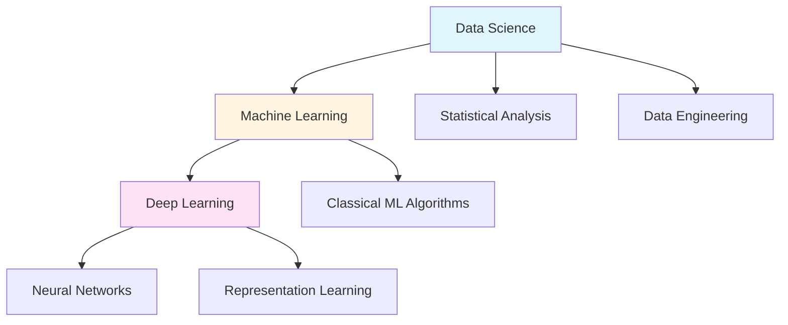

# 📗 ArXiv: Essential Guides for DSML

## Introduction

The fields of Machine Learning (ML), Data Science (DS), and Deep Learning (DL) are often conflated, yet they represent distinct domains with unique methodologies, goals, and applications. This comprehensive guide synthesizes insights from foundational papers to clarify these differences and provide practical guidance for practitioners, combining the **practical folk wisdom** of Pedro Domingos with the **rigorous mathematical foundations** of Osvaldo Simeone and other leading researchers.

## The Three Pillars: Understanding the Landscape



### Data Science: The Holistic Approach

Data Science is a **comprehensive research paradigm** that encompasses the entire knowledge discovery process from raw data. It integrates multiple disciplines:

- **Statistical inference** and hypothesis testing
- **Data engineering** and preprocessing
- **Domain expertise** application
- **Communication** of insights
- **Decision-making** support

Data science focuses on **extracting actionable insights** from data to solve real-world problems, often involving non-technical stakeholders and business contexts.

### Machine Learning: The Learning Paradigm

Machine Learning, as described in the seminal work by Pedro Domingos (Communications of the ACM, 2012) and the comprehensive mathematical treatment by Osvaldo Simeone (arXiv:1709.02840), is fundamentally about **systems that automatically learn programs from data**. 

**Two Complementary Perspectives:**

**Domingos' Practical Perspective:**
- Learning is not just memorization but **generalization**
- Focus on **predictive performance** on unseen data
- Emphasis on **folk knowledge** and practical lessons from experience

**Simeone's Mathematical Perspective:**
- **Probabilistic models** for supervised and unsupervised learning
- Formal treatment of **discriminative vs. generative models**
- **Frequentist and Bayesian approaches** to inference
- Rigorous foundations in **information theory** and optimization

**Mathematical Foundation:**
According to Laurent Younes (arXiv:2409.02668) and Simeone (arXiv:1709.02840), ML builds on:
- Statistical learning theory and PAC learning
- Optimization (gradient descent, proximal methods, SGD)
- Reproducing kernel Hilbert space (RKHS) theory
- Probabilistic graphical models (directed and undirected)
- Information-theoretic measures as unifying tools

**Classical ML includes:**
1. **Supervised Learning**: Linear regression, SVM, decision trees, boosting
2. **Unsupervised Learning**: Clustering, PCA, dimensionality reduction
3. **Semi-supervised Learning**: Combining labeled and unlabeled data
4. **Reinforcement Learning**: Learning through interaction and rewards

### Deep Learning: The Neural Revolution

Deep Learning is a **specialized subset of Machine Learning** focused on neural networks with multiple layers:

**Distinguishing Characteristics:**
- **Representation learning**: Automatic feature extraction
- **End-to-end learning**: Direct mapping from raw inputs to outputs
- **Scalability**: Performance improves with more data and compute
- **Architecture diversity**: CNNs, RNNs, Transformers, GANs

**When to use Deep Learning:**
- Large-scale image, video, or audio data
- Natural language processing tasks
- Complex pattern recognition requiring hierarchical features
- Scenarios with abundant training data

## Two Foundational Perspectives

### Pedro Domingos: The Folk Wisdom of Machine Learning

Domingos' influential paper "A Few Useful Things to Know about Machine Learning" (Communications of the ACM, 2012) provides essential **practical knowledge** rarely found in textbooks. His 12 lessons represent distilled experience from decades of ML research and application.

**Key Philosophy:**
> "Machine learning is not about building better algorithms, it's about understanding data and the world through computational lenses."

**The Core Insight:** Much of the "black art" needed for successful ML applications comes from experience, not theory alone.

**Paper Access:** [PDF from University of Washington](https://homes.cs.washington.edu/~pedrod/papers/cacm12.pdf)

### Osvaldo Simeone: The Mathematical Foundations

Simeone's comprehensive monograph "A Brief Introduction to Machine Learning for Engineers" (arXiv:1709.02840, 2017) provides a **rigorous mathematical treatment** built on first principles, specifically designed for readers with backgrounds in probability and linear algebra.

**Key Philosophy:**
Organize ML concepts according to clearly defined categories:
- Discriminative vs. Generative models
- Frequentist vs. Bayesian approaches
- Exact vs. Approximate inference
- Directed vs. Undirected graphical models
- Convex vs. Non-convex optimization

**The Core Insight:** Deep understanding requires mastery of the mathematical foundations—probabilistic models, information theory, and optimization theory.

**Paper Access:** [arXiv:1709.02840](https://arxiv.org/abs/1709.02840)

## Twelve Lessons from Machine Learning Practice

Based on Domingos' influential paper, here are critical insights for ML practitioners:

### 1. **Learning = Representation + Evaluation + Optimization**

Every ML algorithm consists of three components:
- **Representation**: The hypothesis space (e.g., linear models, neural networks, decision trees)
- **Evaluation**: The objective function (accuracy, log-likelihood, margin)
- **Optimization**: The search method (gradient descent, genetic algorithms)

**Simeone's Mathematical Extension:** The optimization component relies on understanding convex analysis, gradient-based methods (SGD, Adam, RMSProp), and proximal algorithms for non-smooth objectives.

### 2. **It's Generalization That Counts**

The fundamental goal is not to perform well on training data, but on **unseen test data**. This leads to the bias-variance tradeoff:

$$\text{Error} = \text{Bias}^2 + \text{Variance} + \text{Irreducible Error}$$

**Simeone's Framework:** Generalization is formalized through statistical learning theory, with concepts like empirical risk minimization (ERM), structural risk minimization (SRM), and PAC learning bounds providing theoretical guarantees.

### 3. **Data Alone Is Not Enough**

The "No Free Lunch" theorem (Wolpert, 1996) states that **no learning algorithm is universally better** than others. You need:
- Domain knowledge to guide model selection
- Appropriate inductive bias
- Feature engineering (for non-DL approaches)

**Simeone's Perspective:** This is where Bayesian methods excel—priors encode domain knowledge and inductive biases explicitly through the choice of probability distributions.

### 4. **Overfitting Has Many Faces**

Overfitting can occur through:
- Too many features relative to samples
- Too complex models
- Insufficient regularization
- Multiple hypothesis testing (data snooping)

**Mitigation strategies:**
- Cross-validation (k-fold, leave-one-out)
- Regularization (L1/Lasso, L2/Ridge, elastic net, dropout)
- Early stopping in iterative algorithms
- Ensemble methods (bagging, boosting, stacking)

**Mathematical Foundation (Simeone):** Regularization can be understood through Bayesian inference where the regularizer corresponds to a prior distribution, or through the lens of information theory and rate-distortion theory.

### 5. **Intuition Fails in High Dimensions**

The "curse of dimensionality" means:
- Similarity-based reasoning breaks down
- Most volume in high-dimensional spaces is concentrated in corners
- Euclidean distances become less meaningful
- Sample complexity grows exponentially with dimension

**Counter-force:** The "blessing of non-uniformity"—real-world data is not uniformly distributed but concentrated in lower-dimensional manifolds.

**Simeone's Mathematical Treatment:** Dimensionality reduction techniques (PCA, kernel PCA, manifold learning) and the theory of reproducing kernel Hilbert spaces (RKHS) provide formal tools for handling high-dimensional data.

### 6. **Theoretical Guarantees Are Not What They Seem**

PAC (Probably Approximately Correct) learning theory provides bounds, but:
- Bounds are often too loose for practice (exponential or polynomial in dimension)
- Real-world performance may exceed theoretical predictions
- Empirical validation remains essential

**Domingos' Insight:** Theory guides algorithm design but doesn't determine practical decisions.

**Simeone's Balance:** Rigorous theory provides understanding of what's possible and guides design, while acknowledging that practical performance depends on problem structure not captured by worst-case bounds.

### 7. **Feature Engineering Is Key**

For traditional ML (pre-deep learning era):
- Raw features rarely sufficient for good performance
- Domain knowledge crucial for creating informative features
- Feature combinations often more informative than individual features
- Automated feature learning (AutoML, neural architecture search) emerging

**Modern Context:** Deep learning automates feature engineering through representation learning, but feature engineering remains critical for structured/tabular data.

### 8. **More Data Beats a Cleverer Algorithm**

Empirically observed pattern:
- Simple algorithms with lots of data often outperform sophisticated algorithms with little data
- But: clever algorithms can reduce data requirements significantly
- Deep learning particularly benefits from scale

**Theoretical Backing (Simeone):** Statistical learning theory shows that generalization error decreases with sample size, typically as $O(1/\sqrt{n})$ for many algorithms.

### 9. **Learn Many Models, Not Just One**

**Ensemble methods** consistently outperform single models:
- **Bagging** (Bootstrap Aggregating): Reduces variance by training on bootstrap samples (Random Forests)
- **Boosting**: Reduces bias by sequentially fitting to residuals (AdaBoost, XGBoost, LightGBM)
- **Stacking**: Combines diverse models using a meta-learner

**Mathematical Insight:** Ensemble methods work by reducing prediction variance (bagging) or bias (boosting) while maintaining or improving the other. The bias-variance decomposition explains their success.

### 10. **Simplicity Does Not Imply Accuracy**

- Occam's razor is not always correct in ML
- Complex models may generalize better with sufficient data
- Trade-off between interpretability and performance
- Minimum Description Length (MDL) provides a formal framework

**Balance:** Start simple, increase complexity as needed and as data permits.

### 11. **Representable Does Not Imply Learnable**

Even if a model **can represent** the true function:
- Finding it may be computationally intractable (NP-hard)
- Local optima in non-convex optimization landscapes
- Sufficient training data may not be available
- Training algorithms may not converge to the global optimum

**Simeone's Framework:** Distinguishes between:
- **Approximation error**: How well the hypothesis class can represent the target
- **Estimation error**: How well we can find the best hypothesis given finite data
- **Optimization error**: How close our algorithm gets to the optimal hypothesis in the class

### 12. **Correlation Does Not Imply Causation**

ML identifies correlations and associations, not causality:
- Predictive accuracy ≠ causal understanding
- Causal inference requires additional assumptions (DAGs, do-calculus)
- Interventional experiments needed for establishing causality
- Observational data may contain confounders

**Modern Development:** Causal ML and causal inference are emerging subfields bridging prediction and intervention.

## Theoretical Foundations: The Mathematical Toolkit

From Shashua's class notes (arXiv:0904.3664), Younes' textbook (arXiv:2409.02668), and Simeone's monograph (arXiv:1709.02840):

### Statistical Inference

**Bayesian Inference:**
- Combines prior beliefs with observed data to form posterior distributions
- Optimal decision-making under uncertainty via expected utility
- Naturally handles model uncertainty and provides confidence measures
- **Key tools:** Bayes' theorem, conjugate priors, MCMC, variational inference

**Maximum Likelihood / Maximum Entropy:**
- Find parameters maximizing data likelihood: $\theta^* = \arg\max_\theta p(D|\theta)$
- Maximum entropy: Choose the least committal distribution consistent with constraints
- Connection to information theory (KL divergence, cross-entropy)
- Duality relationship: MaxEnt with moment constraints ↔ exponential family distributions

**Simeone's Contribution:** Provides unified treatment showing how MLE and MAP estimation fit within the broader framework of information-theoretic learning.

### Probabilistic Graphical Models

**Directed Models (Bayesian Networks):**
- Encode conditional independence via DAG structure
- Factorization: $p(x_1,...,x_n) = \prod_i p(x_i|parents(x_i))$
- Inference algorithms: belief propagation, junction tree
- **Applications:** Causal modeling, expert systems

**Undirected Models (Markov Random Fields):**
- Encode pairwise relationships via graph structure
- Factorization via clique potentials: $p(x) \propto \prod_c \psi_c(x_c)$
- **Applications:** Image segmentation, spatial statistics

**Simeone's Framework:** Distinguishes exact inference (tractable for trees) from approximate inference (variational methods, sampling) and explains when each applies.

### Algebraic and Spectral Methods

**Principal Component Analysis (PCA):**
- **Goal:** Unsupervised dimensionality reduction
- **Method:** Finds directions of maximum variance via eigendecomposition
- **Math:** Eigenvectors of covariance matrix $\Sigma = \frac{1}{n}X^TX$
- **Variants:** Kernel PCA for nonlinear patterns

**Linear Discriminant Analysis (LDA):**
- **Goal:** Supervised dimensionality reduction
- **Method:** Maximizes between-class scatter, minimizes within-class scatter
- **Math:** Solves generalized eigenvalue problem $S_B w = \lambda S_W w$
- **Use case:** Classification with dimension reduction

**Canonical Correlation Analysis (CCA):**
- **Goal:** Find correlations between two sets of variables
- **Method:** Maximizes correlation between linear combinations
- **Applications:** Multi-view learning, cross-modal retrieval

### PAC Learning Framework

Formal learning theory (Valiant, 1984) provides:

**Sample Complexity:** How many examples $m$ are needed to learn?
- Depends on hypothesis class complexity (VC dimension)
- Typical bound: $m = O(\frac{1}{\epsilon^2}(\text{VC-dim} + \log(1/\delta)))$

**VC Dimension:** Capacity measure of hypothesis class
- Finite VC dimension → class is PAC-learnable
- Linear classifiers in $\mathbb{R}^d$: VC-dim = $d+1$

**Double sampling theorem**:
- Generalization guarantees

**Key Insight:** Learning is possible when hypothesis class has has finite VC dimension; appropriate complexity relative to sample size—not too simple (high bias) nor too complex (high variance).


---

#### 📊 **Double Sampling Theorem: Generalization Guarantees**

**What Is It?**

The **Double Sampling Theorem** (also called the **"symmetrization technique"** or **"ghost sample technique"**) is a fundamental proof technique in PAC (Probably Approximately Correct) learning theory that establishes **uniform convergence** between training error and true error.

**The Core Idea**

**Problem:** We want to bound how much the empirical error (training error) $L_S(h)$ differs from the true error (test/population error) $L_D(h)$ for ALL hypotheses $h \in \mathcal{H}$ simultaneously.

**Challenge:** The true error $L_D(h)$ depends on an unknown distribution $D$, which is hard to analyze directly.

**Solution (Double Sampling):** Instead of comparing training error to the unknowable true distribution, compare it to error on a **second independent sample** (the "ghost sample") drawn from the same distribution.

**Mathematical Formulation**

Given:
- Hypothesis class $\mathcal{H}$
- Training sample $S_1 = \{z_1, ..., z_m\}$ drawn i.i.d. from distribution $D$
- **Ghost sample** $S_2 = \{z'_1, ..., z'_m\}$ also drawn i.i.d. from $D$ (independent of $S_1$)

**Key Insight:**
$$\mathbb{P}_{S_1 \sim D^m}\left[\exists h \in \mathcal{H}: |L_{S_1}(h) - L_D(h)| \geq \epsilon\right]$$

can be bounded by:

$$\mathbb{P}_{S_1, S_2 \sim D^{2m}}\left[\exists h \in \mathcal{H}: |L_{S_1}(h) - L_{S_2}(h)| \geq \frac{\epsilon}{2}\right]$$

**Why This Works**

1. **Expected value connection:**
   $$\mathbb{E}_{S_1}[L_{S_1}(h)] = L_D(h) = \mathbb{E}_{S_2}[L_{S_2}(h)]$$

2. **Symmetry:** Since both $S_1$ and $S_2$ are drawn from $D$, they play symmetric roles

3. **Concentration:** Using concentration inequalities (Hoeffding, McDiarmid), we bound the deviation between two empirical estimates

4. **Discretization:** The second sample effectively "discretizes" the continuous distribution, making the problem finite and tractable

**The Proof Steps**

**Step 1: Replace true distribution with ghost sample**
$$\mathbb{P}[\exists h: |L_{S_1}(h) - L_D(h)| \geq \epsilon] \leq 2 \cdot \mathbb{P}[\exists h: |L_{S_1}(h) - L_{S_2}(h)| \geq \epsilon/2]$$

**Step 2: Use permutation (symmetrization)**
- Swap random elements between $S_1$ and $S_2$
- The probability of large deviation remains the same due to exchangeability

**Step 3: Apply union bound and growth function**
- Bound over all possible labelings on $2m$ points
- Use growth function $\Pi_\mathcal{H}(2m)$ instead of $|\mathcal{H}|$

**Step 4: Apply concentration inequality**
- Use Hoeffding's inequality on the bounded loss
- Results in exponential decay in sample size

### **The Final Bound**

**Theorem (Uniform Convergence via Double Sampling):**

For binary classification with 0-1 loss, for any $\epsilon, \delta > 0$:

$$\mathbb{P}_{S \sim D^m}\left[\exists h \in \mathcal{H}: |L_S(h) - L_D(h)| \geq \epsilon\right] \leq 4\Pi_\mathcal{H}(2m) \exp\left(-\frac{\epsilon^2 m}{8}\right)$$

Where $\Pi_\mathcal{H}(m)$ is the **growth function** (number of distinct ways $\mathcal{H}$ can label $m$ points).

**Setting this $\leq \delta$ and solving for $m$ gives the sample complexity:**

$$m \geq \frac{8}{\epsilon^2}\left(\log \Pi_\mathcal{H}(2m) + \log \frac{4}{\delta}\right)$$

### **Connection to VC Dimension**

Using the Sauer-Shelah lemma:
$$\Pi_\mathcal{H}(m) \leq \left(\frac{em}{d}\right)^d$$

where $d = \text{VC-dim}(\mathcal{H})$.

This gives the famous PAC sample complexity bound:
$$m = O\left(\frac{1}{\epsilon^2}\left(d\log\frac{1}{\epsilon} + \log\frac{1}{\delta}\right)\right)$$

### **Why It's Called "Double Sampling"**

Because the proof technique uses **two independent samples**:
1. **First sample ($S_1$):** The actual training set
2. **Second sample ($S_2$):** The "ghost" or "test" sample used in the proof

Even though we only use one sample in practice, the theoretical analysis requires considering what would happen with two independent samples.

---

### **Practical Implications**

**Generalization Guarantee:**
If you have enough training data, then with high probability:
- The hypothesis that performs best on training data
- Will also perform well on test data
- For ALL hypotheses in your class simultaneously

**This explains:**
- Why empirical risk minimization (ERM) works
- How much training data you need
- Why finite VC dimension is necessary and sufficient for PAC learnability

### **Key Takeaway**

> The Double Sampling Theorem is the **bridge between training and test performance**. It shows that if you have enough data relative to your model's complexity (VC dimension), the training error reliably estimates the true error uniformly across your entire hypothesis class.

This is why we can trust that a model that performs well in training will generalize—**if** we have sufficient samples relative to the model's capacity!


## Probabilistic Models: Simeone's Systematic Framework

### Discriminative vs. Generative Models

**Discriminative Models:**
- Directly model $p(y|x)$: the conditional distribution of output given input
- **Examples:** Logistic regression, SVM, conditional random fields (CRFs)
- **Advantages:** Often better predictive performance, requires less modeling assumptions
- **Disadvantages:** Cannot generate new samples, less interpretable

**Generative Models:**
- Model joint distribution $p(x,y) = p(y)p(x|y)$
- **Examples:** Naive Bayes, hidden Markov models (HMMs), Gaussian mixture models (GMMs)
- **Advantages:** Can generate new samples, handles missing data, incorporates prior knowledge
- **Disadvantages:** Stronger modeling assumptions, may be less accurate for prediction

**Decision Rule:** For both, prediction is $\hat{y} = \arg\max_y p(y|x)$

### Frequentist vs. Bayesian Approaches

**Frequentist:**
- Parameters are **fixed but unknown**
- Estimation via MLE: $\hat{\theta} = \arg\max_\theta p(D|\theta)$
- Confidence intervals based on sampling distribution
- **Pros:** Computationally simpler, fewer assumptions
- **Cons:** No natural way to incorporate prior knowledge

**Bayesian:**
- Parameters are **random variables** with distributions
- Estimation via posterior: $p(\theta|D) \propto p(D|\theta)p(\theta)$
- Credible intervals based on posterior distribution
- **Pros:** Principled uncertainty quantification, incorporates priors
- **Cons:** Computationally intensive, requires prior specification

**Simeone's Insight:** These are complementary approaches—frequentist for large data regimes, Bayesian when prior knowledge is valuable or data is limited.

### Information Theory in Machine Learning

**Key Concepts (Simeone's unifying framework):**
- **Entropy** $H(X) = -\sum_x p(x)\log p(x)$: Uncertainty in random variable
- **Mutual Information** $I(X;Y) = H(X) - H(X|Y)$: Information X provides about Y
- **KL Divergence** $D_{KL}(p||q) = \sum_x p(x)\log\frac{p(x)}{q(x)}$: Dissimilarity between distributions

**Applications:**
- Feature selection: Choose features maximizing $I(X;Y)$
- Model selection: Minimize KL divergence to true distribution
- Variational inference: Minimize KL divergence between approximate and true posterior
- Rate-distortion theory: Trade off compression rate and reconstruction fidelity

## Practical Decision Framework

### When to Use Classical ML

✅ **Structured/tabular data** with clear features
✅ **Limited data** (< 100K samples)
✅ **Interpretability required** (healthcare, finance, legal)
✅ **Feature engineering possible** with domain knowledge
✅ **Computational constraints** (edge devices, real-time)

**Best algorithms:**
- **Tree-based**: XGBoost, LightGBM, CatBoost (gradient boosting)
- **Ensemble**: Random Forests (bagging)
- **Kernel methods**: Support Vector Machines (SVM)
- **Linear**: Logistic/Ridge regression, elastic net
- **Probabilistic**: Naive Bayes, Gaussian processes

**When to use Bayesian approaches:**
- Small datasets where uncertainty quantification matters
- Prior knowledge available (physics, expert knowledge)
- Sequential decision-making (A/B testing, bandits)

### When to Use Deep Learning

✅ **Unstructured data** (images, text, audio, video)
✅ **Massive datasets** (> 1M samples)
✅ **Complex patterns** requiring hierarchical abstraction
✅ **End-to-end learning beneficial** (avoid feature engineering)
✅ **GPU/TPU resources available**
✅ **Transfer learning applicable** (pre-trained models)

**Best architectures:**
- **CNNs** (Convolutional Neural Networks): Computer vision, image analysis
- **Transformers**: NLP, sequences, vision transformers (ViTs)
- **RNNs/LSTMs**: Temporal data, time series (being replaced by Transformers)
- **GANs** (Generative Adversarial Networks): Image generation, style transfer
- **Autoencoders/VAEs**: Representation learning, anomaly detection
- **Graph Neural Networks (GNNs)**: Graph-structured data

### Data Science Workflow

1. **Problem Formulation**
   - Define business objectives clearly
   - Identify success metrics (KPIs)
   - Assess data availability and quality
   - Establish baseline performance

2. **Data Engineering**
   - Collection and storage infrastructure
   - Cleaning and preprocessing pipelines
   - Feature extraction and engineering
   - Data quality assessment and validation
   - Handle missing data, outliers, imbalances

3. **Exploratory Analysis**
   - Statistical summaries and distributions
   - Visualizations (univariate, bivariate, multivariate)
   - Hypothesis generation
   - Pattern discovery and anomaly detection
   - Correlation analysis

4. **Model Building**
   - Algorithm selection (classical ML vs. DL)
   - Training and hyperparameter tuning
   - Cross-validation strategy
   - Ensemble construction if beneficial
   - Probabilistic modeling if uncertainty critical

5. **Evaluation**
   - Test set performance on held-out data
   - Error analysis and failure case examination
   - Bias/fairness assessment across subgroups
   - Robustness testing (adversarial examples, distribution shift)
   - Calibration assessment for probabilistic predictions

6. **Deployment & Monitoring**
   - Production integration and serving infrastructure
   - A/B testing for gradual rollout
   - Performance monitoring and drift detection
   - Model retraining pipelines
   - Explainability and interpretability tools

## The Modern ML Landscape: 2025 and Beyond

### Emerging Trends

**1. Foundation Models & Transfer Learning**
- Pre-trained models as starting points (BERT, GPT, CLIP, SAM)
- Fine-tuning for specific tasks (full, LoRA, adapters)
- Few-shot and zero-shot learning capabilities
- Prompt engineering as new paradigm

**2. AutoML & Neural Architecture Search**
- Automated hyperparameter tuning (Bayesian optimization, grid/random search)
- Architecture discovery (NAS, evolutionary algorithms)
- Democratizing ML expertise for non-experts
- Meta-learning and learning to learn

**3. Explainable AI (XAI)**
- Post-hoc explanations: SHAP, LIME, integrated gradients
- Attention visualization in transformers
- Counterfactual explanations ("what if" scenarios)
- Inherently interpretable models (sparse linear, GAMs, rule lists)

**4. Ethical AI & Fairness**
- Bias detection and mitigation across protected attributes
- Privacy-preserving learning (federated learning, differential privacy)
- Responsible AI frameworks and governance
- Fairness metrics (demographic parity, equalized odds, calibration)

**5. Causal ML**
- Treatment effect estimation (ITE, ATE, CATE)
- Causal discovery from observational data (constraint-based, score-based)
- Bridging prediction and intervention
- Causal representation learning

**6. Probabilistic Programming**
- Languages for expressing probabilistic models (Stan, PyMC, Pyro)
- Automated inference via MCMC and variational methods
- Integration with deep learning (variational autoencoders)

## Key Takeaways

### Conceptual Understanding

1. **Data Science** is the broadest discipline, encompassing the entire data-to-insights pipeline
2. **Machine Learning** is a subset focused on algorithms that automatically learn from data
3. **Deep Learning** is a specialized ML approach using multi-layer neural networks
4. Success requires understanding **when to apply each approach** based on problem characteristics

### Practical Wisdom

5. **No algorithm dominates** across all problems—context determines the best choice (No Free Lunch)
6. **Generalization**, not training performance, is the ultimate goal—avoid overfitting at all costs
7. **Domain knowledge** remains irreplaceable despite automation—priors, features, and evaluation matter
8. **Ensembles** and **more data** are your best friends for improving performance
9. **Theory guides** algorithm design, but **empirical validation** determines success
10. **Ethics and interpretability** are increasingly critical for real-world deployment

### Mathematical Foundations

11. **Probabilistic thinking** unifies many ML approaches—distributions over hypotheses and predictions
12. **Optimization** is central—understand convexity, gradient descent, and convergence
13. **Information theory** provides elegant framework—entropy, mutual information, KL divergence
14. **Bias-variance tradeoff** governs model complexity choices
15. **Statistical learning theory** explains when and why learning is possible

### Two Complementary Paths

16. **Domingos' folk wisdom**: Practical lessons from decades of experience, essential for practitioners
17. **Simeone's mathematical rigor**: Formal foundations for deep understanding, essential for researchers
18. **Integration is key**: Combine practical intuition with theoretical understanding for mastery

## 📚 Essential ArXiv Papers: Your Learning Roadmap

> 🧭 **Navigation Guide:**  
> This unified collection takes you from **foundational principles → practical implementation → cutting-edge research**.  
> Papers are organized by learning phase for maximum clarity and confidence-building.

### 🧩 How to Use This List
1. Start with **Foundational Guides** to understand the "why"  
2. Move to **Intermediate & Applied Surveys** to explore "how" ML/DL are implemented  
3. Finish with **Deep-Dive Research Papers** for architecture-level and theoretical insight  
4. Keep a **Learning Log** — summarize one key concept per paper  

---

## 🧱 PHASE I — Core Foundations (Start Here)

### Theory & Principles

📄 **[A Few Useful Things to Know About Machine Learning](https://homes.cs.washington.edu/~pedrod/papers/cacm12.pdf){:target="_blank"}** — P. Domingos (2012)  
**Note:** Published in Communications of the ACM, Vol. 55 No. 10 (not on arXiv)  
**Why read:** Essential folk knowledge and 12 critical lessons every ML practitioner must know  
**TL;DR:** Generalization, overfitting, bias-variance tradeoff, and why data alone isn't enough  
**Perspective:** Practical wisdom from decades of experience

📄 **[A Brief Introduction to Machine Learning for Engineers](https://arxiv.org/abs/1709.02840){:target="_blank"}** — O. Simeone (2017)  
**Why read:** Rigorous mathematical foundations with systematic treatment of probabilistic models  
**TL;DR:** Discriminative/generative models, frequentist/Bayesian approaches, graphical models, information theory  
**Perspective:** Mathematical rigor built on first principles  
**Target audience:** Engineers with background in probability and linear algebra

📄 **[Introduction to Machine Learning: Class Notes 67577](https://arxiv.org/abs/0904.3664){:target="_blank"}** — A. Shashua (2009)  
**Why read:** Statistical inference, PAC learning theory, and algebraic methods foundation  
**TL;DR:** Bayesian inference, EM algorithm, PCA, LDA, CCA, VC dimension, double sampling theorem and formal learning guarantees  
**Perspective:** Theoretical computer science approach to ML

📄 **[Introduction to Machine Learning](https://arxiv.org/abs/2409.02668){:target="_blank"}** — L. Younes (2024)  
**Why read:** Modern, comprehensive mathematical foundations textbook-style for ML  
**TL;DR:** Optimization theory, kernel methods, RKHS, graphical models, statistical learning, matrix analysis  
**Perspective:** Applied mathematics treatment with measure theory

### Deep Learning Foundations

📄 **[Deep Learning in Neural Networks: An Overview](https://arxiv.org/abs/1404.7828){:target="_blank"}** — J. Schmidhuber (2014)  
**Why read:** Historical + conceptual overview that shaped modern DL understanding  
**TL;DR:** Connects early neural networks, backpropagation, and modern deep architectures  
**Impact:** Citations: 10,000+ | Comprehensive survey of deep learning history

📄 **[An Overview of Gradient Descent Optimization Algorithms](https://arxiv.org/abs/1609.04747){:target="_blank"}** — S. Ruder (2016)  
**Why read:** The must-read optimization primer for training DL models  
**TL;DR:** Explains SGD, momentum, RMSProp, Adam, and convergence dynamics  
**Practical value:** Essential for understanding how to train neural networks effectively

📄 **[Activation Functions: Comparison of Trends in Practice and Research](https://arxiv.org/abs/1811.03378){:target="_blank"}** — R. Nwankpa et al. (2018)  
**Why read:** Comprehensive comparison of activation functions from ReLU to GELU  
**TL;DR:** When and why different activations matter for network performance  
**Practical guidance:** Helps choose appropriate activation for your architecture

---

## 🧩 PHASE II — Applied Fundamentals

### Generative Models & Modern Architectures

📄 **[Generative Adversarial Networks (GANs)](https://arxiv.org/abs/1406.2661){:target="_blank"}** — I. Goodfellow et al. (2014)  
**Why read:** The birth of generative models—essential to modern AI  
**TL;DR:** Explains generator–discriminator adversarial training framework  that revolutionized generation tasks  
**Impact:** Revolutionary paper that enabled photorealistic image generation

### Transfer Learning & Model Efficiency

📄 **[A Comprehensive Survey on Transfer Learning](https://arxiv.org/abs/1911.02685){:target="_blank"}** — F. Zhuang et al. (2019)  
**Why read:** The definitive guide to transfer learning theory and applications  
**TL;DR:** Domain adaptation, inductive vs transductive transfer, fine-tuning strategies  
**Practical value:** Essential for applying pre-trained models effectively

📄 **[A Survey on Deep Transfer Learning](https://arxiv.org/abs/1808.01974){:target="_blank"}** — C. Tan et al. (2018)  
**Why read:** Complements Zhuang's work with deep-network-oriented taxonomy  
**TL;DR:** How pre-trained deep features generalize across different tasks and domains

📄 **[Distilling the Knowledge in a Neural Network](https://arxiv.org/abs/1503.02531){:target="_blank"}** — G. Hinton et al. (2015)  
**Why read:** Classic foundation for model compression and efficiency  
**TL;DR:** Teacher-student distillation for creating smaller, faster models without sacrificing accuracy  
**Practical impact:** Enables deployment of DL models on edge devices  

📄 **[LoRA: Low-Rank Adaptation of Large Language Models](https://arxiv.org/abs/2106.09685){:target="_blank"}** — E. Hu et al. (2021)  
**Why read:** Seminal reference for parameter-efficient fine-tuning (PEFT) methods  
**TL;DR:** Fine-tune massive models by training only low-rank adapter layers  
**Modern relevance:** Foundation of efficient LLM fine-tuning (2024-2025)  

### Natural Language Processing

📄 **[A Survey of the Usages of Deep Learning for NLP](https://arxiv.org/abs/1807.10854){:target="_blank"}** — D. W. Otter et al. (2018)  
**Why read:** Friendly overview of DL in natural language processing  
**TL;DR:** Sequence models, embeddings, neural NLP architectures explained clearly

📄 **[Natural Language Processing Advancements by Deep Learning](https://arxiv.org/abs/2003.01200){:target="_blank"}** — A. Torfi et al. (2020)  
**Why read:** Broader NLP survey building on Otter's paper—includes transformers  
**TL;DR:** Evolution from RNNs to attention mechanisms and transformer-based models

### Privacy & Trust

📄 **[Deep Learning with Differential Privacy](https://arxiv.org/abs/1607.00133){:target="_blank"}** — M. Abadi et al. (2016)  
**Why read:** Introduces privacy-preserving training in deep learning  
**TL;DR:** DP-SGD and formal privacy guarantees for training on sensitive data  
**Practical importance:** Essential for healthcare, finance, personal data

---

## ⚙️ PHASE III — Intermediate & Specialized Topics

### Reinforcement Learning

📄 **[A Brief Survey of Deep Reinforcement Learning](https://arxiv.org/abs/1708.05866){:target="_blank"}** — K. Arulkumaran et al. (2017)  
**Why read:** Concise walkthrough of deep RL—DQN, policy gradients, actor-critic  
**TL;DR:** How neural networks enable agents to learn optimal behavior through interaction

### Explainability & Interpretability

📄 **[A Survey on Explainable Artificial Intelligence (XAI)](https://arxiv.org/abs/1907.07374){:target="_blank"}** — E. Tjoa & C. Guan (2019)  
**Why read:** Core resource for interpretability and trustworthy AI  
**TL;DR:** Methods for understanding and explaining black-box model decisions  
**Categories:** Model-agnostic (LIME, SHAP) vs. model-specific explanations

### Computer Vision

📄 **[Deep Learning for Generic Object Detection: A Survey](https://arxiv.org/abs/1809.02165){:target="_blank"}** — L. Liu et al. (2018)  
**Why read:** Highly cited CV survey—detection architectures and training methods  
**TL;DR:** From R-CNN to YOLO: evolution of object detection in computer vision

📄 **[Deep Visual Domain Adaptation: A Survey](https://arxiv.org/abs/1802.03601){:target="_blank"}** — M. Wang & W. Deng (2018)  
**Why read:** How deep features generalize across visual domains—vital for deployment  
**TL;DR:** Techniques for adapting models trained on one dataset to perform on another

---

## 🔬 PHASE IV — Deep Dive & Advanced Research

### Comprehensive Textbooks

📄 **[Dive into Deep Learning (D2L)](https://arxiv.org/abs/2106.11342){:target="_blank"}** — A. Zhang et al. (2021)  
**Why read:** Textbook-style deep dive combining math, intuition, and runnable code  
**TL;DR:** Interactive learning resource with implementations in PyTorch, TensorFlow, and JAX  
**Unique feature:** Free online book with executable code examples

### Model Efficiency & Optimization

📄 **[Efficient Deep Learning: A Survey on Making Models Smaller, Faster, and Better](https://arxiv.org/abs/2106.08962){:target="_blank"}** — S. Menghani (2021)  
**Why read:** Covers model pruning, quantization, NAS, and distillation in depth  
**TL;DR:** Comprehensive guide to deploying DL models in resource-constrained environments  
**Techniques:** Pruning, quantization, knowledge distillation, neural architecture search

### Modern Applications

📄 **[A Survey on State-of-the-Art Deep Learning Applications](https://arxiv.org/abs/2403.17561){:target="_blank"}** — M. H. M. Noor (2024)  
**Why read:** Consolidates DL use-cases from 2020–2024 across CV, NLP, and time-series  
**TL;DR:** How foundational techniques power modern AI solutions in production  
**Relevance:** Current state of the art as of 2024

### Theoretical Perspectives

📄 **[Connections between Physics, Mathematics and Deep Learning](https://arxiv.org/abs/1811.00576){:target="_blank"}** — J. Thierry-Mieg (2018)  
**Why read:** Theoretical and philosophical perspective connecting DL, geometry, and physics  
**TL;DR:** Deep exploration of why neural networks work from first principles

---

## 🗺️ Unified Learning Path

| Phase | Focus Area | Key Papers | Time Investment |
|:------|:-----------|:-----------|:----------------|
| 🧱 **Foundations** | ML theory, probabilistic models, DL basics | Domingos (2012), Simeone 1709.02840, Shashua 0904.3664, Younes 2409.02668, Schmidhuber 1404.7828, Ruder 1609.04747 | 3-4 weeks |
| 🧩 **Applied Fundamentals** | Transfer learning, NLP, generative models, efficiency | Zhuang 1911.02685, Goodfellow 1406.2661, Hinton 1503.02531, Hu 2106.09685, Otter 1807.10854 | 2-3 weeks |
| ⚙️ **Intermediate** | RL, XAI, CV, domain adaptation | Arulkumaran 1708.05866, Tjoa 1907.07374, Liu 1809.02165, Wang 1802.03601 | 3-4 weeks |
| 🔬 **Deep Dive** | Advanced theory, efficiency, modern applications | Zhang 2106.11342, Menghani 2106.08962, Noor 2403.17561, Thierry-Mieg 1811.00576 | Ongoing |

---

## 🧰 Practical Study Strategies

### Reading Approach (Three-Pass Method)

**First Pass: Survey (15 minutes)**
- Read abstract, introduction, and conclusion
- Skim section headings and subheadings
- Look at figures and tables
- **Goal:** Understand the paper's main contribution

**Second Pass: Comprehension (1-2 hours)**
- Read the paper carefully but skip detailed proofs
- Note key equations and algorithms
- Mark unfamiliar terms for later lookup
- Understand the experimental setup and results
- **Goal:** Grasp the paper's content and methodology

**Third Pass: Deep Understanding (3-4 hours)**
- Work through derivations and proofs
- Implement key algorithms if possible
- Critically evaluate assumptions and limitations
- Consider how to apply or extend the work
- **Goal:** Master the paper thoroughly

### Active Learning

💻 **Code along:** 
- Replicate key experiments from papers
- Use Kaggle notebooks or Google Colab
- Start with provided code repositories when available
- Modify hyperparameters to develop intuition

🗂️ **Build a paper map:** 
- Create a concept graph showing paper relationships
- Use tools like Obsidian, Notion, or mind mapping software
- Track which papers cite each other
- Identify research lineages and schools of thought

🤝 **Discuss:** 
- Join ML reading groups (local or online)
- Participate in Reddit's r/MachineLearning
- Engage on Twitter/X with ML researchers
- Present papers to colleagues or study groups

🔄 **Revisit:** 
- Return to foundational papers quarterly
- Notice new insights as your understanding deepens
- Connect new papers to foundational concepts
- Build cumulative knowledge over time

### Recommended Workflow

**Week 1-2: Build Intuition**
1. Start with **Domingos (2012)** for practical ML wisdom
2. Read **Schmidhuber (1404.7828)** for DL history and context
3. Study **Ruder (1609.04747)** for optimization fundamentals

**Week 3-4: Mathematical Foundations**
4. Work through **Simeone (1709.02840)** systematically—take notes on each chapter
5. Supplement with **Shashua (0904.3664)** for theoretical perspective
6. Reference **Younes (2409.02668)** for deeper mathematical details

**Week 5-6: Specialization Begins**
7. Choose your primary interest area (NLP, CV, RL, etc.)
8. Read the corresponding surveys from Phase II
9. Implement a simple project in your chosen area

**Week 7+: Deep Dive & Application**
10. Work through **D2L (2106.11342)** chapters relevant to your focus
11. Read specialized papers from Phase III-IV
12. Contribute to open source or build portfolio projects
13. Stay current with recent papers on arXiv

### Documentation Template

For each paper, maintain a structured summary:

```markdown
# Paper Title
**Authors:** [List]
**Year:** [Year]
**arXiv:** [Link]
**Citations:** [Count from Google Scholar]

## One-Sentence Summary
[Core contribution in plain English]

## Key Contributions
- [Bullet point 1]
- [Bullet point 2]
- [Bullet point 3]

## Methodology
[Brief description of approach]

## Results
[Key findings and performance metrics]

## Limitations
[What the paper doesn't address]

## Personal Notes
[Your insights, connections to other work, questions]

## Code/Resources
[Links to implementations, datasets, etc.]

## Related Papers
[Papers that cite or build on this work]
```

---

## 📚 Complementary Resources

### Classic Textbooks

📖 **The Elements of Statistical Learning** — Hastie, Tibshirani, Friedman  
**Why read:** The Bible of statistical learning—comprehensive and rigorous  
**Free:** Available at https://hastie.su.domains/ElemStatLearn/

📖 **Deep Learning** — Goodfellow, Bengio, Courville  
**Why read:** Authoritative textbook on deep learning fundamentals  
**Free:** Available at https://www.deeplearningbook.org/

📖 **Pattern Recognition and Machine Learning** — Bishop  
**Why read:** Excellent coverage of probabilistic graphical models and Bayesian methods  
**Complements:** Simeone's treatment of probabilistic ML

📖 **The Master Algorithm** — Domingos  
**Why read:** Popular science book by Domingos explaining ML to general audience  
**Audience:** Non-technical readers wanting ML intuition

📖 **Probabilistic Machine Learning Series** — Murphy  
**Why read:** Modern, comprehensive treatment (3 volumes)  
**Free:** Introductory volume available online

### Online Courses

🎓 **[Andrew Ng's Machine Learning](https://www.coursera.org/learn/machine-learning){:target="_blank"}** — Coursera  
**Level:** Beginner-friendly introduction  
**Duration:** ~60 hours  
**Cost:** Free to audit

🎓 **[Fast.ai Practical Deep Learning](https://course.fast.ai/){:target="_blank"}**  
**Level:** Intermediate, code-first approach  
**Duration:** ~80 hours  
**Cost:** Completely free

🎓 **[MIT 6.S191 Introduction to Deep Learning](https://introtodeeplearning.com/){:target="_blank"}**  
**Level:** Intermediate to advanced  
**Duration:** Lectures + labs  
**Cost:** Free (recorded lectures available)

🎓 **[Stanford CS229: Machine Learning](https://cs229.stanford.edu/){:target="_blank"}**  
**Level:** Advanced with strong math prerequisites  
**Duration:** Full semester course  
**Cost:** Free (lecture notes and videos)

🎓 **[Stanford CS231n: CNN for Visual Recognition](https://cs231n.stanford.edu/){:target="_blank"}**  
**Level:** Advanced computer vision  
**Duration:** Full semester  
**Cost:** Free (lecture notes and videos)

🎓 **[Stanford CS224n: NLP with Deep Learning](https://web.stanford.edu/class/cs224n/){:target="_blank"}**  
**Level:** Advanced NLP  
**Duration:** Full semester  
**Cost:** Free (lecture notes and videos)

### Interactive Platforms

🔬 **[Kaggle Learn](https://www.kaggle.com/learn){:target="_blank"}**  
**Content:** Hands-on micro-courses with notebooks  
**Topics:** Python, pandas, ML, DL, feature engineering  
**Cost:** Free

🔬 **[Google Machine Learning Crash Course](https://developers.google.com/machine-learning/crash-course){:target="_blank"}**  
**Content:** Self-paced with TensorFlow exercises  
**Duration:** ~15 hours  
**Cost:** Free

🔬 **[Hugging Face Course](https://huggingface.co/course){:target="_blank"}**  
**Content:** Modern NLP and transformers  
**Focus:** Practical implementation with transformers library  
**Cost:** Free

### Communities & Forums

💬 **r/MachineLearning** — Reddit community for ML research  
💬 **r/learnmachinelearning** — Beginner-friendly ML community  
💬 **Hugging Face Forums** — NLP and transformers discussions  
💬 **Papers with Code** — Track SOTA results and implementations  
💬 **ML Twitter/X** — Follow researchers for latest developments

---

## 🎯 Specialized Learning Tracks

### Track 1: Classical ML Practitioner
**Goal:** Master traditional ML for structured data

1. Domingos (2012) — Practical wisdom
2. Shashua (0904.3664) — Theory foundations
3. Hastie et al. — Elements of Statistical Learning
4. Focus on ensemble methods, feature engineering
5. Kaggle competitions for structured data

### Track 2: Deep Learning Engineer
**Goal:** Build and deploy neural networks

1. Schmidhuber (1404.7828) — DL history
2. Goodfellow et al. — Deep Learning textbook
3. Ruder (1609.04747) — Optimization
4. Zhang et al. (2106.11342) — D2L for hands-on
5. Specialized surveys for CV/NLP based on interest

### Track 3: ML Researcher
**Goal:** Conduct original ML research

1. Simeone (1709.02840) — Rigorous foundations
2. Younes (2409.02668) — Advanced mathematics
3. Recent papers in your subfield (past 2 years)
4. Contribute to open source ML libraries
5. Participate in paper reading groups

### Track 4: ML for Engineers
**Goal:** Apply ML to engineering problems

1. Simeone (1709.02840) — Written for engineers
2. Domingos (2012) — Practical lessons
3. Menghani (2106.08962) — Model efficiency
4. Deployment-focused resources
5. MLOps and production ML practices

---

## 🔄 Keeping Current (2025)

**Monthly Habits:**
- Subscribe to arXiv alerts in your subfields
- Follow ML conferences (NeurIPS, ICML, ICLR, CVPR, ACL)
- Read Papers with Code for SOTA tracking
- Participate in online ML communities

**Key Conferences to Watch:**
- **NeurIPS** (December) — Broad ML research
- **ICML** (July) — Machine learning theory and applications
- **ICLR** (May) — Deep learning focused
- **CVPR** (June) — Computer vision
- **ACL** (July) — Natural language processing
- **AAAI** (February) — AI broadly

**Emerging Topics (2025):**
- Foundation models and efficient fine-tuning
- Multimodal learning (vision + language + audio)
- AI safety and alignment
- Causal representation learning
- Neuro-symbolic AI
- Quantum machine learning

---

## Conclusion

Machine Learning, Data Science, and Deep Learning represent a hierarchy of increasingly specialized approaches to learning from data. While deep learning dominates headlines with impressive results on unstructured data, classical ML and comprehensive data science practices remain essential for most real-world applications.

This guide has synthesized two complementary perspectives:

**Domingos' Practical Wisdom:**
- Folk knowledge from decades of experience
- Critical lessons that theory alone doesn't teach
- Emphasis on what works in practice
- Accessible insights for practitioners

**Simeone's Mathematical Rigor:**
- Systematic probabilistic framework
- Formal foundations in information theory
- Principled approach to model design
- Deep understanding of the "why"

### The Path to Mastery

Success in ML/DS/DL requires understanding:
- **What** each approach offers and when it applies
- **When** to apply classical ML vs. deep learning
- **How** to combine techniques effectively (ensembles, transfer learning)
- **Why** certain methods work or fail (theory + empirics)
- **Whether** your model is actually learning or just memorizing

### The Integration Principle

The most effective practitioners combine:
1. **Practical intuition** (Domingos) with **theoretical understanding** (Simeone)
2. **Empirical experimentation** with **principled design**
3. **Modern techniques** (deep learning) with **classical methods** (when appropriate)
4. **Predictive accuracy** with **interpretability and fairness**
5. **Individual expertise** with **community knowledge**

As the field evolves rapidly, the boundaries between these disciplines continue to blur, but their foundational principles—grounded in statistics, probability, optimization, information theory, and computer science — remain timeless.

### Final Wisdom

> *"Machine learning is not just about building better algorithms; it's about understanding data, the world, and intelligence itself through computational and mathematical lenses. True mastery comes from balancing practical intuition with theoretical rigor, empirical validation with principled design, and technical excellence with ethical responsibility."*

> “A true understanding of Deep Learning is built not just by reading papers,  but by **living their insights** — coding, experimenting, and reflecting.”  


### The Learning Journey

Remember that:
- **Learning ML is a marathon, not a sprint**—pace yourself
- **Implementation beats passive reading**—code along with papers
- **Community accelerates growth**—engage with others
- **Foundations compound over time**—revisit core papers
- **Curiosity drives discovery**—follow your interests
- **Ethics matter from day one**—build responsibly

---

## 📖 How to Use This Document

**For Beginners:**
1. Start with Introduction and Three Pillars
2. Read Domingos' 12 lessons carefully
3. Work through Phase I papers over 1 month
4. Join an online course (Fast.ai or Andrew Ng)

**For Intermediate Learners:**
1. Review Mathematical Foundations section
2. Study both Domingos and Simeone perspectives
3. Pick a specialization track
4. Implement projects from D2L book

**For Advanced Practitioners:**
1. Use as reference for specific topics
2. Explore Phase IV papers
3. Contribute to open source
4. Read recent arXiv papers in your subfield

**For Researchers:**
1. Deep dive into Simeone's mathematical treatment
2. Study theoretical perspectives thoroughly
3. Use paper map to find research gaps
4. Engage with latest conference proceedings

---

*Last updated: December 17, 2025*  
*Document version: 2.0 (Corrected & Harmonized)*

**Corrections made:**
- ✅ Fixed arXiv:1709.02840 attribution (now correctly: Simeone, not Domingos)
- ✅ Clarified that Domingos' paper is in Communications of the ACM (not arXiv)
- ✅ Integrated both Domingos' practical wisdom and Simeone's mathematical rigor
- ✅ Added probabilistic models section from Simeone's framework
- ✅ Expanded information theory treatment
- ✅ Harmonized content structure for complementary perspectives

**Tags:** #MachineLearning #DataScience #DeepLearning #ArXiv #MLFundamentals #Research #Corrected

---

**Share this post:**
- [Twitter](https://twitter.com/intent/tweet?text=Essential%20ML%2FDS%2FDL%20Guide&url=YOUR_POST_URL)
- [LinkedIn](https://www.linkedin.com/sharing/share-offsite/?url=YOUR_POST_URL)
- [Reddit](https://reddit.com/submit?url=YOUR_POST_URL)
