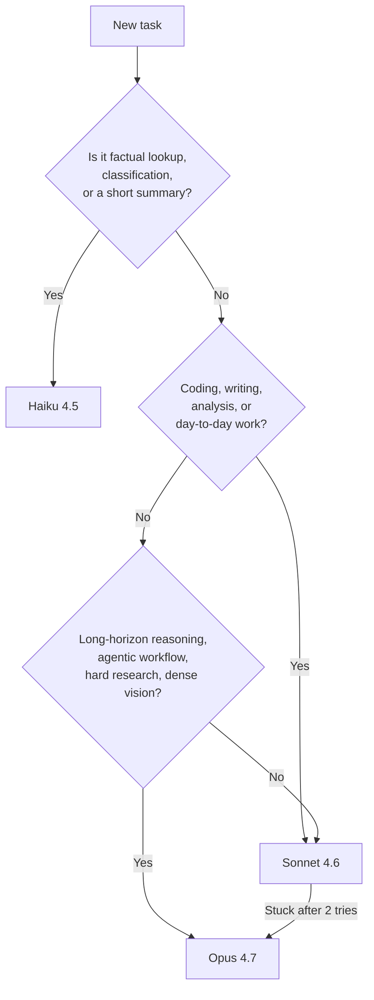

## Claude AI Resources

- <a href="[https://bytebytego.com/guides/cybersecurity-101-in-one-picture/](https://sidsaladi.substack.com/p/the-complete-claude-101-guide-master)" target="_blank" rel="noopener noreferrer"><mark style="background-color: #a7f3d0; border-radius: 4px; padding: 2px 4px; color: #065f46;">Claude-AI 101: Complete Guide &amp; Practical Use Cases | Substack</mark></a>

## Introduction to Claude-AI

Claude AI's models, features, extensions, prompting patterns, task recipes, design traps, long-document workflows, and prompting myth-busters. Incorporates the official Anthropic prompting docs plus Sander Schulhoff's Prompt Report findings!

> **TL;DR** — Claude.ai is not one thing. It's a model family (Haiku → Sonnet → Opus), a workspace (Projects), a creation canvas (Artifacts), a universe of integrations (Connectors), and a prompting surface that rewards clarity. This post walks a complete beginner through *all of it* — with circumstances, task recipes, myth-busters, and a master prompt you can steal at the end.{: .prompt-tip }

> **v3 changelog** — Folds in the current Anthropic prompting best-practices doc *and* Sander Schulhoff's Prompt Report (the meta-study of 1,500+ papers covering 200+ techniques). New: advanced techniques (decomposition, self-criticism, ensembling), long-document prompting, prompt-style mirroring, the Opus 4.7 design-default trap, a myth-busters section, and safer autonomy patterns. **Role-playing guidance has been corrected** — it helps with tone, not with factual accuracy.{: .prompt-info }

## Why this guide exists

If you've just landed on [claude.ai](https://claude.ai) and everything looks *almost* like ChatGPT but not quite — the model picker at the top, the weird "Artifacts" panel, the sidebar that says "Projects", the `+` button that offers "Connectors" — this post is for you.

By the end, you'll know:

1. Which **model** to pick for which job.
2. What **Artifacts, Projects, Connectors, Skills, Styles, and Extensions** actually do.
3. The **general prompting rules** that move the needle.
4. The **advanced techniques** from Schulhoff's Prompt Report — decomposition, self-criticism, ensembling.
5. **Long-document prompting** — how to arrange prompts when you're pasting a 50-page PDF.
6. **Task recipes** for content, summaries, analysis, brainstorming, coding.
7. **Myths busted** — what doesn't actually work, even though it looks like it should.
8. A **copy-paste master prompt**.

Grab a coffee. ☕

---

## Part 1 — The model family (and how to pick)

Anthropic ships Claude in three flavors, named after three poetic forms from shortest to longest:

| Tier             | Current model | Personality              | Best for                                                                                     |
| ---------------- | ------------- | ------------------------ | -------------------------------------------------------------------------------------------- |
| **Haiku**  | Haiku 4.5     | Fast, light, cheap       | Quick answers, classification, summaries, high-volume work                                   |
| **Sonnet** | Sonnet 4.6    | The daily driver         | 80% of real work — coding, writing, analysis, research                                      |
| **Opus**   | Opus 4.7      | The heavyweight reasoner | Hard problems — deep research, complex refactors, long-horizon planning, vision-heavy tasks |

Three things to internalize before you touch the model picker:

**1. A new version isn't a patch.** Each release is a separate training run. Re-test your go-to prompts when a new version drops — Opus 4.7 is notably more *literal* than Opus 4.6.

**2. Rate limits are real.** Haiku sips, Sonnet drinks, Opus gulps.

**3. Adaptive thinking is automatic.** Sonnet 4.6 and Opus 4.6/4.7 calibrate reasoning depth on their own. You don't toggle it in chat. On the API, you steer it via an `effort` parameter (`low` → `medium` → `high` → `xhigh` → `max`) — more on this in Part 4.

### The picker cheat sheet

```text
Need a yes/no, a quick rewrite, or a short summary?     → Haiku 4.5
Writing, coding, analysis, research — your default?     → Sonnet 4.6
Novel problem, long refactor, vision-heavy, hard?       → Opus 4.7
Stuck on Sonnet twice?                                  → Escalate to Opus
```

### A decision flow you can actually follow



### What's new in Opus 4.7 that affects how you prompt

A few behavioral shifts matter even for chat users:

- **More literal instruction following.** Opus 4.7 will not silently generalize. If you want a rule applied everywhere, say "apply this to *every* section, not just the first."
- **Response length calibrates to complexity.** Short on simple lookups, long on open-ended analysis. If you want something terser, say so (or add: *"Provide concise, focused responses. Skip non-essential context."*).
- **Fewer tool calls, more reasoning.** At lower effort, Opus 4.7 may skip tools where Opus 4.6 would have used them. Tell it explicitly when a tool *must* be used.
- **Vision jumped 3×** — images up to ~3.75 MP (2,576 px long edge). Feed it dense screenshots, technical diagrams, and data-rich UIs with confidence.
- **Warmer style is gone.** Opus 4.7 is more direct and opinionated, fewer emoji, less validation. If your brand voice is warm, prompt for it: *"Use a warm, collaborative tone. Acknowledge the user's framing before answering."*

---

## Part 2 — The platform anatomy

Claude.ai has **five building blocks**.

| Block                     | What it*is*           | What it*does*                                                 |
| ------------------------- | ----------------------- | --------------------------------------------------------------- |
| **Chat**            | The conversation window | Where you talk                                                  |
| **Artifacts**       | A panel next to chat    | Where Claude's outputs live (docs, code, diagrams, apps)        |
| **Projects**        | A dedicated workspace   | Where context, files, and instructions stay sticky across chats |
| **Connectors**      | Plug-ins to your tools  | Where Claude reaches Gmail, Drive, Calendar, GitHub, etc.       |
| **Skills / Styles** | Behavior presets        | How Claude *behaves* — domain expertise or tone             |

### 2.1 Artifacts — the output canvas

> An **Artifact** is anything Claude makes that's meant to be kept, shared, or edited — not just chatted about. Think: React component, Word doc, HTML page, SVG diagram, Mermaid flowchart, working calculator, interactive dashboard.
> {: .prompt-tip }

Artifacts appear automatically when Claude decides the output is substantial: code >~15–20 lines, standalone documents, interactive things, visualizations, content you'll reuse. **AI-powered Artifacts** can themselves call the Claude API; **Storage** lets them persist data across sessions.

### 2.2 Projects — your sticky workspace

A **Project** bundles custom instructions (persistent system prompt), knowledge (up to ~200K tokens of uploaded files on Pro), and chat history. Create one for anything recurring or context-heavy.

> Treat your Project's custom instructions like production code. Version it. Test it. Iterate on what's actually broken — not what might hypothetically go wrong.
> {: .prompt-warning }

### 2.3 Connectors, Web Search, Skills, Styles, Memory

- **Connectors** — `+` menu → add Gmail, Drive, Calendar, GitHub, Slack, Notion, Asana, Linear, Jira. Under the hood, these are **MCP servers**.
- **Web Search** — `+` menu; use for news, prices, current office-holders, version-specific docs. Skip for timeless knowledge.
- **Skills** — silent folders of domain expertise (docx, pptx, xlsx, pdf, frontend-design). You don't invoke them; Claude loads them when relevant.
- **Styles** — composer toggle. Normal / Concise / Explanatory / Formal, or paste a writing sample for a custom voice.
- **Memory** — Settings toggle. Claude builds a cross-chat picture of you (opt-in, reviewable).

> **Important:** without Memory on (and often *even with* it), Claude does not retain info across conversations automatically. If a new chat needs context from an old one, paste it in — or use a Project.
> {: .prompt-warning }

### 2.4 The rest of the Claude universe

- **Claude Code** — terminal-based agentic coding tool
- **Claude in Chrome** — browser-extension agent
- **Claude for Excel / PowerPoint** — spreadsheet and deck agents (beta)
- **Cowork** — desktop automation product
- **API** — models: `claude-opus-4-7`, `claude-sonnet-4-6`, `claude-haiku-4-5-20251001`

---

## Part 3 — Circumstance × Feature: the matching table

| Your situation                       | Model              | Feature to use                             |
| ------------------------------------ | ------------------ | ------------------------------------------ |
| Quick factual lookup                 | Haiku              | Web Search on                              |
| Explaining a concept                 | Sonnet             | Plain chat                                 |
| Writing a blog post / article        | Sonnet             | Artifacts (markdown)                       |
| Fixing a small bug                   | Sonnet             | Chat + paste code                          |
| Refactoring a whole module           | Opus               | Project with the codebase uploaded         |
| Drafting a contract / legal memo     | Opus               | Project + uploaded templates + Styles      |
| Building a React component           | Sonnet             | Artifacts (React)                          |
| Making a pitch deck                  | Sonnet             | Artifacts (pptx skill)                     |
| Data analysis on a CSV               | Sonnet             | Upload CSV → Artifact with charts         |
| Drafting emails consistently         | Sonnet             | Project + Style + Gmail connector          |
| Research across 20 PDFs              | Opus               | Project, all PDFs uploaded                 |
| Summarizing today's news             | Sonnet             | Web Search                                 |
| Reading dense screenshots / diagrams | **Opus 4.7** | Artifacts; feed 1080p images               |
| High-volume simple classification    | Haiku              | API (not web chat)                         |
| Novel multi-step problem             | Opus               | Plain chat — adaptive thinking handles it |

---

## Part 4 — General prompting rules

Good prompting is less "magic spell" and more "clear handoff to a smart new employee." Here are the rules that actually move the needle.

### Rule 1 — The golden rule: the colleague test

> Show your prompt to a colleague with minimal context on the task. If they'd be confused, Claude will be too.
> {: .prompt-tip }

That's the entire philosophy. Everything below is mechanics.

### Rule 2 — Write like a contract

```text
Role: Senior sales analyst for a B2B SaaS company.
Context: Q4 2025, enterprise segment. Data attached as CSV.
Task: Identify the top 3 deal patterns and recommend one action per pattern.
Output format:
  1. Summary (3 sentences)
  2. Top 3 patterns — each with evidence and a recommended action
  3. One caveat about the data's limitations
If unsure about something: say so explicitly. Do not guess.
```

### Rule 3 — Specify audience, tone, and style explicitly

Three levers to always consider:

| Lever                 | Ask yourself                                            |
| --------------------- | ------------------------------------------------------- |
| **Audience**    | Who reads this? What do they already know?              |
| **Tone**        | Formal / conversational / playful / clinical?           |
| **Style guide** | Sentence length? Voice? Banned words? Formatting rules? |

### Rule 4 — Add context and *explain why*

Don't just tell Claude *what*; tell it *why*. Claude generalizes from motivation.

**Weak:** "Use British English."

**Strong:** *"Our readership is UK-based — use British English so the spelling and idiom feels native to them."*

Schulhoff's research (the Prompt Report's meta-analysis of 1,500+ papers) calls context / "additional information" the **most underrated high-impact lever** in prompting. Bios, past interactions, domain references — they often make the difference between 60% and 90% accuracy.

### Rule 5 — Use XML tags when prompts get complex

Modern Claude doesn't *need* XML for simple prompts, but once your prompt mixes instructions, context, examples, and input, tags prevent mix-ups.

```xml
<role>You are a friendly technical editor.</role>

<context>
The blog is for developers new to AI. Tone: warm, precise, no jargon.
</context>

<style_guide>
- Sentences under 22 words
- Active voice
</style_guide>

<task>
Rewrite the draft inside <draft> tags to match the style guide.
</task>

<draft>
[paste the draft here]
</draft>
```

### Rule 6 — Show, don't just tell (few-shot)

Schulhoff's single highest-impact finding: **few-shot prompting can take a medical-coding task from near-0% to 90% accuracy.** Three to five diverse, relevant examples beat three paragraphs of instructions every time.

```xml
<examples>
  <example>
    <input>The meeting is Tuesday.</input>
    <output>📅 Meeting — Tuesday</output>
  </example>
  <example>
    <input>Coffee with Sam tomorrow 3pm.</input>
    <output>☕ Coffee with Sam — Tomorrow, 3:00 PM</output>
  </example>
</examples>

Now format this: "Lunch Friday 12:30 with the design team."
```

Make examples **relevant** (mirror your real case), **diverse** (cover edge cases), and **structured** (wrap them in `<example>` tags).

### Rule 7 — Define the exact output structure

Claude won't guess what "a summary" means to you. Give it a skeleton.

```text
Structure your response as:
  1. Executive summary (2–3 sentences)
  2. Key metrics (bulleted list)
  3. Trends (3 items, each one line)
  4. Recommendations (3 items, each with rationale)
```

For comparisons → table. For rankings → numbered list. For data → JSON with a stated schema.

### Rule 8 — Tell Claude what to do, not what not to do

Positive instructions beat negative ones.

**Weak:** "Do not use markdown in your response."

**Strong:** "Write in smoothly flowing prose paragraphs."

**Bonus trick — your prompt's style influences the output's style.** If you want less markdown back, remove markdown from your prompt. If you want prose, write your prompt in prose.

### Rule 9 — Give Claude permission to say "I don't know"

```text
If the data is insufficient to answer, say so rather than speculating.
If you haven't read a referenced file, read it before answering.
Never make claims about code you haven't investigated.
```

### Rule 10 — Ask for reasoning + self-check

```text
Before giving the final answer, think through the problem inside <thinking> tags.
Then give the final answer inside <answer> tags.
Before finishing, verify your answer against the constraints above.
```

The self-check clause is a quiet upgrade — catches more errors than "think step by step" alone, especially for math, code, and logic.

### Rule 11 — Iterate, don't rewrite

> *"That's close — make bullet 2 more specific, drop bullet 4, and soften the tone in the opener."*

Targeted feedback beats "make it better" every time.

### Rule 12 — Long complex tasks: break them across messages

A research → outline → draft → edit → polish task doesn't belong in one prompt. Run it across turns; each turn gets Claude's full attention.

### Rule 13 — Include all context in the same chat

Claude has no memory between chats by default. If chat A made something chat B should build on, paste it in — or use a Project.

### Rule 14 — Anticipate follow-ups inside the prompt

```text
After the analysis, generate 5 questions the board might ask about
this report, each with a suggested answer.
```

One prompt → a briefing *and* a Q&A prep sheet.

### Rule 15 — Calm language beats ALL CAPS

Aggressive prompts ("CRITICAL!", "YOU MUST", "NEVER EVER") produce *worse* results on Claude 4.x. They over-trigger. Just say what you want.

### Rule 16 — Keep prompts in the sweet spot

Most tasks land well in **150–300 words of prompt**. LLM reasoning degrades past ~3,000 tokens. If you need more context than that, put it in an attached file or a Project's knowledge base — not in the prompt itself.

### About `effort` (for API users only)

If you use the API, Claude 4.6/4.7 accepts an `effort` parameter: `low`, `medium`, `high`, `xhigh` (new on Opus 4.7), `max`. Rules of thumb:

- **Chat/content/classification** → `low` or `medium`
- **Most coding and analysis** → `high`
- **Hard coding, agentic loops, deep research** → `xhigh`
- **`max`** only when `xhigh` isn't enough — diminishing returns, risk of overthinking

Claude.ai web chat doesn't expose this — the app calibrates for you.

---

## Part 5 — Advanced techniques (from the Prompt Report)

These come from Sander Schulhoff's Prompt Report — the biggest meta-analysis of prompting research ever done (1,500+ papers, 200+ techniques). Five patterns do most of the heavy lifting. You already met few-shot (Rule 6) and context (Rule 4). Here are the other three.

### 5.1 Decomposition — break the problem apart first

Instead of asking Claude to solve X, ask it to first **list the sub-problems** inside X and solve each in turn.

```text
I need to decide whether to rewrite our authentication service.

First, decompose this decision into its sub-problems (technical,
organizational, risk, cost, timing). Don't answer them yet — just
list them.

Then work through each sub-problem one by one with evidence and
assumptions. Finally, synthesize into a recommendation.
```

Why it works: Claude handles a chain of small, well-defined questions more reliably than one sprawling one.

### 5.2 Self-criticism — let Claude grade itself

One turn of critique adds noticeable accuracy on reasoning tasks, and costs you nothing but a paragraph.

```text
Produce your initial answer. Then, critique your answer as if you
were a skeptical expert reviewer — look for logical gaps, missing
evidence, and unstated assumptions. Finally, produce a revised
answer incorporating the critique.
```

Use this for anything fact-heavy, legally sensitive, or numerically precise.

### 5.3 Ensembling — ask multiple times, take the majority

This is API-flavoured, but useful to know the concept. Run the same prompt 3–5 times (ideally with small variations) and pick the answer that appears most often. It's the LLM equivalent of a random forest — and for classification or factual extraction tasks, it reliably boosts accuracy. In chat you can crudely emulate this by asking "give me three independent takes, then synthesize."

---

## Part 6 — Long-document prompting

This is its own discipline. When you're stuffing a 50-page PDF or a whole codebase into context, sequence and wrapping matter.

### 6.1 Put long data at the top

Queries at the end of long prompts improve answer quality by **up to 30%** on Anthropic's internal tests. The pattern:

```xml
<documents>
  <document index="1">
    <source>Q2_2023_Financial_Report.pdf</source>
    <document_content>
    [long document text here]
    </document_content>
  </document>
</documents>

Now, using the document above, answer: [your question]
```

### 6.2 Ground answers in quotes

For long-document tasks, ask Claude to **extract the relevant quotes first**, then answer.

```text
Before answering, quote the passages from the document that are
relevant to the question. Only then give your answer, and cite the
quotes you used.
```

This single line cuts hallucinations dramatically — and gives you auditable, verifiable output.

### 6.3 Name the document

"The attached Q2 report" is better than "this file." "`Q2_2023_Financial_Report.pdf` section 4" is better still.

---

## Part 7 — Task-specific recipes

### 7.1 Content creation

```text
Checklist before you hit send:
  [ ] Specified audience
  [ ] Specified tone and brand voice
  [ ] Gave one example of similar content
  [ ] Set a word count
  [ ] Stated banned words/phrases
```

**Recipe — email with tone transfer:**

````text
Here's a similar email I've sent (use as a tone reference, not a template):

---
Dear [Client], I hope this email finds you well. I wanted to update you
on the progress of [Project Name]. Unfortunately, we've encountered an
unexpected issue that will delay our completion date by approximately
two weeks. We're working diligently to resolve this.
Best regards, [Your Name]
---

Now draft a new email in the same tone and structure for this situation:
we're delayed by a month due to supply chain issues, client is Acme Corp,
and we want to offer a 15% discount as a goodwill gesture.
````

### 7.2 Document summary and Q&A

````text
Document attached: 'Tech_Industry_Trends_2023.pdf' (50 pages).

Before summarizing, quote the 5–8 passages most relevant to AI and
machine learning trends.

Then, in 2 paragraphs, summarize those passages. Answer:
  1. Top 3 AI applications in business this year?
  2. How is ML impacting tech industry job roles?
  3. What risks does the report flag about AI adoption?

Cite page numbers for every claim. If the report doesn't cover
something, say so — don't speculate.
````

### 7.3 Data analysis and visualization

````text
Attached: 'Sales_Data_2023.xlsx'. Structure the output as:

1. Executive Summary (2–3 sentences)
2. Key Metrics:
   - Total sales per quarter
   - Top-performing product category
   - Highest-growth region
3. Trends: 3 items, each with a one-line explanation
4. Recommendations: 3 actions, each with rationale and the data
   point that supports it
5. Suggest 3 chart types that would best communicate these findings.

After the analysis, critique your own findings for any unsupported
assumptions before finalizing.
````

### 7.4 Brainstorming

````text
We need team-building activities for a remote team of 20.

1. Suggest 10 virtual activities that promote collaboration
2. For each, explain in one sentence how it builds teamwork
3. Categorize as: ice-breaker / communication / problem-solving
4. Flag one low-cost and one premium option per category
````

### 7.5 Coding — staying grounded

For any code task, paste this block once and reuse it:

````text
<investigate_before_answering>
Never speculate about code you haven't opened. If I reference a file,
read it before answering. Never make claims about code before
investigating. Prefer grounded, verifiable answers over guesses.
</investigate_before_answering>

<avoid_overengineering>
- Only make changes I directly requested or are clearly necessary.
- Don't add error handling for scenarios that can't happen.
- Don't create abstractions for one-time operations.
- Don't add comments/docstrings to code you didn't change.
- A bug fix doesn't need surrounding code "cleaned up."
</avoid_overengineering>
````

---

## Part 8 — Myth-busters (what doesn't work)

These feel like they should help. Research says otherwise.

### Myth 1 — "You are a world-class expert in X" boosts accuracy

**Reality:** Role prompting shifts **tone and style** noticeably, but has **little to no effect on factual accuracy** in controlled studies. Telling Claude "you are a PhD physicist" doesn't make it more correct about physics — the knowledge is either there or it isn't.

**When roles *do* help:**

- Creative work (voice, register)
- Exploration (role-switching for debate or negotiation prep)
- Setting tone for user-facing products
- Getting specific *kinds* of output (a CFO's framing vs. a marketer's)

**When roles don't help:** technical correctness, math, classification, fact retrieval. If you need accuracy, use few-shot examples, context, and self-criticism instead.

### Myth 2 — "I'll tip you $200" / "My career depends on this"

Earlier models showed tiny, inconsistent bumps from bribes and threats. **Claude 4.x shows no meaningful effect**, and the aggressive variants often *hurt* performance by over-triggering caution. Skip it.

### Myth 3 — Longer prompts are always better

Past ~3,000 tokens, reasoning quality starts to degrade. Pile context into **attached files** or **Projects**, not into the prompt itself.

### Myth 4 — "Let me think step-by-step" is still needed

On Claude 4.6/4.7 with adaptive thinking, the model already decides when to reason deeply. Explicit CoT still helps when thinking is *disabled* (low effort, cost-sensitive use), but it's not the upgrade it used to be. Self-check clauses (Rule 10) are the better lever now.

### Myth 5 — Role-playing unlocks hidden knowledge

Nope. If the information isn't in training or context, no amount of "pretend you're an insider" will conjure it. Attach the source material instead.

---

## Part 9 — Design & frontend: the Opus 4.7 default trap

Worth knowing if you ever ask Claude to build a landing page, dashboard, or slide deck.

**The default:** Opus 4.7 reaches for warm cream/off-white backgrounds (~`#F4F1EA`), serif display fonts (Georgia, Fraunces, Playfair), italic accents, terracotta/amber highlights. Lovely for editorial, hospitality, portfolio. **Wrong** for dashboards, dev tools, fintech, healthcare, enterprise.

**The trap:** telling it "don't use cream" or "make it minimal" just flips it to a *different* fixed palette. Generic negatives don't produce variety.

**What works:**

**Option A — specify concrete alternative:**

```text
Use a cold monochrome atmosphere — pale silver-gray deepening into
blue-gray and near-black. Palette strictly: #E9ECEC, #C9D2D4, #8C9A9E,
#44545B, #11171B. Square angular sans-serif with wide letter-spacing.
4px corner radius. Generous margins.
```

**Option B — force it to propose choices first:**

```text
Before building, propose 4 distinct visual directions for this brief
(each as: bg hex / accent hex / typeface — one-line rationale).
Ask me to pick one, then implement only that direction.
```

Pair with an anti-slop snippet:

```text
<frontend_aesthetics>
Avoid generic AI aesthetics — overused fonts (Inter, Roboto, system
fonts), clichéd color schemes (purple gradients on white),
predictable layouts. Use distinctive fonts, cohesive color themes,
and purposeful micro-interactions.
</frontend_aesthetics>
```

---

## Part 10 — Safer autonomy (for Connectors & Claude Code)

If Claude can actually *do* things in your tools — post to Slack, push to GitHub, delete files — you want a confirmation rail.

Drop this into any Project where Claude has write access:

````text
<action_safety>
Before taking actions that are hard to reverse, affect shared systems,
or are destructive, ask me before proceeding.

Examples requiring confirmation:
- Destructive: deleting files or branches, dropping DB tables, rm -rf
- Hard to reverse: git push --force, git reset --hard, amending
  published commits
- Visible to others: pushing code, commenting on PRs/issues, sending
  messages, modifying shared infrastructure

When you hit an obstacle, do NOT use destructive shortcuts
(e.g. --no-verify, discarding unknown files that might be work in
progress).
</action_safety>
````

---

## Part 11 — Bad vs good: a rewrite drill

| ❌ Bad                                              | ✅ Good                                                                                                                                                                                                             |
| --------------------------------------------------- | ------------------------------------------------------------------------------------------------------------------------------------------------------------------------------------------------------------------- |
| "Help me with a presentation."                      | "Create a 10-slide outline for a Q2 sales meeting. Cover Q2 results, top products, Q3 targets. Per slide: 3 bullet points + one chart-type suggestion."                                                             |
| "Make it better."                                   | "Three targeted changes: (1) warmer opener, (2) add one customer example in paragraph 3, (3) cut paragraph 5 to focus on benefits."                                                                                 |
| "Write a product description."                      | "200-word description for an ergonomic office chair. Brand voice: friendly, innovative, health-conscious. Cover (1) ergonomic features, (2) health/productivity benefit, (3) sustainable materials, (4) clear CTA." |
| "Summarize this report."                            | "Summarize the attached report in 3 paragraphs focused on section 4. Quote relevant passages first, then answer. Cite page numbers. If a claim isn't in the report, say so."                                        |
| "Give me some team-building ideas."                 | "10 virtual activities for a remote team of 20. Categorize as ice-breaker / communication / problem-solving. Flag one low-cost + one premium per category."                                                         |
| "You are a world-class expert. Give me the answer." | "Here are 3 examples of the kind of analysis I want: [examples]. Using the same structure, analyze the attached data. Before finalizing, self-critique and revise."                                                 |

---

## Part 12 — The master prompt (copy, paste, adapt)

This scaffold handles 80% of serious tasks. Paste it into a new Project's custom instructions, or into the chat directly.

````text
<role>
You are a {domain} expert who writes and thinks carefully. You prioritize
correctness, clarity, and brevity in that order.
</role>

<context>
{Who I am, what I'm working on, and any background Claude needs but that
isn't the task itself. Explain the "why" — Claude generalizes from it.}
</context>

<audience>
{Who will read or use Claude's output — expertise level, priorities,
and what they'll do with it.}
</audience>

<task>
{One clear goal. If the problem is complex, ask Claude to decompose
it first before answering.}
</task>

<constraints>
- {Hard rule 1 — e.g., "Output under 400 words"}
- {Hard rule 2 — e.g., "No marketing adjectives"}
- {Hard rule 3 — e.g., "Cite any factual claim"}
</constraints>

<output_format>
{Exact structure — headings, bullets, JSON schema, whatever.}
</output_format>

<self_check>
Before finalizing: critique your draft for unsupported claims,
missing evidence, or violations of the constraints. Revise accordingly.
</self_check>

<uncertainty_rule>
If any part of the task is ambiguous or information is missing, ask
ONE clarifying question before producing the output. Do not guess.
</uncertainty_rule>
````

### Worked example — a board-level financial briefing

````text
<role>
Act as a seasoned CFO preparing a board briefing.
</role>

<context>
The attached 'Q2_2023_Financial_Report.pdf' is our Q2 report. The
board is non-technical but financially literate. They make
capital-allocation decisions based on this briefing.
</context>

<task>
Before analyzing, decompose the briefing into its sub-sections
(performance, KPIs, segments, balance sheet, outlook, risk, peers).
Then tackle each in turn.
</task>

<output_format>
1. Executive Summary (3–4 sentences)
2. Financial Performance Overview (revenue QoQ/YoY, margins,
   cash flow)
3. KPI Table — top 5 KPIs, current status, significance, trend
4. Segment Analysis — best/worst performers, likely causes
5. Balance Sheet — significant changes, key ratios with interpretation
6. Forward Outlook — 3 Q3 predictions + 2–3 strategic moves
7. Risk Assessment — 3 risks + mitigation
8. Peer Comparison — 2–3 competitors from public data
9. Anticipated Q&A — 5 likely board questions with suggested answers
10. Closing paragraph — one paragraph I can read aloud to open the
    meeting.
</output_format>

<constraints>
- Quote page numbers for every factual claim from the report
- State assumptions explicitly
- Use tables for KPI and peer-comparison sections
- If data is missing, say so instead of inferring
</constraints>

<self_check>
Before finalizing: critique each section for unsupported claims,
and verify every number against the source document.
</self_check>

<uncertainty_rule>
If you need clarification on segment definitions or peer selection,
ask before starting.
</uncertainty_rule>
````

---

## Part 13 — Common beginner mistakes

| Mistake                                            | Better move                                        |
| -------------------------------------------------- | -------------------------------------------------- |
| Using Opus for everything                          | Default to Sonnet; escalate only when stuck        |
| Re-pasting context every chat                      | Use a Project                                      |
| "Is this good?" followed by a rewrite              | Ask Claude what would make it better, then iterate |
| Pasting a 5000-word spec into the prompt           | Attach as a file                                   |
| Ignoring the Artifacts panel                       | Iterate inside the Artifact — 10× faster         |
| Leaving Web Search off for current events          | Turn it on                                         |
| Expecting memory across chats                      | Turn on Memory, or use a Project                   |
| Aggressive caps-lock prompts                       | Calm, direct language                              |
| One-shot giant prompt for complex tasks            | Decompose, or split across messages                |
| "Give me some ideas"                               | Specify count, categories, constraints             |
| "Summarize this" with no structure                 | Specify length, focus, and output format           |
| Trusting role-playing for factual accuracy         | Use few-shot + context + self-check instead        |
| "Don't use markdown" in a heavily-formatted prompt | Write the prompt in prose; the output will follow  |

---

## Part 14 — A 15-minute setup checklist

1. **Settings → Appearance** — theme + your name.
2. **Settings → Memory** — enable and review occasionally.
3. **Settings → Feature previews** — toggle Artifacts, Code Execution, useful previews.
4. **Connectors** — add Google Drive and Calendar at minimum.
5. **Create your first Project** — call it "Scratchpad". Paste the master prompt into custom instructions.
6. **Pick a default Style** — Concise or Normal to start.
7. **Bookmark** [docs.claude.com](https://docs.claude.com).

---

## Part 15 — Where to go next

- **Prompting docs (the source of truth):** [platform.claude.com — prompting best practices](https://platform.claude.com/docs/en/build-with-claude/prompt-engineering/claude-prompting-best-practices)
- **Pick the right model:** [claude.com/resources/tutorials/choosing-the-right-claude-model](https://claude.com/resources/tutorials/choosing-the-right-claude-model)
- **Artifacts help:** [support.claude.com — artifacts](https://support.claude.com/en/articles/9487310-what-are-artifacts-and-how-do-i-use-them)
- **The Prompt Report** (Schulhoff et al., the meta-study referenced in Part 5): [learnprompting.org](https://learnprompting.org/)
- **For developers:** Claude Code, the API docs, Claude SDKs

---

## One final thought

Claude in 2026 isn't a chatbot you poke at. It's a workbench. The people getting outsized value from it aren't the ones typing clever questions — they're the ones who set up a Project once, connect their tools once, write a good system prompt once, and then just *work*.

And — if Schulhoff's research has one blunt lesson — it's this: **examples and context beat cleverness.** Show Claude what you want, give it the background, and let the model do the thinking.

Now go build something. 🛠️

> **Feedback welcome.** If something in this post was unclear, or you found a better pattern, drop a comment below.
> {: .prompt-tip }
