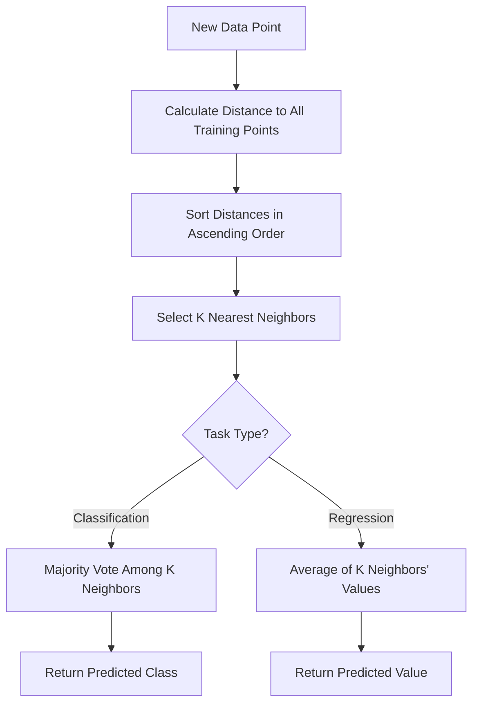

# K-Nearest Neighbors (KNN): Deep Dive & Best Practices

## Table of Contents
1. [Introduction](#introduction)
2. [Algorithm Fundamentals](#algorithm-fundamentals)
3. [Distance Metrics](#distance-metrics)
4. [Algorithm Workflow](#algorithm-workflow)
5. [Implementation from Scratch](#implementation-from-scratch)
6. [Scikit-Learn Implementation](#scikit-learn-implementation)
7. [Hyperparameter Tuning](#hyperparameter-tuning)
8. [Advantages and Disadvantages](#advantages-and-disadvantages)
9. [Best Practices](#best-practices)
10. [Practical Applications](#practical-applications)
11. [Terminology Tables](#terminology-tables)

---

## Introduction

The K-Nearest Neighbors algorithm is a fundamental machine learning technique that operates on a deceptively simple principle: similar data points tend to cluster together in feature space. Developed initially by Evelyn Fix and Joseph Hodges in 1951 for the US military, and later expanded by Thomas Cover and Peter Hart in 1967, KNN has remained one of the most accessible yet powerful algorithms in the machine learning toolkit.

### What Makes KNN Special?

**Core Principle**: KNN makes predictions based on proximity. It assumes that birds of a feather flock together—data points with similar characteristics will have similar labels or values.

**Lazy Learning**: Unlike most algorithms that build a model during training, KNN is a "lazy learner." It simply memorizes the training dataset and performs all computations at prediction time. There is no traditional training phase where the algorithm learns parameters.

**Non-Parametric**: KNN makes no assumptions about the underlying data distribution. It doesn't assume data follows a Gaussian distribution or any other specific pattern, making it highly flexible.

### Classification vs Regression

KNN can solve both classification and regression problems:

- **Classification**: Assigns a class label based on majority vote among the k nearest neighbors
- **Regression**: Predicts a continuous value by averaging the values of the k nearest neighbors

---

## Algorithm Fundamentals

### The Mathematics Behind KNN

At its core, KNN answers one fundamental question: **"Which k training examples are closest to my new data point?"**

The process involves:

1. **Distance Calculation**: Compute the distance between the query point and all training points
2. **Neighbor Selection**: Identify the k closest training points
3. **Prediction**:
   - **Classification**: Return the most common class among the k neighbors (plurality vote)
   - **Regression**: Return the average (or weighted average) of the k neighbors' values

### Key Parameters

**k (Number of Neighbors)**:
- The most critical hyperparameter
- Determines how many nearby points influence the prediction
- Small k (e.g., k=1): More sensitive to noise, can overfit, complex decision boundaries
- Large k (e.g., k=100): Smoother decision boundaries, can underfit, more computationally expensive
- Typically odd values are chosen for binary classification to avoid ties

**Distance Metric**:
- Defines how similarity is measured
- Common choices: Euclidean, Manhattan, Minkowski
- Must be appropriate for the data type and problem

**Weighting Scheme**:
- **Uniform**: All k neighbors contribute equally
- **Distance**: Closer neighbors have more influence (weighted by inverse distance)

### Instance-Based Learning

KNN is an instance-based learning algorithm, meaning:
- It stores the entire training dataset
- No model parameters are learned
- Predictions are made by directly comparing to stored instances
- Memory requirements scale with dataset size

---

## Distance Metrics

Distance metrics are the heart of KNN. The choice of metric profoundly affects algorithm performance.

### Euclidean Distance

The most commonly used metric, measuring straight-line distance in multidimensional space.

**Formula**:

$$d(P, Q) = \sqrt{\sum_{i=1}^{n} (p_i - q_i)^2}$$

Where:
- $P$ and $Q$ are two points in n-dimensional space
- $p_i$ is the value of point P in dimension i
- $q_i$ is the value of point Q in dimension i
- $n$ is the number of dimensions (features)

**Plain English**: Square each coordinate difference, sum them all up, and take the square root.

**Example**:

Given two points: $P = (3, 1)$ and $Q = (6, 5)$

```
d(P,Q) = √[(3-6)² + (1-5)²]
       = √[(-3)² + (-4)²]
       = √[9 + 16]
       = √25
       = 5
```

**Properties**:
- Sensitive to feature scales—features with larger ranges dominate
- Works best when features are continuous and on similar scales
- Assumes all dimensions are equally important
- Default metric in scikit-learn's KNN

**When to Use**:
- Features are continuous and normalized
- Data is in low to moderate dimensions
- Features are roughly equally important

### Manhattan Distance (L1 Distance)

Also known as taxicab distance or city block distance, it measures the distance as if navigating a grid-based street system.

**Formula**:

$$d(P, Q) = \sum_{i=1}^{n} |p_i - q_i|$$

**Plain English**: Sum the absolute differences of all coordinates.

**Example**:

Given $P = (4, 4)$ and $Q = (1, 1)$

```
d(P,Q) = |4-1| + |4-1|
       = |3| + |3|
       = 3 + 3
       = 6
```

**Geometric Interpretation**: Like walking through city blocks—you can't cut diagonally, only move along axes.

**Properties**:
- More robust to outliers than Euclidean
- Preferred in high-dimensional spaces
- Works well when movement is constrained to orthogonal directions

**When to Use**:
- High-dimensional data (where Euclidean suffers from curse of dimensionality)
- Data with outliers
- Sparse feature spaces
- Grid-based or discrete movement patterns

### Minkowski Distance

A generalized distance metric that includes both Euclidean and Manhattan as special cases.

**Formula**:

$$d(P, Q) = \left(\sum_{i=1}^{n} |p_i - q_i|^p\right)^{\frac{1}{p}}$$

Where $p$ is a positive parameter.

**Special Cases**:
- $p = 1$: Manhattan distance
- $p = 2$: Euclidean distance  
- $p = \infty$: Chebyshev distance (maximum coordinate difference)

**When to Use**:
- Experimenting to find the optimal distance metric
- When problem characteristics suggest a specific p value
- Cross-validation can help determine optimal p

### Chebyshev Distance

Measures the maximum absolute difference across any dimension.

**Formula**:

$$d(P, Q) = \max_i |p_i - q_i|$$

**Example**:

Given $P = (4, 6, 8)$ and $Q = (1, 3, 5)$

```
Differences: |4-1| = 3, |6-3| = 3, |8-5| = 3
d(P,Q) = max(3, 3, 3) = 3
```

**When to Use**:
- Chess-like movement patterns (king can move to any adjacent square)
- Warehouse logistics (robot movement in grid)
- When the bottleneck dimension matters most

### Cosine Distance

Measures the cosine of the angle between two vectors, focusing on orientation rather than magnitude.

**Formula**:

$$\text{cosine similarity} = \frac{P \cdot Q}{||P|| \times ||Q||}$$

$$\text{cosine distance} = 1 - \text{cosine similarity}$$

**When to Use**:
- Text analysis and document similarity
- When direction matters more than magnitude
- Recommendation systems
- High-dimensional sparse data

### Distance Metric Comparison

| Metric | Best For | Computational Cost | Sensitivity to Outliers | Scale Sensitivity |
|--------|----------|-------------------|------------------------|-------------------|
| Euclidean | Continuous, normalized data | Moderate | High | Very High |
| Manhattan | High-dimensional, sparse data | Low | Low | High |
| Minkowski | Tunable between Euclidean/Manhattan | Moderate-High | Variable | High |
| Chebyshev | Grid-based problems | Low | Moderate | High |
| Cosine | Text, directional data | Moderate | Low | None |

---

## Algorithm Workflow

### Step-by-Step Process

**Training Phase** (Trivial):
1. Store all training examples $(X_{train}, y_{train})$
2. No model parameters are learned
3. No optimization occurs

**Prediction Phase** (Where the work happens):



### Detailed Algorithm Pseudocode

```
Algorithm: K-Nearest Neighbors

Input:
  - Training set: X_train (features), y_train (labels)
  - Test point: x_test
  - Number of neighbors: k
  - Distance metric: metric

Output:
  - Predicted class (classification) or value (regression)

Procedure:
  1. Initialize empty list: distances = []
  
  2. For each training example (x_i, y_i) in (X_train, y_train):
       a. Calculate distance d = metric(x_test, x_i)
       b. Append (d, y_i) to distances
  
  3. Sort distances by d in ascending order
  
  4. Select first k elements from sorted distances
  
  5. Extract labels/values from k nearest neighbors
  
  6. If classification:
       Count frequency of each class
       Return class with highest frequency
     
     If regression:
       Calculate mean of k neighbor values
       Return mean value
```

### Worked Example: Hand Calculation

**Dataset** (2D points with classes):

| Point | X1 | X2 | Class |
|-------|----|----|-------|
| A     | 1  | 1  | Red   |
| B     | 2  | 2  | Red   |
| C     | 3  | 1  | Red   |
| D     | 6  | 5  | Blue  |
| E     | 7  | 7  | Blue  |
| F     | 8  | 6  | Blue  |

**Query Point**: $Q = (5, 4)$, find class with $k=3$ using Euclidean distance.

**Step 1**: Calculate distances

```
d(Q,A) = √[(5-1)² + (4-1)²] = √[16 + 9] = √25 = 5.00
d(Q,B) = √[(5-2)² + (4-2)²] = √[9 + 4] = √13 ≈ 3.61
d(Q,C) = √[(5-3)² + (4-1)²] = √[4 + 9] = √13 ≈ 3.61
d(Q,D) = √[(5-6)² + (4-5)²] = √[1 + 1] = √2 ≈ 1.41
d(Q,E) = √[(5-7)² + (4-7)²] = √[4 + 9] = √13 ≈ 3.61
d(Q,F) = √[(5-8)² + (4-6)²] = √[9 + 4] = √13 ≈ 3.61
```

**Step 2**: Sort by distance

| Rank | Point | Distance | Class |
|------|-------|----------|-------|
| 1    | D     | 1.41     | Blue  |
| 2    | B     | 3.61     | Red   |
| 3    | C     | 3.61     | Red   |
| 4    | E     | 3.61     | Blue  |
| 5    | F     | 3.61     | Blue  |
| 6    | A     | 5.00     | Red   |

**Step 3**: Select k=3 nearest neighbors

- D (Blue), B (Red), C (Red)

**Step 4**: Majority vote

- Blue: 1 vote
- Red: 2 votes

**Prediction**: **Red**

---

## Implementation from Scratch

### Pure Python Implementation

```python
from typing import List, Union, Tuple
from collections import Counter
import math

class KNNFromScratch:
    """
    K-Nearest Neighbors classifier implemented from scratch.
    
    This implementation demonstrates the core KNN algorithm without
    relying on external libraries beyond built-ins.
    """
    
    def __init__(self, k: int = 3):
        """
        Initialize KNN classifier.
        
        Args:
            k: Number of nearest neighbors to consider
        """
        if k < 1:
            raise ValueError("k must be at least 1")
        self.k = k
        self.X_train = None
        self.y_train = None
    
    def fit(self, X: List[List[float]], y: List[Union[int, str]]) -> None:
        """
        Fit the KNN model by storing the training data.
        
        Args:
            X: Training features (list of feature vectors)
            y: Training labels
        """
        if len(X) != len(y):
            raise ValueError("X and y must have same length")
        if len(X) == 0:
            raise ValueError("Training data cannot be empty")
        
        self.X_train = X
        self.y_train = y
    
    @staticmethod
    def euclidean_distance(point1: List[float], point2: List[float]) -> float:
        """
        Calculate Euclidean distance between two points.
        
        Args:
            point1: First point coordinates
            point2: Second point coordinates
            
        Returns:
            Euclidean distance between points
        """
        if len(point1) != len(point2):
            raise ValueError("Points must have same dimensionality")
        
        squared_diff_sum = sum((p1 - p2) ** 2 for p1, p2 in zip(point1, point2))
        return math.sqrt(squared_diff_sum)
    
    def predict_single(self, x: List[float]) -> Union[int, str]:
        """
        Predict class for a single data point.
        
        Args:
            x: Feature vector to classify
            
        Returns:
            Predicted class label
        """
        # Calculate distances to all training points
        distances = []
        for i, x_train in enumerate(self.X_train):
            dist = self.euclidean_distance(x, x_train)
            distances.append((dist, self.y_train[i]))
        
        # Sort by distance and select k nearest
        distances.sort(key=lambda pair: pair[0])
        k_nearest = distances[:self.k]
        
        # Extract labels of k nearest neighbors
        k_nearest_labels = [label for _, label in k_nearest]
        
        # Return most common label (majority vote)
        most_common = Counter(k_nearest_labels).most_common(1)
        return most_common[0][0]
    
    def predict(self, X: List[List[float]]) -> List[Union[int, str]]:
        """
        Predict classes for multiple data points.
        
        Args:
            X: Feature vectors to classify
            
        Returns:
            List of predicted class labels
        """
        return [self.predict_single(x) for x in X]
    
    def score(self, X: List[List[float]], y: List[Union[int, str]]) -> float:
        """
        Calculate accuracy on test data.
        
        Args:
            X: Test features
            y: True labels
            
        Returns:
            Accuracy score (fraction of correct predictions)
        """
        predictions = self.predict(X)
        correct = sum(pred == true for pred, true in zip(predictions, y))
        return correct / len(y)


# Example usage
if __name__ == "__main__":
    # Training data
    X_train = [
        [1, 1],
        [2, 2],
        [3, 1],
        [6, 5],
        [7, 7],
        [8, 6]
    ]
    y_train = ['Red', 'Red', 'Red', 'Blue', 'Blue', 'Blue']
    
    # Test data
    X_test = [[5, 4], [2, 3]]
    
    # Create and train model
    knn = KNNFromScratch(k=3)
    knn.fit(X_train, y_train)
    
    # Make predictions
    predictions = knn.predict(X_test)
    print(f"Predictions: {predictions}")
    # Output: Predictions: ['Red', 'Red']
```

### NumPy-Based Implementation

```python
import numpy as np
from typing import Union
from numpy.typing import NDArray
from collections import Counter

class KNNNumPy:
    """
    Vectorized K-Nearest Neighbors using NumPy.
    
    This implementation leverages NumPy for efficient computation,
    especially beneficial for larger datasets.
    """
    
    def __init__(self, k: int = 3, metric: str = 'euclidean'):
        """
        Initialize KNN classifier.
        
        Args:
            k: Number of nearest neighbors
            metric: Distance metric ('euclidean' or 'manhattan')
        """
        if k < 1:
            raise ValueError("k must be at least 1")
        if metric not in ['euclidean', 'manhattan']:
            raise ValueError("metric must be 'euclidean' or 'manhattan'")
        
        self.k = k
        self.metric = metric
        self.X_train = None
        self.y_train = None
    
    def fit(self, X: NDArray, y: NDArray) -> None:
        """
        Store training data.
        
        Args:
            X: Training features, shape (n_samples, n_features)
            y: Training labels, shape (n_samples,)
        """
        if X.shape[0] != y.shape[0]:
            raise ValueError("X and y must have same number of samples")
        
        self.X_train = np.array(X)
        self.y_train = np.array(y)
    
    def _calculate_distances(self, X: NDArray) -> NDArray:
        """
        Calculate distances between test points and all training points.
        
        Args:
            X: Test features, shape (n_test_samples, n_features)
            
        Returns:
            Distance matrix, shape (n_test_samples, n_train_samples)
        """
        if self.metric == 'euclidean':
            # Broadcasting: (n_test, 1, n_features) - (1, n_train, n_features)
            diff = X[:, np.newaxis, :] - self.X_train[np.newaxis, :, :]
            distances = np.sqrt(np.sum(diff ** 2, axis=2))
        else:  # manhattan
            diff = X[:, np.newaxis, :] - self.X_train[np.newaxis, :, :]
            distances = np.sum(np.abs(diff), axis=2)
        
        return distances
    
    def predict(self, X: NDArray) -> NDArray:
        """
        Predict classes for test data.
        
        Args:
            X: Test features, shape (n_samples, n_features)
            
        Returns:
            Predicted labels, shape (n_samples,)
        """
        X = np.array(X)
        distances = self._calculate_distances(X)
        
        # Find indices of k nearest neighbors for each test point
        k_nearest_indices = np.argsort(distances, axis=1)[:, :self.k]
        
        # Get labels of k nearest neighbors
        k_nearest_labels = self.y_train[k_nearest_indices]
        
        # Majority vote for each test point
        predictions = []
        for labels in k_nearest_labels:
            # Use Counter for majority vote
            most_common = Counter(labels).most_common(1)[0][0]
            predictions.append(most_common)
        
        return np.array(predictions)
    
    def score(self, X: NDArray, y: NDArray) -> float:
        """
        Calculate accuracy.
        
        Args:
            X: Test features
            y: True labels
            
        Returns:
            Accuracy score
        """
        predictions = self.predict(X)
        return np.mean(predictions == y)


# Example usage
if __name__ == "__main__":
    # Generate sample data
    np.random.seed(42)
    
    # Training data
    X_train = np.array([
        [1, 1],
        [2, 2],
        [3, 1],
        [6, 5],
        [7, 7],
        [8, 6]
    ])
    y_train = np.array(['Red', 'Red', 'Red', 'Blue', 'Blue', 'Blue'])
    
    # Test data
    X_test = np.array([[5, 4], [2, 3]])
    
    # Train and predict
    knn = KNNNumPy(k=3, metric='euclidean')
    knn.fit(X_train, y_train)
    
    predictions = knn.predict(X_test)
    print(f"Predictions: {predictions}")
    # Output: Predictions: ['Red' 'Red']
```

---

## Scikit-Learn Implementation

### Basic Classification Example

```python
import numpy as np
from sklearn.neighbors import KNeighborsClassifier
from sklearn.model_selection import train_test_split
from sklearn.preprocessing import StandardScaler
from sklearn.metrics import accuracy_score, classification_report, confusion_matrix
from sklearn.datasets import load_iris

# Load dataset
iris = load_iris()
X, y = iris.data, iris.target

# Split data
X_train, X_test, y_train, y_test = train_test_split(
    X, y, test_size=0.3, random_state=42, stratify=y
)

# Feature scaling (important for KNN)
scaler = StandardScaler()
X_train_scaled = scaler.fit_transform(X_train)
X_test_scaled = scaler.transform(X_test)

# Create and train KNN classifier
knn = KNeighborsClassifier(n_neighbors=5)
knn.fit(X_train_scaled, y_train)

# Make predictions
y_pred = knn.predict(X_test_scaled)

# Evaluate
accuracy = accuracy_score(y_test, y_pred)
print(f"Accuracy: {accuracy:.4f}")
print("\nClassification Report:")
print(classification_report(y_test, y_pred, target_names=iris.target_names))
print("\nConfusion Matrix:")
print(confusion_matrix(y_test, y_pred))
```

### Regression Example

```python
from sklearn.neighbors import KNeighborsRegressor
from sklearn.datasets import make_regression
from sklearn.metrics import mean_squared_error, r2_score
import matplotlib.pyplot as plt

# Generate regression data
X, y = make_regression(n_samples=200, n_features=1, noise=20, random_state=42)

# Split data
X_train, X_test, y_train, y_test = train_test_split(
    X, y, test_size=0.3, random_state=42
)

# Create and train KNN regressor
knn_reg = KNeighborsRegressor(n_neighbors=5, weights='distance')
knn_reg.fit(X_train, y_train)

# Predictions
y_pred = knn_reg.predict(X_test)

# Evaluation
mse = mean_squared_error(y_test, y_pred)
r2 = r2_score(y_test, y_pred)

print(f"Mean Squared Error: {mse:.4f}")
print(f"R² Score: {r2:.4f}")

# Visualization
plt.figure(figsize=(10, 6))
plt.scatter(X_test, y_test, color='blue', label='Actual', alpha=0.6)
plt.scatter(X_test, y_pred, color='red', label='Predicted', alpha=0.6)
plt.xlabel('Feature')
plt.ylabel('Target')
plt.title('KNN Regression: Actual vs Predicted')
plt.legend()
plt.grid(True)
plt.show()
```

### Comparing Different Distance Metrics

```python
from sklearn.neighbors import KNeighborsClassifier
from sklearn.model_selection import cross_val_score
from sklearn.datasets import load_wine
import pandas as pd

# Load dataset
wine = load_wine()
X, y = wine.data, wine.target

# Scale features
scaler = StandardScaler()
X_scaled = scaler.fit_transform(X)

# Test different distance metrics
metrics = ['euclidean', 'manhattan', 'chebyshev', 'minkowski']
results = []

for metric in metrics:
    knn = KNeighborsClassifier(n_neighbors=5, metric=metric)
    scores = cross_val_score(knn, X_scaled, y, cv=5, scoring='accuracy')
    results.append({
        'Metric': metric,
        'Mean Accuracy': scores.mean(),
        'Std Dev': scores.std()
    })

# Display results
df_results = pd.DataFrame(results)
print(df_results.to_string(index=False))
```

---

## Hyperparameter Tuning

### Understanding Key Hyperparameters

**1. n_neighbors (k)**:
- Controls number of neighbors to consider
- Small values: Complex decision boundaries, potential overfitting
- Large values: Smooth boundaries, potential underfitting
- Typically use odd values for binary classification

**2. weights**:
- `'uniform'`: All neighbors weighted equally
- `'distance'`: Closer neighbors weighted more heavily (inverse distance)

**3. metric**:
- Distance function: 'euclidean', 'manhattan', 'minkowski', etc.
- Choice depends on data characteristics

**4. p** (for Minkowski):
- Power parameter: p=1 (Manhattan), p=2 (Euclidean)

**5. algorithm**:
- `'auto'`: Automatically selects best algorithm
- `'ball_tree'`: Ball tree structure
- `'kd_tree'`: KD tree structure  
- `'brute'`: Brute force search

### Finding Optimal K Value

```python
from sklearn.model_selection import cross_val_score
import matplotlib.pyplot as plt

# Test range of k values
k_range = range(1, 31)
cv_scores = []

for k in k_range:
    knn = KNeighborsClassifier(n_neighbors=k)
    scores = cross_val_score(knn, X_scaled, y, cv=5, scoring='accuracy')
    cv_scores.append(scores.mean())

# Find optimal k
optimal_k = k_range[cv_scores.index(max(cv_scores))]
print(f"Optimal k: {optimal_k}")

# Plot k vs accuracy
plt.figure(figsize=(10, 6))
plt.plot(k_range, cv_scores, marker='o')
plt.xlabel('Number of Neighbors (k)')
plt.ylabel('Cross-Validated Accuracy')
plt.title('KNN: Finding Optimal k Value')
plt.grid(True)
plt.axvline(x=optimal_k, color='r', linestyle='--', 
            label=f'Optimal k={optimal_k}')
plt.legend()
plt.show()
```

### Grid Search Cross-Validation

```python
from sklearn.model_selection import GridSearchCV

# Define parameter grid
param_grid = {
    'n_neighbors': [3, 5, 7, 9, 11, 13, 15],
    'weights': ['uniform', 'distance'],
    'metric': ['euclidean', 'manhattan', 'minkowski'],
    'p': [1, 2]  # Only used when metric='minkowski'
}

# Create GridSearchCV object
grid_search = GridSearchCV(
    KNeighborsClassifier(),
    param_grid,
    cv=5,
    scoring='accuracy',
    n_jobs=-1,
    verbose=1
)

# Fit grid search
grid_search.fit(X_train_scaled, y_train)

# Best parameters and score
print("Best Parameters:", grid_search.best_params_)
print("Best Cross-Validation Score:", grid_search.best_score_)

# Use best model
best_knn = grid_search.best_estimator_
y_pred = best_knn.predict(X_test_scaled)
print("Test Accuracy:", accuracy_score(y_test, y_pred))
```

### Randomized Search (Faster Alternative)

```python
from sklearn.model_selection import RandomizedSearchCV
from scipy.stats import randint

# Define parameter distributions
param_dist = {
    'n_neighbors': randint(1, 30),
    'weights': ['uniform', 'distance'],
    'metric': ['euclidean', 'manhattan', 'chebyshev'],
}

# Randomized search
random_search = RandomizedSearchCV(
    KNeighborsClassifier(),
    param_distributions=param_dist,
    n_iter=50,  # Number of parameter combinations to try
    cv=5,
    scoring='accuracy',
    random_state=42,
    n_jobs=-1
)

random_search.fit(X_train_scaled, y_train)

print("Best Parameters:", random_search.best_params_)
print("Best Score:", random_search.best_score_)
```

### Complete Pipeline with Hyperparameter Tuning

```python
from sklearn.pipeline import Pipeline
from sklearn.preprocessing import StandardScaler
from sklearn.model_selection import GridSearchCV

# Create pipeline
pipeline = Pipeline([
    ('scaler', StandardScaler()),
    ('knn', KNeighborsClassifier())
])

# Define parameters for pipeline
param_grid = {
    'knn__n_neighbors': [3, 5, 7, 9, 11],
    'knn__weights': ['uniform', 'distance'],
    'knn__metric': ['euclidean', 'manhattan']
}

# Grid search on pipeline
grid_search = GridSearchCV(
    pipeline,
    param_grid,
    cv=5,
    scoring='accuracy',
    n_jobs=-1
)

# Fit
grid_search.fit(X_train, y_train)

# Results
print("Best Parameters:", grid_search.best_params_)
print("Training Score:", grid_search.score(X_train, y_train))
print("Test Score:", grid_search.score(X_test, y_test))
```

---

## Advantages and Disadvantages

### Advantages

**1. Simplicity and Interpretability**
- Extremely simple to understand and explain
- No complex mathematical concepts required
- Decision-making process is transparent
- Easy to visualize in 2D or 3D

**2. No Training Phase**
- No time-consuming training process
- Model can be updated instantly with new data
- Just add new examples to the dataset

**3. Non-Parametric**
- Makes no assumptions about data distribution
- Can model complex, non-linear decision boundaries
- Adapts naturally to data structure

**4. Versatility**
- Works for both classification and regression
- Handles multi-class problems naturally
- Can be adapted for various domains

**5. Effective for Small to Medium Datasets**
- Performs well when data is not too large
- Competitive accuracy on many problems

### Disadvantages

**1. Computational Expense**
- **Slow Predictions**: Must compute distance to all training points
- **Memory Intensive**: Stores entire training dataset
- **Poor Scalability**: Performance degrades with large datasets
- Time complexity: O(n × d) where n = samples, d = dimensions

**2. Curse of Dimensionality**
- Performance degrades significantly in high-dimensional spaces
- Distance metrics become less meaningful
- All points become approximately equidistant
- Requires more training data exponentially

**3. Sensitivity to Irrelevant Features**
- All features contribute equally to distance
- Noisy or irrelevant features can dominate
- Feature selection/engineering is crucial

**4. Sensitivity to Feature Scales**
- Features with larger ranges dominate distance calculations
- **Mandatory preprocessing**: Normalization or standardization required
- Results can change dramatically without scaling

**5. Class Imbalance Issues**
- Majority class can dominate predictions
- Rare classes may never be predicted
- Requires balancing techniques

**6. Choice of K**
- Optimal k is problem-dependent
- No universal rule for choosing k
- Requires cross-validation

**7. Storage Requirements**
- Must store entire training set
- Not suitable for memory-constrained environments

---

## Best Practices

### Data Preprocessing

**1. Feature Scaling (Mandatory)**

```python
from sklearn.preprocessing import StandardScaler, MinMaxScaler

# Option 1: Standardization (zero mean, unit variance)
scaler = StandardScaler()
X_scaled = scaler.fit_transform(X)

# Option 2: Min-Max Normalization (scale to [0, 1])
scaler = MinMaxScaler()
X_scaled = scaler.fit_transform(X)
```

**Why Scaling Matters**: Features with larger numerical ranges will dominate distance calculations.

**Example**:
- Feature 1: Age (20-80)
- Feature 2: Income (20,000-200,000)

Without scaling, income differences will completely overwhelm age differences in distance calculations.

**2. Handle Missing Values**

```python
from sklearn.impute import SimpleImputer, KNNImputer

# Simple imputation
imputer = SimpleImputer(strategy='mean')
X_imputed = imputer.fit_transform(X)

# KNN-based imputation (uses KNN to estimate missing values)
knn_imputer = KNNImputer(n_neighbors=5)
X_imputed = knn_imputer.fit_transform(X)
```

**3. Feature Selection**

Remove irrelevant or noisy features to improve performance.

```python
from sklearn.feature_selection import SelectKBest, f_classif

# Select top k features
selector = SelectKBest(f_classif, k=10)
X_selected = selector.fit_transform(X, y)

# Get selected feature indices
selected_features = selector.get_support(indices=True)
```

**4. Dimensionality Reduction**

For high-dimensional data, reduce dimensions before applying KNN.

```python
from sklearn.decomposition import PCA

# PCA to reduce dimensions
pca = PCA(n_components=0.95)  # Retain 95% variance
X_reduced = pca.fit_transform(X_scaled)
```

### Choosing K

**Guidelines**:

1. **Start with** $k = \sqrt{n}$ where n is number of training samples
2. **Use odd values** for binary classification (avoids ties)
3. **Cross-validate** to find optimal k
4. **Consider domain knowledge**: Some problems naturally suggest certain k values
5. **Small datasets**: Use smaller k (3-7)
6. **Large datasets**: Can use larger k (10-50)

**Visualization Technique**:

```python
# Plot training and validation error vs k
train_scores = []
val_scores = []

for k in range(1, 30):
    knn = KNeighborsClassifier(n_neighbors=k)
    # Training score
    knn.fit(X_train, y_train)
    train_scores.append(knn.score(X_train, y_train))
    # Validation score
    val_scores.append(knn.score(X_val, y_val))

plt.plot(range(1, 30), train_scores, label='Training')
plt.plot(range(1, 30), val_scores, label='Validation')
plt.xlabel('k')
plt.ylabel('Accuracy')
plt.legend()
plt.show()
```

Look for the "elbow" where validation score plateaus or starts decreasing.

### Handling Imbalanced Classes

**1. Use Weighted KNN**

```python
# Distance weighting gives more importance to closer neighbors
knn = KNeighborsClassifier(n_neighbors=5, weights='distance')
```

**2. Resampling Techniques**

```python
from imblearn.over_sampling import SMOTE
from imblearn.under_sampling import RandomUnderSampler

# Oversample minority class
smote = SMOTE(random_state=42)
X_resampled, y_resampled = smote.fit_resample(X_train, y_train)

# Undersample majority class
undersampler = RandomUnderSampler(random_state=42)
X_resampled, y_resampled = undersampler.fit_resample(X_train, y_train)
```

**3. Adjust Class Weights in Evaluation**

```python
from sklearn.metrics import classification_report

# Get balanced metrics
print(classification_report(y_test, y_pred, 
                           target_names=class_names,
                           sample_weight=sample_weights))
```

### Optimization for Large Datasets

**1. Use Efficient Data Structures**

```python
# Ball Tree or KD Tree for faster neighbor search
knn = KNeighborsClassifier(
    n_neighbors=5,
    algorithm='ball_tree'  # or 'kd_tree'
)
```

**2. Approximate Nearest Neighbors**

For massive datasets, consider approximate methods:

```python
from sklearn.neighbors import NearestNeighbors
import annoy  # Approximate Nearest Neighbors Oh Yeah

# Annoy index for fast approximate search
annoy_index = annoy.AnnoyIndex(n_features, metric='euclidean')
```

**3. Sample Training Data**

```python
from sklearn.model_selection import train_test_split

# Use only a subset for training
X_train_subset, _, y_train_subset, _ = train_test_split(
    X_train, y_train, 
    train_size=0.3,  # Use 30% of data
    stratify=y_train
)
```

### Cross-Validation Best Practices

```python
from sklearn.model_selection import StratifiedKFold

# Stratified K-Fold ensures class balance in each fold
skf = StratifiedKFold(n_splits=5, shuffle=True, random_state=42)

scores = []
for train_idx, val_idx in skf.split(X, y):
    X_train_fold = X[train_idx]
    y_train_fold = y[train_idx]
    X_val_fold = X[val_idx]
    y_val_fold = y[val_idx]
    
    knn = KNeighborsClassifier(n_neighbors=5)
    knn.fit(X_train_fold, y_train_fold)
    score = knn.score(X_val_fold, y_val_fold)
    scores.append(score)

print(f"Mean CV Score: {np.mean(scores):.4f} ± {np.std(scores):.4f}")
```

---

## Practical Applications

### 1. Recommendation Systems

KNN excels at finding similar users or items.

```python
# Movie recommendation example
from sklearn.neighbors import NearestNeighbors

# User-item rating matrix
# Rows: users, Columns: movies, Values: ratings
user_item_matrix = np.array([
    [5, 4, 0, 0, 2],
    [4, 0, 0, 5, 3],
    [0, 0, 5, 4, 0],
    [0, 5, 4, 0, 0]
])

# Find similar users using cosine similarity
knn_model = NearestNeighbors(metric='cosine', algorithm='brute')
knn_model.fit(user_item_matrix)

# Find 2 most similar users to user 0
distances, indices = knn_model.kneighbors(
    user_item_matrix[0].reshape(1, -1),
    n_neighbors=3  # Including self
)

print("Similar users:", indices[0][1:])  # Exclude self
print("Distances:", distances[0][1:])
```

### 2. Anomaly Detection

Identify outliers by finding points far from neighbors.

```python
from sklearn.neighbors import LocalOutlierFactor

# LOF-based anomaly detection
lof = LocalOutlierFactor(n_neighbors=20, contamination=0.1)

# -1 for outliers, 1 for inliers
outlier_labels = lof.fit_predict(X)

# Get outlier scores
outlier_scores = lof.negative_outlier_factor_

# Identify anomalies
anomaly_indices = np.where(outlier_labels == -1)[0]
print(f"Found {len(anomaly_indices)} anomalies")
```

### 3. Image Classification

```python
from sklearn.datasets import fetch_openml
from sklearn.neighbors import KNeighborsClassifier

# Load MNIST digits (subset for speed)
mnist = fetch_openml('mnist_784', version=1, parser='auto')
X, y = mnist.data[:10000], mnist.target[:10000]

# Split and scale
X_train, X_test, y_train, y_test = train_test_split(
    X, y, test_size=0.2, random_state=42
)

scaler = StandardScaler()
X_train_scaled = scaler.fit_transform(X_train)
X_test_scaled = scaler.transform(X_test)

# Train KNN
knn = KNeighborsClassifier(n_neighbors=5)
knn.fit(X_train_scaled, y_train)

# Evaluate
accuracy = knn.score(X_test_scaled, y_test)
print(f"Digit recognition accuracy: {accuracy:.4f}")
```

### 4. Medical Diagnosis

```python
from sklearn.datasets import load_breast_cancer

# Load breast cancer dataset
cancer = load_breast_cancer()
X, y = cancer.data, cancer.target

# Preprocessing pipeline
from sklearn.pipeline import Pipeline
from sklearn.preprocessing import StandardScaler

pipeline = Pipeline([
    ('scaler', StandardScaler()),
    ('knn', KNeighborsClassifier(n_neighbors=7, weights='distance'))
])

# Cross-validation
from sklearn.model_selection import cross_val_score

scores = cross_val_score(pipeline, X, y, cv=5, scoring='accuracy')
print(f"Diagnosis accuracy: {scores.mean():.4f} ± {scores.std():.4f}")
```

### 5. Text Classification

```python
from sklearn.feature_extraction.text import TfidfVectorizer
from sklearn.datasets import fetch_20newsgroups

# Load text data
categories = ['alt.atheism', 'talk.religion.misc']
newsgroups = fetch_20newsgroups(
    subset='train',
    categories=categories,
    shuffle=True,
    random_state=42
)

# Convert text to TF-IDF features
vectorizer = TfidfVectorizer(max_features=1000)
X = vectorizer.fit_transform(newsgroups.data)
y = newsgroups.target

# KNN with cosine distance works well for text
knn = KNeighborsClassifier(n_neighbors=5, metric='cosine')

# Cross-validate
scores = cross_val_score(knn, X, y, cv=5)
print(f"Text classification accuracy: {scores.mean():.4f}")
```

---

## Terminology Tables

### Table 1: KNN Lifecycle Phase Terminology

Different terms used across literature for the same concepts:

| Phase | Alternative Terms | Description |
|-------|------------------|-------------|
| **Training Phase** | Fitting, Learning Phase, Memorization Phase | Storing the training dataset |
| **Prediction Phase** | Inference, Testing Phase, Query Phase | Making predictions on new data |
| **Distance Calculation** | Similarity Measurement, Metric Computation | Computing distances to neighbors |
| **Neighbor Selection** | K-Selection, Nearest Retrieval | Identifying k closest points |
| **Aggregation** | Voting (Classification), Averaging (Regression) | Combining neighbor information |

### Table 2: Distance Metric Terminology

| Mathematical Name | Alternative Names | Symbol | Common Usage |
|------------------|-------------------|--------|--------------|
| Euclidean Distance | L2 Norm, L2 Distance | $\|\|·\|\|_2$ | Default in scikit-learn |
| Manhattan Distance | L1 Norm, Taxicab Distance, City Block | $\|\|·\|\|_1$ | High-dimensional data |
| Minkowski Distance | $L_p$ Norm | $\|\|·\|\|_p$ | Generalized metric |
| Chebyshev Distance | $L_∞$ Norm, Maximum Distance, Chessboard | $\|\|·\|\|_∞$ | Grid-based problems |
| Cosine Similarity | Angular Similarity | $\cos(\theta)$ | Text analysis |

### Table 3: Algorithm Parameter Terminology

| Scikit-Learn Parameter | Mathematical Notation | Alternative Names | Purpose |
|-----------------------|--------------------- |-------------------|---------|
| `n_neighbors` | k | Number of neighbors, K-value | Controls smoothness |
| `weights` | w | Weighting scheme | Uniform vs distance-based |
| `metric` | d | Distance function, Similarity measure | How to measure closeness |
| `p` | p | Minkowski parameter, Power parameter | Minkowski distance exponent |
| `algorithm` | - | Search strategy | Tree vs brute force |
| `leaf_size` | - | Tree size parameter | Ball/KD tree optimization |

### Table 4: Hierarchical Terminology Differentiation

#### Level 1: Algorithm Category
- **Instance-Based Learning** (Stores examples)
  - KNN
  - K-Means (clustering variant)
  - Case-Based Reasoning

#### Level 2: Learning Paradigm
- **Supervised Learning** (Has labels)
  - Classification (discrete outputs)
    - K-Nearest Neighbors Classifier
  - Regression (continuous outputs)
    - K-Nearest Neighbors Regressor

- **Unsupervised Learning** (No labels)
  - Clustering
    - K-Means

#### Level 3: KNN-Specific Variants
- **Standard KNN** (Basic algorithm)
- **Weighted KNN** (Distance-weighted voting)
- **Condensed KNN** (Reduced training set)
- **Edited KNN** (Remove noisy examples)
- **Fuzzy KNN** (Soft membership degrees)

#### Level 4: Implementation Strategy
- **Brute Force** (Exhaustive search)
- **Tree-Based** (Spatial indexing)
  - KD-Tree (k-dimensional tree)
  - Ball Tree (Metric tree)
- **Approximate** (Fast but inexact)
  - LSH (Locality-Sensitive Hashing)
  - ANNOY (Approximate Nearest Neighbors)

### Table 5: Evaluation Metrics by Task Type

| Task Type | Primary Metrics | When to Use | Formula/Notes |
|-----------|----------------|-------------|---------------|
| **Binary Classification** | Accuracy, Precision, Recall, F1-Score, AUC-ROC | Balanced classes | $\text{Accuracy} = \frac{TP + TN}{TP + TN + FP + FN}$ |
| **Multi-class Classification** | Macro/Micro F1, Confusion Matrix | Multiple classes | Weighted or unweighted average |
| **Regression** | MSE, RMSE, MAE, R² | Continuous predictions | $MSE = \frac{1}{n}\sum(y_i - \hat{y}_i)^2$ |
| **Imbalanced Classification** | Precision-Recall Curve, F1-Score, Matthews Correlation | Skewed classes | Emphasize minority class |

### Table 6: Common Jargon Equivalences

| Term 1 | ≡ | Term 2 | Context |
|--------|---|--------|---------|
| Lazy Learning | = | Instance-Based Learning | KNN stores data, doesn't learn parameters |
| Memory-Based Learning | = | Exemplar-Based Learning | Uses stored examples directly |
| Plurality Vote | ≈ | Majority Vote | Technically different (>50% vs most common) |
| Query Point | = | Test Point | The new data point to classify |
| Training Samples | = | Reference Points | Points used for comparison |
| Feature Space | = | Attribute Space | The dimensional space where data lives |
| Curse of Dimensionality | = | Hughes Phenomenon | Performance degradation in high dimensions |
| k-value | = | Neighborhood Size | Number of neighbors parameter |

---

## References

<a href="https://en.wikipedia.org/wiki/K-nearest_neighbors_algorithm" target="_blank">k-nearest neighbors algorithm - Wikipedia</a>

<a href="https://www.ibm.com/think/topics/knn" target="_blank">What is the k-nearest neighbors algorithm? - IBM</a>

<a href="https://scikit-learn.org/stable/modules/neighbors.html" target="_blank">Nearest Neighbors - scikit-learn Documentation</a>

<a href="https://www.geeksforgeeks.org/machine-learning/k-nearest-neighbours/" target="_blank">K-Nearest Neighbor(KNN) Algorithm - GeeksforGeeks</a>

<a href="https://www.analyticsvidhya.com/blog/2018/03/introduction-k-neighbours-algorithm-clustering/" target="_blank">Guide to K-Nearest Neighbors Algorithm - Analytics Vidhya</a>

<a href="https://towardsdatascience.com/k-nearest-neighbors-algorithm-d4a8bb1926a3" target="_blank">K-Nearest Neighbors Algorithm - Towards Data Science</a>

<a href="https://www.elastic.co/what-is/knn" target="_blank">What is k-Nearest Neighbor (kNN)? - Elastic</a>

<a href="https://arize.com/blog-course/knn-algorithm-k-nearest-neighbor/" target="_blank">Deep Dive on KNN - Arize AI</a>

<a href="https://www.kdnuggets.com/2020/11/most-popular-distance-metrics-knn.html" target="_blank">Most Popular Distance Metrics Used in KNN - KDnuggets</a>

<a href="https://arxiv.org/pdf/1708.04321" target="_blank">Effects of Distance Measure Choice on KNN Classifier Performance - ArXiv</a>

<a href="https://scikit-learn.org/stable/modules/grid_search.html" target="_blank">Tuning the hyper-parameters of an estimator - scikit-learn</a>

<a href="https://www.sciencedirect.com/topics/computer-science/k-nearest-neighbors-algorithm" target="_blank">k-Nearest Neighbors Algorithm - ScienceDirect</a>

<a href="https://www.tutorialspoint.com/machine_learning/machine_learning_knn_nearest_neighbors.htm" target="_blank">K-Nearest Neighbors in Machine Learning - TutorialsPoint</a>

<a href="https://medium.com/@luigi.fiori.lf0303/distance-metrics-and-k-nearest-neighbor-knn-1b840969c0f4" target="_blank">Distance metrics and K-Nearest Neighbor - Medium</a>

---

## Conclusion

K-Nearest Neighbors represents a perfect balance of simplicity and effectiveness. While it may not be the most sophisticated algorithm in the machine learning toolkit, its intuitive foundation makes it an excellent starting point for beginners and a reliable choice for practitioners when data is appropriately preprocessed and the problem characteristics align with KNN's strengths.

**Key Takeaways**:

1. **Always scale features** before using KNN
2. **Choose k via cross-validation**, not guesswork
3. **Consider distance metrics carefully** based on your data
4. **Be mindful of computational costs** with large datasets
5. **Preprocess thoroughly**: Feature selection and dimensionality reduction matter
6. **Test multiple configurations**: Grid search to find optimal hyperparameters

The algorithm's transparency, combined with proper preprocessing and hyperparameter tuning, makes KNN a valuable tool for classification and regression tasks across diverse domains—from medical diagnosis to recommendation systems.

---

*Document created: April 25, 2026*  
*Last updated: April 25, 2026*
