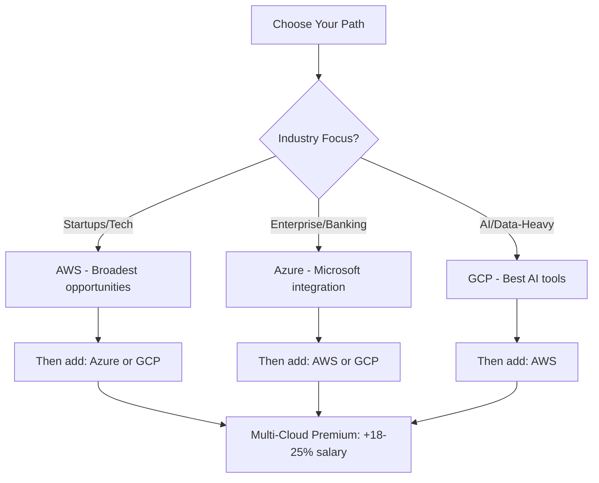

<!--
image:
  path: /assets/img/posts/data-science-career-2026.webp
  alt: Data Science Career Roadmap 2026
-->

## Executive Summary

The data science field in 2026 presents unprecedented opportunities with a **34% projected growth** (2024-2034) according to the U.S. Bureau of Labor Statistics. However, the market has become bifurcated: **specialists with production deployment skills** command premium salaries while generalist roles face intense competition.

**Critical Market Reality:**
- Demand exceeds supply by **50%+** in the US by 2026
- **11.5 million new data roles** projected by late 2026
- Average salary: **$120,000-$129,000** for Data Scientists
- **68% of job postings** now require multi-cloud expertise

> **Key Insight**: Companies aren't hiring "model builders" — they're hiring data scientists who can **ship, monitor, and productionize** models end-to-end.
{: .prompt-warning }

---

## Part 1: In-Demand Skills Analysis (2026)

### 📊 Top Skills Ranking

Based on analysis of **700+ job postings** in 2026, here are the most in-demand skills:

| Rank | Skill | Prevalence | Change from 2025 | Priority |
|:----:|:------|:----------:|:----------------:|:--------:|
| **1** | **Statistics & ML** | 92% | Stable | ⭐⭐⭐⭐⭐ |
| **2** | **Communication** | 86% | ↑ (+15pp) | ⭐⭐⭐⭐⭐ |
| **3** | **Python** | 82% | ↓ (from #2) | ⭐⭐⭐⭐⭐ |
| **4** | **SQL** | 79% | ↑ (+18pp) | ⭐⭐⭐⭐⭐ |
| **5** | **ETL/Pipelines** | 31% | ↑ (+18pp) | ⭐⭐⭐⭐ |
| **6** | **Snowflake** | 21% | ↑ (+10pp) | ⭐⭐⭐⭐ |
| **7** | **dbt** | 19% | ↑ (+9pp) | ⭐⭐⭐⭐ |
| **8** | **Cloud (AWS/Azure/GCP)** | 68% | Stable | ⭐⭐⭐⭐⭐ |
| **9** | **Docker/Kubernetes** | 45% | ↑ | ⭐⭐⭐⭐ |
| **10** | **GenAI/LLMs** | 89% | NEW | ⭐⭐⭐⭐⭐ |

### 🔄 Skills with Declining Demand

| Skill | 2025 | 2026 | Trend | Alternative |
|:------|:----:|:----:|:-----:|:-----------|
| **SAS** | 15% | 2% | ↓↓↓ | Python (Pandas, scikit-learn) |
| **MATLAB** | 5% | 0% | ↓↓↓ | Python (NumPy, SciPy) |
| **Scala** | 9% | 1% | ↓↓ | Python, SQL warehouses |
| **R** | 50% | 41% | ↓ | Python (still viable in academia) |
| **Hadoop** | 12% | 3% | ↓↓ | Snowflake, BigQuery, Spark |

> **Note**: R at 41% is still significant, especially in biostatistics, clinical trials, and academia. Not dead, just specialized.
{: .prompt-info }

---

## Part 2: Programming Languages Deep Dive

### Python vs R vs Julia: Career ROI Analysis

#### **Python** 🐍

**Market Share**: #1 (78% of job postings explicitly mention Python)

**Best For**:
- General-purpose data science
- Production ML systems
- Deep learning & AI
- MLOps & deployment
- Web scraping & automation

**Ecosystem**:
- **Data**: Pandas, Polars, Ibis (replacing Pandas), NumPy
- **ML**: scikit-learn, XGBoost, LightGBM
- **Deep Learning**: PyTorch, TensorFlow, Keras
- **GenAI**: LangChain, LangGraph, llama-index
- **Deployment**: FastAPI, Flask, Streamlit

**Salary Impact**: Standard baseline (reference point)

**When to Choose**:
- First language for data science
- Production deployment is priority
- AI/GenAI development
- Startup/tech company focus

#### **R** 📊

**Market Share**: #2-3 (41% of job postings in 2026, down from 50%)

**Best For**:
- Statistical analysis & research
- Clinical trials & pharma
- Academic research
- Advanced visualization
- Regulatory reporting (FDA prefers R)

**Ecosystem**:
- **Data**: dplyr, tidyr, data.table
- **Visualization**: ggplot2 (industry gold standard)
- **Stats**: Over 18,000 CRAN packages
- **ML**: caret, mlr3

**Salary Impact**: +0-5% in specialized roles (biostatistics, pharma)

**When to Choose**:
- Healthcare/pharmaceutical industry
- Academic or research institution
- Statistical consulting
- Exploratory data analysis (EDA) focus

**Critical Insight**: The best data scientists in 2026 are **bilingual** — Python for pipelines/deployment, R for deep statistical analysis and publication-quality visualizations.

#### **Julia** ⚡

**Market Share**: Niche (<1% of general postings, but 500-800 specialized roles)

**Best For**:
- High-performance computing
- Quantitative finance
- Scientific computing
- Novel algorithm development
- Physics simulations

**Ecosystem**:
- **Speed**: JIT compilation → C-level performance
- **Data**: DataFrames.jl, TidierData.jl
- **ML**: Flux.jl, MLJ.jl
- **Interop**: Call Python, R, C, Fortran libraries

**Salary Impact**: +10-20% in specialized roles (quant finance, HPC)

**When to Choose**:
- Hedge funds & algorithmic trading
- Climate modeling
- Computational physics
- Performance is critical bottleneck

**Job Market Reality**:
- **Python**: ~300,000-400,000 global openings
- **R**: ~80,000-120,000 global openings
- **Julia**: ~500-800 specialized openings

---

## Part 3: Cloud Platforms Comparison

### AWS vs Azure vs GCP: Strategic Choice Matrix

| Factor | AWS | Azure | GCP |
|:-------|:----|:------|:----|
| **Market Share** | 31% | 23-25% | 11-12% |
| **Job Openings** | ~55,000 | ~42,000 | ~20,000 |
| **Avg Salary** | Baseline | +5-8% | +10-15% |
| **Best For** | Startups, general purpose | Enterprise, Microsoft stack | AI/ML, data analytics |
| **Learning Curve** | Moderate (200+ services) | Steep (Microsoft ecosystem) | Easier (focused tools) |
| **AI/ML Tools** | SageMaker, Bedrock | Azure ML + OpenAI exclusive | Vertex AI, TPUs, BigQuery ML |
| **Certifications** | Most recognized | Enterprise value | Specialized premium |
| **Multi-Cloud** | 42% of jobs require 2+ clouds | 42% of jobs require 2+ clouds | 42% of jobs require 2+ clouds |

#### **Recommendations by Career Path**



#### **Platform-Specific Strengths**

**AWS** (Start Here for Most):
- Largest ecosystem & community
- Most job opportunities (2.5x vs GCP)
- Best documentation & learning resources
- Services: EC2, S3, Lambda, SageMaker

**Azure** (Enterprise Focus):
- Microsoft 365 deep integration
- **Exclusive OpenAI partnership** (GPT-4, GPT-5)
- Best for organizations using: Office 365, Active Directory, .NET
- Growing fastest in absolute revenue

**GCP** (AI/Data Specialists):
- **Best AI/ML tools**: Vertex AI, AutoML, TPUs
- **BigQuery**: Industry-leading data warehouse
- **GKE**: Best managed Kubernetes (Google invented K8s)
- Private global fiber network

> **Strategy**: Learn AWS first (job volume), then add GCP or Azure for multi-cloud premium.
{: .prompt-tip }

---

## Part 4: Modern Data Stack Alternatives

### Data Manipulation Tools

| Category | Traditional | Modern Alternative | Why Switch? |
|:---------|:-----------|:-------------------|:------------|
| **Python Data** | Pandas | **Polars** or **Ibis** | 5-10x faster, better syntax |
| **Package Mgmt** | pip/poetry | **uv** | All-in-one, blazing fast |
| **Notebooks** | Jupyter | **Positron IDE** | Best of RStudio + VS Code |
| **R Data** | base R | **dplyr/tidyverse** | Readable, chainable syntax |

### BI & Visualization

| Tool | Use Case | Learning Priority | Job Market |
|:-----|:---------|:-----------------|:-----------|
| **Tableau** | Enterprise BI, drag-drop | ⭐⭐⭐⭐ | High demand |
| **Power BI** | Microsoft ecosystem | ⭐⭐⭐⭐ | Growing fast |
| **Looker** | Data modeling, SQL-based | ⭐⭐⭐ | Medium |
| **Matplotlib/Seaborn** | Code-based (Python) | ⭐⭐⭐⭐⭐ | Essential |
| **ggplot2** | Code-based (R) | ⭐⭐⭐⭐ | R users |
| **Plotly** | Interactive dashboards | ⭐⭐⭐ | Growing |

---

## Part 5: Job Roles & Career Progression

### Role-by-Role Analysis

#### 1. **Data Analyst** (Entry Point)

| Aspect | Details |
|:-------|:--------|
| **Salary Range** | $52,918 - $137,310/year (Entry: $68,892 - $81,000) |
| **Priority Level** | ⭐⭐⭐⭐ HIGH - Best entry point |
| **Core Skills** | SQL (79%), Python/R, Excel, BI Tools, Statistics |
| **Career Path** | Junior → Senior Analyst → BI Analyst → Analytics Manager → Data Scientist |
| **Growth Outlook** | 108,400 new jobs next decade |
| **Time to Competency** | 3-6 months for basics |

**Key Responsibilities**:
- Analyze data to answer business questions
- Create dashboards and reports
- Identify trends and patterns
- Communicate insights to stakeholders

#### 2. **Data Scientist** (Core Role)

| Aspect | Details |
|:-------|:--------|
| **Salary Range** | $78,361 - $209,740/year (Avg: $120,000-$129,000) |
| **Priority Level** | ⭐⭐⭐⭐⭐ CRITICAL - Highest strategic value |
| **Core Skills** | Stats & ML (92%), Communication (86%), Python (82%), SQL (79%) |
| **Career Path** | Junior → Mid → Senior → Lead → DS Manager → Chief Data Officer |
| **Growth Outlook** | 34% growth, 23,400 openings/year |
| **Time to Competency** | 6-12 months intensive study |

**2026 Market Reality**:
- Must own projects **end-to-end** (not just modeling)
- Production deployment skills now mandatory
- Data engineering knowledge essential
- Communication ranked #2 (above Python!)

#### 3. **Machine Learning Engineer** (Production Focus)

| Aspect | Details |
|:-------|:--------|
| **Salary Range** | $113,000 - $310,009/year |
| **Priority Level** | ⭐⭐⭐⭐⭐ CRITICAL - Deployment skills in highest demand |
| **Core Skills** | Python/Java, ML, TensorFlow/PyTorch, MLOps, Docker/K8s, Cloud |
| **Career Path** | Junior MLE → Senior → Staff → Principal → ML Manager |
| **Growth Outlook** | Fastest growing specialization |

**Critical Differentiator**: Not about model building — about **shipping to production**.

#### 4. **Data Engineer** (Foundation)

| Aspect | Details |
|:-------|:--------|
| **Salary Range** | $88,216 - $211,050/year |
| **Priority Level** | ⭐⭐⭐⭐⭐ CRITICAL - Foundation for all DS work |
| **Core Skills** | SQL, Python, Spark, ETL (+18%), Snowflake (+10%), dbt (+9%), Airflow |
| **Growth Trend** | Data scientists now expected to have DE skills |

**Why Demand Surged**: Companies expect DS to work directly with data infrastructure, not just consume clean tables.

#### 5. **Generative AI Developer** (Emerging Critical)

| Aspect | Details |
|:-------|:--------|
| **Salary Range** | $135,000 - $200,000/year |
| **Priority Level** | ⭐⭐⭐⭐⭐ EMERGING CRITICAL - Fastest growth |
| **Core Skills** | LLMs, LangChain, LangGraph, Prompt Engineering, RAG, Vector DBs |
| **Market Reality** | GenAI mentioned in 89% of job postings |

**Critical**: GenAI is now **baseline expectation**, not a specialization.

#### 6. **AI Research Engineer**

| Aspect | Details |
|:-------|:--------|
| **Salary Range** | $130,000 - $250,000/year |
| **Priority Level** | ⭐⭐⭐⭐ HIGH - Requires advanced education |
| **Core Skills** | PyTorch/TensorFlow, Research methodology, Model optimization |
| **Best For** | PhDs, research labs, cutting-edge work |

---

## Part 6: 12-Month Mastery Roadmap

### Phase 1: Foundation (Months 1-3) ⭐⭐⭐⭐⭐

**Priority**: HIGHEST - Everything depends on this

#### Month 1: Python & SQL

**Week 1-2: Python Fundamentals**
- Variables, data types, loops, functions
- Object-Oriented Programming (OOP) basics
- Virtual environments, modules, packages
- **Project**: 3 mini-projects (calculator, file processor, web scraper)

**Week 2-4: SQL Mastery**
- JOINs, subqueries, CTEs
- Window functions: `ROW_NUMBER`, `RANK`, `LAG`, `LEAD`, `SUM OVER`
- Aggregations, `GROUP BY`, `HAVING`
- **Practice**: 30 SQL challenges (LeetCode, HackerRank)

**Resources**:
- [Python.org Tutorial](https://docs.python.org/3/tutorial/)
- [SQLBolt](https://sqlbolt.com/)
- [LeetCode SQL Problems](https://leetcode.com/problemset/database/)

#### Month 2: Data Manipulation & Statistics

**Week 1-2: Pandas & NumPy**
```python
import pandas as pd
import numpy as np

# Essential operations
df = pd.read_csv('data.csv')
df.head()
df.info()
df.describe()

# Data cleaning
df.dropna()
df.fillna(method='ffill')

# Grouping
df.groupby('category').agg({'sales': 'sum'})

# Joining
pd.merge(df1, df2, on='key', how='left')
```

**Week 3-4: Statistics Fundamentals**
- Descriptive statistics: mean, median, mode, std dev
- Probability distributions: Normal, Binomial, Poisson
- Hypothesis testing, p-values, confidence intervals
- Correlation vs. causation

**Project**: 5 data cleaning exercises, statistical analysis report

#### Month 3: Git, EDA & Visualization

**Week 1: Version Control**
```bash
git init
git add .
git commit -m "Initial commit"
git branch feature-xyz
git checkout feature-xyz
git merge main
git push origin main
```

**Week 2-3: Exploratory Data Analysis**
```python
import matplotlib.pyplot as plt
import seaborn as sns

# Distribution plots
sns.histplot(data=df, x='column')
sns.boxplot(data=df, x='category', y='value')

# Correlation heatmap
sns.heatmap(df.corr(), annot=True)

# Scatter plots
sns.scatterplot(data=df, x='feature1', y='feature2', hue='category')
```

**Week 4: Project Alpha**
- End-to-end SQL + Python + EDA project
- Example: Analyze public mobility/transportation data
- **Deliverable**: GitHub repo with detailed README

---

### Phase 2: Machine Learning (Months 4-7) ⭐⭐⭐⭐⭐

**Priority**: CRITICAL - Core differentiator

#### Month 4-5: Classical Machine Learning

**Supervised Learning**:

```python
from sklearn.model_selection import train_test_split
from sklearn.linear_model import LogisticRegression
from sklearn.ensemble import RandomForestClassifier
from sklearn.metrics import accuracy_score, classification_report

# Train-test split
X_train, X_test, y_train, y_test = train_test_split(X, y, test_size=0.2)

# Model training
model = RandomForestClassifier(n_estimators=100)
model.fit(X_train, y_train)

# Evaluation
y_pred = model.predict(X_test)
print(classification_report(y_test, y_pred))
```

**Algorithms to Master**:
1. Linear & Logistic Regression
2. Decision Trees & Random Forests
3. Gradient Boosting (XGBoost, LightGBM, CatBoost)
4. Support Vector Machines (SVM)
5. K-Nearest Neighbors (KNN)

**Unsupervised Learning**:
- K-Means Clustering
- DBSCAN
- Principal Component Analysis (PCA)
- t-SNE for visualization

**Model Evaluation**:
- Train/test splits, cross-validation
- Metrics: Accuracy, Precision, Recall, F1, ROC-AUC, RMSE, MAE
- Confusion matrices
- Overfitting vs. underfitting

**Project Beta**: Customer retention prediction model

#### Month 6-7: Feature Engineering & Tuning

**Feature Engineering** (70% of ML work):
```python
# Categorical encoding
from sklearn.preprocessing import OneHotEncoder, LabelEncoder

# Scaling
from sklearn.preprocessing import StandardScaler, MinMaxScaler
scaler = StandardScaler()
X_scaled = scaler.fit_transform(X)

# Feature creation
df['total_price'] = df['quantity'] * df['unit_price']
df['month'] = pd.to_datetime(df['date']).dt.month
```

**Hyperparameter Tuning**:
```python
from sklearn.model_selection import GridSearchCV

param_grid = {
    'n_estimators': [100, 200, 300],
    'max_depth': [10, 20, 30],
    'min_samples_split': [2, 5, 10]
}

grid = GridSearchCV(RandomForestClassifier(), param_grid, cv=5)
grid.fit(X_train, y_train)
best_model = grid.best_estimator_
```

**Deliverable**: Kaggle competition entry (top 50%)

---

### Phase 3: Production Skills (Months 8-10) ⭐⭐⭐⭐⭐

**Priority**: HIGHEST - Market demands deployment skills

#### Month 8: Data Engineering Essentials

**Modern Data Stack** (+18% demand in 2026):

**Snowflake/BigQuery Fundamentals**:
```sql
-- Create data warehouse
CREATE DATABASE analytics;
CREATE SCHEMA staging;

-- Load data
COPY INTO staging.users
FROM @my_s3_stage
FILE_FORMAT = (TYPE = CSV);

-- Transformations with dbt
-- models/staging/stg_users.sql
SELECT
    user_id,
    email,
    created_at::DATE as signup_date
FROM {{ source('raw', 'users') }}
WHERE email IS NOT NULL
```

**Airflow for Orchestration**:
```python
from airflow import DAG
from airflow.operators.python import PythonOperator
from datetime import datetime

def extract_data():
    # Extract logic
    pass

def transform_data():
    # Transform logic
    pass

dag = DAG('etl_pipeline', start_date=datetime(2026, 1, 1), schedule_interval='@daily')

extract = PythonOperator(task_id='extract', python_callable=extract_data, dag=dag)
transform = PythonOperator(task_id='transform', python_callable=transform_data, dag=dag)

extract >> transform
```

**Deliverable**: ETL pipeline documentation

#### Month 9: MLOps & Deployment

**Docker Containerization**:
```dockerfile
FROM python:3.11-slim

WORKDIR /app
COPY requirements.txt .
RUN pip install --no-cache-dir -r requirements.txt

COPY . .
CMD ["python", "app.py"]
```

**FastAPI for Model Serving**:
```python
from fastapi import FastAPI
import joblib

app = FastAPI()
model = joblib.load('model.pkl')

@app.post("/predict")
def predict(features: dict):
    prediction = model.predict([list(features.values())])
    return {"prediction": prediction[0]}
```

**Cloud Deployment**:
- AWS: EC2, S3, SageMaker
- GCP: Compute Engine, Cloud Run, Vertex AI
- Azure: VM, Blob Storage, Azure ML

**CI/CD Pipeline** (GitHub Actions):
```yaml
name: ML Pipeline
on: [push]
jobs:
  train-deploy:
    runs-on: ubuntu-latest
    steps:
      - uses: actions/checkout@v2
      - name: Train model
        run: python train.py
      - name: Deploy to cloud
        run: ./deploy.sh
```

**Deliverable**: Deployed ML API on cloud platform

#### Month 10: GenAI & LLM Applications

**Essential GenAI Skills** (89% of postings):

**LangChain Basics**:
```python
from langchain.llms import OpenAI
from langchain.chains import LLMChain
from langchain.prompts import PromptTemplate

llm = OpenAI(temperature=0.7)
prompt = PromptTemplate(
    input_variables=["product"],
    template="Generate a description for {product}"
)

chain = LLMChain(llm=llm, prompt=prompt)
result = chain.run("smart watch")
```

**RAG Implementation**:
```python
from langchain.vectorstores import Chroma
from langchain.embeddings import OpenAIEmbeddings
from langchain.document_loaders import TextLoader

# Load documents
loader = TextLoader('docs/')
documents = loader.load()

# Create vector store
embeddings = OpenAIEmbeddings()
vectorstore = Chroma.from_documents(documents, embeddings)

# Query
query = "What is the refund policy?"
docs = vectorstore.similarity_search(query)
```

**Vector Databases**:
- ChromaDB (local development)
- Pinecone (production)
- Weaviate (hybrid search)

**Project Gamma**: RAG application - "Chat with Company Policy"

---

### Phase 4: Specialization & Portfolio (Months 11-12) ⭐⭐⭐⭐

#### Month 11: Choose Your Specialization

**Option A: Deep Learning & Computer Vision**
- Neural networks, CNNs, Transfer Learning
- PyTorch/TensorFlow in depth
- Image classification, object detection
- **Project**: Image classifier or object detector

**Option B: Natural Language Processing**
- Transformers, BERT, GPT architectures
- Text preprocessing, tokenization, embeddings
- Sentiment analysis, named entity recognition
- **Project**: NLP pipeline or chatbot

**Option C: Time Series & Forecasting**
- ARIMA, Prophet, LSTM for sequences
- Anomaly detection
- Demand forecasting
- **Project**: Sales forecasting or anomaly detector

#### Month 12: Capstone Project

**Requirements for Production-Ready System**:
1. ✅ Cloud-hosted (AWS/GCP/Azure)
2. ✅ FastAPI backend with error handling
3. ✅ Database integration (PostgreSQL/MongoDB)
4. ✅ Monitoring & logging (MLflow/LangSmith)
5. ✅ CI/CD pipeline (GitHub Actions)
6. ✅ Professional documentation (README, API docs)
7. ✅ Deployed and accessible via URL

**Example**: Real-time fraud detection system, recommendation engine, or predictive maintenance dashboard

---

## Part 7: Critical Success Factors (2026)

### 1. End-to-End Project Ownership

The 2026 market shows clear shift: companies want data scientists who can own projects from **conception to production**.

**What This Means**:
1. Understand business problem first
2. Extract and prepare own data (DE skills)
3. Build and validate models
4. Deploy to production
5. Monitor performance and iterate
6. Communicate results to stakeholders

### 2. Communication Skills (Now #2 Most Requested)

Communication jumped from #3 (2025) to **#2 (2026)** in job postings.

**Develop These Skills**:
- Write clear, jargon-free reports
- Create compelling data visualizations
- Present to non-technical audiences
- Document code and processes
- Tell stories with data

### 3. Production Deployment (Critical Differentiator)

> "Companies aren't hiring model builders — they're hiring data scientists who can ship, monitor, and productionize models end-to-end."
{: .prompt-danger }

**Essential Production Skills**:
- Docker & containerization
- Cloud platforms (AWS/GCP/Azure)
- API development (FastAPI/Flask)
- Model monitoring
- CI/CD pipelines

### 4. GenAI Baseline Knowledge

GenAI is no longer specialization — it's **baseline expectation**.

**Minimum Competencies**:
- Understand how LLMs work
- Effective prompt engineering
- API integration with LLM providers
- Basic RAG implementation

---

## Part 8: Career Progression Timeline

### Typical Career Path


| Years | Level | Key Focus | Expected Capabilities | Salary Range |
|:-----:|:------|:----------|:---------------------|:-------------|
| **0-1** | Junior/Entry | Learn tools, execute tasks | SQL, Python, basic ML, docs | $70K-$90K |
| **2-3** | Mid-level | Own projects independently | Advanced ML, deployment, stakeholder mgmt | $100K-$130K |
| **4-6** | Senior | Define problems, mentor | Problem scoping, tech leadership, impact | $130K-$180K |
| **7-10** | Lead/Staff | Set direction, influence | Architecture, team building, ROI | $180K-$250K |
| **10+** | Manager/Director/CDO | Strategy, team scaling | Budget, hiring, cross-functional | $200K-$400K+ |

### Advancement Strategies

**1. Build Track Record of Impact**
- Keep running doc of analyses → decisions
- Quantify: revenue ↑, costs ↓, time saved

**2. Mentor and Lead**
- Review junior work
- Onboard new team members
- Lead technical discussions

**3. Own Projects End-to-End**
- Volunteer for strategic projects
- Demonstrate production capability

**4. Develop Domain Expertise**
- Healthcare, finance, retail depth
- Industry-specific regulations

---

## Part 9: Industry-Specific Opportunities

### High-Growth Industries for Data Science

| Industry | Market Value/Growth | Key Applications | Priority |
|:---------|:-------------------|:-----------------|:--------:|
| **Healthcare** | $84.2B by 2027<br>Fastest growing | Predictive outcomes, genomics, disease risk | ⭐⭐⭐⭐⭐ |
| **Finance** | $1.3T annual value | Fraud detection, risk, trading, credit | ⭐⭐⭐⭐⭐ |
| **Supply Chain** | 26.5% market share 2026 | Demand forecasting, optimization | ⭐⭐⭐⭐ |
| **Manufacturing** | $3.55B by 2026 (21.6% CAGR) | Predictive maintenance, quality | ⭐⭐⭐⭐ |
| **E-commerce** | 23x more likely to acquire | Recommendations, personalization | ⭐⭐⭐⭐ |

**Industry Selection Strategy**:
1. **Healthcare**: Best growth, requires domain knowledge
2. **Finance**: Highest pay, strict regulations
3. **Tech/Startups**: Most innovative, fast-paced
4. **Retail/E-commerce**: High volume, immediate impact

---

## Appendix: Skills Mastery Summary Tables

### A. Core Technical Skills Priority Matrix

| Skill Category | Specific Skills | Mastery Timeline | Priority | Job Market Demand |
|:---------------|:---------------|:-----------------|:--------:|:------------------|
| **Programming** | Python | 1-2 months | ⭐⭐⭐⭐⭐ | 82% of postings |
| | SQL | 1 month | ⭐⭐⭐⭐⭐ | 79% of postings |
| | R | 2-3 months | ⭐⭐⭐ | 41% (specialized) |
| **Data Manipulation** | Pandas/Polars | 2 weeks | ⭐⭐⭐⭐⭐ | Essential |
| | NumPy | 1 week | ⭐⭐⭐⭐ | Essential |
| | dplyr (R) | 1 week | ⭐⭐⭐ | R users only |
| **Statistics & Math** | Descriptive stats | 1 month | ⭐⭐⭐⭐⭐ | 92% of postings |
| | Probability | 2 weeks | ⭐⭐⭐⭐⭐ | Essential |
| | Linear algebra | 1 month | ⭐⭐⭐⭐ | Deep learning |
| **Machine Learning** | Classical ML | 2-3 months | ⭐⭐⭐⭐⭐ | 69% of postings |
| | Deep learning | 2-3 months | ⭐⭐⭐⭐ | Advanced roles |
| | MLOps | 1-2 months | ⭐⭐⭐⭐⭐ | Production focus |
| **Data Engineering** | ETL/Pipelines | 1 month | ⭐⭐⭐⭐⭐ | +18% in 2026 |
| | Snowflake/BigQuery | 2-3 weeks | ⭐⭐⭐⭐ | +10% in 2026 |
| | dbt | 1-2 weeks | ⭐⭐⭐⭐ | +9% in 2026 |
| | Airflow | 2 weeks | ⭐⭐⭐⭐ | Growing |
| **Cloud Platforms** | AWS | 1-2 months | ⭐⭐⭐⭐⭐ | 68% combined |
| | Azure | 1-2 months | ⭐⭐⭐⭐ | Enterprise focus |
| | GCP | 1-2 months | ⭐⭐⭐⭐ | AI/ML focus |
| **Deployment** | Docker | 2 weeks | ⭐⭐⭐⭐⭐ | 45% of postings |
| | Kubernetes | 1 month | ⭐⭐⭐⭐ | Production |
| | FastAPI/Flask | 1 week | ⭐⭐⭐⭐⭐ | API deployment |
| **GenAI** | LLMs/Prompt eng | 2-4 weeks | ⭐⭐⭐⭐⭐ | 89% of postings |
| | LangChain/LangGraph | 2-3 weeks | ⭐⭐⭐⭐⭐ | Emerging critical |
| | RAG systems | 1-2 weeks | ⭐⭐⭐⭐ | Growing fast |
| | Vector databases | 1 week | ⭐⭐⭐⭐ | RAG requirement |
| **Visualization** | Matplotlib/Seaborn | 1-2 weeks | ⭐⭐⭐⭐⭐ | Python essential |
| | Tableau | 2-3 weeks | ⭐⭐⭐⭐ | Enterprise BI |
| | Power BI | 2-3 weeks | ⭐⭐⭐⭐ | Microsoft stack |

### B. Soft Skills Priority Matrix

| Soft Skill | Importance 2026 | Development Time | Practice Methods |
|:-----------|:---------------|:----------------|:-----------------|
| **Communication** | ⭐⭐⭐⭐⭐ (#2 skill) | Ongoing | Presentations, blog posts, documentation |
| **Problem-solving** | ⭐⭐⭐⭐⭐ | Ongoing | Kaggle, real projects |
| **Critical thinking** | ⭐⭐⭐⭐⭐ | Ongoing | Case studies, peer review |
| **Collaboration** | ⭐⭐⭐⭐ | Ongoing | Team projects, open source |
| **Business acumen** | ⭐⭐⭐⭐ | 3-6 months | Industry reading, stakeholder work |
| **Adaptability** | ⭐⭐⭐⭐ | Continuous | Learning new tools quickly |

### C. Learning Resources Comparison

| Platform | Best For | Cost | Time Investment | Certificate Value |
|:---------|:---------|:-----|:---------------|:------------------|
| **DataCamp** | Interactive, beginner-friendly | $25-39/mo | 2-4 hrs/week | ⭐⭐⭐ |
| **Coursera** | University courses, depth | $49-79/mo | 5-10 hrs/week | ⭐⭐⭐⭐ |
| **365 Data Science** | Full curriculum, career support | $29/mo | 3-5 hrs/week | ⭐⭐⭐ |
| **Kaggle** | Practice, competitions | Free | Varies | ⭐⭐⭐⭐ |
| **Fast.ai** | Practical deep learning | Free | 10+ hrs/week | ⭐⭐⭐ |
| **YouTube** | Supplementary learning | Free | As needed | ⭐⭐ |
| **Books** | Deep understanding | $30-60 | Self-paced | ⭐⭐⭐⭐ |

### D. Tool Alternatives Quick Reference

| Need | Primary Tool | Alternative 1 | Alternative 2 | When to Use Alternative |
|:-----|:-------------|:--------------|:--------------|:----------------------|
| **Language** | Python | R | Julia | R: Stats/academia<br>Julia: HPC/quant finance |
| **Data Wrangling** | Pandas | Polars | Ibis | Polars: Speed<br>Ibis: Multi-backend |
| **ML Library** | scikit-learn | XGBoost | LightGBM | XGBoost: Competitions<br>LightGBM: Speed |
| **Deep Learning** | PyTorch | TensorFlow | JAX | TF: Production<br>JAX: Research |
| **Cloud** | AWS | Azure | GCP | Azure: Microsoft<br>GCP: AI/Data |
| **Notebook** | Jupyter | Positron IDE | Pluto (Julia) | Positron: Best of both<br>Pluto: Reactive |
| **BI Tool** | Tableau | Power BI | Looker | Power BI: Microsoft<br>Looker: SQL-based |
| **Version Control** | Git/GitHub | GitLab | Bitbucket | GitLab: CI/CD integrated |

### E. Certification ROI Analysis

| Certification | Cost | Study Time | Salary Impact | Best For |
|:--------------|:-----|:-----------|:-------------|:---------|
| **AWS Certified Machine Learning** | $300 | 40-60 hrs | +$5K-10K | Cloud ML deployment |
| **Google Professional Data Engineer** | $200 | 50-80 hrs | +$8K-12K | GCP data pipelines |
| **Azure Data Scientist Associate** | $165 | 30-50 hrs | +$5K-8K | Azure ML workflows |
| **TensorFlow Developer** | $100 | 40-60 hrs | +$3K-5K | Deep learning roles |
| **Databricks Certified** | $200 | 20-40 hrs | +$5K-10K | Spark/big data |

---

## Final Recommendations

### The 2026 Data Science Success Formula

**Phase 1** (Months 0-3): **Foundation**
- Master Python + SQL (non-negotiable)
- Build statistical foundation
- Create 3-5 portfolio projects
- **Investment**: 2-3 hrs/day

**Phase 2** (Months 4-7): **Machine Learning**
- Classical ML algorithms
- Feature engineering (70% of work)
- Model evaluation mastery
- **Investment**: 3-4 hrs/day

**Phase 3** (Months 8-10): **Production**
- Data engineering essentials
- MLOps & deployment
- GenAI/LLM applications
- **Investment**: 4-5 hrs/day

**Phase 4** (Months 11-12): **Specialization**
- Choose: Deep Learning, NLP, or Time Series
- Build capstone production system
- Polish portfolio & resume
- **Investment**: 5+ hrs/day

### Career Strategy

**Immediate** (First 6 months):
1. ✅ Learn Python + SQL to competency
2. ✅ Complete 30 SQL challenges
3. ✅ Build 3 end-to-end projects
4. ✅ Start contributing to open source

**Short-term** (6-12 months):
1. ✅ Master classical ML
2. ✅ Deploy first production model
3. ✅ Learn AWS or GCP fundamentals
4. ✅ Build impressive GitHub portfolio

**Medium-term** (1-2 years):
1. ✅ Specialize in high-demand area (GenAI, MLOps)
2. ✅ Contribute to major open source projects
3. ✅ Write technical blog posts
4. ✅ Speak at meetups/conferences

**Long-term** (2-5 years):
1. ✅ Become bilingual (Python + R or Python + Julia)
2. ✅ Multi-cloud expertise (AWS + GCP/Azure)
3. ✅ Deep domain knowledge (healthcare, finance, etc.)
4. ✅ Mentor others, build personal brand

---

## Resources

### Essential Books
1. **Fundamentals of Data Engineering** - Joe Reis, Matt Housley
2. **Hands-On Machine Learning** - Aurélien Géron
3. **Python for Data Analysis** - Wes McKinney
4. **Designing Machine Learning Systems** - Chip Huyen

### Practice Platforms
- **LeetCode**: SQL and Python challenges
- **HackerRank**: Algorithms and data structures
- **Kaggle**: Real-world datasets and competitions
- **StrataScratch**: FAANG interview questions

### Communities
- **r/datascience** on Reddit
- **Data Science Central**
- **Kaggle Forums**
- **LinkedIn Data Science Groups**

### Conferences (2026)
- NeurIPS, ICML, KDD (research)
- Strata Data Conference (industry)
- PyData (Python-focused)
- DataConnect (networking)

---

## Conclusion

The data science field in 2026 offers unprecedented opportunities for those willing to invest in the right skills. The market is **bifurcated**: specialists with production deployment experience and domain expertise are in **high demand with record salaries**, while generalist data scientists face **intense competition**.

**Key Takeaways**:

1. **Production skills are mandatory** - Not just model building
2. **Communication now #2** - Above Python in importance
3. **GenAI is baseline** - No longer optional specialization
4. **Multi-cloud expected** - 42% of jobs require 2+ clouds
5. **End-to-end ownership** - From problem to production

**Your Next Steps**:

1. Start with **Python + SQL** (Month 1)
2. Build **real projects** (not tutorials)
3. Deploy to **production** (not just notebooks)
4. Document on **GitHub**
5. Network and **apply early**

> The best time to start was yesterday. The second best time is **today**.
{: .prompt-tip }

**Remember**: With 34% projected growth and demand exceeding supply by 50%+, data science remains one of the strongest career paths. The winners will be those who **ship production systems**, **communicate clearly**, and **never stop learning**.

Your future in data science starts with the first line of code you write tonight. 🚀

---

*Last Updated: April 29, 2026*

*Sources: U.S. Bureau of Labor Statistics, GeeksforGeeks, DataCamp, KDnuggets, Medium Job Market Analysis 2026, McKinsey & Company, PwC Global AI Jobs Barometer, Fortune Business Insights, World Economic Forum*
