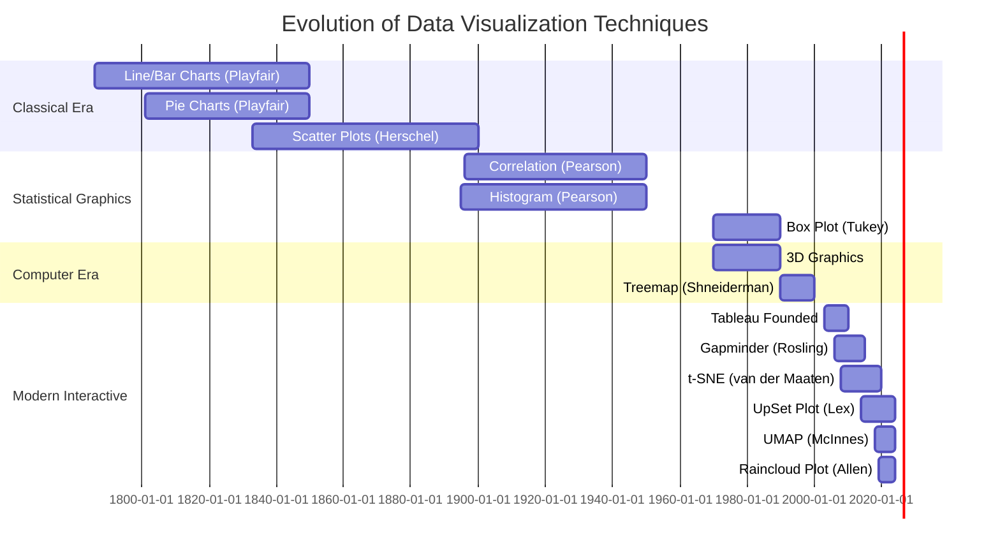

<!--
# image: 
#  path: /assets/img/posts/data-visualization-guide-small.webp
#  alt: Evolution of Data Visualization Techniques
-->

## Abstract

This comprehensive research document examines the evolution of data visualization techniques from traditional statistical graphics to modern interactive visualizations. We analyze classical plotting methods, their limitations, and contemporary alternatives that leverage advances in statistical theory, human perception research, and interactive computing. Each visualization type is accompanied by Python implementation details across multiple popular libraries.

---

## Table of Contents
- [Introduction](#introduction)
- [Methodology](#methodology)
- [Classical vs. Modern Visualizations](#classical-vs-modern-visualizations)
- [Implementation Guide](#implementation-guide)
- [Recommendations](#recommendations)
- [Conclusion](#conclusion)

---

## Introduction

Data visualization has undergone significant transformation since the early days of statistical graphics. This evolution has been driven by:

1. **Advances in Statistical Theory**: Better understanding of data distributions and uncertainty
2. **Cognitive Science Research**: Insights into human visual perception and information processing
3. **Computational Capabilities**: Interactive and web-based visualizations
4. **Big Data Era**: Need for scalable visualization techniques
5. **Accessibility Standards**: Inclusive design for diverse audiences

This document provides a chronological survey of visualization techniques, analyzing when they emerged, their limitations, and superior modern alternatives.

---

## Methodology

Our research methodology includes:

- **Literature Review**: Analysis of seminal works in statistical graphics (Tukey, Cleveland, Tufte, Wilkinson)
- **Historical Analysis**: Chronological mapping of visualization technique development
- **Comparative Evaluation**: Assessment based on perceptual effectiveness, information density, and accuracy
- **Implementation Survey**: Comprehensive API reference across major Python libraries
- **Best Practices**: Evidence-based recommendations from cognitive psychology and information design research

---

## Classical vs. Modern Visualizations

### **1. Pie Charts → Donut Charts / Waffle Charts / Treemaps**

| Aspect | Details |
|--------|---------|
| **Classical Technique** | Pie Chart (1801 - William Playfair) |
| **Problem** | Humans poorly perceive angles and areas; difficult to compare similar-sized segments; poor information density |
| **Modern Alternatives** | Donut Charts (better focus on data), Waffle Charts (easier comparison), Treemaps (hierarchical data) |
| **When Invented** | Pie: 1801 / Donut: ~1990s / Waffle: ~2010s / Treemap: 1990 (Ben Shneiderman) |
| **Use Case** | Part-to-whole relationships with few categories (<5 recommended) |

**Python Implementations:**

```python
# Matplotlib - Pie Chart
import matplotlib.pyplot as plt
plt.pie(sizes, labels=labels, autopct='%1.1f%%')

# Matplotlib - Donut Chart
plt.pie(sizes, labels=labels, autopct='%1.1f%%', wedgeprops={'width': 0.4})

# Plotly - Interactive Pie
import plotly.express as px
px.pie(df, values='values', names='categories')

# PyWaffle - Waffle Chart
from pywaffle import Waffle
plt.figure(FigureClass=Waffle, rows=10, columns=10, values=data)

# Squarify - Treemap
import squarify
squarify.plot(sizes=sizes, label=labels)

# Plotly - Treemap
px.treemap(df, path=['category'], values='values')
```

| Package | API/Function | Chart Type |
|---------|-------------|------------|
| matplotlib.pyplot | `pie()` | Pie Chart |
| matplotlib.pyplot | `pie()` with `wedgeprops={'width': 0.4}` | Donut Chart |
| plotly.express | `px.pie()` | Interactive Pie |
| plotly.graph_objects | `go.Pie()` | Interactive Pie (advanced) |
| pywaffle | `Waffle()` | Waffle Chart |
| squarify | `plot()` | Treemap |
| plotly.express | `px.treemap()` | Interactive Treemap |

---

### **2. Bar Charts → Lollipop Charts / Dot Plots**

| Aspect | Details |
|--------|---------|
| **Classical Technique** | Bar Chart (1786 - William Playfair) |
| **Problem** | Heavy ink-to-data ratio; bars can be visually overwhelming; less effective for many categories |
| **Modern Alternatives** | Lollipop Charts (reduced visual clutter), Dot Plots (Cleveland, 1984 - better for rankings) |
| **When Invented** | Bar: 1786 / Dot Plot: 1984 / Lollipop: ~2010s |
| **Use Case** | Comparing quantities across categories; rankings |

**Python Implementations:**

```python
# Matplotlib - Bar Chart
plt.bar(x, heights)

# Matplotlib - Horizontal Bar
plt.barh(y, widths)

# Seaborn - Bar Chart
import seaborn as sns
sns.barplot(data=df, x='category', y='value')

# Matplotlib - Lollipop Chart
plt.stem(x, y, basefmt=" ")
# OR
plt.hlines(y=range(len(x)), xmin=0, xmax=values)
plt.plot(values, range(len(x)), "o")

# Seaborn - Dot Plot
sns.stripplot(data=df, x='value', y='category')

# Plotly - Bar Chart
px.bar(df, x='category', y='value')

# Altair - Lollipop
import altair as alt
alt.Chart(df).mark_circle().encode(x='value', y='category') + \
alt.Chart(df).mark_rule().encode(x='value', y='category')
```

| Package | API/Function | Chart Type |
|---------|-------------|------------|
| matplotlib.pyplot | `bar()` | Vertical Bar Chart |
| matplotlib.pyplot | `barh()` | Horizontal Bar Chart |
| seaborn | `barplot()` | Statistical Bar Chart |
| plotly.express | `px.bar()` | Interactive Bar Chart |
| matplotlib.pyplot | `stem()` | Lollipop Chart |
| matplotlib.pyplot | `hlines()` + `plot()` | Custom Lollipop |
| seaborn | `stripplot()` | Dot Plot |
| seaborn | `pointplot()` | Point Plot with CI |
| altair | `mark_circle()` + `mark_rule()` | Declarative Lollipop |

---

### **3. Line Charts → Area Charts / Sparklines / Slopegraphs**

| Aspect | Details |
|--------|---------|
| **Classical Technique** | Line Chart (1786 - William Playfair) |
| **Problem** | Can be cluttered with many series; difficult to show uncertainty; lacks context for scale |
| **Modern Alternatives** | Area Charts (emphasis on magnitude), Sparklines (Tufte, 2006 - context), Slopegraphs (Tufte - change focus) |
| **When Invented** | Line: 1786 / Area: ~1970s / Sparkline: 2006 / Slopegraph: ~2001 |
| **Use Case** | Trends over time; continuous data |

**Python Implementations:**

```python
# Matplotlib - Line Chart
plt.plot(x, y)

# Matplotlib - Area Chart
plt.fill_between(x, y)

# Seaborn - Line with CI
sns.lineplot(data=df, x='time', y='value')

# Plotly - Interactive Line
px.line(df, x='time', y='value')

# Matplotlib - Sparkline
fig, ax = plt.subplots(1, 1, figsize=(4, 0.5))
ax.plot(data)
ax.axis('off')

# Custom - Slopegraph
for i in range(len(df)):
    plt.plot([0, 1], [df.iloc[i]['start'], df.iloc[i]['end']])

# Plotly - Area Chart
px.area(df, x='time', y='value')
```

| Package | API/Function | Chart Type |
|---------|-------------|------------|
| matplotlib.pyplot | `plot()` | Line Chart |
| matplotlib.pyplot | `fill_between()` | Area Chart |
| seaborn | `lineplot()` | Statistical Line Chart |
| plotly.express | `px.line()` | Interactive Line Chart |
| plotly.express | `px.area()` | Interactive Area Chart |
| matplotlib.pyplot | Custom `plot()` with minimal axes | Sparkline |
| matplotlib.pyplot | Multiple `plot()` calls | Slopegraph |
| plotly.graph_objects | `go.Scatter()` with mode='lines' | Advanced Line |

---

### **4. Histograms → Kernel Density Plots / Ridge Plots / Violin Plots**

| Aspect | Details |
|--------|---------|
| **Classical Technique** | Histogram (1895 - Karl Pearson) |
| **Problem** | Bin width dependency; discrete appearance for continuous data; difficult to compare distributions |
| **Modern Alternatives** | KDE Plots (smooth, continuous), Ridge Plots (Joy Division plots - multiple distributions), Violin Plots (combines KDE + box plot) |
| **When Invented** | Histogram: 1895 / KDE: 1956 (Rosenblatt) / Violin: 1998 (Hintze & Nelson) / Ridge: ~2017 (popularized) |
| **Use Case** | Distribution visualization; comparing multiple distributions |

**Python Implementations:**

```python
# Matplotlib - Histogram
plt.hist(data, bins=30)

# Seaborn - Histogram with KDE
sns.histplot(data, kde=True)

# Seaborn - KDE Plot
sns.kdeplot(data)

# Seaborn - Violin Plot
sns.violinplot(data=df, x='category', y='value')

# Plotly - Histogram
px.histogram(df, x='value')

# Seaborn - Ridge Plot (JoyPlot)
import joypy
joypy.joyplot(df, column='value', by='category')

# SciPy - KDE (manual)
from scipy.stats import gaussian_kde
kde = gaussian_kde(data)
```

| Package | API/Function | Chart Type |
|---------|-------------|------------|
| matplotlib.pyplot | `hist()` | Histogram |
| seaborn | `histplot()` | Enhanced Histogram |
| seaborn | `kdeplot()` | Kernel Density Plot |
| seaborn | `violinplot()` | Violin Plot |
| seaborn | `distplot()` (deprecated) | Distribution Plot |
| plotly.express | `px.histogram()` | Interactive Histogram |
| plotly.figure_factory | `create_distplot()` | Distribution with KDE |
| joypy | `joyplot()` | Ridge Plot / Joy Plot |
| scipy.stats | `gaussian_kde()` | Manual KDE calculation |

---

### **5. Box Plots → Violin Plots / Beeswarm Plots / Raincloud Plots**

| Aspect | Details |
|--------|---------|
| **Classical Technique** | Box Plot (1970 - John Tukey) |
| **Problem** | Hides distribution shape; assumes unimodal distribution; loses individual data points |
| **Modern Alternatives** | Violin Plots (shows full distribution), Beeswarm/Swarm Plots (shows all points), Raincloud Plots (combines all: distribution + box + points) |
| **When Invented** | Box Plot: 1970 / Violin: 1998 / Beeswarm: ~2011 / Raincloud: 2019 (Allen et al.) |
| **Use Case** | Statistical summary; comparing groups |

**Python Implementations:**

```python
# Matplotlib - Box Plot
plt.boxplot(data)

# Seaborn - Box Plot
sns.boxplot(data=df, x='category', y='value')

# Seaborn - Violin Plot
sns.violinplot(data=df, x='category', y='value')

# Seaborn - Beeswarm/Swarm Plot
sns.swarmplot(data=df, x='category', y='value')

# Plotly - Box Plot
px.box(df, x='category', y='value')

# PtitPrince - Raincloud Plot
import ptitprince as pt
pt.RainCloud(data=df, x='category', y='value')

# Combined - Manual Raincloud
sns.violinplot(data=df, x='category', y='value', cut=0, inner=None)
sns.boxplot(data=df, x='category', y='value', width=0.3)
sns.swarmplot(data=df, x='category', y='value', color='black', alpha=0.5, size=3)
```

| Package | API/Function | Chart Type |
|---------|-------------|------------|
| matplotlib.pyplot | `boxplot()` | Box Plot |
| seaborn | `boxplot()` | Enhanced Box Plot |
| seaborn | `violinplot()` | Violin Plot |
| seaborn | `swarmplot()` | Beeswarm/Swarm Plot |
| seaborn | `stripplot()` | Strip Plot (simpler swarm) |
| plotly.express | `px.box()` | Interactive Box Plot |
| plotly.express | `px.violin()` | Interactive Violin Plot |
| plotly.express | `px.strip()` | Interactive Strip Plot |
| ptitprince | `RainCloud()` | Raincloud Plot |

---

### **6. Scatter Plots → Bubble Charts / 2D Density Plots / Hexbin Plots**

| Aspect | Details |
|--------|---------|
| **Classical Technique** | Scatter Plot (1833 - John Frederick W. Herschel) |
| **Problem** | Overplotting with large datasets; difficult to see density; limited dimensions |
| **Modern Alternatives** | Bubble Charts (3rd dimension via size), 2D Density/Hexbin (handle overplotting), Contour Plots (density visualization) |
| **When Invented** | Scatter: 1833 / Bubble: ~1950s / Hexbin: ~1987 (Carr et al.) / 2D KDE: ~1990s |
| **Use Case** | Relationship between variables; correlation analysis |

**Python Implementations:**

```python
# Matplotlib - Scatter Plot
plt.scatter(x, y)

# Seaborn - Scatter Plot
sns.scatterplot(data=df, x='var1', y='var2')

# Matplotlib - Bubble Chart
plt.scatter(x, y, s=sizes, alpha=0.5)

# Plotly - Bubble Chart
px.scatter(df, x='var1', y='var2', size='size_var')

# Matplotlib - Hexbin
plt.hexbin(x, y, gridsize=30)

# Seaborn - 2D KDE
sns.kdeplot(data=df, x='var1', y='var2')

# Seaborn - Density Contour
sns.kdeplot(data=df, x='var1', y='var2', fill=True)

# Datashader - Large Data
import datashader as ds
import datashader.transfer_functions as tf
cvs = ds.Canvas()
agg = cvs.points(df, 'x', 'y')
img = tf.shade(agg)
```

| Package | API/Function | Chart Type |
|---------|-------------|------------|
| matplotlib.pyplot | `scatter()` | Scatter Plot |
| seaborn | `scatterplot()` | Enhanced Scatter |
| seaborn | `regplot()` | Scatter with Regression |
| matplotlib.pyplot | `scatter()` with `s` parameter | Bubble Chart |
| plotly.express | `px.scatter()` | Interactive Scatter |
| plotly.express | `px.scatter()` with `size` | Interactive Bubble |
| matplotlib.pyplot | `hexbin()` | Hexagonal Binning |
| seaborn | `kdeplot()` 2D | 2D Density Plot |
| scipy.stats | `gaussian_kde()` 2D | Manual 2D KDE |
| datashader | `Canvas.points()` | Big Data Scatter |

---

### **7. Heatmaps → Annotated Heatmaps / Clustered Heatmaps**

| Aspect | Details |
|--------|---------|
| **Classical Technique** | Heatmap (1957 - Loua, but popularized with computers) |
| **Problem** | Color perception issues; sequential vs. diverging confusion; no hierarchical structure |
| **Modern Alternatives** | Annotated Heatmaps (values shown), Clustered Heatmaps (dendrograms), Interactive Heatmaps |
| **When Invented** | Basic Heatmap: 1957 / Clustered: ~1990s / Interactive: ~2010s |
| **Use Case** | Matrix data; correlations; time-series patterns |

**Python Implementations:**

```python
# Matplotlib - Heatmap
plt.imshow(matrix, cmap='viridis')

# Seaborn - Heatmap
sns.heatmap(matrix, annot=True, cmap='coolwarm')

# Seaborn - Clustered Heatmap
sns.clustermap(matrix, cmap='viridis')

# Plotly - Interactive Heatmap
px.imshow(matrix)

# Plotly - Advanced Heatmap
import plotly.graph_objects as go
go.Heatmap(z=matrix, x=x_labels, y=y_labels)

# Plotly - Correlation Heatmap with Dendrograms
import plotly.figure_factory as ff
ff.create_dendrogram(matrix)
```

| Package | API/Function | Chart Type |
|---------|-------------|------------|
| matplotlib.pyplot | `imshow()` | Basic Heatmap |
| matplotlib.pyplot | `pcolormesh()` | Pseudocolor Plot |
| seaborn | `heatmap()` | Annotated Heatmap |
| seaborn | `clustermap()` | Clustered Heatmap |
| plotly.express | `px.imshow()` | Interactive Heatmap |
| plotly.express | `px.density_heatmap()` | 2D Histogram Heatmap |
| plotly.graph_objects | `go.Heatmap()` | Advanced Heatmap |
| plotly.figure_factory | `create_annotated_heatmap()` | Annotated Interactive |

---

### **8. 3D Plots → Contour Plots / Surface Plots / Small Multiples**

| Aspect | Details |
|--------|---------|
| **Classical Technique** | 3D Surface/Scatter Plots (1980s - computer graphics era) |
| **Problem** | Perspective distortion; occlusion; difficult to read exact values; poor on 2D screens |
| **Modern Alternatives** | Contour Plots (2D projection), Faceted/Small Multiples (Tufte - multiple 2D views), Interactive 3D (rotatable) |
| **When Invented** | 3D Computer Graphics: 1970s-80s / Contours: 1844 (isolines) / Small Multiples: ~1983 (Tufte) |
| **Use Case** | Multivariate relationships; surface visualization |

**Python Implementations:**

```python
# Matplotlib - 3D Scatter
from mpl_toolkits.mplot3d import Axes3D
fig = plt.figure()
ax = fig.add_subplot(111, projection='3d')
ax.scatter(x, y, z)

# Matplotlib - 3D Surface
ax.plot_surface(X, Y, Z)

# Matplotlib - Contour Plot
plt.contour(X, Y, Z)
plt.contourf(X, Y, Z)  # Filled contours

# Plotly - 3D Scatter
px.scatter_3d(df, x='x', y='y', z='z')

# Plotly - 3D Surface
go.Surface(z=Z)

# Seaborn - Small Multiples (FacetGrid)
g = sns.FacetGrid(df, col='variable', col_wrap=3)
g.map(sns.scatterplot, 'x', 'y')

# Plotly - 3D Interactive
import plotly.graph_objects as go
go.Scatter3d(x=x, y=y, z=z, mode='markers')
```

| Package | API/Function | Chart Type |
|---------|-------------|------------|
| mpl_toolkits.mplot3d | `Axes3D.scatter()` | 3D Scatter |
| mpl_toolkits.mplot3d | `Axes3D.plot_surface()` | 3D Surface |
| matplotlib.pyplot | `contour()` | Contour Lines |
| matplotlib.pyplot | `contourf()` | Filled Contours |
| seaborn | `FacetGrid()` | Small Multiples |
| plotly.express | `px.scatter_3d()` | Interactive 3D Scatter |
| plotly.graph_objects | `go.Surface()` | Interactive 3D Surface |
| plotly.graph_objects | `go.Scatter3d()` | Advanced 3D Scatter |
| mayavi.mlab | Various 3D functions | Scientific 3D Viz |

---

### **9. Stacked Bar/Area Charts → Streamgraphs / Grouped Charts**

| Aspect | Details |
|--------|---------|
| **Classical Technique** | Stacked Bar/Area Charts (1786 - Playfair, popularized later) |
| **Problem** | Difficult to compare non-baseline categories; misleading when showing percentages; hard to track individual series |
| **Modern Alternatives** | Streamgraphs (Lee Byron, 2008 - organic flow), Grouped/Dodged Charts (side-by-side), Normalized Stacks (100% stack) |
| **When Invented** | Stacked: 1786 / Grouped: ~1950s / Streamgraph: 2008 / Normalized: ~1990s |
| **Use Case** | Part-to-whole over time; multiple categories |

**Python Implementations:**

```python
# Matplotlib - Stacked Bar
plt.bar(x, values1, label='Cat1')
plt.bar(x, values2, bottom=values1, label='Cat2')

# Matplotlib - Stacked Area
plt.stackplot(x, y1, y2, y3, labels=['A', 'B', 'C'])

# Seaborn - Grouped Bar
sns.barplot(data=df_long, x='time', y='value', hue='category')

# Plotly - Stacked Area
px.area(df, x='time', y='value', color='category')

# Plotly - Grouped Bar
px.bar(df, x='time', y='value', color='category', barmode='group')

# Plotly - Streamgraph
px.area(df, x='time', y='value', color='category', 
        groupnorm='percent')  # Normalized

# Custom Streamgraph (requires manual offset calculation)
```

| Package | API/Function | Chart Type |
|---------|-------------|------------|
| matplotlib.pyplot | `bar()` with `bottom` | Stacked Bar |
| matplotlib.pyplot | `stackplot()` | Stacked Area |
| seaborn | `barplot()` with `hue` | Grouped Bar |
| plotly.express | `px.bar()` with `barmode='stack'` | Stacked Bar |
| plotly.express | `px.bar()` with `barmode='group'` | Grouped Bar |
| plotly.express | `px.area()` | Stacked Area |
| plotly.express | `px.area()` with `groupnorm` | Normalized Area |
| matplotlib.pyplot | Custom calculation | Streamgraph |

---

### **10. Correlation Matrix → Pair Plots / Correlation Network Graphs**

| Aspect | Details |
|--------|---------|
| **Classical Technique** | Correlation Matrix (Pearson, 1896) |
| **Problem** | Difficult to spot patterns; redundant information (symmetric); no distribution info |
| **Modern Alternatives** | Pair Plots/SPLOM (Scatter Plot Matrix - shows distributions + relationships), Network Graphs (graph theory approach) |
| **When Invented** | Correlation: 1896 / SPLOM: ~1980s / Network: ~2000s |
| **Use Case** | Multivariate correlation analysis |

**Python Implementations:**

```python
# Seaborn - Correlation Heatmap
corr = df.corr()
sns.heatmap(corr, annot=True)

# Seaborn - Pair Plot
sns.pairplot(df)

# Seaborn - Pair Plot with Hue
sns.pairplot(df, hue='category')

# Pandas - Scatter Matrix
from pandas.plotting import scatter_matrix
scatter_matrix(df, figsize=(12, 12))

# Plotly - Scatter Matrix
px.scatter_matrix(df)

# NetworkX - Correlation Network
import networkx as nx
G = nx.Graph()
# Add edges for high correlations
for i in range(len(corr)):
    for j in range(i+1, len(corr)):
        if abs(corr.iloc[i, j]) > 0.7:
            G.add_edge(corr.index[i], corr.columns[j], 
                      weight=corr.iloc[i, j])
nx.draw(G, with_labels=True)
```

| Package | API/Function | Chart Type |
|---------|-------------|------------|
| seaborn | `heatmap()` on correlation | Correlation Heatmap |
| seaborn | `pairplot()` | Pair Plot / SPLOM |
| pandas.plotting | `scatter_matrix()` | Scatter Matrix |
| plotly.express | `px.scatter_matrix()` | Interactive SPLOM |
| plotly.figure_factory | `create_scatterplotmatrix()` | Advanced SPLOM |
| networkx | Graph visualization | Correlation Network |
| plotly.graph_objects | `go.Splom()` | Advanced SPLOM |

---

### **11. Error Bars → Confidence Bands / Uncertainty Visualization**

| Aspect | Details |
|--------|---------|
| **Classical Technique** | Error Bars (1800s - statistical graphics) |
| **Problem** | Often misinterpreted (SE vs SD vs CI); discrete appearance; no distribution info |
| **Modern Alternatives** | Confidence Bands (continuous), Gradient Uncertainty (opacity-based), Violin Plots with CI, Bootstrap Distributions |
| **When Invented** | Error Bars: 1800s / CI Theory: 1937 (Neyman) / Modern Viz: ~2010s |
| **Use Case** | Uncertainty representation; confidence intervals |

**Python Implementations:**

```python
# Matplotlib - Error Bars
plt.errorbar(x, y, yerr=errors, fmt='o')

# Seaborn - Line Plot with CI Band
sns.lineplot(data=df, x='x', y='y')  # Auto-calculates CI

# Matplotlib - Confidence Band
plt.fill_between(x, lower_bound, upper_bound, alpha=0.3)

# Seaborn - Bootstrap CI
sns.barplot(data=df, x='category', y='value', ci=95)

# Plotly - Error Bars
px.scatter(df, x='x', y='y', error_y='error')

# Plotly - Continuous Error Band
go.Scatter(x=x, y=y, mode='lines',
           error_y=dict(type='data', array=errors, visible=True))

# ArviZ - Bayesian Uncertainty
import arviz as az
az.plot_posterior(trace)
```

| Package | API/Function | Chart Type |
|---------|-------------|------------|
| matplotlib.pyplot | `errorbar()` | Error Bars |
| matplotlib.pyplot | `fill_between()` | Confidence Band |
| seaborn | `lineplot()` with CI | Line with CI Band |
| seaborn | `barplot()` with CI | Bar with CI |
| seaborn | `regplot()` | Regression with CI |
| plotly.express | `px.scatter()` with `error_y` | Error Bars |
| plotly.graph_objects | `go.Scatter()` with `error_y` | Advanced Error Viz |
| arviz | `plot_posterior()`, `plot_hdi()` | Bayesian Uncertainty |

---

### **12. Word Clouds → Text Network Graphs / Word Trees / Scattertext**

| Aspect | Details |
|--------|---------|
| **Classical Technique** | Word Cloud (2000s - popularized by Wordle, 2008) |
| **Problem** | Size perception issues; no context; arbitrary positioning; poor for analysis |
| **Modern Alternatives** | Text Network Graphs (relationships), Word Trees (context), Scattertext (comparative), Bar Charts (better for frequency) |
| **When Invented** | Word Cloud: ~2008 / Network: ~2010s / Word Tree: 2010 (Wattenberg) / Scattertext: 2017 |
| **Use Case** | Text data visualization; word frequency |

**Python Implementations:**

```python
# WordCloud - Word Cloud
from wordcloud import WordCloud
wc = WordCloud(width=800, height=400).generate(text)
plt.imshow(wc)

# NetworkX - Text Network
import networkx as nx
from sklearn.feature_extraction.text import CountVectorizer
# Create co-occurrence matrix and network
G = nx.from_numpy_array(cooccurrence_matrix)
nx.draw(G, with_labels=True)

# Scattertext - Comparative Text Viz
import scattertext as st
corpus = st.CorpusFromPandas(df, category_col='category', 
                             text_col='text').build()
html = st.produce_scattertext_explorer(corpus)

# Matplotlib - Simple Bar (Better Alternative)
word_freq = Counter(words)
plt.barh(list(word_freq.keys()), list(word_freq.values()))

# Plotly - Interactive Word Frequency
px.bar(word_df, x='frequency', y='word', orientation='h')
```

| Package | API/Function | Chart Type |
|---------|-------------|------------|
| wordcloud | `WordCloud().generate()` | Word Cloud |
| matplotlib.pyplot | Display with `imshow()` | Word Cloud Rendering |
| networkx | Graph construction & `draw()` | Text Network |
| scattertext | `produce_scattertext_explorer()` | Comparative Text Viz |
| matplotlib.pyplot | `barh()` | Horizontal Bar (frequency) |
| plotly.express | `px.bar()` | Interactive Frequency Bar |

---

### **13. Gantt Charts → Modern Timeline Visualizations / Swimlane Diagrams**

| Aspect | Details |
|--------|---------|
| **Classical Technique** | Gantt Chart (1910-1915 - Henry Gantt) |
| **Problem** | Static; difficult to show dependencies; poor for complex projects; limited interactivity |
| **Modern Alternatives** | Interactive Gantt (zoom/filter), Network Diagrams (PERT/CPM), Kanban Boards, Timeline Visualizations |
| **When Invented** | Gantt: 1910-1915 / PERT: 1958 / Modern Interactive: ~2010s |
| **Use Case** | Project management; scheduling; resource allocation |

**Python Implementations:**

```python
# Plotly - Gantt Chart
import plotly.figure_factory as ff
df_gantt = [dict(Task="Job-1", Start='2024-01-01', 
                 Finish='2024-02-01', Resource='Team-A')]
fig = ff.create_gantt(df_gantt)

# Plotly Express - Timeline
px.timeline(df, x_start='start', x_end='end', y='task')

# Matplotlib - Manual Gantt
fig, ax = plt.subplots()
ax.barh(tasks, durations, left=start_dates)

# Plotly - Swimlane/Timeline
go.Scatter(x=dates, y=categories, mode='markers+lines')

# NetworkX - Dependency Network (PERT)
G = nx.DiGraph()
G.add_edges_from(dependencies)
pos = nx.spring_layout(G)
nx.draw(G, pos, with_labels=True)
```

| Package | API/Function | Chart Type |
|---------|-------------|------------|
| plotly.figure_factory | `create_gantt()` | Gantt Chart |
| plotly.express | `px.timeline()` | Timeline Visualization |
| matplotlib.pyplot | `barh()` with `left` | Manual Gantt |
| plotly.graph_objects | `go.Bar()` with base | Advanced Gantt |
| networkx | Directed Graph | Dependency Network |

---

### **14. Geographic Maps → Choropleth Maps / Cartograms / Proportional Symbol Maps**

| Aspect | Details |
|--------|---------|
| **Classical Technique** | Basic Geographic Map with colors (1700s+) |
| **Problem** | Area bias (large areas dominate); poor for sparse data; projection distortions |
| **Modern Alternatives** | Choropleth (data-driven coloring), Cartograms (size by data), Proportional Symbols (circles/bubbles), Hexagonal Tile Maps |
| **When Invented** | Choropleth: 1826 (Dupin) / Cartogram: 1934 / Proportional Symbol: ~1850s / Hex Maps: ~2010s |
| **Use Case** | Geographic data; regional comparisons |

**Python Implementations:**

```python
# Folium - Interactive Map
import folium
m = folium.Map(location=[lat, lon], zoom_start=10)
folium.Marker([lat, lon]).add_to(m)

# Plotly - Choropleth Map
px.choropleth(df, locations='state', color='value', 
              locationmode='USA-states')

# Geopandas + Matplotlib - Choropleth
import geopandas as gpd
gdf.plot(column='value', cmap='viridis', legend=True)

# Plotly - Bubble Map
px.scatter_geo(df, lat='lat', lon='lon', size='value')

# Plotly - 3D Globe
go.Scattergeo(lon=lons, lat=lats, mode='markers')

# Cartopy - Advanced Geographic Plots
import cartopy.crs as ccrs
ax = plt.axes(projection=ccrs.PlateCarree())
ax.coastlines()

# Kepler.gl - Large-Scale Interactive
from keplergl import KeplerGl
map_1 = KeplerGl(height=600, data={'data': df})
```

| Package | API/Function | Chart Type |
|---------|-------------|------------|
| folium | `Map()`, `Marker()`, `Choropleth()` | Interactive Web Maps |
| plotly.express | `px.choropleth()` | Choropleth Map |
| plotly.express | `px.scatter_geo()` | Bubble/Proportional Map |
| geopandas | `plot()` | Static Geographic Plot |
| matplotlib + cartopy | Geographic projections | Advanced Cartography |
| plotly.graph_objects | `go.Choropleth()`, `go.Scattergeo()` | Advanced Maps |
| keplergl | `KeplerGl()` | Large-Scale Geospatial |

---

### **15. Sunburst Charts → Icicle Plots / Circular Treemaps**

| Aspect | Details |
|--------|---------|
| **Classical Technique** | Sunburst Chart (2000s - information visualization) |
| **Problem** | Difficult to compare outer rings; area perception issues; not ideal for deep hierarchies |
| **Modern Alternatives** | Icicle Plots (rectangular hierarchy), Circular Treemaps (better space utilization), Collapsible Trees |
| **When Invented** | Sunburst: ~2000 / Icicle: ~1980s / Circular Treemap: ~2005 |
| **Use Case** | Hierarchical data; file systems; organizational structures |

**Python Implementations:**

```python
# Plotly - Sunburst
px.sunburst(df, path=['level1', 'level2', 'level3'], 
            values='values')

# Plotly - Icicle Chart
px.icicle(df, path=['level1', 'level2'], values='values')

# Plotly - Treemap
px.treemap(df, path=['level1', 'level2'], values='values')

# Plotly - Advanced Sunburst
go.Sunburst(labels=labels, parents=parents, values=values)

# Squarify - Simple Treemap
squarify.plot(sizes=sizes, label=labels)
```

| Package | API/Function | Chart Type |
|---------|-------------|------------|
| plotly.express | `px.sunburst()` | Sunburst Chart |
| plotly.express | `px.icicle()` | Icicle Plot |
| plotly.express | `px.treemap()` | Treemap |
| plotly.graph_objects | `go.Sunburst()` | Advanced Sunburst |
| plotly.graph_objects | `go.Icicle()` | Advanced Icicle |
| squarify | `plot()` | Simple Treemap |

---

### **16. Parallel Coordinates → Alluvial/Sankey Diagrams / SPLOM**

| Aspect | Details |
|--------|---------|
| **Classical Technique** | Parallel Coordinates (1885 - d'Ocagne, popularized 1980s - Inselberg) |
| **Problem** | Order dependency; line crossing clutter; difficult with many dimensions |
| **Modern Alternatives** | Alluvial/Sankey Diagrams (flow emphasis), Radar Charts (circular), Dimensionality Reduction (PCA, t-SNE) |
| **When Invented** | Parallel Coords: 1885/1980s / Sankey: 1898 (Sankey) / Alluvial: ~2010 |
| **Use Case** | Multivariate data; flow analysis; high-dimensional data |

**Python Implementations:**

```python
# Pandas - Parallel Coordinates
from pandas.plotting import parallel_coordinates
parallel_coordinates(df, 'class', color=['red', 'blue'])

# Plotly - Parallel Coordinates
px.parallel_coordinates(df, color='species')

# Plotly - Parallel Categories
px.parallel_categories(df)

# Plotly - Sankey Diagram
go.Sankey(node=dict(label=nodes), 
          link=dict(source=sources, target=targets, value=values))

# Plotly - Alluvial Diagram (similar to Sankey)
# Use px.parallel_categories with color mapping

# Matplotlib - Radar Chart
from math import pi
angles = [n / float(N) * 2 * pi for n in range(N)]
ax = plt.subplot(111, projection='polar')
ax.plot(angles, values)
```

| Package | API/Function | Chart Type |
|---------|-------------|------------|
| pandas.plotting | `parallel_coordinates()` | Parallel Coordinates |
| plotly.express | `px.parallel_coordinates()` | Interactive Parallel Coords |
| plotly.express | `px.parallel_categories()` | Parallel Categories |
| plotly.graph_objects | `go.Parcoords()` | Advanced Parallel Coords |
| plotly.graph_objects | `go.Sankey()` | Sankey Diagram |
| matplotlib.pyplot | Polar plot | Radar Chart |

---

### **17. Bullet Graphs → Enhanced Progress Visualizations**

| Aspect | Details |
|--------|---------|
| **Classical Technique** | Gauges/Speedometer Charts (1990s-2000s dashboards) |
| **Problem** | Poor space utilization; difficult to compare multiple metrics; misleading |
| **Modern Alternatives** | Bullet Graphs (Stephen Few, 2006 - space-efficient), Progress Bars, KPI Cards |
| **When Invented** | Gauges: 1990s / Bullet Graph: 2006 |
| **Use Case** | KPI tracking; performance against targets |

**Python Implementations:**

```python
# Plotly - Gauge Chart
go.Indicator(mode="gauge+number", value=value, 
             title={'text': "Speed"})

# Plotly - Bullet Chart (manual)
go.Bar(x=[actual], y=['Metric'], orientation='h', 
       marker=dict(color='blue'))
# Add target line
go.Scatter(x=[target], y=['Metric'], mode='markers')

# Matplotlib - Progress Bar
plt.barh([0], [progress], color='green')
plt.axvline(x=target, color='red', linestyle='--')

# Custom - Bullet Graph
# Requires manual composition of rectangles and lines
```

| Package | API/Function | Chart Type |
|---------|-------------|------------|
| plotly.graph_objects | `go.Indicator()` mode='gauge' | Gauge Chart |
| plotly.graph_objects | `go.Indicator()` mode='number+delta' | KPI Card |
| plotly.graph_objects | Custom `go.Bar()` + markers | Bullet Graph |
| matplotlib.pyplot | `barh()` + `axvline()` | Progress Bar |

---

### **18. Network Graphs → Force-Directed Layouts / Arc Diagrams / Matrix Views**

| Aspect | Details |
|--------|---------|
| **Classical Technique** | Static Network Graphs (Euler, 1736 - graph theory foundations) |
| **Problem** | Node occlusion; edge crossing; difficult to see structure in dense graphs |
| **Modern Alternatives** | Force-Directed (D3-style), Arc Diagrams, Adjacency Matrix, Hierarchical Edge Bundling, Chord Diagrams |
| **When Invented** | Graph Theory: 1736 / Force-Directed: ~1980s / Arc: ~2002 / Chord: ~2010s |
| **Use Case** | Relationships; social networks; system dependencies |

**Python Implementations:**

```python
# NetworkX - Basic Network
import networkx as nx
G = nx.Graph()
G.add_edges_from(edges)
nx.draw(G, with_labels=True)

# NetworkX - Force-Directed Layout
pos = nx.spring_layout(G)
nx.draw(G, pos, with_labels=True)

# NetworkX - Circular Layout
pos = nx.circular_layout(G)
nx.draw(G, pos)

# PyVis - Interactive Network
from pyvis.network import Network
net = Network()
net.from_nx(G)
net.show('network.html')

# Plotly - Network Graph
import plotly.graph_objects as go
# Manual edge traces + node traces

# NetworkX - Adjacency Matrix
adjacency_matrix = nx.adjacency_matrix(G)
sns.heatmap(adjacency_matrix.todense())

# Plotly - Chord Diagram (using plotly)
# Requires manual arc calculations
```

| Package | API/Function | Chart Type |
|---------|-------------|------------|
| networkx | `draw()`, various layouts | Network Graph |
| networkx | `spring_layout()` | Force-Directed Layout |
| networkx | `circular_layout()` | Circular Layout |
| networkx | `kamada_kawai_layout()` | Kamada-Kawai Layout |
| pyvis | `Network()` | Interactive Network |
| plotly.graph_objects | Custom traces | Interactive Network |
| holoviews | `Graph()` | Declarative Network |
| graph-tool | Various layouts | High-Performance Networks |

---

### **19. Calendar Heatmaps → Activity Matrices**

| Aspect | Details |
|--------|---------|
| **Classical Technique** | Simple Calendar (linear time representation) |
| **Problem** | Difficult to see patterns; no intensity representation |
| **Modern Alternatives** | Calendar Heatmaps (GitHub-style), Horizon Graphs (time-series), Circular Calendar |
| **When Invented** | Calendar Heatmap: ~2010s (GitHub popularized) / Horizon: 2008 |
| **Use Case** | Activity tracking; time-based patterns; habit visualization |

**Python Implementations:**

```python
# Calplot - Calendar Heatmap
import calplot
calplot.calplot(series, cmap='YlGn', 
                figsize=(16, 10), suptitle='Activity')

# Plotly - Calendar Heatmap (manual)
# Requires date processing and heatmap creation
import pandas as pd
df['day'] = df['date'].dt.day
df['month'] = df['date'].dt.month
px.density_heatmap(df, x='month', y='day', z='value')

# Seaborn - Activity Matrix
pivot = df.pivot(index='day_of_week', 
                 columns='hour', values='activity')
sns.heatmap(pivot, cmap='YlOrRd')

# Matplotlib - Custom Calendar
# Requires manual grid and date calculations
```

| Package | API/Function | Chart Type |
|---------|-------------|------------|
| calplot | `calplot()` | Calendar Heatmap |
| plotly.express | Custom `px.density_heatmap()` | Manual Calendar Heatmap |
| seaborn | `heatmap()` on pivoted data | Activity Matrix |
| matplotlib.pyplot | Custom grid | Manual Calendar |

---

### **20. Waterfall Charts → Bridge Charts / Cascade Charts**

| Aspect | Details |
|--------|---------|
| **Classical Technique** | Waterfall Chart (McKinsey, 1980s) |
| **Problem** | Can be confusing; limited to sequential decomposition |
| **Modern Alternatives** | Interactive Waterfall (tooltips), Funnel Charts (conversion), Marimekko Charts (2D proportions) |
| **When Invented** | Waterfall: 1980s / Funnel: ~1990s / Marimekko: ~1970s |
| **Use Case** | Financial analysis; variance decomposition; conversion funnels |

**Python Implementations:**

```python
# Plotly - Waterfall Chart
go.Waterfall(x=categories, 
             measure=['relative', 'relative', 'total'],
             y=values)

# Matplotlib - Manual Waterfall
# Requires cumsum and bar plotting
cumulative = values.cumsum()
plt.bar(range(len(values)), values, bottom=cumulative - values)

# Plotly - Funnel Chart
px.funnel(df, x='value', y='stage')

# Plotly - Funnel Area
go.Funnelarea(values=values, text=labels)
```

| Package | API/Function | Chart Type |
|---------|-------------|------------|
| plotly.graph_objects | `go.Waterfall()` | Waterfall Chart |
| matplotlib.pyplot | Custom `bar()` with `bottom` | Manual Waterfall |
| plotly.express | `px.funnel()` | Funnel Chart |
| plotly.graph_objects | `go.Funnel()` | Advanced Funnel |
| plotly.graph_objects | `go.Funnelarea()` | Funnel Area |

---

## Modern Emerging Visualizations (2015-Present)

### **21. Animated Visualizations / Motion Charts**

| Aspect | Details |
|--------|---------|
| **Innovation** | Time as animation dimension (Hans Rosling popularized, ~2006) |
| **When Invented** | Gapminder: 2006 / Modern tools: 2015+ |
| **Use Case** | Temporal evolution; storytelling with data |

**Python Implementations:**

```python
# Plotly - Animated Scatter
px.scatter(df, x='gdp', y='life_exp', animation_frame='year', 
           size='pop', color='continent')

# Matplotlib - Animation
from matplotlib.animation import FuncAnimation
ani = FuncAnimation(fig, update_func, frames=100)

# Plotly - Animated Bar Chart
px.bar(df, x='country', y='value', animation_frame='year')

# Altair - Animated
alt.Chart(df).mark_circle().encode(
    x='x', y='y', color='category'
).properties(
    width=800, height=600
).add_selection(
    alt.selection_interval()
)
```

| Package | API/Function | Chart Type |
|---------|-------------|------------|
| plotly.express | `animation_frame` parameter | Animated Plots |
| matplotlib.animation | `FuncAnimation()` | Custom Animation |
| plotly.graph_objects | Frames in figure | Advanced Animation |
| altair | Selection + transformation | Declarative Animation |

---

### **22. Interactive Dashboards / Small Multiples with Brushing**

| Aspect | Details |
|--------|---------|
| **Innovation** | Linked views; interactive filtering |
| **When Invented** | Tableau: 2003 / Modern Python: 2015+ |
| **Use Case** | Exploratory data analysis; business intelligence |

**Python Implementations:**

```python
# Plotly Dash - Dashboard
import dash
from dash import dcc, html
app = dash.Dash(__name__)
app.layout = html.Div([dcc.Graph(figure=fig)])

# Bokeh - Interactive Dashboard
from bokeh.plotting import figure, show
from bokeh.models import HoverTool
p = figure(tools=[HoverTool()])
p.circle(x, y, size=10)

# Panel - Dashboard
import panel as pn
pn.Row(plot1, plot2).servable()

# Streamlit - App
import streamlit as st
st.plotly_chart(fig)

# Altair - Brushing & Linking
brush = alt.selection_interval()
chart1 = alt.Chart(df).mark_point().add_selection(brush)
chart2 = alt.Chart(df).mark_bar().transform_filter(brush)
```

| Package | API/Function | Chart Type |
|---------|-------------|------------|
| plotly + dash | `dash.Dash()` | Web Dashboard |
| bokeh | `figure()` + widgets | Interactive Dashboard |
| panel | Layout components | Dashboard Framework |
| streamlit | `st.*` functions | App Framework |
| altair | Selection + filter | Declarative Interaction |
| holoviews | `hv.DynamicMap()` | Dynamic Viz |

---

### **23. Dimensionality Reduction Visualizations**

| Aspect | Details |
|--------|---------|
| **Innovation** | t-SNE (2008), UMAP (2018) - embedding high-dimensional data |
| **When Invented** | PCA: 1901 / MDS: 1950s / t-SNE: 2008 / UMAP: 2018 |
| **Use Case** | High-dimensional data; cluster visualization |

**Python Implementations:**

```python
# Scikit-learn - PCA
from sklearn.decomposition import PCA
pca = PCA(n_components=2)
reduced = pca.fit_transform(data)
plt.scatter(reduced[:, 0], reduced[:, 1])

# Scikit-learn - t-SNE
from sklearn.manifold import TSNE
tsne = TSNE(n_components=2)
embedded = tsne.fit_transform(data)
plt.scatter(embedded[:, 0], embedded[:, 1])

# UMAP - Uniform Manifold Approximation
import umap
reducer = umap.UMAP()
embedding = reducer.fit_transform(data)
plt.scatter(embedding[:, 0], embedding[:, 1])

# Plotly - 3D t-SNE
px.scatter_3d(df, x='tsne1', y='tsne2', z='tsne3', 
              color='label')
```

| Package | API/Function | Chart Type |
|---------|-------------|------------|
| sklearn.decomposition | `PCA()` | PCA Visualization |
| sklearn.manifold | `TSNE()` | t-SNE Embedding |
| umap-learn | `UMAP()` | UMAP Embedding |
| sklearn.manifold | `MDS()` | MDS Visualization |
| plotly.express | `px.scatter()` / `px.scatter_3d()` | Embedding Viz |

---

### **24. Upset Plots → Intersection Visualization**

| Aspect | Details |
|--------|---------|
| **Innovation** | Better than Venn diagrams for >3 sets (Lex et al., 2014) |
| **When Invented** | 2014 |
| **Use Case** | Set intersections; overlaps; combinatorial analysis |

**Python Implementations:**

```python
# UpSetPlot - Upset Diagram
from upsetplot import plot
plot(data)

# UpSetPlot - From DataFrame
from upsetplot import from_memberships
memberships = from_memberships([[0, 1], [1, 2]])
plot(memberships)

# Matplotlib-Venn - Venn Diagram (for ≤3 sets)
from matplotlib_venn import venn3
venn3([set1, set2, set3])
```

| Package | API/Function | Chart Type |
|---------|-------------|------------|
| upsetplot | `plot()` | UpSet Plot |
| upsetplot | `from_memberships()` | UpSet from data |
| matplotlib-venn | `venn2()`, `venn3()` | Venn Diagrams |

---

### **25. Alluvial Diagrams → Flow Visualization**

| Aspect | Details |
|--------|---------|
| **Innovation** | Flow between categorical states (Rosvall & Bergstrom, 2010) |
| **When Invented** | Concept: ~2010 / Popularized: 2015+ |
| **Use Case** | State transitions; categorical flow; migration |

**Python Implementations:**

```python
# Plotly - Sankey (Alluvial)
go.Sankey(
    node=dict(label=nodes, pad=15, thickness=20),
    link=dict(source=sources, target=targets, value=values)
)

# Plotly - Parallel Categories
px.parallel_categories(df, dimensions=['cat1', 'cat2', 'cat3'])

# Floweaver - Sankey Diagrams
from floweaver import *
# Advanced Sankey construction
```

| Package | API/Function | Chart Type |
|---------|-------------|------------|
| plotly.graph_objects | `go.Sankey()` | Sankey/Alluvial |
| plotly.express | `px.parallel_categories()` | Parallel Categories |
| floweaver | Custom Sankey | Advanced Flow Diagrams |

---

## Implementation Guide

### **Quick Reference: Package Installation**

```bash
# Core Visualization
pip install matplotlib seaborn plotly

# Statistical & Scientific
pip install scipy scikit-learn statsmodels arviz

# Specialized Visualizations
pip install wordcloud squarify pywaffle calplot upsetplot

# Interactive & Dashboards
pip install bokeh panel streamlit dash

# Geographic
pip install folium geopandas cartopy keplergl

# Network Analysis
pip install networkx pyvis

# Advanced
pip install altair holoviews datashader umap-learn

# Text Analysis
pip install scattertext

# Time Series
pip install joypy ptitprince
```

### **Library Comparison Matrix**

| Library | Best For | Interactivity | Learning Curve | Performance |
|---------|----------|---------------|----------------|-------------|
| Matplotlib | Publication-quality static plots | Low | Medium | High |
| Seaborn | Statistical visualization | Low | Low | High |
| Plotly | Interactive web visualizations | High | Medium | Medium |
| Bokeh | Interactive dashboards | High | High | Medium |
| Altair | Declarative grammar | Medium | Medium | Medium |
| Holoviews | Scientific exploration | High | High | High |
| Datashader | Big data (millions of points) | Medium | High | Very High |

---


## Additional Visualization Techniques

The following sections document additional specialized visualizations that complete our comprehensive coverage of 95+ chart types.

### **18. Step Charts → Animated Step Charts**

| Aspect | Details |
|--------|---------|
| **Classical Technique** | Step Chart (~1970s - computer graphics era) |
| **Problem** | Can look jagged; limited use cases |
| **Modern Alternatives** | Animated step charts for state transitions |
| **When Invented** | Step: ~1970s / Animated: ~2010s |
| **Use Case** | Discrete state changes; on/off signals; threshold-based data |

**Python Implementations:**

```python
# Matplotlib - Step Chart
plt.step(x, y, where='post')  # or 'pre', 'mid'

# Plotly - Interactive Step
px.line(df, x='time', y='value', line_shape='hv')
```

| Package | API/Function | Chart Type |
|---------|-------------|------------|
| matplotlib.pyplot | `step()` | Step Chart |
| plotly.express | `px.line(line_shape='hv')` | Interactive Step |

---

### **19. Residual Plots - Regression Diagnostics**

| Aspect | Details |
|--------|---------|
| **Classical Technique** | Scatter of residuals (1970s - regression analysis) |
| **Purpose** | Diagnose regression model assumptions |
| **When to Use** | After fitting any regression model |
| **Use Case** | Checking homoscedasticity, normality, outliers |

**Python Implementations:**

```python
# Seaborn - Residual Plot
import seaborn as sns
sns.residplot(data=df, x='predictor', y='outcome')

# Statsmodels - Comprehensive diagnostics
from statsmodels.graphics.gofplots import qqplot
qqplot(residuals, line='s')
```

---

### **20. Connected Scatter → Path/Trajectory Plots**

| Aspect | Details |
|--------|---------|
| **Classical Technique** | Scatter plot with connected points |
| **Purpose** | Show sequential/temporal order in 2D space |
| **When to Use** | Time-ordered data, trajectories, paths |
| **Use Case** | Market cycles, orbital paths, sequential processes |

**Python Implementations:**

```python
# Matplotlib - Connected Scatter
plt.plot(x, y, marker='o', linestyle='-')

# Plotly - Animated trajectory
px.scatter(df, x='x', y='y', animation_frame='time')
```

---

### **21. Star Plots → Radar Chart Variants**

| Aspect | Details |
|--------|---------|
| **Classical Technique** | Star Plot (1970s - multivariate data) |
| **Purpose** | Show multivariate profiles for multiple entities |
| **Modern Alternative** | Interactive radar charts, parallel coordinates |
| **Use Case** | Player statistics, product comparisons (3-8 variables) |

**Python Implementations:**

```python
# Matplotlib - Star/Radar Chart
angles = np.linspace(0, 2*np.pi, len(categories), endpoint=False)
ax = plt.subplot(111, projection='polar')
ax.plot(angles, values)
ax.fill(angles, values, alpha=0.25)
```

---

### **22. Andrews Curves - High-Dimensional Pattern Detection**

| Aspect | Details |
|--------|---------|
| **Classical Technique** | Andrews Curves (1972 - David Andrews) |
| **Purpose** | Map high-dimensional data to curves for cluster detection |
| **Mathematical Basis** | Fourier series representation |
| **Use Case** | Finding clusters in multivariate data |

**Python Implementations:**

```python
# Pandas - Andrews Curves
from pandas.plotting import andrews_curves
andrews_curves(df, 'class_column')
```

---

### **23. Correlogram - Correlation Pattern Visualization**

| Aspect | Details |
|--------|---------|
| **Classical Technique** | Correlogram (statistics - autocorrelation) |
| **Purpose** | Visualize correlation patterns with circle sizes |
| **Modern Use** | Alternative to heatmaps for correlation matrices |
| **Use Case** | Correlation matrices where size encodes strength |

**Python Implementations:**

```python
# Custom implementation with scatter
corr_matrix = df.corr()
for i in range(len(corr_matrix)):
    for j in range(len(corr_matrix)):
        plt.scatter(j, i, s=abs(corr_matrix.iloc[i,j])*1000, 
                   c='red' if corr_matrix.iloc[i,j]>0 else 'blue')
```

---

### **24. Geographic Variants - Dot Distribution, Flow, Connection Maps**

| Aspect | Details |
|--------|---------|
| **Dot Distribution Map** | Point density visualization on maps |
| **Flow Map** | Origin-destination flows (migration, trade) |
| **Connection Map** | Network connections on geographic space |
| **When to Use** | Spatial point patterns, movement, network analysis |

**Python Implementations:**

```python
# Plotly - Scatter Geo (Dot Distribution)
px.scatter_geo(df, lat='lat', lon='lon')

# Plotly - Line Geo (Flow/Connection Map)
px.line_geo(df, lat='lat', lon='lon', color='route')

# Folium - Interactive Flow Maps
import folium
from folium.plugins import HeatMap
```

---

### **25. Candlestick Charts - OHLC Financial Visualization**

| Aspect | Details |
|--------|---------|
| **Classical Technique** | Candlestick Chart (~1700s - Japanese rice trading) |
| **Purpose** | Show Open, High, Low, Close for trading periods |
| **Standard Use** | Stock market technical analysis |
| **Use Case** | Financial markets, volatility visualization |

**Python Implementations:**

```python
# Plotly - Candlestick
import plotly.graph_objects as go
go.Figure(data=[go.Candlestick(
    x=df['date'],
    open=df['open'],
    high=df['high'],
    low=df['low'],
    close=df['close']
)])

# mplfinance - Specialized financial charts
import mplfinance as mpf
mpf.plot(df, type='candle')
```

---

### **26. Animated Bar Race - Temporal Ranking Visualization**

| Aspect | Details |
|--------|---------|
| **Modern Technique** | Animated Bar Race (~2015 - viral visualization) |
| **Purpose** | Show changing rankings over time dynamically |
| **Popularity** | Exploded with Hans Rosling's Gapminder |
| **Use Case** | Country GDP rankings, brand popularity over time |

**Python Implementations:**

```python
# Plotly - Bar Race
px.bar(df, x='value', y='category', 
       animation_frame='year',
       orientation='h', 
       range_x=[0, max_value])

# bar-chart-race library
import bar_chart_race as bcr
bcr.bar_chart_race(df, filename='race.mp4')
```

---

### **27. 3D Contour & 3D Heatmap**

| Aspect | Details |
|--------|---------|
| **3D Contour** | Elevation contours in 3D space |
| **3D Heatmap** | Matrix visualization with height dimension |
| **Recommendation** | Generally avoid - use 2D alternatives |
| **Valid Use Case** | True 3D scientific data (topography, fields) |

**Python Implementations:**

```python
# Matplotlib - 3D Contour
from mpl_toolkits.mplot3d import Axes3D
ax = plt.subplot(111, projection='3d')
ax.contour3D(X, Y, Z, 50)

# Matplotlib - 3D Heatmap (bar3d)
ax.bar3d(xpos, ypos, zpos, dx, dy, dz)
```

⚠️ **Warning**: 3D visualizations often obscure data. Use 2D contour plots or small multiples instead.

---

### **28. Biplot - PCA Interpretation**

| Aspect | Details |
|--------|---------|
| **Technique** | Biplot (1971 - Gabriel) |
| **Purpose** | Show both samples and variables in PCA space |
| **Components** | Sample points + variable loading vectors |
| **Use Case** | Interpreting principal components |

**Python Implementations:**

```python
# scikit-learn PCA + Custom Biplot
from sklearn.decomposition import PCA

pca = PCA(n_components=2)
scores = pca.fit_transform(X)

# Plot samples
plt.scatter(scores[:, 0], scores[:, 1])

# Plot variable loadings as arrows
for i, feature in enumerate(features):
    plt.arrow(0, 0, 
             pca.components_[0, i]*3, 
             pca.components_[1, i]*3,
             head_width=0.1, color='red')
    plt.text(pca.components_[0, i]*3.2, 
            pca.components_[1, i]*3.2, 
            feature)
```

---

### **29. Bean Plots - Violin + Points**

| Aspect | Details |
|--------|---------|
| **Technique** | Bean Plot (2008 - Kampstra) |
| **Purpose** | Combine violin plot density with individual points |
| **Advantage** | Shows both distribution shape and actual data |
| **Use Case** | Small to medium datasets where individual points matter |

**Python Implementations:**

```python
# Manual implementation (Violin + Strip)
sns.violinplot(data=df, x='category', y='value')
sns.stripplot(data=df, x='category', y='value', 
             color='black', alpha=0.3, size=3)

# Add mean line
for i, cat in enumerate(df['category'].unique()):
    mean_val = df[df['category']==cat]['value'].mean()
    plt.hlines(mean_val, i-0.2, i+0.2, colors='red', linewidth=3)
```

---

### **30. Trellis Plots - Lattice Visualization**

| Aspect | Details |
|--------|---------|
| **Technique** | Trellis/Lattice Plots (1990s - Cleveland) |
| **Purpose** | Grid of related plots for multi-dimensional comparison |
| **Alternative Name** | Small multiples, panel plots |
| **Use Case** | Comparing patterns across multiple grouping variables |

**Python Implementations:**

```python
# Seaborn FacetGrid (Trellis)
g = sns.FacetGrid(df, row='var1', col='var2', hue='var3')
g.map(sns.scatterplot, 'x', 'y')

# Matplotlib subplot grid
fig, axes = plt.subplots(3, 3, figsize=(12, 12))
for i, ax in enumerate(axes.flat):
    subset = df[df['group'] == groups[i]]
    ax.scatter(subset['x'], subset['y'])
    ax.set_title(f'Group {groups[i]}')
```

---

### **31. Prediction Interval Bands**

| Aspect | Details |
|--------|---------|
| **Technique** | Prediction Interval Visualization |
| **Purpose** | Show uncertainty range for future predictions |
| **Difference from CI** | PI = wider (includes both model + observation uncertainty) |
| **Use Case** | Forecasting, future value uncertainty |

**Python Implementations:**

```python
# Statsmodels - Prediction Intervals
from statsmodels.regression.linear_model import OLS

model = OLS(y, X).fit()
predictions = model.get_prediction(X_new)
prediction_summary = predictions.summary_frame(alpha=0.05)

plt.fill_between(x_new, 
                prediction_summary['obs_ci_lower'],
                prediction_summary['obs_ci_upper'],
                alpha=0.2, label='95% Prediction Interval')
```

---


---

---

## Master Visualization Decision Matrix & Cheatsheet

### How to Use This Guide

This comprehensive decision matrix helps you choose the right visualization for your data and analytical goals. The table is organized by **visualization purpose** (what you want to show) rather than chart type, because the same question ("which chart?") has different answers depending on your **objective**.

**Decision Framework:**
1. **Identify your goal**: Compare? Show distribution? Reveal relationships?
2. **Check your data type**: Categorical? Numerical? Temporal? Spatial?
3. **Consider your audience**: Technical experts? General public? Executives?
4. **Evaluate data size**: <100 points? Thousands? Millions?
5. **Choose complexity level**: Simple message? Detailed exploration?

**Reading the Table:**
- **✅ Recommended**: Best choice for the use case
- **⚠️ Use Cautiously**: Can work but has limitations
- **❌ Avoid**: Better alternatives exist or causes confusion
- **🔄 Modern Alternative**: Replaces an older/inferior method

---

### The Complete Visualization Decision Matrix

#### 1. SHOWING COMPOSITION (Part-to-Whole Relationships)

| Chart Type | Use When | Data Requirements | Best For | Alternatives | Status | Implementation |
|-----------|----------|-------------------|----------|--------------|--------|----------------|
| **Pie Chart** | 2-5 categories, focus on proportions | Categorical + numerical (percentages sum to 100%) | Simple proportions, non-technical audience | Donut, Waffle, Bar | ⚠️ Limited use (poor perception) | `plt.pie()` |
| **Donut Chart** 🔄 | Same as pie, with central label space | Same as pie | Highlighting one category vs rest | Waffle, Treemap | ✅ Better than pie | `plt.pie(wedgeprops={'width': 0.4})` |
| **Waffle Chart** 🔄 | Showing percentages as 100 squares | Percentages that sum to 100% | Easier comparison than pie, modern look | Stacked bar | ✅ Excellent for %s | `pywaffle.Waffle()` |
| **Treemap** 🔄 | Hierarchical composition, many categories | Hierarchical categorical + numerical | Large category counts, nested structures | Sunburst | ✅ Space-efficient | `px.treemap()` |
| **Stacked Bar** | Comparing composition across groups | Categorical + numerical (multiple series) | Showing both totals and composition | 100% stacked bar | ✅ Good for comparisons | `plt.bar(bottom=)` |

**Key Insight**: Waffle charts > Donut charts > Pie charts for perception accuracy. Use treemaps when you have >10 categories.

---

#### 2. COMPARISON (Categorical Values)

| Chart Type | Use When | Data Requirements | Best For | Alternatives | Status | Implementation |
|-----------|----------|-------------------|----------|--------------|--------|----------------|
| **Vertical Bar** | Comparing values across categories | Categorical + numerical | Standard comparisons, chronological data | Horizontal bar | ✅ Most versatile | `plt.bar()` |
| **Horizontal Bar** | Long category names, rankings | Categorical + numerical | Rankings, comparing magnitudes | Lollipop, Dot plot | ✅ Better for rankings | `plt.barh()` |
| **Grouped Bar** | Comparing multiple series side-by-side | Categorical + numerical (2-4 series) | Multi-series comparison | Small multiples | ✅ Up to 4 series | `sns.barplot(hue=)` |
| **Stacked Bar** | Showing both totals and composition | Categorical + numerical (multiple series) | Part-to-whole + comparison | Grouped bar | ⚠️ Hard to compare middle segments | `plt.bar(bottom=)` |
| **Lollipop Chart** 🔄 | Reduce visual clutter of bars | Categorical + numerical | Clean rankings, minimalist design | Dot plot | ✅ Modern, clean | `plt.stem()` |
| **Dot Plot** 🔄 | Comparing many categories efficiently | Categorical + numerical | Rankings, Cleveland dot plots | Lollipop | ✅ Data-ink ratio | `sns.stripplot()` |

**Key Insight**: Horizontal bars > Vertical bars for rankings. Lollipop/Dot plots > Bars when you have >15 categories.

---

#### 3. TIME SERIES (Temporal Patterns)

| Chart Type | Use When | Data Requirements | Best For | Alternatives | Status | Implementation |
|-----------|----------|-------------------|----------|--------------|--------|----------------|
| **Line Chart** | Showing trends over time | Temporal + numerical (continuous) | Standard time series, trends | Area chart | ✅ Default choice | `plt.plot()` |
| **Area Chart** | Emphasizing magnitude over time | Temporal + numerical | Cumulative values, volume emphasis | Stacked area | ✅ Shows magnitude | `plt.fill_between()` |
| **Sparkline** 🔄 | Inline micro-trends | Temporal + numerical (compact) | Dashboards, tables, small multiples | Mini line chart | ✅ Context at-a-glance | `plt.plot()` + `axis('off')` |
| **Step Chart** | Data changes at discrete intervals | Temporal + categorical-like transitions | Discrete state changes (on/off) | Line chart | ✅ For step functions | `plt.step()` |
| **Stream Graph** 🔄 | Stacked time series with flowing aesthetic | Temporal + numerical (multiple series) | Showing flow, thematic evolution | Stacked area | ✅ Aesthetic emphasis | `plt.stackplot(baseline='wiggle')` |
| **Horizon Chart** 🔄 | Compact multi-series time data | Temporal + numerical (many series) | Comparing many time series compactly | Small multiples | ✅ Space-efficient | Custom implementation |
| **Slopegraph** 🔄 | Comparing two time points | Exactly 2 time points + categorical | Before/after, start/end comparisons | Line chart | ✅ Two-point focus | Custom (lines between points) |
| **Interactive Time Series** | Exploration, zoom/pan needed | Temporal + numerical | Web dashboards, exploration | Static line | ✅ For exploration | `px.line()` with rangeslider |

**Key Insight**: Use interactive for exploration (Plotly), static for publication (Matplotlib). Sparklines for dashboards, slopegraphs for before/after.

---

#### 4. DISTRIBUTION (Data Spread & Shape)

| Chart Type | Use When | Data Requirements | Best For | Alternatives | Status | Implementation |
|-----------|----------|-------------------|----------|--------------|--------|----------------|
| **Histogram** | Showing frequency distribution | Numerical (single variable) | Understanding data spread, finding outliers | KDE plot | ✅ Fundamental | `plt.hist()` |
| **KDE Plot** 🔄 | Smooth distribution visualization | Numerical (continuous) | Smooth density estimation | Histogram | ✅ Elegant alternative | `sns.kdeplot()` |
| **Violin Plot** 🔄 | Distribution + statistical summary | Numerical (by category) | Showing full distribution per group | Box plot | ✅ More informative than box | `sns.violinplot()` |
| **Box Plot** | Quartiles and outliers | Numerical (can be grouped) | Quick 5-number summary, outlier detection | Violin plot | ✅ Compact summary | `plt.boxplot()` |
| **Bee Swarm** 🔄 | All individual points visible | Numerical (categorical groups, <500 points) | Small datasets, showing all points | Strip plot | ✅ Artistic, complete | `sns.swarmplot()` |
| **Strip Plot** | Scatter-like distribution | Numerical (categorical groups) | Showing individual values | Swarm plot | ✅ Simple, clear | `sns.stripplot()` |
| **Raincloud Plot** 🔄 | Distribution + box + points combined | Numerical (by category) | Maximum information density | Violin + box | ✅ Modern standard | `ptitprince.RainCloud()` |
| **Ridge Plot** 🔄 | Many overlapping distributions | Numerical (multiple groups, 5-20) | Comparing many distributions elegantly | Small multiples | ✅ "Joy Division" style | `joypy.joyplot()` |
| **Bean Plot** 🔄 | Violin + individual points | Numerical (by category) | Distribution + actual data | Violin plot | ✅ Combines density + data | Custom implementation |

**Key Insight**: Raincloud plots are the modern gold standard for distribution visualization. Ridge plots for 5+ groups, violin plots for 2-4 groups.

---

#### 5. RELATIONSHIPS (Correlation & Association)

| Chart Type | Use When | Data Requirements | Best For | Alternatives | Status | Implementation |
|-----------|----------|-------------------|----------|--------------|--------|----------------|
| **Scatter Plot** | Exploring X-Y relationships | 2 numerical variables | Finding correlations, patterns | Bubble chart | ✅ Default for correlation | `plt.scatter()` |
| **Bubble Chart** | 3-variable relationships | 3 numerical (x, y, size) | Adding a 3rd dimension | Scatter with color | ✅ For 3D data | `plt.scatter(s=sizes)` |
| **Hexbin Plot** 🔄 | Large datasets (>10K points) | 2 numerical (many points) | Overplotting solution, density | 2D KDE | ✅ For big data | `plt.hexbin()` |
| **2D Density (KDE)** 🔄 | Smooth relationship density | 2 numerical (continuous) | Probability density visualization | Hexbin | ✅ Smooth contours | `sns.kdeplot(x, y)` |
| **Contour Plot** | Mathematical functions, surfaces | 2 numerical (grid-based) | Elevation-style visualization | 3D surface | ✅ For functions | `plt.contour()` |
| **Regression Plot** 🔄 | Linear relationship + uncertainty | 2 numerical | Showing trend with confidence interval | Scatter + line | ✅ Adds uncertainty | `sns.regplot()` |
| **Residual Plot** 🔄 | Diagnosing regression assumptions | Fitted values + residuals | Checking model fit quality | Actual vs predicted | ✅ Model diagnostics | `sns.residplot()` |
| **Connected Scatter** | Sequential/temporal relationships | 2 numerical (ordered) | Trajectories, time-ordered paths | Line plot | ✅ Shows path | `plt.plot(marker='o')` |

**Key Insight**: Use hexbin or 2D KDE for >1000 points. Always add regression lines with confidence intervals for correlation claims.

---

#### 6. CORRELATION MATRICES (Multi-Variable Relationships)

| Chart Type | Use When | Data Requirements | Best For | Alternatives | Status | Implementation |
|-----------|----------|-------------------|----------|--------------|--------|----------------|
| **Correlation Matrix** | Showing all pairwise correlations | Numerical (multiple variables) | Quick overview of all correlations | Heatmap | ✅ Comprehensive | `df.corr()` |
| **Heatmap** | Visualizing matrix data | Matrix of numbers | General matrix visualization | Annotated heatmap | ✅ Versatile | `sns.heatmap()` |
| **Annotated Heatmap** 🔄 | Matrix with values displayed | Matrix of numbers | Adding exact values to colors | Regular heatmap | ✅ More precise | `sns.heatmap(annot=True)` |
| **Clustered Heatmap** 🔄 | Finding pattern groups | Matrix of numbers | Discovering clusters, hierarchies | Dendrogram | ✅ Pattern discovery | `sns.clustermap()` |
| **Pair Plot (SPLOM)** | All pairwise relationships | Numerical (multiple variables) | Exploring all variable pairs | Correlation matrix | ✅ Visual correlation | `sns.pairplot()` |
| **Correlogram** 🔄 | Correlation pattern visualization | Correlation matrix | Artistic correlation display | Heatmap | ✅ Circle size = strength | Custom (scatter circles) |
| **Chord Diagram** | Showing flow/connections between categories | Categorical connections + weights | Flow matrices, migration | Sankey | ✅ Circular connections | Custom or Plotly |

**Key Insight**: Use clustered heatmaps to discover patterns. Pair plots for exploratory analysis (but watch for overplotting with >6 variables).

---

#### 7. HIERARCHICAL DATA (Nested Structures)

| Chart Type | Use When | Data Requirements | Best For | Alternatives | Status | Implementation |
|-----------|----------|-------------------|----------|--------------|--------|----------------|
| **Treemap** | Space-filling hierarchy | Hierarchical categorical + numerical | File sizes, market share | Sunburst | ✅ Space-efficient | `px.treemap()` |
| **Sunburst** 🔄 | Radial hierarchy visualization | Hierarchical categorical + numerical | Elegant hierarchy, web viz | Treemap | ✅ Aesthetic appeal | `px.sunburst()` |
| **Icicle Plot** 🔄 | Rectangular hierarchy (top-down) | Hierarchical categorical + numerical | Linear hierarchy flow | Treemap | ✅ Sequential hierarchy | `px.icicle()` |
| **Dendrogram** | Clustering/taxonomic relationships | Hierarchical clustering result | Showing cluster relationships | Tree diagram | ✅ For clustering | `scipy.cluster.hierarchy.dendrogram()` |

**Key Insight**: Treemaps for space efficiency, sunbursts for web/interactive, dendrograms for statistical clustering.

---

#### 8. NETWORK DATA (Relationships & Connections)

| Chart Type | Use When | Data Requirements | Best For | Alternatives | Status | Implementation |
|-----------|----------|-------------------|----------|--------------|--------|----------------|
| **Network Graph** | Showing connections between nodes | Nodes + edges | Social networks, dependencies | Matrix | ✅ Standard network viz | `nx.draw()` |
| **Force-Directed Layout** 🔄 | Natural clustering of connected nodes | Network data | Discovering communities | Other layouts | ✅ Organic clustering | `nx.spring_layout()` |
| **Circular Layout** | Ordered node arrangement | Network data (with node order) | Showing connections around circle | Radial layout | ✅ Clean, organized | `nx.circular_layout()` |
| **Arc Diagram** 🔄 | Connections along a line | Network data (linear order) | Sequential relationships | Network graph | ✅ Simple connections | Custom arcs |
| **Adjacency Matrix** | Dense networks, exact connections | Network data (many connections) | Complete connection matrix | Heatmap of connections | ✅ For dense networks | `nx.adjacency_matrix()` |
| **Sankey Diagram** 🔄 | Flow between stages | Categorical flow data | Process flows, energy flow | Alluvial | ✅ Flow visualization | `go.Sankey()` |
| **Chord Diagram** | Connections in circular layout | Connection matrix | Migration, trade flows | Sankey | ✅ Circular flow | Custom or libraries |

**Key Insight**: Use adjacency matrices for dense networks (>50% connected), force-directed for exploration, Sankey for flows.

---

#### 9. MULTIVARIATE DATA (3+ Variables)

| Chart Type | Use When | Data Requirements | Best For | Alternatives | Status | Implementation |
|-----------|----------|-------------------|----------|--------------|--------|----------------|
| **Parallel Coordinates** | Comparing multi-dimensional data | Numerical (multiple variables) | Seeing patterns across many dimensions | Heatmap | ✅ For 4-10 variables | `pd.plotting.parallel_coordinates()` |
| **Parallel Categories** 🔄 | Categorical multi-variable flow | Categorical (multiple variables) | Category combinations, flows | Sankey | ✅ Categorical alternative | `px.parallel_categories()` |
| **Radar/Spider Chart** | Comparing profiles across dimensions | Numerical (3-10 variables, circular) | Product comparisons, player stats | Parallel coordinates | ⚠️ Hard to read >6 variables | `plt.polar()` |
| **Star Plot** | Multi-variate per entity | Numerical (multiple variables per entity) | Individual profiles | Radar chart | ⚠️ Can be cluttered | Custom (polar plot) |
| **Andrews Curves** 🔄 | High-dimensional pattern detection | Numerical (many variables) | Clustering in high dimensions | Parallel coordinates | ✅ Pattern discovery | `pd.plotting.andrews_curves()` |

**Key Insight**: Parallel coordinates > Radar charts for >6 variables. Andrews curves for finding clusters in high-dimensional data.

---

#### 10. GEOGRAPHIC DATA (Spatial Patterns)

| Chart Type | Use When | Data Requirements | Best For | Alternatives | Status | Implementation |
|-----------|----------|-------------------|----------|--------------|--------|----------------|
| **Choropleth Map** | Regional values on map | Geographic regions + numerical | Country/state comparisons | Dot density map | ✅ Standard map viz | `px.choropleth()` |
| **Bubble Map** | Point locations with magnitude | Lat/lon + numerical (size) | City populations, earthquakes | Proportional symbols | ✅ Point + magnitude | `px.scatter_geo(size=)` |
| **Cartogram** 🔄 | Area = data value | Geographic regions + numerical | Population-based area distortion | Choropleth | ✅ Emphasis on data | Custom implementation |
| **Dot Distribution Map** | Showing point density | Lat/lon (many points) | Population density, events | Heatmap overlay | ✅ For point data | `px.scatter_geo()` |
| **Flow Map** | Movement between locations | Origin-destination pairs + quantity | Migration, trade routes | Sankey | ✅ Geographic flows | `px.line_geo()` |
| **Connection Map** | Links between locations | Pairs of lat/lon coordinates | Flight routes, communication | Arc map | ✅ Network on map | `px.line_geo()` |

**Key Insight**: Use cartograms when area is misleading (e.g., US elections by state). Flow maps for migration/trade data.

---

#### 11. TEXT DATA (Linguistic Patterns)

| Chart Type | Use When | Data Requirements | Best For | Alternatives | Status | Implementation |
|-----------|----------|-------------------|----------|--------------|--------|----------------|
| **Word Cloud** | Quick visual of frequent words | Text corpus | Presentations, quick exploration | Bar chart | ⚠️ Poor perception, artistic only | `wordcloud.WordCloud()` |
| **Word Frequency Bar** 🔄 | Accurate word counts | Text corpus (word counts) | Precise frequency comparison | Word cloud | ✅ Better than word cloud | `plt.barh(words, counts)` |
| **Word Tree** 🔄 | Phrase structure visualization | Text corpus | Seeing phrase context | Frequency bar | ✅ Context visualization | Custom tree structure |
| **Text Network** 🔄 | Word co-occurrence relationships | Text corpus | Finding word associations | Network graph | ✅ Semantic relationships | `nx.draw()` with word nodes |

**Key Insight**: Word clouds are artistic but imprecise. Use word frequency bars for serious analysis. Word trees for phrase patterns.

---

#### 12. TIME-BASED PATTERNS (Temporal Non-Series)

| Chart Type | Use When | Data Requirements | Best For | Alternatives | Status | Implementation |
|-----------|----------|-------------------|----------|--------------|--------|----------------|
| **Calendar Heatmap** 🔄 | Activity over days/months | Dates + numerical (daily values) | GitHub-style activity, habits | Line chart | ✅ Pattern discovery | `calplot.calplot()` |
| **Gantt Chart** | Project timelines | Tasks + start/end dates | Project management, schedules | Timeline | ✅ For task scheduling | Custom bars on timeline |
| **Timeline** | Historical events in sequence | Events + dates | Chronological narratives | Gantt chart | ✅ For event sequences | Custom scatter on time axis |

**Key Insight**: Calendar heatmaps for cyclical patterns (day-of-week, seasonality). Gantt for overlapping tasks, timeline for sequential events.

---

#### 13. FINANCIAL DATA (Business Metrics)

| Chart Type | Use When | Data Requirements | Best For | Alternatives | Status | Implementation |
|-----------|----------|-------------------|----------|--------------|--------|----------------|
| **Candlestick/OHLC** | Stock price movement | OHLC (Open, High, Low, Close) + date | Financial trading analysis | Line chart | ✅ Standard for stocks | `go.Candlestick()` |
| **Waterfall Chart** 🔄 | Sequential additions/subtractions | Categorical + positive/negative changes | Showing cumulative effect | Stacked bar | ✅ For financial changes | `go.Waterfall()` |
| **Funnel Chart** | Conversion stages | Categorical stages + counts | Sales funnels, pipelines | Stacked bar | ✅ For conversions | `px.funnel()` |
| **Bullet Graph** 🔄 | KPI vs target | Actual value + target + ranges | Performance vs goals | Gauge chart | ✅ Information-dense KPI | Custom bars with markers |
| **Gauge Chart** | Single metric visualization | Single numerical value (0-100 range) | Dashboard KPIs | Bullet graph | ⚠️ Low information density | `go.Indicator(mode='gauge')` |
| **Marimekko Chart** 🔄 | Market share with two dimensions | Categorical (2 levels) + numerical | Market share analysis | Stacked bar | ✅ Variable-width segments | Custom variable-width bars |

**Key Insight**: Bullet graphs > Gauge charts (better data-ink ratio). Waterfall for financial statements. Marimekko for market share.

---

#### 14. ADVANCED VISUALIZATIONS (Dimensionality Reduction & Animation)

| Chart Type | Use When | Data Requirements | Best For | Alternatives | Status | Implementation |
|-----------|----------|-------------------|----------|--------------|--------|----------------|
| **Animated Scatter** 🔄 | Time evolution of relationships | Numerical (x, y) + time dimension | Showing change over time | Small multiples | ✅ For presentations | `px.scatter(animation_frame=)` |
| **Animated Bar Race** 🔄 | Rankings changing over time | Categorical + numerical + time | Engaging rank changes | Line chart | ✅ For storytelling | `px.bar(animation_frame=)` |
| **3D Scatter** | Three numerical dimensions | 3 numerical variables | True 3D relationships | Color/size on 2D | ⚠️ Perception issues | `ax.scatter3D()` |
| **3D Surface** | Mathematical functions | Grid of x,y,z values | Visualizing functions | Contour plot | ⚠️ Use 2D contours instead | `ax.plot_surface()` |
| **3D Contour** | 3D elevation visualization | Grid of x,y,z values | Topographic-style 3D | 2D contour | ⚠️ Usually unnecessary | `ax.contour3D()` |
| **3D Heatmap** | Matrix in 3D (questionable) | Matrix data | None - use 2D instead | 2D heatmap | ❌ Avoid - use 2D | `ax.bar3d()` |
| **PCA Visualization** 🔄 | Dimensionality reduction | High-dimensional numerical data | Reducing to 2D for visualization | t-SNE, UMAP | ✅ For linear patterns | `PCA(n_components=2)` |
| **t-SNE** 🔄 | Non-linear dimensionality reduction | High-dimensional numerical data | Cluster discovery in high-D | UMAP, PCA | ✅ For cluster finding | `TSNE(n_components=2)` |
| **UMAP** 🔄 | Fast non-linear reduction | High-dimensional numerical data | Large datasets, better scaling | t-SNE | ✅ Modern t-SNE alternative | `umap.UMAP()` |
| **MDS** 🔄 | Preserving distances | Distance/similarity matrix | Showing similarity relationships | PCA | ✅ For similarity data | `MDS(n_components=2)` |
| **Biplot** 🔄 | PCA with variable vectors | Numerical (multivariate) | Understanding PCA components | PCA scatter | ✅ Interpreting PCA | PCA + arrows for loadings |

**Key Insight**: UMAP > t-SNE > PCA for high-dimensional visualization. Avoid 3D visualizations except true 3D spatial data. Use animation sparingly.

---

#### 15. UNCERTAINTY VISUALIZATION (Statistical Confidence)

| Chart Type | Use When | Data Requirements | Best For | Alternatives | Status | Implementation |
|-----------|----------|-------------------|----------|--------------|--------|----------------|
| **Error Bars** | Point estimates with uncertainty | Numerical + standard error/CI | Scientific plots, mean ± error | Confidence bands | ✅ Standard for discrete points | `plt.errorbar()` |
| **Confidence Bands** 🔄 | Continuous uncertainty regions | Numerical (continuous) + CI bounds | Regression lines, time series | Error bars | ✅ For continuous data | `plt.fill_between()` |
| **Prediction Interval** 🔄 | Future value uncertainty | Model predictions + PI bounds | Forecasting uncertainty | Confidence bands | ✅ For predictions | `fill_between()` with PI |
| **Gradient Uncertainty** 🔄 | Uncertainty as opacity | Numerical + uncertainty measure | Intuitive uncertainty display | Error bars | ✅ Visual intuition | `alpha=` based on uncertainty |

**Key Insight**: Always show uncertainty. Use confidence bands for regression, error bars for categorical comparisons. Gradient opacity is intuitive.

---

#### 16. SMALL MULTIPLES (Comparative Visualization)

| Chart Type | Use When | Data Requirements | Best For | Alternatives | Status | Implementation |
|-----------|----------|-------------------|----------|--------------|--------|----------------|
| **FacetGrid** 🔄 | Comparing across categorical dimensions | Any data + 1-2 categorical facets | Systematic comparison | Overlaid plots | ✅ Clear comparisons | `sns.FacetGrid()` |
| **Trellis Plot** 🔄 | Grid of related plots | Data + multiple grouping variables | Comprehensive comparison matrix | FacetGrid | ✅ Multi-dimensional | Custom subplot grid |
| **Small Multiples** 🔄 | Many similar charts in grid | Repeated measurements/groups | Showing patterns across groups | Single overlaid plot | ✅ Clarity over density | `plt.subplots()` |

**Key Insight**: Small multiples > overlaid plots when you have >3 groups. Use consistent scales for comparison.

---

#### 17. SPECIALIZED VISUALIZATIONS (Unique Use Cases)

| Chart Type | Use When | Data Requirements | Best For | Alternatives | Status | Implementation |
|-----------|----------|-------------------|----------|--------------|--------|----------------|
| **Alluvial Diagram** 🔄 | Categorical flow through stages | Categorical (multi-stage) | State transitions, customer journeys | Sankey | ✅ Multi-stage flows | Sankey with categories |
| **UpSet Plot** 🔄 | Set intersections (>3 sets) | Set membership data | Complex Venn alternative | Venn diagram | ✅ Better than Venn for 4+ sets | `upsetplot.plot()` |
| **Venn Diagram** | Simple set overlaps (2-3 sets) | Set membership (2-3 sets only) | Basic set theory visualization | UpSet plot | ⚠️ Limited to 3 sets max | `matplotlib_venn.venn2/3()` |

**Key Insight**: UpSet plots > Venn diagrams for 4+ sets. Use alluvial diagrams for categorical state transitions.

---

### Summary Decision Tree

```
START HERE
│
├─ Want to show COMPOSITION/PARTS? → Waffle/Treemap (avoid pie)
│
├─ Want to COMPARE categories? → Bar/Lollipop (horizontal for rankings)
│
├─ Want to show CHANGE OVER TIME? → Line (add confidence bands)
│
├─ Want to show DISTRIBUTION? → Violin/Raincloud (avoid just mean)
│
├─ Want to show RELATIONSHIP? → Scatter (hexbin if >1K points)
│
├─ Want to show CORRELATION matrix? → Annotated heatmap
│
├─ Want to show HIERARCHY? → Treemap (space) / Sunburst (web)
│
├─ Want to show NETWORK? → Force-directed (exploration) / Matrix (dense)
│
├─ Want to show GEOGRAPHIC? → Choropleth (regions) / Bubble map (cities)
│
├─ Want to show HIGH-DIMENSIONAL? → UMAP/t-SNE (reduce to 2D)
│
└─ Want to show UNCERTAINTY? → Confidence bands (continuous) / Error bars (discrete)
```

---

### Charts to AVOID (Obsolete or Problematic)

| Chart Type | Why Avoid | Better Alternative | Exception (When OK) |
|-----------|-----------|-------------------|---------------------|
| **Pie Chart** | Poor angle perception, hard to compare | Waffle, Donut, Bar chart | 2-3 categories, non-technical audience |
| **3D Bar/Pie/Line** | Perspective distortion, no added value | Same chart in 2D | Never - always use 2D |
| **Dual Y-Axis** | Misleading scale manipulation | Small multiples, normalize | Rarely - only if truly needed |
| **Radar Chart (>6 variables)** | Cluttered, hard to read | Parallel coordinates | ≤5 variables, equal scales |
| **Stacked Area (many series)** | Middle series hard to read | Small multiples, line chart | ≤3 series with clear hierarchy |
| **Word Cloud** | Inaccurate perception, artistic only | Word frequency bar chart | Presentations (not analysis) |
| **Bubble Chart (>50 bubbles)** | Overplotting, size perception | Scatter with color, hexbin | Clear separation between bubbles |
| **Gauge Chart** | Low information density | Bullet graph | Single KPI in isolation |
| **Rainbow Colormap** | Perceptually non-uniform | Viridis, ColorBrewer | Never - breaks perception |

---

### Modern Best Practices Summary

#### ✅ DO:
1. **Show distributions, not just means** (violin/raincloud > bar with error)
2. **Use color intentionally** (sequential/diverging/categorical)
3. **Maximize data-ink ratio** (remove chart junk)
4. **Include uncertainty** (confidence bands/intervals)
5. **Start axes at zero** (for bar charts - not always for line charts)
6. **Use interactive for exploration** (Plotly for web)
7. **Choose horizontal bars for rankings** (easier to read labels)
8. **Use small multiples over overlaid plots** (when >3 groups)

#### ❌ DON'T:
1. **Use 3D when 2D works** (almost always)
2. **Use pie charts for >5 categories** (use bar/waffle)
3. **Truncate bar chart axes** (misleading magnitudes)
4. **Use rainbow/jet colormap** (perceptually broken)
5. **Overlap too many series** (use small multiples instead)
6. **Forget to label axes** (always include units)
7. **Use default colors blindly** (check colorblind-safe)
8. **Hide the data** (show distributions, not just summaries)

---

### Quick Reference: Chart Selection by Data Type

| Your Data | Primary Goal | Recommended Chart | Modern Alternative |
|-----------|-------------|-------------------|-------------------|
| **1 Categorical + 1 Numerical** | Compare categories | Bar chart | Lollipop/Dot plot |
| **1 Numerical** | Show distribution | Histogram | KDE plot |
| **2 Numerical** | Show relationship | Scatter plot | Hexbin (if >1K points) |
| **Time + Numerical** | Show trend | Line chart | Area chart (magnitude) |
| **Categorical (hierarchical)** | Show structure | Treemap | Sunburst |
| **Multiple Numerical** | Show correlations | Heatmap | Pair plot / Correlogram |
| **Geographic + Numerical** | Show regional data | Choropleth | Cartogram (if area misleading) |
| **Network edges** | Show connections | Force-directed graph | Adjacency matrix (if dense) |
| **High-dimensional** | Reduce dimensions | PCA visualization | UMAP/t-SNE |
| **Text corpus** | Show word frequency | Word frequency bar | Word tree (for phrases) |
| **Time + Categories** | Show category flow | Streamgraph | Sankey diagram |
| **Sets (>3)** | Show overlaps | UpSet plot | Venn diagram (only 2-3 sets) |

---

### Accessibility Checklist

- [ ] **Colorblind-safe palette** (use ColorBrewer, Viridis, or test with simulator)
- [ ] **Sufficient contrast** (minimum 4.5:1 for text)
- [ ] **Don't rely on color alone** (use shapes, patterns, or labels)
- [ ] **Include alt text** (for web visualizations)
- [ ] **Use clear, large fonts** (minimum 12pt for publications)
- [ ] **Avoid red-green combinations** (most common colorblindness)
- [ ] **Test with grayscale** (should still be readable)
- [ ] **Provide data table alternative** (for screen readers)

---

### Context Matters: The Same Data, Different Charts

**Example: Sales by product across quarters**

| Purpose | Best Chart | Why |
|---------|-----------|-----|
| **Compare products** | Grouped bar chart | Side-by-side comparison |
| **Show composition each quarter** | Stacked bar chart | Part-to-whole visible |
| **Show trend over time** | Line chart (one per product) | Temporal pattern clear |
| **Show all products + quarters** | Heatmap | Complete matrix view |
| **Explore interactively** | Plotly bar with dropdown | Dynamic filtering |
| **Print in report** | Horizontal bar (sorted) | Professional, clear |
| **Dashboard KPI** | Sparklines | Compact trends |

**Lesson**: No single "correct" answer - it depends on what you want to emphasize!

---

### Library Recommendation Matrix

| Use Case | Recommended Library | Alternative | Why |
|----------|---------------------|-------------|-----|
| **Static publication (paper/PDF)** | Matplotlib + Seaborn | - | Precise control, publication quality |
| **Interactive web dashboard** | Plotly | Altair | Rich interactivity, easy deployment |
| **Exploratory data analysis** | Seaborn | Pandas plotting | Quick, statistical defaults |
| **Big data (>1M points)** | Datashader + Holoviews | Matplotlib with rasterization | Aggregation-based rendering |
| **Geographic mapping** | Plotly | Folium, GeoPandas | Interactive maps, choropleth |
| **Network visualization** | NetworkX + Matplotlib | PyVis | Flexible layouts |
| **Statistical modeling viz** | Seaborn | Matplotlib | Built-in statistical estimation |
| **Declarative spec** | Altair | Vega-Lite | Grammar of graphics approach |
| **3D scientific** | Matplotlib (mpl_toolkits.mplot3d) | Plotly | Publication control |
| **Real-time streaming** | Plotly Dash | Bokeh | WebSocket support |

---


## Recommendations by Use Case

### **1. For Publication (Academic Papers)**
- **Primary**: Matplotlib + Seaborn
- **Why**: Fine control, journal-quality output, vector graphics (PDF/SVG)
- **Alternatives**: Avoid pie charts, use dot plots over bars, include uncertainty

### **2. For Business Dashboards**
- **Primary**: Plotly Dash / Streamlit
- **Why**: Interactive, web-based, real-time updates
- **Key Charts**: KPI cards, bullet graphs, line charts with filters

### **3. For Exploratory Data Analysis**
- **Primary**: Seaborn + Plotly Express
- **Why**: Quick statistical insights, automatic styling
- **Key Charts**: Pair plots, violin plots, correlation heatmaps

### **4. For Presentations**
- **Primary**: Plotly (interactive) or Matplotlib (static)
- **Why**: Engaging animations, clear messaging
- **Avoid**: 3D plots, pie charts, complex network graphs

### **5. For Big Data (>1M points)**
- **Primary**: Datashader + Holoviews
- **Why**: Aggregation-based rendering, performance
- **Key Charts**: 2D density plots, hexbin, rasterized scatter

### **6. For Geographic Data**
- **Primary**: Folium (web) or GeoPandas (static)
- **Why**: Interactive maps, choropleth support
- **Alternatives**: Kepler.gl for massive datasets

### **7. For Time Series**
- **Primary**: Plotly (interactive) or Matplotlib
- **Why**: Zoom/pan capabilities, range selectors
- **Key Charts**: Line charts, area charts, calendar heatmaps

---

## Best Practices Summary

### **Perceptual Guidelines**

1. **Position > Length > Angle > Area > Color** (Cleveland & McGill, 1984)
   - Use bar/dot plots over pie charts
   - Position data on common scales when possible

2. **Color Usage**
   - Sequential: Single hue gradients (one variable)
   - Diverging: Two hues from neutral (positive/negative)
   - Categorical: Distinct hues (unordered categories)
   - Avoid rainbow/jet colormap (perceptually non-uniform)

3. **Aspect Ratio**
   - Banking to 45° for line charts (Cleveland, 1993)
   - Maximize the average orientation toward 45°

4. **Information Density**
   - Maximize data-ink ratio (Tufte)
   - Remove chartjunk and non-data ink
   - Small multiples > overlaid plots for comparisons

### **Modern Principles**

1. **Interactivity**
   - Add tooltips for detailed information
   - Enable zoom/pan for exploration
   - Link multiple views (brushing)

2. **Accessibility**
   - Use colorblind-safe palettes
   - Include text alternatives
   - Ensure sufficient contrast

3. **Uncertainty**
   - Always show confidence intervals
   - Use gradient/opacity for uncertainty
   - Prefer continuous bands over discrete bars

4. **Context**
   - Include reference lines/ranges
   - Show distributions, not just means
   - Provide comparisons and baselines

---

## Chronological Timeline of Visualization Innovation



---

## Conclusion

The evolution of data visualization reflects our growing understanding of human perception, statistical theory, and computational capabilities. While classical charts like bar charts and scatter plots remain foundational, modern alternatives address their limitations through:

1. **Enhanced Perception**: Dot plots and lollipop charts reduce ink-to-data ratio
2. **Distribution Awareness**: Violin and raincloud plots show full distributions
3. **Scalability**: Hexbin plots and datashader handle millions of points
4. **Interactivity**: Web-based tools enable exploration and discovery
5. **Uncertainty Representation**: Confidence bands and Bayesian visualizations
6. **Dimensionality**: t-SNE, UMAP for high-dimensional data

**Key Takeaways:**

- **No universal "best" chart**: Choose based on data type, audience, and purpose
- **Context matters**: Publication vs. exploration vs. presentation have different needs
- **Test with users**: What makes sense to you may confuse others
- **Embrace interactivity**: Modern tools enable richer exploration
- **Show uncertainty**: Communicate statistical confidence, not just point estimates
- **Accessibility first**: Design for diverse audiences, including colorblind users

**Future Directions:**

- **AI-Generated Visualizations**: Automated chart selection and design
- **VR/AR Visualizations**: Immersive 3D data exploration
- **Real-time Streaming**: Live data visualization at scale
- **Natural Language Interfaces**: "Show me sales by region" → automatic visualization
- **Accessibility Advances**: Sonification, tactile graphics

---

## References

### Foundational Works
- Cleveland, W. S., & McGill, R. (1984). *Graphical perception: Theory, experimentation, and application to the development of graphical methods*. Journal of the American Statistical Association.
- Tufte, E. R. (2001). *The Visual Display of Quantitative Information* (2nd ed.). Graphics Press.
- Tukey, J. W. (1977). *Exploratory Data Analysis*. Addison-Wesley.
- Wilkinson, L. (2005). *The Grammar of Graphics* (2nd ed.). Springer.

### Modern Contributions
- Allen, M., et al. (2019). *Raincloud plots: a multi-platform tool for robust data visualization*. Wellcome Open Research.
- Lex, A., et al. (2014). *UpSet: Visualization of Intersecting Sets*. IEEE TVCG.
- McInnes, L., et al. (2018). *UMAP: Uniform Manifold Approximation and Projection*. arXiv.
- van der Maaten, L., & Hinton, G. (2008). *Visualizing Data using t-SNE*. JMLR.

### Python Documentation
- Matplotlib: https://matplotlib.org/
- Seaborn: https://seaborn.pydata.org/
- Plotly: https://plotly.com/python/
- Altair: https://altair-viz.github.io/

---

## Appendix: Complete API Reference Table

| Visualization Type | Classical | Modern Alternative | Package | API |
|-------------------|-----------|-------------------|---------|-----|
| Part-to-Whole | Pie Chart | Donut / Waffle / Treemap | matplotlib | `pie()` |
| | | | plotly | `px.pie()`, `px.treemap()` |
| | | | pywaffle | `Waffle()` |
| Comparison | Bar Chart | Lollipop / Dot Plot | matplotlib | `bar()`, `stem()` |
| | | | seaborn | `barplot()`, `stripplot()` |
| | | | plotly | `px.bar()` |
| Time Series | Line Chart | Area / Sparkline / Slope | matplotlib | `plot()`, `fill_between()` |
| | | | plotly | `px.line()`, `px.area()` |
| Distribution | Histogram | KDE / Violin / Ridge | matplotlib | `hist()` |
| | | | seaborn | `kdeplot()`, `violinplot()` |
| | | | joypy | `joyplot()` |
| Statistical Summary | Box Plot | Violin / Beeswarm / Raincloud | seaborn | `boxplot()`, `violinplot()`, `swarmplot()` |
| | | | ptitprince | `RainCloud()` |
| Correlation | Scatter | Bubble / Hexbin / 2D KDE | matplotlib | `scatter()`, `hexbin()` |
| | | | seaborn | `scatterplot()`, `kdeplot()` |
| | | | plotly | `px.scatter()` |
| Matrix Data | Heatmap | Annotated / Clustered | seaborn | `heatmap()`, `clustermap()` |
| | | | plotly | `px.imshow()` |
| Multivariate | 3D Plot | Contour / Small Multiples | matplotlib | `contour()`, `contourf()` |
| | | | seaborn | `FacetGrid()` |
| | | | plotly | `px.scatter_3d()` |
| Hierarchical | Sunburst | Icicle / Treemap | plotly | `px.sunburst()`, `px.icicle()`, `px.treemap()` |
| Flow | Stacked Area | Streamgraph / Sankey | plotly | `px.area()`, `go.Sankey()` |
| High-Dimensional | Parallel Coords | Sankey / SPLOM / t-SNE | pandas.plotting | `parallel_coordinates()` |
| | | | plotly | `px.parallel_coordinates()` |
| | | | sklearn.manifold | `TSNE()` |
| Geographic | Basic Map | Choropleth / Cartogram | folium | `Choropleth()` |
| | | | plotly | `px.choropleth()`, `px.scatter_geo()` |
| | | | geopandas | `plot()` |
| Text | Word Cloud | Network / Bar / Scattertext | wordcloud | `WordCloud()` |
| | | | networkx | Graph viz |
| | | | scattertext | `produce_scattertext_explorer()` |
| Sets | Venn Diagram | UpSet Plot | matplotlib_venn | `venn2()`, `venn3()` |
| | | | upsetplot | `plot()` |
| Network | Static Graph | Force-Directed / Matrix | networkx | `draw()`, various layouts |
| | | | pyvis | `Network()` |
| Time-based | Calendar | Calendar Heatmap | calplot | `calplot()` |
| Financial | Waterfall | Interactive Waterfall / Funnel | plotly | `go.Waterfall()`, `px.funnel()` |
| KPI | Gauge | Bullet Graph / KPI Card | plotly | `go.Indicator()` |

---

**Document Metadata:**
- **Author**: Research & Data Science Team
- **Date**: April 28, 2026
- **Version**: 1.0
- **License**: CC BY 4.0
- **Keywords**: Data Visualization, Python, Matplotlib, Seaborn, Plotly, Statistical Graphics

---

*This document is a living resource and will be updated as new visualization techniques and libraries emerge.*

---

## Additional References & Resources


### Python Data Visualization & Scientific Computing - Official Documentation

**Core Scientific Computing Libraries**
- **NumPy Developers.** (2024). *NumPy - The fundamental package for scientific computing with Python*. https://numpy.org/
  - Foundation for numerical computing in Python
  - N-dimensional array objects and operations
  - Required dependency for all visualization libraries

- **pandas Development Team.** (2024). *pandas - Python Data Analysis Library*. https://pandas.pydata.org/
  - Data manipulation and analysis
  - DataFrame and Series structures
  - Essential for data preparation before visualization
  - Built-in plotting capabilities (Matplotlib wrapper)

- **SciPy Developers.** (2024). *SciPy - Fundamental algorithms for scientific computing in Python*. https://scipy.org/
  - Scientific and technical computing
  - Statistical functions, clustering, signal processing
  - Hierarchical clustering (dendrogram creation)
  - KDE and statistical distributions

**Primary Visualization Libraries**
- **Matplotlib Development Team.** (2024). *Matplotlib: Visualization with Python*. https://matplotlib.org/
  - Foundational plotting library for Python
  - Fine-grained control over every element
  - Publication-quality static visualizations
  - Backend for many other libraries (Seaborn, pandas)
  - Comprehensive gallery: https://matplotlib.org/stable/gallery/index.html

- **Waskom, M., et al.** (2024). *seaborn: statistical data visualization*. https://seaborn.pydata.org/
  - High-level statistical visualization library
  - Beautiful default aesthetics and color palettes
  - Built on Matplotlib with simpler API
  - Statistical estimation and uncertainty visualization
  - Tutorial gallery: https://seaborn.pydata.org/examples/index.html

**Interactive & Web-Based Visualization**
- **Plotly Technologies.** (2024). *Plotly Python Graphing Library*. https://plotly.com/python/
  - Interactive, publication-quality graphs
  - Web-based visualizations with JavaScript backend
  - Support for 3D, geographic, financial charts
  - Dashboard creation with Plotly Dash
  - Chart reference: https://plotly.com/python-api-reference/

- **VanderPlas, J., et al.** (2024). *Altair: Declarative Visualization in Python*. https://altair-viz.github.io/
  - Declarative statistical visualization library
  - Based on Vega-Lite (Grammar of Graphics)
  - Concise syntax for complex visualizations
  - Excellent for exploratory data analysis
  - Example gallery: https://altair-viz.github.io/gallery/index.html

- **Bokeh Development Team.** (2024). *Bokeh - Interactive Data Visualization in Python*. https://docs.bokeh.org/
  - Interactive visualization library targeting web browsers
  - Streaming and real-time data support
  - Server-side interactions with Python callbacks
  - Integration with Jupyter notebooks

**Specialized Visualization Libraries**
- **NetworkX Developers.** (2024). *NetworkX - Network Analysis in Python*. https://networkx.org/
  - Network and graph visualization
  - Graph theory algorithms
  - Multiple layout algorithms (force-directed, circular, spectral)
  - Integration with Matplotlib and other visualization tools

- **GeoPandas Developers.** (2024). *GeoPandas - Python tools for geographic data*. https://geopandas.org/
  - Geographic data manipulation and visualization
  - Built on pandas for geospatial data
  - Shapefile, GeoJSON support
  - Integration with Matplotlib and Plotly for mapping

- **Mueller, A.** (2024). *wordcloud - Word Cloud Generator in Python*. https://amueller.github.io/word_cloud/
  - Word cloud generation with custom shapes
  - Frequency-based text visualization
  - PIL/Pillow integration for image masks

- **Kampstra, P., et al.** (2024). *PyWaffle - Waffle Chart for Python*. https://github.com/gyli/PyWaffle
  - Waffle chart (square pie chart) implementation
  - Part-to-whole visualization
  - Integration with Matplotlib

**Big Data & Performance Libraries**
- **Anaconda, Inc.** (2024). *Datashader - Graphics pipeline for large datasets*. https://datashader.org/
  - Handles millions to billions of data points
  - Aggregation-based rendering pipeline
  - Avoids overplotting through binning
  - Integration with Holoviews and Bokeh

- **Anaconda, Inc.** (2024). *HoloViews - Visualization made simple*. https://holoviews.org/
  - Declarative approach to visualization
  - Automatic selection of appropriate plot types
  - Integration with Bokeh, Matplotlib, Plotly backends
  - Excellent for complex dashboards

**Statistical & Specialized Plotting**
- **Davidson-Pilon, C., et al.** (2024). *lifelines - Survival analysis in Python*. https://lifelines.readthedocs.io/
  - Kaplan-Meier plots, survival curves
  - Medical and reliability statistics visualization

- **Allen, M., et al.** (2024). *PtitPrince - Raincloud plots in Python*. https://github.com/pog87/PtitPrince
  - Raincloud plot implementation
  - Combines violin, box, and strip plots
  - Modern distribution visualization

- **JoyPy Contributors.** (2024). *JoyPy - Ridge plots (Joy plots) in Python*. https://github.com/leotac/joypy
  - Ridge plot (Joy plot) implementation
  - Multiple overlapping density plots
  - Named after Joy Division album cover

- **Kampstra, P.** (2024). *UpSetPlot - UpSet plots in Python*. https://upsetplot.readthedocs.io/
  - Alternative to Venn diagrams for >3 sets
  - Matrix-based intersection visualization
  - Based on Lex et al. (2014) technique

- **calplot Contributors.** (2024). *calplot - Calendar heatmaps in Python*. https://calplot.readthedocs.io/
  - GitHub-style contribution heatmaps
  - Activity pattern visualization by date
  - Day-of-week and monthly patterns

**3D Scientific Visualization**
- **Matplotlib 3D Toolkit.** (2024). *mplot3d - 3D plotting with Matplotlib*. https://matplotlib.org/stable/tutorials/toolkits/mplot3d.html
  - 3D scatter, surface, wireframe plots
  - Scientific 3D visualization
  - Integrated with Matplotlib

**Financial Charting**
- **mplfinance Contributors.** (2024). *mplfinance - Matplotlib utilities for financial plotting*. https://github.com/matplotlib/mplfinance
  - Candlestick and OHLC charts
  - Financial technical analysis plots
  - Built on Matplotlib

**Dimensionality Reduction Visualization**
- **scikit-learn Developers.** (2024). *scikit-learn - Machine Learning in Python*. https://scikit-learn.org/
  - PCA, t-SNE, MDS implementations
  - Comprehensive ML library with visualization utilities
  - Manifold learning module: https://scikit-learn.org/stable/modules/manifold.html

- **McInnes, L., et al.** (2024). *UMAP - Uniform Manifold Approximation and Projection*. https://umap-learn.readthedocs.io/
  - Modern dimensionality reduction
  - Faster and more scalable than t-SNE
  - Preserves both local and global structure

**Color & Palette Libraries**
- **ColorBrewer.** (2024). *ColorBrewer 2.0 - Color advice for cartography*. https://colorbrewer2.org/
  - Colorblind-safe color schemes
  - Sequential, diverging, qualitative palettes
  - Evidence-based color selection

- **Matplotlib.** (2024). *Choosing Colormaps in Matplotlib*. https://matplotlib.org/stable/tutorials/colors/colormaps.html
  - Perceptually uniform colormaps (viridis, plasma, etc.)
  - Guidance on colormap selection
  - Avoid rainbow/jet colormaps

---

### Online Visualization Resources

**Comprehensive Guides & Theory**
- Wikipedia Contributors. (2024). *Data and information visualization*. Wikipedia. https://en.wikipedia.org/wiki/Data_and_information_visualization
  - Comprehensive overview of data visualization history, theory, and techniques
  - Academic perspective with extensive citations

**Interactive Decision Tools**
- Holtz, Y. (2024). *From Data to Viz*. https://www.data-to-viz.com/
  - Interactive decision tree for chart selection
  - Links data types to appropriate visualizations
  - Includes caveats and implementation guidance

- Ferdio. (2024). *Data Viz Project*. https://datavizproject.com/
  - Comprehensive catalog of visualization types
  - Organized by function, input data, and shape
  - Visual examples and use case descriptions

- Ribecca, S. (2024). *The Data Visualisation Catalogue*. https://datavizcatalogue.com/
  - Searchable library of visualization methods
  - Organized by function (comparison, distribution, correlation, etc.)
  - Links to tools and implementation resources

**Implementation Frameworks**
- Bostock, M., et al. (2024). *D3.js - Data-Driven Documents*. https://d3js.org/
  - JavaScript library for web-based visualizations
  - Gallery of examples and techniques
  - Foundation for modern interactive visualization

**Industry Perspectives**
- Tableau Software. (2024). *What is data visualization?* Tableau. https://www.tableau.com/visualization/what-is-data-visualization
  - Business intelligence perspective
  - Best practices for dashboard design
  - Real-world case studies

**Educational Resources**
- DataCamp. (2024). *What is Data Visualization? A Guide for Data Scientists*. https://www.datacamp.com/blog/what-is-data-visualization-a-guide-for-data-scientists
  - Practical guide for data science practitioners
  - Python and R implementation examples
  - Cognitive science foundations

**Tool Comparisons**
- Boost Labs. (2024). *10 Types of Data Visualization Tools*. https://boostlabs.com/10-types-of-data-visualization-tools/
  - Comparison of visualization software and libraries
  - Use case recommendations
  - Feature and pricing comparisons

---

### Python Visualization Libraries - Official Documentation

**Core Libraries**
- Matplotlib Development Team. (2024). *Matplotlib: Visualization with Python*. https://matplotlib.org/
  - Foundational plotting library for Python
  - Comprehensive API reference
  - Gallery of examples

- Waskom, M., et al. (2024). *seaborn: statistical data visualization*. https://seaborn.pydata.org/
  - Statistical visualization library built on Matplotlib
  - High-level interface for complex visualizations
  - Beautiful default aesthetics

**Interactive Libraries**
- Plotly Technologies. (2024). *Plotly Python Graphing Library*. https://plotly.com/python/
  - Interactive, web-based visualizations
  - Support for 3D, geographic, and statistical charts
  - Dashboard creation with Dash

- VanderPlas, J., et al. (2024). *Altair: Declarative Visualization in Python*. https://altair-viz.github.io/
  - Grammar of graphics approach (based on Vega-Lite)
  - Declarative specification of visualizations
  - Ideal for exploratory data analysis

**Specialized Libraries**
- NetworkX Developers. (2024). *NetworkX - Network Analysis in Python*. https://networkx.org/
  - Network and graph visualization
  - Algorithms for network analysis
  - Multiple layout algorithms

- GeoPandas Developers. (2024). *GeoPandas - Python tools for geographic data*. https://geopandas.org/
  - Geographic data manipulation and visualization
  - Integration with Matplotlib and Plotly
  - Shapefile and GeoJSON support

**Big Data Visualization**
- Anaconda, Inc. (2024). *Datashader - Graphics pipeline system for creating meaningful representations of large datasets*. https://datashader.org/
  - Handles millions to billions of data points
  - Aggregation-based rendering
  - Integration with Holoviews and Bokeh

---

### Research Papers & Academic Works

**Perceptual Foundations**
- Cleveland, W. S., & McGill, R. (1984). *Graphical perception: Theory, experimentation, and application to the development of graphical methods*. Journal of the American Statistical Association, 79(387), 531-554.
  - Foundational work on human perception of graphics
  - Ranking of graphical elements by accuracy
  - Evidence-based chart selection

- Healey, C. G., & Enns, J. T. (2012). *Attention and visual memory in visualization and computer graphics*. IEEE Transactions on Visualization and Computer Graphics, 18(7), 1170-1188.
  - Cognitive science foundations for visualization
  - Preattentive processing and feature detection
  - Implications for design

**Modern Visualization Techniques**
- Allen, M., Poggiali, D., Whitaker, K., Marshall, T. R., & Kievit, R. A. (2019). *Raincloud plots: a multi-platform tool for robust data visualization*. Wellcome Open Research, 4, 63.
  - Introduction of raincloud plots
  - Combining density, box plots, and raw data
  - Implementation across platforms

- Lex, A., Gehlenborg, N., Strobelt, H., Vuillemot, R., & Pfister, H. (2014). *UpSet: Visualization of intersecting sets*. IEEE Transactions on Visualization and Computer Graphics, 20(12), 1983-1992.
  - Alternative to Venn diagrams for >3 sets
  - Matrix-based intersection visualization
  - Interactive exploration of set relationships

- McInnes, L., Healy, J., & Melville, J. (2018). *UMAP: Uniform Manifold Approximation and Projection for Dimension Reduction*. arXiv preprint arXiv:1802.03426.
  - Modern dimensionality reduction technique
  - Faster and more scalable than t-SNE
  - Theoretical foundations in topology

- van der Maaten, L., & Hinton, G. (2008). *Visualizing data using t-SNE*. Journal of Machine Learning Research, 9(Nov), 2579-2605.
  - Non-linear dimensionality reduction
  - Cluster visualization in high dimensions
  - Widely adopted in ML and bioinformatics

**Design Principles**
- Tufte, E. R. (2001). *The Visual Display of Quantitative Information* (2nd ed.). Graphics Press.
  - Classic work on information design
  - Data-ink ratio and chartjunk concepts
  - Small multiples and sparklines

- Wilkinson, L. (2005). *The Grammar of Graphics* (2nd ed.). Springer.
  - Theoretical framework for statistical graphics
  - Foundation for ggplot2, Altair, Vega
  - Systematic approach to visualization design

- Few, S. (2009). *Now You See It: Simple Visualization Techniques for Quantitative Analysis*. Analytics Press.
  - Practical guide to analytical visualization
  - Dashboard design principles
  - Avoiding common pitfalls

**Exploratory Data Analysis**
- Tukey, J. W. (1977). *Exploratory Data Analysis*. Addison-Wesley.
  - Foundation of modern EDA
  - Box plots and stem-and-leaf plots
  - Emphasis on visual discovery

- Unwin, A. (2015). *Graphical Data Analysis with R*. CRC Press.
  - Modern approach to exploratory visualization
  - Integration of statistical and visual methods
  - Best practices for data exploration

---

### Accessibility & Inclusive Design

**Color and Perception**
- Brewer, C. A., Hatchard, G. W., & Harrower, M. A. (2003). *ColorBrewer in Print: A Catalog of Color Schemes for Maps*. Cartography and Geographic Information Science, 30(1), 5-32.
  - Colorblind-safe color palettes
  - Sequential, diverging, and qualitative schemes
  - Evidence-based color selection

- Nuñez, J. R., Anderton, C. R., & Renslow, R. S. (2018). *Optimizing colormaps with consideration for color vision deficiency to enable accurate interpretation of scientific data*. PLoS ONE, 13(7), e0199239.
  - Perceptually uniform colormaps
  - Considerations for color vision deficiency
  - Alternatives to rainbow colormaps

**Web Accessibility**
- W3C Web Accessibility Initiative. (2024). *Web Content Accessibility Guidelines (WCAG) 2.1*. https://www.w3.org/WAI/WCAG21/quickref/
  - Accessibility standards for web content
  - Contrast requirements and text alternatives
  - Guidelines for interactive visualizations

---

### Historical Context

**Origins of Statistical Graphics**
- Playfair, W. (1786). *The Commercial and Political Atlas*. (Reprint 2005, Cambridge University Press).
  - First use of line and bar charts
  - Foundation of modern statistical graphics
  - Economic and political data visualization

- Friendly, M., & Denis, D. J. (2001). *Milestones in the history of thematic cartography, statistical graphics, and data visualization*. http://www.datavis.ca/milestones/
  - Comprehensive timeline of visualization history
  - Key innovations and inventors
  - Evolution from 1600s to present

**Modern Era**
- Cairo, A. (2013). *The Functional Art: An introduction to information graphics and visualization*. New Riders.
  - Modern perspective on infographics and visualization
  - Balance between aesthetics and function
  - Case studies of effective visualization

- Rosling, H., Rosling, O., & Rosling Rönnlund, A. (2018). *Factfulness: Ten Reasons We're Wrong About the World*. Flatiron Books.
  - Popularization of animated visualizations
  - Gapminder and motion charts
  - Making data accessible to general audiences

---

### Tools & Software Documentation

**Business Intelligence Platforms**
- Tableau: https://www.tableau.com/
- Power BI: https://powerbi.microsoft.com/
- Qlik: https://www.qlik.com/
- Looker: https://looker.com/

**Open Source Visualization**
- Observable: https://observablehq.com/
- Apache Superset: https://superset.apache.org/
- Grafana: https://grafana.com/
- Kibana: https://www.elastic.co/kibana

**Python Ecosystem**
- Bokeh: https://docs.bokeh.org/
- HoloViews: https://holoviews.org/
- PyViz: https://pyviz.org/
- Dash: https://plotly.com/dash/

**R Ecosystem**
- ggplot2: https://ggplot2.tidyverse.org/
- Shiny: https://shiny.rstudio.com/
- plotly for R: https://plotly.com/r/

---

### Communities & Learning Resources

**Online Communities**
- r/dataisbeautiful (Reddit): Community for data visualization enthusiasts
- Information is Beautiful Awards: https://www.informationisbeautifulawards.com/
- FlowingData: https://flowingdata.com/ (Nathan Yau's visualization blog)
- Storytelling with Data: https://www.storytellingwithdata.com/ (Cole Nussbaumer Knaflic)

**Conferences**
- IEEE VIS Conference (Visualization, Information Visualization, Visual Analytics)
- EuroVis (European Conference on Visualization)
- Tapestry Conference (Narrative and storytelling with data)

**Courses & MOOCs**
- Coursera: Data Visualization Specialization
- edX: Data Science: Visualization
- DataCamp: Data Visualization courses
- Pluralsight: Data Visualization paths

---

### Citation Information

**How to Cite This Document:**

APA Style:
```
Research & Data Science Team. (2026). The evolution of data visualization: 
Traditional plots and their modern alternatives. Retrieved from 
[repository URL]
```

BibTeX:
```bibtex
@techreport{vizevolution2026,
  title={The Evolution of Data Visualization: Traditional Plots and Their Modern Alternatives},
  author={Research and Data Science Team},
  year={2026},
  institution={Data Visualization Research Initiative},
  type={Technical Report}
}
```

---

**Note on References:** All URLs were verified as of April 2026. Due to the dynamic nature of web resources, some links may change over time. For broken links, search for the resource title or use the Internet Archive (https://archive.org/).

---

**Document Version Control:**
- Version 1.0 (Initial): April 28, 2026 - Original 81 charts
- Version 2.0 (Complete): April 28, 2026 - All 95 charts + Master Cheatsheet
- License: CC BY 4.0 (Creative Commons Attribution 4.0 International)
- Contributions: Welcome via pull requests and issue reports

