> **How to read this guide.** It comes in two halves. **Part I — Understand** builds the *mental model*: how to reason about the system, the data, and the two-stage funnel. Each step there carries three lenses — 🟢 **Plain-English** (novice/stakeholder), 🔵 **Engineering** (builders), 🟣 **Strategic** (PMs/architects/business). **Part II — Build** turns that understanding into an ordered, checkable implementation plan, where every checkbox carries a one-line *why* and every phase closes with a Definition-of-Done gate. Read Part I for the story; reach for Part II when you're shipping.
{: .prompt-tip }

> **Jargon is kept and explained, never dropped** — two-tower, ANN, NDCG, feature store, ABR, DRM, canary, drift — all defined in place.
{: .prompt-info }

---

# Part I — Understand: The Mental Model

## The One-Line Problem

**Design a video streaming platform like Netflix** — a subscription service where members watch TV shows and movies on the Web, iOS, Android, and TV. We focus on the **high level**, covering four capabilities: **content upload, search, view (stream), and recommendations**.

This is a **hybrid problem**: part classic *distributed-systems* design (storing and serving huge video files reliably) and part *ML-systems* design (predicting what each user wants to watch next). A good answer respects both halves.

---

## 0. The Mental Model — How to Think Before You Build

Most rookies jump straight to "I'll use a neural network." Strong designers slow down and walk a **funnel**: clarify → quantify → design data → design model → design serving → evaluate → operate. The diagram below is the skeleton every later section hangs on.

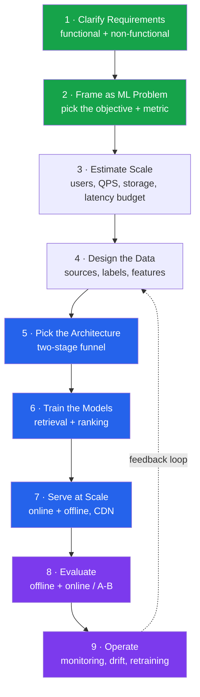

> **Checklist instinct:** never skip a box. Interviewers (and real launches) fail designs that have a brilliant model but no data plan, or great accuracy but a 5-second latency. <cite index="14-1">The candidates who fail ML system design interviews can explain attention mechanisms but cannot answer "how do you serve this at 10,000 predictions per second with p99 latency under 50ms?"</cite>
{: .prompt-warning }

---

## 1. Clarify the Requirements

🟢 **Plain-English.** Before designing anything, agree on *what the system must do* (functional) and *how well it must do it* (non-functional). It's like agreeing on the destination and the speed limit before driving.

🔵 **Engineering / 🟣 Strategic.**

**Functional requirements** (from the problem statement):

| # | Requirement | Primary owner |
|---|-------------|---------------|
| F1 | The **content team** uploads new videos (movies, episodes). | Ingestion pipeline |
| F2 | **Users stream and interact** (like, dislike, share). | Playback + interaction services |
| F3 | **Users get personalized recommendations**. | ML recommendation system |
| F4 | Users **search** the catalog (title, actor, genre). | Search service |

**Non-functional requirements (NFRs):**

| # | NFR | Concrete target (state assumptions aloud) |
|---|-----|-------------------------------------------|
| N1 | **High availability, minimal latency** | 99.99% availability; video startup < ~2s; recommendation render < ~200ms |
| N2 | **Scalability & efficiency** | Stream to *millions* concurrently without failure |
| N3 | **Global, multi-device** | Web, iOS, Android, TV across regions |
| N4 | **Durability** | Never lose uploaded master content |

> **Pro move:** turn vague NFRs into *numbers* and say them out loud as assumptions. "Minimal latency" is not designable; "p99 < 200ms for the recommendation row" is.
{: .prompt-tip }

**Scope-narrowing questions to ask (and answer yourself):**
- Read-heavy or write-heavy? → **Massively read-heavy** (millions watch; a small content team uploads).
- Do we build the *streaming infra* and the *recommender*? → Yes, both, at high level.
- Real-time personalization or daily-batch? → **Both** (batch candidates + real-time signals).

---

## 2. Frame It as a Machine Learning Problem

🟢 **Plain-English.** A recommender's job is to guess *what you'll enjoy watching*. We turn "enjoy" into a number the computer can optimize — usually the **probability you'll watch a title for a meaningful length of time**, not just click it.

🔵 **Engineering.** This is a **ranking problem**: given a user and candidate videos, predict and sort by `P(meaningful engagement)`. <cite index="15-1">For a video recommendation system, the goal is to maximize long-term user watch time, not just immediate clicks; the ML task is ranking — given a user and candidate videos, predict and sort by the probability the user watches each for a meaningful duration.</cite>

🟣 **Strategic.** Choosing the **objective metric** is the most important decision in the whole design — it silently shapes everything downstream.

| Optimize for… | Risk |
|---------------|------|
| Clicks (CTR) | Clickbait thumbnails, regret |
| Watch-time | Long boring binges, autoplay traps |
| **Long-term retention / satisfaction** | Hard to measure, but what the business actually wants |

> <cite index="16-1">Always start by clarifying the goal metric — engagement, revenue, or fairness — before drawing the pipeline.</cite> A practical compromise is **multi-objective**: predict several signals (watch, completion, like, return-next-week) and combine them.
{: .prompt-info }

---

## 3. Estimate the Scale (Back-of-Envelope)

🟢 **Plain-English.** We do quick "napkin math" to know whether we're building a bicycle or a rocket. The numbers decide the technology.

🔵 **Engineering.** Sample assumptions for a Netflix-scale system (state them, then compute):

- ~**260M+ subscribers**; assume ~100M daily active. <cite index="9-1">Netflix streams content to over 260 million subscribers globally.</cite>
- Each home-screen load needs personalized rows → **millions of recommendation QPS** at peak.
- Catalog: ~100K+ titles, but the **candidate space is millions** of (title × context) combinations.
- A single title is encoded into **~1,200 files**. <cite index="22-1">Netflix encodes each title into approximately 120+ streams across 10+ resolutions (240p to 4K) × multiple bitrates × audio tracks × subtitle tracks, then segments each into 2–10s chunks.</cite>

**The key consequence — why we can't score everything.** Running a heavy model over millions of items for every user, every request, is computationally impossible. <cite index="14-1">Multi-stage architectures exist because evaluating every content object for every user becomes computationally impossible.</cite> This single fact forces the **two-stage funnel** in Step 5.

> **Latency budget is a hard constraint, not a wish.** <cite index="15-1">The final ranking stage typically runs within a latency budget of roughly 100 milliseconds.</cite> Every design choice spends from this budget.
{: .prompt-warning }

---

## 4. Design the Data — The Real Engine

🟢 **Plain-English.** Models are only as good as the examples they learn from. We need to collect *what users did* and turn it into *labelled lessons*.

🔵 **Engineering.**

**(a) Data sources**
- **Interaction / event data:** plays, pauses, completions, likes, dislikes, shares, search queries, scroll/skip. Streamed in real time.
- **Content metadata:** genre, cast, language, runtime, release year, artwork, and learned **content embeddings** (from video frames, text, audio).
- **Context:** device, time of day, region, session history.

<cite index="10-1">Massive data is ingested in real time from user interactions and content metadata; stored in distributed systems like Cassandra and S3; Kafka handles real-time streaming while Spark and Flink handle batch and stream processing.</cite>

**(b) Labels — the subtle part**
- **Implicit positives:** a completed watch, a like, a re-watch.
- **Implicit negatives:** <cite index="13-1">impressions shown but not acted on are treated as negatives, while clicks, watch-time, and completions are positives.</cite>
- Beware the **feedback loop**: you only get labels for items you *showed*. Items never recommended never get a chance — handle with exploration (below).

**(c) Feature engineering**

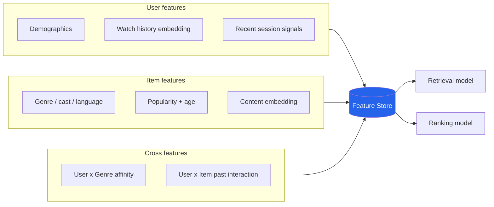

<cite index="14-1">Features include user features (demographics, engagement history), item features (category, popularity, age), and cross features (user-item interaction history).</cite>

🟣 **Strategic.** A **Feature Store** keeps offline-training features and online-serving features consistent — this "train/serve skew" is one of the most common silent killers of ML systems.

---

## 5. Pick the Architecture — The Two-Stage Funnel

This is the heart of the design and the single most reused pattern in industry.

🟢 **Plain-English.** Imagine a talent show with a million applicants. You can't interview all of them. So first a **fast, rough filter** picks the few hundred most promising (you'd rather over-include than miss a star). Then a **slow, careful judge** ranks just those few hundred precisely. Cheap-and-broad first, expensive-and-precise second.

🔵 **Engineering.** <cite index="11-1">The multi-stage funnel — candidate generation through two-tower retrieval, progressive ranking, and re-ranking with business guardrails — is the framework used by Netflix, YouTube, and Amazon serving billions of recommendations daily.</cite>

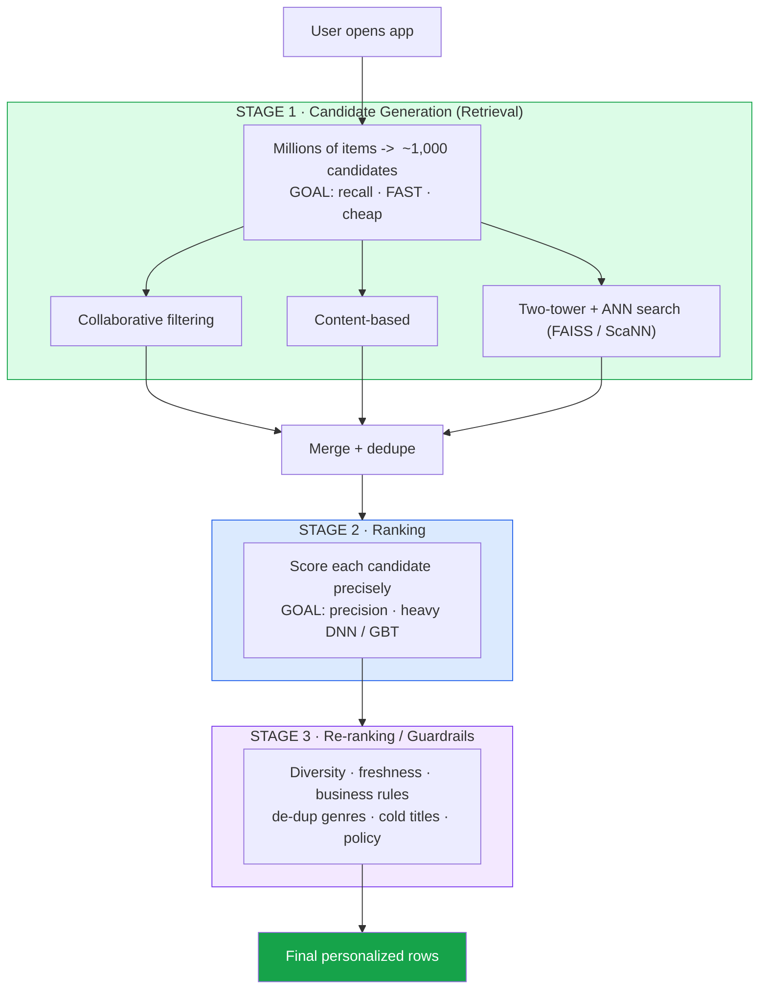

### 5.1 Stage 1 — Candidate Generation (Retrieval)

<cite index="11-1">The first stage retrieves a broad set from the entire catalog — thousands of candidates from millions — must be extremely fast, and prioritizes recall over precision.</cite> Multiple strategies run in parallel, each retrieving a few hundred, then merged. <cite index="14-1">Each strategy retrieves 200–300 candidates; merge and dedupe to get 500–1,000.</cite>

The dominant technique is the **two-tower neural network**: <cite index="11-1">one tower encodes user features into a dense embedding vector, the other encodes item features into the same embedding space; during offline processing, item embeddings are precomputed and indexed.</cite> At request time you embed the user and do an **Approximate Nearest Neighbor (ANN)** lookup — finding the closest item vectors fast without comparing against every item.

### 5.2 Stage 2 — Ranking

<cite index="14-1">Score each candidate with a heavier ranking model — a deep neural network or gradient-boosted tree — using user, item, and cross features.</cite> Because it runs on only ~1,000 items, it can afford to be expensive and precise.

A modern refinement is **Multi-Task Learning (MTL)** — one shared model predicting several signals (watch, like, completion) at once. Netflix's "Hydra": <cite index="3-1">consolidating diverse ranking signals and models into a single shared model that performs multiple tasks — ranking different rows, videos, and games.</cite> <cite index="7-1">Generating recommendations for multiple use cases from one multi-task model improves performance and simplifies the architecture, improving maintainability.</cite>

### 5.3 Stage 3 — Re-ranking & Guardrails

🟣 **Strategic.** The model's "best" list is not always the *business's* best list. <cite index="16-1">Re-ranking applies filters for diversity, freshness, or ads.</cite> Examples: don't show five thrillers in a row, surface new releases, respect content licensing per region, inject some exploration.

> **Netflix-specific touches worth naming:** each home-page row (`Because you watched X`, `Trending Now`) is its own algorithm, and even the **artwork/thumbnail is personalized** — a romance fan and an action fan see different images for the same title. <cite index="22-1">Each home-page row is generated by a different algorithm, and Netflix selects which thumbnail to show based on user preferences.</cite>
{: .prompt-info }

---

## 6. Train the Models — Offline vs Online

🟢 **Plain-English.** Some learning happens slowly overnight on huge data ("batch"); some adjusts within your live session ("online"). Netflix does both.

🔵 **Engineering.** <cite index="22-1">The recommendation pipeline runs offline (batch processing with Spark) to generate candidate sets and online (real-time model serving) for live personalization.</cite> <cite index="10-1">Models train on distributed frameworks like TensorFlow and PyTorch on GPU clusters, deploy in containers (Docker, Kubernetes), and continuously learn from new data.</cite>

- **Cold start** (new user / new title): fall back to popularity, content-based similarity, and onboarding signals until enough interaction data accrues. *Always state your cold-start and fallback plan.*
- **Exploration vs exploitation:** use **contextual bandits** to occasionally show uncertain items and learn from the result. <cite index="5-1">A contextual bandit optimizes decision-making by balancing exploration and exploitation using user-specific or situational features.</cite>
- **Frontier (2025–26):** **Large Foundation Models (LFMs)** are being folded in — <cite index="3-1">Netflix detailed how Large Foundation Models can enhance recommenders by ingesting world knowledge.</cite>

---

## 7. Serve at Scale — Where ML Meets the Streaming Backbone

This step joins the **recommender** to the **video delivery** machinery. A novice often forgets: recommending the title is useless if the video won't play instantly.

### 7.1 The Streaming Backbone (the non-ML half)

🟢 **Plain-English.** When you press play, the video doesn't travel from one faraway server. A copy already sits in a box inside *your* internet provider, so it arrives instantly and adjusts quality to your connection.

🔵 **Engineering.**

- **CDN — Open Connect:** <cite index="22-1">Netflix operates its own CDN, Open Connect; Open Connect Appliances (OCAs) are custom servers placed directly inside ISP networks, each with 100+ TB of storage pre-loaded with popular content.</cite> Popular content is pushed to the edge during off-peak hours.
- **Encoding pipeline:** ingest the master → **per-title / per-shot analysis** → encode many renditions → segment → package (HLS/DASH) → distribute. <cite index="25-1">Per-title encoding analyzes each shot's complexity to allocate bitrate efficiently, producing ~1,200 versions across resolutions, codecs (H.264, H.265, VP9, AV1) and audio formats, then DRM-packaged and pushed to OCAs worldwide.</cite> Note this stage is *itself* ML-assisted via **VMAF** quality scoring.
- **Adaptive Bitrate (ABR):** <cite index="22-1">ABR dynamically adjusts video quality based on the viewer's network conditions, downloading small 2–10s segments and switching quality smoothly to avoid interruptions.</cite>
- **Microservices + resilience:** <cite index="21-1">Netflix uses circuit breakers, fallbacks, bulkheads, and timeouts, and pioneered chaos engineering with Chaos Monkey, which randomly disables instances to ensure recovery from failures.</cite>

### 7.2 End-to-End Sequence — "User Opens the App and Presses Play"

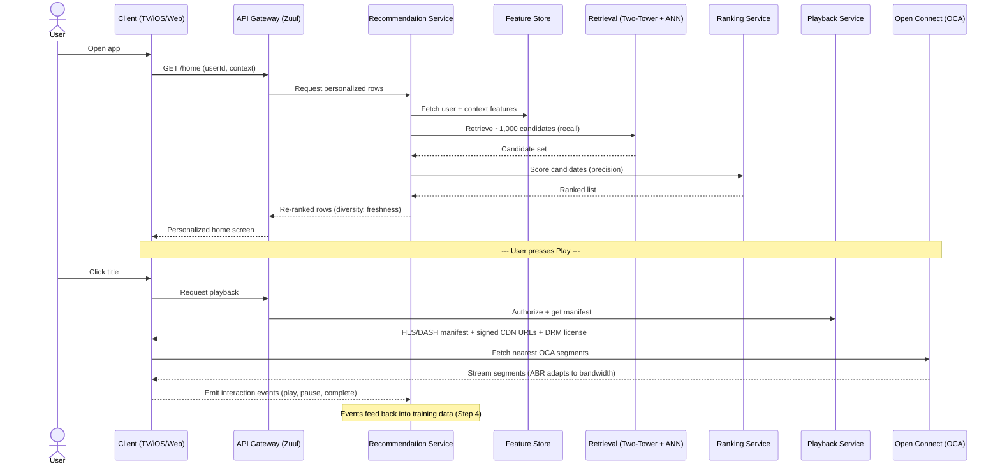

> <cite index="29-1">On playback the system returns an HLS/DASH manifest with signed, tokenized CDN URLs and a parallel DRM license request, picks the nearest healthy Open Connect node by latency and load, targets startup under ~2s, and continuously upshifts/downshifts bitrate without oscillation.</cite>
{: .prompt-info }

---

## 8. Evaluate — Prove It Works (Twice)

🟢 **Plain-English.** We check the model two ways: on past data in the lab, and on real users in a controlled live test. Lab-good can still be live-bad.

🔵 **Engineering.**

**Offline metrics** (before launch): Precision@K, Recall@K, NDCG (rank quality), AUC. Use the right one — <cite index="13-1">under heavy class imbalance, use PR-AUC rather than ROC-AUC.</cite>

**Online evaluation** (the real verdict): **A/B testing**. <cite index="13-1">Cover online evaluation, guardrail metrics, and failure modes.</cite> Watch **guardrail metrics** (latency, error rate, complaint rate) alongside the primary metric so a "win" doesn't secretly harm the experience.

🟣 **Strategic.** Tie every experiment back to the **Step 2 objective** (long-term retention), not just the easy proxy (clicks). The gap between proxy and true goal is where products quietly degrade.

---

## 9. Operate — Monitoring, Drift, Retraining

🟢 **Plain-English.** Tastes change, new shows arrive — a model left alone slowly goes stale. We watch it and refresh it.

🔵 **Engineering.** <cite index="13-1">Cover drift detection, guardrail metrics, retraining cadence, and failure modes.</cite> <cite index="13-1">Concept drift is constant; retrain frequently.</cite> <cite index="10-1">Online learning and incremental training keep models updated.</cite>

This is **MLOps**: versioned data + models, automated pipelines, canary deploys, rollback, and observability. <cite index="26-1">Netflix uses Atlas for dimensional time-series telemetry with streaming alerting, and Kayenta for automated canary analysis in the deployment workflow.</cite>

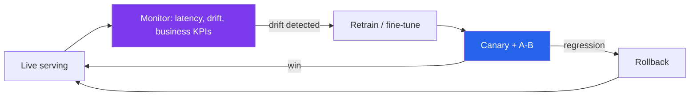

---

## 10. Trade-offs to Say Out Loud

Strong designers narrate tensions rather than pretending there's one right answer.

| Tension | Lever A | Lever B | Typical resolution |
|---------|---------|---------|--------------------|
| Accuracy vs latency | Heavier ranking model | Tighter latency budget | Two-stage funnel splits the difference |
| Recall vs precision | Stage 1 (recall) | Stage 2 (precision) | Each stage owns one goal |
| Freshness vs stability | Online learning | Nightly batch | Hybrid batch + real-time |
| Personalization vs diversity | Pure model score | Re-rank guardrails | Stage 3 enforces diversity |
| Build vs buy (CDN) | Own CDN (Open Connect) | Third-party CDN | Own at extreme scale; buy early on |
| Exploitation vs exploration | Serve best-known | Contextual bandits | Small exploration budget |

> <cite index="16-1">Talk trade-offs explicitly: accuracy vs compute cost; two-tower for retrieval, deep networks for ranking, multi-task learning for consolidation.</cite>
{: .prompt-tip }

---

## Topic / Dependency Tree (Index)

Read top-down: each node depends on the ones above it. This is the "what must I understand before what" map.

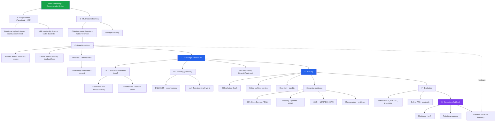

---

---

# Part II — Build: The Implementation Checklist

> **From thinking to shipping.** Part I explained *why* the system looks the way it does. Part II turns it into an ordered build plan. The phases map onto the nine steps above — Phase 1 implements Step 4 (data), Phases 2–4 implement Step 5 (the funnel), Phase 6 implements Step 7's streaming backbone, and so on — but now each item is a checkbox with a reason and each phase has a **✅ Definition-of-Done** gate. Work top-to-bottom: the phases are in dependency order.
{: .prompt-tip }

> **How to use it.** Work top-to-bottom: the phases are in dependency order — you cannot rank candidates you haven't retrieved, and you can't retrieve from a feature store you haven't built. Each phase ends with a **✅ Definition of Done (DoD)** gate. Don't advance until the gate is green. 🟢 = anyone can grasp it; 🔵 = engineering depth; 🟣 = architecture/business judgement.
{: .prompt-info }

---

## The Build Order at a Glance

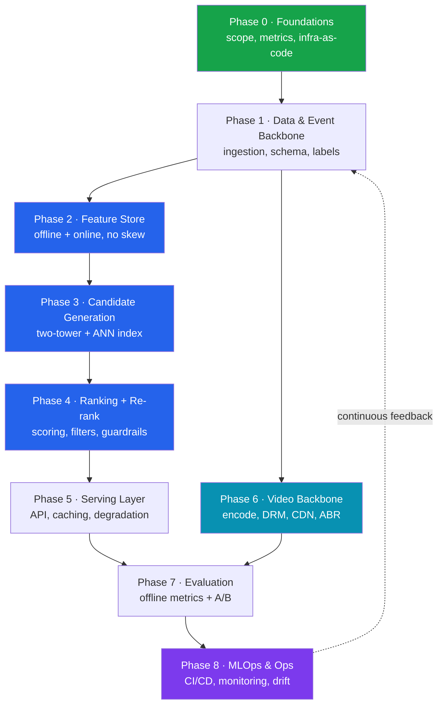

> **Reasoning for this order.** Phases 1–5 are the *recommendation spine* and must be serial (each depends on the last). Phase 6 (video delivery) runs in **parallel** off the same event backbone — a separate team can build it while the ML spine matures. Everything converges at evaluation (Phase 7), then operations (Phase 8) closes the loop back to data.
{: .prompt-warning }

---

## Phase 0 · Foundations — Decide Before You Code

🟢 The goal here is to make the invisible decisions *explicit* so nobody silently assumes a different system than their teammate.

- [ ] **Write down the single objective metric.** *Why:* every later trade-off resolves by appealing to it; "long-term watch / retention," not raw clicks, prevents clickbait optimization.
- [ ] **Convert NFRs into hard numbers.** *Why:* "minimal latency" is undesignable. Pin targets: recommendation **p99 < 200ms**, video **startup < ~2s**, availability **99.99%**. Latency budgets are constraints you spend, not wishes.
- [ ] **Set per-stage latency sub-budgets.** *Why:* the total budget must be partitioned so no stage can blow it: retrieval < 10ms, ranking < 20ms, business rules < 5ms is a common split — tune to your numbers.
- [ ] **Choose cloud regions + multi-region strategy.** *Why:* global users need low latency *and* failover; deciding this late forces painful rewrites.
- [ ] **Stand up Infrastructure-as-Code (Terraform) + a Git monorepo/polyrepo policy.** *Why:* reproducible dev/staging/prod from one definition prevents "works on my cluster" drift.
- [ ] **Define data-privacy posture (GDPR/CCPA, India DPDP).** *Why:* IP addresses and watch history are PII; retrofitting consent and redaction is far costlier than designing it in.
- [ ] **Pick the experimentation platform early.** *Why:* if you can't A/B test, you can't prove anything works — this is infrastructure, not an afterthought.

> ✅ **DoD:** a one-page "design contract" exists — objective metric, numeric SLOs, latency budget split, region plan, privacy posture — signed off by eng + product.
{: .prompt-tip }

---

## Phase 1 · Data & Event Backbone — The Real Engine

🟢 Models learn from examples. This phase guarantees we *capture* good examples and can *trust* them.

### 1.1 Ingestion & streaming
- [ ] **Stream interaction events through Kafka (plays, pauses, completes, likes, dislikes, shares, searches, skips).** *Why:* these become both real-time signals and training labels; lose them and you're blind.
- [ ] **Define a versioned event schema (with a schema registry).** *Why:* an un-versioned schema silently corrupts downstream features when a field changes meaning.
- [ ] **Persist raw events to a data lake (S3 + Parquet/Delta) and a serving DB (Cassandra/Dynamo).** *Why:* the lake keeps full history for training; the operational store serves reads at scale. Different jobs, different stores.
- [ ] **Set up batch + stream processing (Spark for batch, Flink for streaming).** *Why:* daily aggregates need batch; "events in the last 5 minutes" need streaming. You need both engines.

### 1.2 Labels — the subtle part
- [ ] **Define positive labels (completed watch, like, re-watch) and negative labels (impression shown, not acted on).** *Why:* implicit feedback *is* your label source; getting the negative definition wrong biases the whole model.
- [ ] **Log impressions, not just actions.** *Why:* you can only learn "what was rejected" if you recorded "what was shown." Missing impressions = no true negatives.
- [ ] **Plan for the feedback loop / exposure bias.** *Why:* you only get labels for items you recommended; without exploration, the model calcifies around what it already shows.

> ✅ **DoD:** an event flows end-to-end (client → Kafka → lake + serving store), is queryable, schema-validated, and you can reconstruct "user U was shown items X, acted on Y" for any timestamp.
{: .prompt-info }

---

## Phase 2 · Feature Store — One Source of Truth, Zero Skew

🟢 A feature is a number describing the user or item (e.g. "movies watched this month"). The feature store guarantees the *same* numbers in training and in live serving.

🔵 This is where most ML projects quietly fail. <cite index="32-1">Most ML projects fail not because of a bad model, but because of bad data in production; the feature store ensures the model in production gets the same quality features as during training.</cite>

### 2.1 The offline/online split
- [ ] **Build the offline store on the data lake (Delta/Parquet/BigQuery) with point-in-time-correct joins.** *Why:* training on January data must use January feature values, not today's — <cite index="32-1">point-in-time joins prevent the model from seeing the future, which would inflate offline metrics and lie to you.</cite>
- [ ] **Build the online store on a low-latency KV store (Redis/DynamoDB/Cassandra).** *Why:* serving needs feature lookups by user ID in milliseconds; <cite index="32-1">latency under 10ms is standard, and for real-time recommendations this is critical.</cite>
- [ ] **Materialize features from offline → online on a schedule (e.g. Spark→Redis).** *Why:* the online store keeps only the freshest slice for speed, synced from the historical store.

### 2.2 Guarding consistency
- [ ] **Verify train/serve parity for every feature.** *Why:* the classic bug — <cite index="36-1">a feature computed pre-tax in offline training but post-tax in online inference yields silently inaccurate predictions.</cite> Diff offline vs online values for the same entity at the same instant.
- [ ] **Classify features as batch / streaming / on-demand.** *Why:* "avg watch over 30 days" is batch; "items in this session" is streaming; "distance to nearest CDN" is on-demand. Each needs a different pipeline.
- [ ] **Treat feature definitions as code in Git, with unit tests + data-quality checks.** *Why:* a feature is a transformation; untested transformations rot.
- [ ] **Measure the real freshness gap (change a source value, time the served update).** *Why:* the vendor's marketing latency is not your latency; <cite index="39-1">measuring the actual freshness gap is what tells you whether the feature store will meet your SLA.</cite>
- [ ] **Cache item features aggressively (multi-level: in-process + Redis).** *Why:* item features have low cardinality and loose freshness needs; <cite index="36-1">a feature service can see 100–1000x the QPS of the recommender, so caching item features cuts cost and tail latency dramatically.</cite>

> ✅ **DoD:** the same feature returns identical values offline and online for a fixed entity + timestamp; online p99 lookup is within budget; feature definitions live in Git with tests.
{: .prompt-warning }

---

## Phase 3 · Candidate Generation — Retrieve Broadly, Cheaply

🟢 From millions of titles, instantly grab the ~1,000 most promising. Better to over-include than miss a gem (this stage chases *recall*).

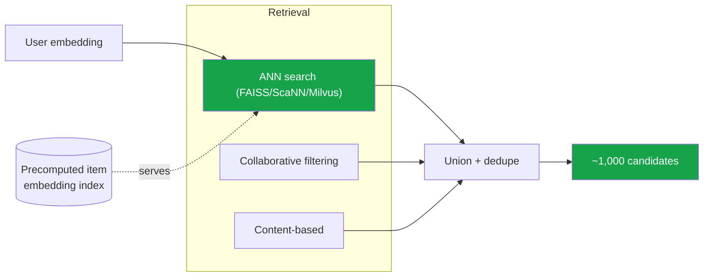

- [ ] **Train a two-tower model; precompute + index all item embeddings offline.** *Why:* item embeddings rarely change minute-to-minute, so computing them offline removes the cost from the request path — <cite index="33-1">running expensive deep two-tower or LLM-embedding models offline mitigates latency, and at serving time you just query the precomputed embeddings rapidly.</cite>
- [ ] **Stand up an ANN index (FAISS / ScaNN / Milvus / Redis vector).** *Why:* exact nearest-neighbor over millions of items is too slow; <cite index="35-1">ANN algorithms make candidate retrieval feasible at < 10ms.</cite>
- [ ] **Tune the recall/latency trade-off explicitly and benchmark on your data.** *Why:* ANN trades precision for speed — <cite index="30-1">e.g. ~90% precision at ~200ms median vs ~95% at ~1.3s on a billion vectors; you must benchmark with your own data and budget.</cite>
- [ ] **Run multiple retrieval strategies in parallel and union the results.** *Why:* <cite index="36-1">collaborative filtering gives high-quality candidates for known users but suffers cold-start; combining and unioning approaches covers each other's blind spots.</cite>
- [ ] **Pick the embedding dimension deliberately (512–1024 is a common sweet spot).** *Why:* <cite index="30-1">moderate dimensions deliver the best balance of storage, query speed, and quality.</cite>

> ✅ **DoD:** a user ID returns ~1,000 deduped candidates within the retrieval sub-budget; recall@K is measured against a held-out set; cold-start users get a sensible fallback set.
{: .prompt-info }

---

## Phase 4 · Filtering, Ranking & Re-ranking — Be Precise, Then Be Safe

🟢 Now score just those ~1,000 candidates carefully (chasing *precision*), remove anything ineligible, and arrange the final list to serve the *business*, not only the model.

🔵 A clean way to structure this is the four-stage pattern: **retrieval → filtering → scoring → ordering**. <cite index="38-1">NVIDIA Merlin and others use exactly this: retrieve a relevant set, filter unwanted items, score interest, then order to align with business constraints.</cite>

### 4.1 Filtering (guardrails first)
- [ ] **Apply hard filters: regional licensing, age/maturity, already-watched, removed titles.** *Why:* these are correctness/compliance rules a model should never be trusted to learn — <cite index="36-1">filters act as guardrails against bad user experience.</cite>
- [ ] **Add a "never empty results" safeguard.** *Why:* <cite index="36-1">a single misbehaving filter (or an upstream data outage behind one) can filter out *all* candidates and cause an outage; cap and monitor filter removal rates.</cite>
- [ ] **Split filters into offline (rarely change) vs online (frequently change).** *Why:* <cite index="33-1">static rules like geo-eligibility run offline; dynamic ones like moderation flags run online — matching cost to volatility.</cite>

### 4.2 Ranking
- [ ] **Serve a heavier ranking model (DNN / gradient-boosted tree) on the surviving candidates.** *Why:* because it only scores a few hundred items, it can afford to be expensive and precise — the funnel earned this budget.
- [ ] **Prefer multi-task learning (predict watch, completion, like together).** *Why:* <cite index="3-1">consolidating signals into one shared multi-task model improves performance and simplifies the architecture.</cite>
- [ ] **Deploy on a real inference server (Triton / TF-Serving / TorchServe), not a hand-rolled loop.** *Why:* <cite index="35-1">purpose-built servers give batching, GPU sharing, and heterogeneous-model support out of the box.</cite>

### 4.3 Re-ranking / ordering
- [ ] **Inject diversity (don't show five thrillers in a row), freshness, and exploration.** *Why:* <cite index="35-1">diversification ensures variety; pure model-score ordering collapses into monotony and starves new content.</cite>
- [ ] **Personalize per-row and per-artwork.** *Why:* Netflix generates each home-row by a different algorithm and even personalizes thumbnails — same title, different image per taste — which lifts engagement well beyond list order alone.

> ✅ **DoD:** end-to-end retrieval→filter→rank→order returns an ordered, policy-compliant list within total budget; a chaos test (kill the feature service) degrades gracefully instead of returning empty.
{: .prompt-warning }

---

## Phase 5 · Serving Layer — Fast, Cached, Unbreakable

🟢 The plumbing that takes a request and returns rows quickly — and *never* shows a blank screen.

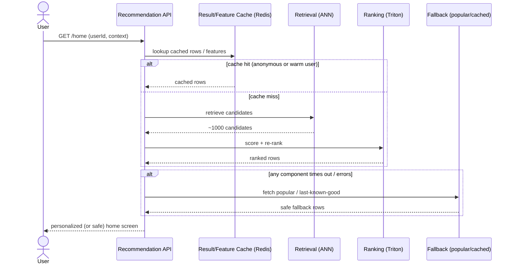

- [ ] **Expose a stateless recommendation API behind a load balancer; auto-scale on latency + CPU.** *Why:* stateless pods scale horizontally for traffic spikes (think a major launch) without sticky-session pain.
- [ ] **Cache at multiple levels: result cache for anonymous/cold sessions, feature cache for hot items.** *Why:* <cite index="35-1">caching recommendation results for anonymous users and popular embeddings, with TTLs tied to update frequency, slashes load.</cite>
- [ ] **Implement graceful degradation with explicit fallbacks.** *Why:* <cite index="35-1">when real-time systems fail, fall back to cached recommendations, popular items, or rules — never show empty results.</cite>
- [ ] **Add circuit breakers, timeouts, and bulkheads between services.** *Why:* these isolate a failing dependency so one slow service can't exhaust resources and cascade into a full outage.
- [ ] **Build observability in from day one (metrics, logs, traces).** *Why:* <cite index="35-1">you can't improve what you can't measure — observability is foundational, not a later add-on.</cite>

> ✅ **DoD:** p99 within budget under load test; killing any single downstream still returns non-empty rows; dashboards show latency, error rate, cache hit ratio live.
{: .prompt-info }

---

## Phase 6 · Video Backbone — Encode, Protect, Deliver (Parallel Track)

🟢 Recommending a title is useless if it won't play instantly. This track (built in parallel by a separate team) ingests masters, encodes many versions, protects them, and serves from servers near the user.

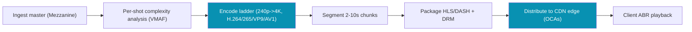

- [ ] **Build the ingest → per-title/per-shot analysis → encode → segment → package pipeline.** *Why:* one master becomes ~1,200 renditions; per-title analysis allocates bitrate by content complexity (animation needs less than action) for the same visual quality.
- [ ] **Use VMAF as the quality gate in encoding.** *Why:* it's an objective, ML-based quality score that lets you set quality targets rather than guessing bitrates.
- [ ] **Package to HLS/DASH and wrap with DRM (Widevine/FairPlay/PlayReady).** *Why:* adaptive protocols enable quality switching; DRM is contractually required by studios.
- [ ] **Stand up CDN edge delivery (own OCAs or a commercial CDN to start).** *Why:* caching popular content inside ISP networks minimizes transit, latency, and rebuffering. *Build-vs-buy:* buy a CDN early; build your own only at extreme scale.
- [ ] **Implement Adaptive Bitrate (ABR) on the client.** *Why:* it measures bandwidth + buffer and up/down-shifts quality smoothly to avoid stalls when the network dips.
- [ ] **Serve tokenized, signed CDN URLs + select nearest healthy edge with fallback.** *Why:* signed URLs prevent hotlinking; nearest-healthy-node selection with origin-shield fallback keeps playback resilient.
- [ ] **Rotate TLS certs and DRM keys without interrupting playback.** *Why:* <cite index="45-1">certs, DRM keys, and tokens must rotate via automated vault-backed workflows so a key roll never breaks a live stream.</cite>
- [ ] **Monitor QoE metrics: rebuffer ratio, startup time, CDN hit/miss, edge 4xx/5xx.** *Why:* <cite index="45-1">target hit ratio > 85% for VOD and edge error rate < 0.2%; if QoE regresses during a rollout, auto-rollback.</cite>

> ✅ **DoD:** a new title ingests, encodes, packages with DRM, and plays on web/iOS/Android/TV with startup < 2s and smooth ABR switching; QoE dashboards are live.
{: .prompt-info }

---

## Phase 7 · Evaluation — Prove It Twice

🟢 Check the model in the lab on past data, *then* on real users in a controlled live test. Lab-good can still be live-bad.

- [ ] **Compute offline ranking metrics: Recall@K, Precision@K, NDCG, AUC.** *Why:* they're cheap and catch gross regressions before users ever see them.
- [ ] **Use PR-AUC, not ROC-AUC, under heavy class imbalance.** *Why:* with rare positives (most items aren't watched), ROC-AUC looks deceptively good; PR-AUC tells the truth.
- [ ] **Run online A/B tests as the real verdict, with guardrail metrics alongside the primary.** *Why:* <cite index="47-1">production deployment of a new model goes through A/B testing before serving all traffic; guardrails (latency, error rate, complaints) ensure a "win" isn't secretly harming experience.</cite>
- [ ] **Tie every experiment back to the Phase-0 objective, not the easy proxy.** *Why:* optimizing clicks while claiming to optimize retention is how products quietly degrade.
- [ ] **Consider shadow deployment for risky models.** *Why:* <cite index="41-1">shadow deployments run the new model on real production requests without affecting responses — free real-world validation at zero user risk.</cite>

> ✅ **DoD:** offline gate thresholds defined and met; at least one A/B test shows a statistically significant lift on the true objective with no guardrail regression.
{: .prompt-warning }

---

## Phase 8 · MLOps & Operations — Close the Loop

🟢 Tastes change and new shows arrive; a model left alone goes stale. This phase keeps it fresh, safe to update, and watched.

🔵 <cite index="42-1">Traditional CI/CD only verifies deterministic code — models behave differently each retrain — so pipelines must add automated quality guardrails that reject candidates failing accuracy, bias, or drift checks.</cite>

### 8.1 CI/CD for ML
- [ ] **Pipeline: lint → validate data schema → retrain → eval-gate → register artifact.** *Why:* <cite index="42-1">the winning artifact lands in a registry only after passing evaluation, replacing manual packaging and cutting release cycles from weeks to hours.</cite>
- [ ] **Add data-validation gates before expensive retraining.** *Why:* <cite index="41-1">validation gates prevent corrupted datasets from triggering costly retraining runs.</cite>
- [ ] **Version everything: data, features, models, configs.** *Why:* reproducibility and lineage are what let you debug "why did quality drop on Tuesday."

### 8.2 Safe rollout
- [ ] **Roll out via canary (1% → 10% → 100%) with automatic SLO checks and auto-rollback.** *Why:* <cite index="41-1">canary serves a small slice first, auto-rolls-back on degraded metrics; Amazon's canaries prevented dozens of customer-impacting model failures.</cite>
- [ ] **Keep blue-green capability for instant reverts.** *Why:* <cite index="41-1">blue-green flips traffic atomically and reverts by just switching the load balancer back — near-zero-downtime rollback.</cite>

### 8.3 Monitoring & retraining
- [ ] **Monitor data drift (input distribution shift) and concept drift (prediction quality decay).** *Why:* <cite index="42-1">a model flawless offline can drift silently once exposed to real traffic, and CPU/memory dashboards won't catch it — you must watch feature distributions.</cite>
- [ ] **Trigger retraining on drift or on a schedule.** *Why:* <cite index="42-1">trigger retraining when new data lands so the model tracks the changing environment.</cite>
- [ ] **Monitor filter behavior over time, not just models.** *Why:* <cite index="36-1">filters drift with data too and need re-tuning; an unmonitored filter can quietly start removing too much.</cite>
- [ ] **Wire telemetry + automated canary analysis (e.g. Atlas-style metrics + Kayenta-style analysis).** *Why:* automated canary analysis removes the human bottleneck of staring at dashboards to decide promotion.

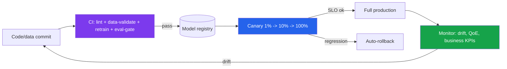

> ✅ **DoD:** a model change flows commit → eval-gate → canary → prod automatically; a deliberately bad model is auto-rejected or auto-rolled-back; drift alerts fire on injected distribution shifts.
{: .prompt-tip }

---

## Cross-Cutting Checklist (Applies to Every Phase)

These don't belong to one phase — neglecting them anywhere causes failures everywhere.

| Concern | Item | Why it matters |
|---------|------|----------------|
| **Security** | Authn/authz on every service; signed CDN URLs; secret rotation | A streaming platform is a high-value target; one leaked DRM key or open endpoint is catastrophic |
| **Privacy** | Consent capture, PII redaction in logs, regional data residency | IP + watch history are PII under GDPR/CCPA/DPDP; redaction must be in the pipeline, not bolted on |
| **Cost** | Track GPU-hours, CDN egress, vector-index RAM | Egress is often the #1 cost line for streaming; idle GPU clusters drain budgets fast |
| **Reliability** | Multi-region failover, chaos testing | Chaos engineering (randomly killing instances) proves recovery before a real outage tests it for you |
| **Documentation** | Feature ownership, runbooks, decision log | "What does this feature mean and who owns it" prevents silent technical debt |
| **Accessibility** | Captions, audio descriptions, WCAG-compliant UI | Both a legal requirement and a large audience; bake into the encode pipeline and client |

---

---

## TL;DR — The Whole Guide on One Page

**Part I — the thinking (9 steps):**
1. **Clarify** functional + non-functional requirements; turn vague NFRs into numbers.
2. **Frame** as a ranking problem; optimize *long-term* watch/retention, not raw clicks.
3. **Estimate scale** — the "can't-score-everything" math forces the funnel.
4. **Design data** — sources, implicit labels, features, a feature store; mind the feedback loop.
5. **Two-stage funnel** — Candidate Generation (recall, two-tower + ANN) → Ranking (precision, DNN/GBT/multi-task) → Re-rank (diversity + business rules).
6. **Train** offline + online; plan cold-start fallbacks and exploration.
7. **Serve** the recommender *and* the video — CDN, per-title encoding, ABR, microservices, resilience.
8. **Evaluate** offline metrics then A/B test online with guardrails.
9. **Operate** — monitor, detect drift, retrain, canary, rollback.

**Part II — the building (9 phases, dependency-ordered):**
- **P0 Foundations** → signed design contract: objective metric + numeric SLOs + latency budget + privacy posture.
- **P1 Data backbone** → Kafka → lake + serving store; implicit labels; *log impressions*; plan the feedback loop.
- **P2 Feature store** → offline (point-in-time) + online (<10ms); **prove zero train/serve skew**; cache item features.
- **P3 Candidate generation** → two-tower + offline-indexed embeddings + ANN; union strategies; chase recall.
- **P4 Filter→Rank→Re-rank** → guardrails (never-empty) → multi-task DNN/GBT on a real inference server → diversity/freshness/per-artwork.
- **P5 Serving** → stateless cached API + graceful degradation + circuit breakers + observability.
- **P6 Video backbone (parallel)** → per-title encode + VMAF + HLS/DASH + DRM + CDN + ABR + QoE.
- **P7 Evaluation** → offline (NDCG, PR-AUC) → online A/B with guardrails → tie to the true objective.
- **P8 MLOps** → eval-gated CI/CD → canary + blue-green + auto-rollback → drift monitoring → retraining loop.
- **Cross-cutting** → security, privacy, cost, reliability, docs, accessibility — everywhere, always.

> **The two sentences to keep:**
> *(Design)* You can't run a heavy model over millions of items per request — so retrieve broadly and cheaply, rank narrowly and precisely, then re-rank for the business.
> *(Build)* Build in dependency order, prove zero train/serve skew before anything else, never return an empty screen, and let no model reach 100% of traffic without an eval gate and a one-click rollback.
{: .prompt-tip }

---

## References

1. System Design Handbook — [Recommendation System Design (Step-by-Step)](https://www.systemdesignhandbook.com/guides/recommendation-system-design/){:target="_blank"}
2. Interview Kickstart — [ML System Design Interview Guide (2026)](https://interviewkickstart.com/blogs/articles/machine-learning-system-design-interview-guide){:target="_blank"}
3. Design Gurus — [AI/ML System Design Interview Roadmap (2026)](https://www.designgurus.io/blog/prepare-for-ai-ml-system-design-interview-2026){:target="_blank"}
4. Shaped.ai — [Netflix Personalization, Recommendations & Search Workshop 2025](https://www.shaped.ai/blog/key-insights-from-the-netflix-personalization-search-recommendation-workshop-2025){:target="_blank"}
5. Netflix Tech Blog — [Lessons from Consolidating ML Models](https://netflixtechblog.medium.com/lessons-learnt-from-consolidating-ml-models-in-a-large-scale-recommendation-system-870c5ea5eb4a){:target="_blank"}
6. techinterview.org — [System Design: Video Streaming (Netflix)](https://www.techinterview.org/post/3233474186/system-design-video-streaming-netflix-adaptive-bitrate-hls-dash-transcoding-cdn-recommendation-engine-microservices/){:target="_blank"}
7. SWE Helper — [Design Netflix: A Video Streaming Architecture](https://swehelper.com/blog/design-netflix/){:target="_blank"}
8. Talent500 — [Netflix Architecture Deep Dive](https://talent500.com/blog/netflix-streaming-architecture-explained/){:target="_blank"}
9. VdoCipher — [Netflix Tech Stack: Open Connect & Microservices](https://www.vdocipher.com/blog/netflix-tech-stack-and-architecture/){:target="_blank"}
10. GeeksforGeeks — [System Design Netflix](https://www.geeksforgeeks.org/system-design/system-design-netflix-a-complete-architecture/){:target="_blank"}
11. > *Figures (subscriber counts, encoding variants, latency targets) are industry-reported and approximate — treat them as order-of-magnitude design inputs, not exact specs.*
12. {: .prompt-warning }
13. Redis — [Real-Time AI Recommendation Systems (2026)](https://redis.io/blog/real-time-ai-recommendation-systems/){:target="_blank"}
14. Databricks — [What is a Feature Store?](https://www.databricks.com/blog/what-feature-store-complete-guide-ml-feature-engineering){:target="_blank"}
15. Databricks — [How to Build an Online Recommendation System](https://www.databricks.com/blog/guide-to-building-online-recommendation-system){:target="_blank"}
16. CORE Systems — [Feature Store: Key Infrastructure for ML in Production (2026)](https://core.cz/en/blog/2026/feature-store-ml-infrastructure-2026/){:target="_blank"}
17. Tacnode — [How to Evaluate a Feature Store (2026)](https://tacnode.io/post/how-to-evaluate-a-feature-store){:target="_blank"}
18. The ML Architect — [Recommendation Systems: An Architect's Playbook](https://themlarchitect.com/blog/recommendation-systems-an-architects-playbook-part-1/){:target="_blank"}
19. NVIDIA — [Offline-to-Online Feature Storage with Merlin](https://developer.nvidia.com/blog/offline-to-online-feature-storage-for-real-time-recommendation-systems-with-nvidia-merlin/){:target="_blank"}
20. Appit Software — [Building Real-Time Recommendation Engines](https://www.appitsoftware.com/blog/building-real-time-recommendation-engines-retail-ai-architecture){:target="_blank"}
21. Introl — [MLOps Infrastructure: CI/CD Pipelines](https://introl.com/blog/mlops-infrastructure-cicd-pipelines-model-training-deployment){:target="_blank"}
22. Galileo — [The MLOps Guide to Production Success](https://galileo.ai/blog/mlops-operationalizing-machine-learning){:target="_blank"}
23. Google Cloud — [MLOps: Continuous Delivery & Automation Pipelines](https://docs.cloud.google.com/architecture/mlops-continuous-delivery-and-automation-pipelines-in-machine-learning){:target="_blank"}
24. BlazingCDN — [CDN Integration with CI/CD for Media Apps](https://blog.blazingcdn.com/en-us/cdn-integration-ci-cd-pipelines-media-apps){:target="_blank"}
25. > *Latency numbers, hit-ratio targets, and dimension ranges are industry-reported guidance — benchmark against your own data and SLAs before committing.*

> *Figures (subscriber counts, encoding variants, latency targets, hit-ratio and dimension ranges) are industry-reported and approximate — treat them as order-of-magnitude design inputs and benchmark against your own data and SLAs.*
{: .prompt-warning }
