> **TL;DR:** Don't install PostgreSQL extensions merely because they are popular. Start with a small, production-ready baseline, then add extensions only when a real requirement justifies them.
> {: .prompt-tip }

## What Is a PostgreSQL Extension?

PostgreSQL is already a powerful database. An **extension** adds capabilities that are not necessarily enabled as part of the core installation.

Extensions can add features for:

* 📊 Performance monitoring
* 🔐 Cryptography and security
* 🔎 Fuzzy and advanced search
* 🤖 AI and vector search
* 📝 Database auditing
* ⏰ Job scheduling
* 🔗 Cross-database access
* 🗺️ Geospatial data
* 🕒 Time-series workloads
* 🧪 Database testing

The basic pattern is simple:

```sql
CREATE EXTENSION extension_name;
```

For example:

```sql
CREATE EXTENSION pg_trgm;
```

However, there is an important distinction:

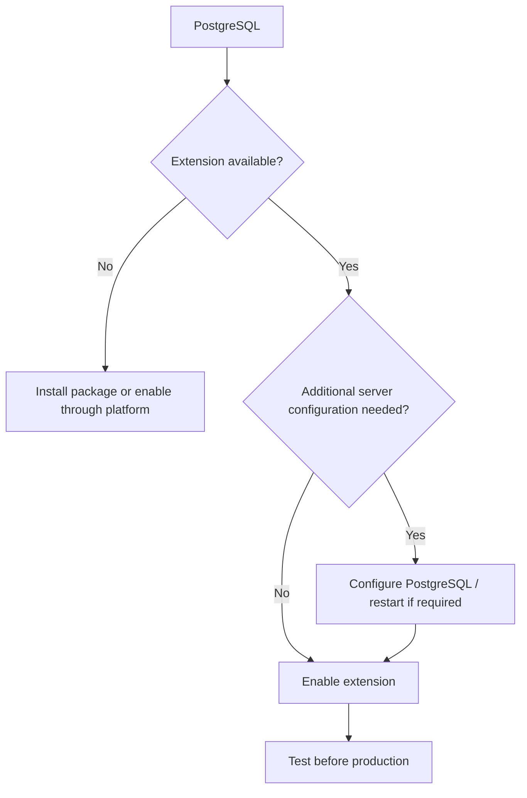

> **Important:** `CREATE EXTENSION` does not guarantee that an extension is available, supported by your cloud provider, or ready for production without additional configuration.
> {: .prompt-warning }

---

## The Golden Rule

Before installing any extension, ask:

> **What specific problem am I trying to solve?**

A good decision process looks like this:

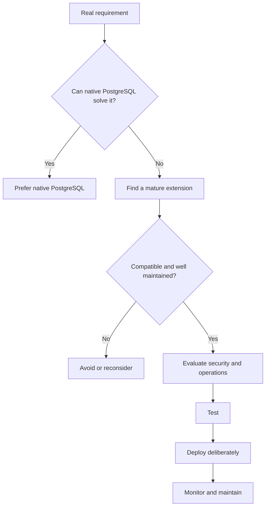

**Popularity is evidence. It is not architecture.**

---

# Top Extensions at a Glance

The following ranking emphasizes both **real-world popularity** and **practical applicability to IDRM**.

⭐ indicates particularly strong applicability to IDRM.

|   Rank | Extension                 | Primary Capability               |  IDRM |
| -----: | ------------------------- | -------------------------------- | :---: |
|  **1** | `pg_stat_statements`      | Query performance monitoring     | ⭐⭐⭐⭐⭐ |
|  **2** | `pgcrypto`                | Cryptography and secure values   | ⭐⭐⭐⭐⭐ |
|  **3** | `pg_trgm`                 | Fuzzy text search                | ⭐⭐⭐⭐⭐ |
|  **4** | `pgvector`                | Vector and semantic search       | ⭐⭐⭐⭐⭐ |
|  **5** | `pgAudit`                 | Detailed database auditing       | ⭐⭐⭐⭐⭐ |
|  **6** | `citext`                  | Case-insensitive text            | ⭐⭐⭐⭐⭐ |
|  **7** | `postgres_fdw`            | Remote PostgreSQL access         | ⭐⭐⭐⭐⭐ |
|  **8** | `pg_cron`                 | Scheduled SQL jobs               | ⭐⭐⭐⭐⭐ |
|  **9** | Native UUID / `uuid-ossp` | UUID generation                  | ⭐⭐⭐⭐⭐ |
| **10** | `unaccent`                | Accent-insensitive search        |  ⭐⭐⭐⭐ |
| **11** | PostGIS                   | Geospatial data                  | ⭐⭐⭐⭐* |
| **12** | `pg_repack`               | Online maintenance / de-bloating |  ⭐⭐⭐⭐ |
| **13** | `pg_partman`              | Partition management             |  ⭐⭐⭐⭐ |
| **14** | TimescaleDB               | Time-series workloads            | ⭐⭐⭐⭐* |
| **15** | `pgtap`                   | Database testing                 |  ⭐⭐⭐⭐ |
| **16** | `hypopg`                  | Hypothetical indexes             |  ⭐⭐⭐⭐ |
| **17** | `pg_ivm`                  | Incremental materialized views   |  ⭐⭐⭐⭐ |
| **18** | `hll`                     | Approximate distinct counts      |  ⭐⭐⭐  |
| **19** | `hstore`                  | Lightweight key-value data       |  ⭐⭐⭐  |
| **20** | `file_fdw`                | External files as tables         |  ⭐⭐⭐  |

* **Workload-dependent:** potentially essential when the corresponding requirement exists; unnecessary otherwise.

---

# 🥇 `pg_stat_statements`

## Your SQL Performance Detective

When an application becomes slow, developers often know:

> "The database is slow."

But they need to know:

* Which query is responsible?
* How often does it run?
* Which query consumes the most total time?
* Did performance change after deployment?

`pg_stat_statements` helps answer these questions.


### Why total cost matters

A single slow query is not always your biggest problem.

```text
Query A: 100 ms × 10 executions
       = 1 second total

Query B:   5 ms × 1,000,000 executions
       = 5,000 seconds total
```

Query B may deserve more attention.

### Basic usage

```sql
CREATE EXTENSION pg_stat_statements;
```

Example investigation:

```sql
SELECT
    query,
    calls,
    total_exec_time,
    mean_exec_time
FROM pg_stat_statements
ORDER BY total_exec_time DESC
LIMIT 10;
```

> `pg_stat_statements` requires appropriate PostgreSQL server configuration. Treat it as production infrastructure, not merely another SQL feature.
> {: .prompt-info }

**IDRM fit:** ⭐⭐⭐⭐⭐

**Recommendation:** A near-essential extension for serious production PostgreSQL workloads.

---

# 🥈 `pgcrypto`

## Cryptographic Capabilities Inside PostgreSQL

`pgcrypto` provides database-side cryptographic functionality.

Typical uses include:

* Cryptographic hashes
* Secure random values
* Password-related functions
* Encryption-related operations


Enable it with:

```sql
CREATE EXTENSION pgcrypto;
```

> Encryption alone is not a complete security architecture. Key storage, access control, rotation, logging, and threat modeling matter just as much.
> {: .prompt-warning }

**IDRM fit:** ⭐⭐⭐⭐⭐

---

# 🥉 `pg_trgm`

## Fast Fuzzy Search

Traditional equality is strict:

```text
Kalyan Narayana ≠ Kalyaan Narayana
```

But people make typos.

`pg_trgm` enables approximate matching based on **trigram similarity**.


Enable it:

```sql
CREATE EXTENSION pg_trgm;
```

Example:

```sql
SELECT *
FROM users
WHERE name % 'Kalyaan'
ORDER BY similarity(name, 'Kalyaan') DESC;
```

### Excellent for

* Names
* Organizations
* Search boxes
* Autocomplete
* Typo tolerance
* Duplicate detection
* Approximate matching

**IDRM fit:** ⭐⭐⭐⭐⭐

---

# ⭐ `pgvector`

## Semantic Search Inside PostgreSQL

`pg_trgm` finds **similar text**.

`pgvector` finds **similar meaning**.

That distinction is critical:

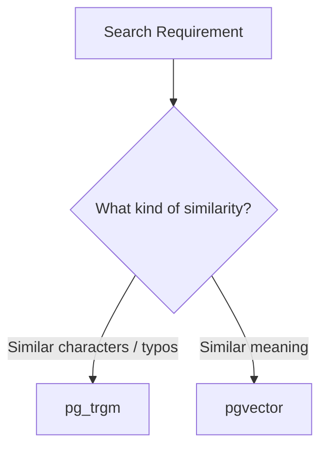

For example:

```text
"How do I reset my password?"
```

may be semantically related to:

```text
"I forgot my login credentials."
```

even though the words differ.

The typical AI flow is:

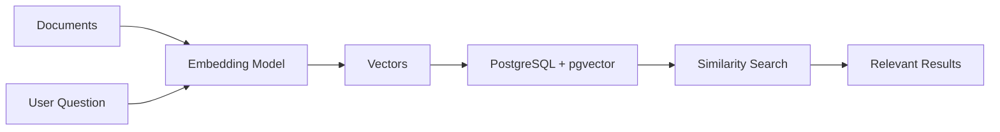

### Common use cases

* RAG
* AI assistants
* Semantic search
* Knowledge retrieval
* Similar-document search
* Recommendations

> `pgvector` does not automatically produce good AI search. Retrieval quality also depends on embeddings, chunking, metadata, indexing, queries, and evaluation.
> {: .prompt-tip }

**IDRM fit:** ⭐⭐⭐⭐⭐ if AI or semantic retrieval is part of the roadmap.

---

# ⭐ `pgAudit`

## Knowing Who Did What

For sensitive systems, normal logs may not answer:

* Who accessed sensitive data?
* Who changed a record?
* What operation occurred?
* When did it happen?

`pgAudit` provides more detailed database auditing.

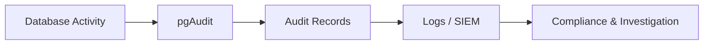

### Particularly relevant for

* Sensitive information
* Enterprise systems
* Compliance
* Investigations
* Forensics
* Accountability

> Audit logging should be selective and deliberate. More logging also means more storage, operational overhead, and potential exposure of sensitive information.
> {: .prompt-warning }

**IDRM fit:** ⭐⭐⭐⭐⭐

---

# ⭐ `citext`

## Case-Insensitive Text Made Simple

These may represent the same logical email address:

```text
Alice@example.com
alice@example.com
ALICE@EXAMPLE.COM
```

Using ordinary `text`, comparisons are case-sensitive.

Developers often write:

```sql
LOWER(email) = LOWER(...)
```

`citext` simplifies this use case.

```sql
CREATE EXTENSION citext;
```

Then:

```sql
email CITEXT
```

### Excellent candidates

* Emails
* Usernames
* Login identifiers
* Tags
* Case-insensitive business identifiers

**IDRM fit:** ⭐⭐⭐⭐⭐

---

# ⭐ `postgres_fdw`

## Query Another PostgreSQL Database

Sometimes copying data is unnecessary.

`postgres_fdw` lets PostgreSQL access remote PostgreSQL data through foreign tables.

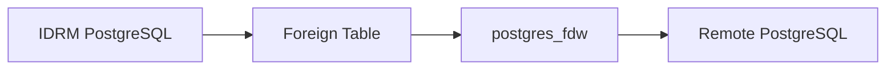

### Useful for

* Controlled integration
* Reporting
* Gradual migration
* Transitional architectures

> Foreign access is not automatically fast. Consider network latency, remote load, query pushdown, transactions, connection management, and failure handling.
> {: .prompt-info }

**IDRM fit:** ⭐⭐⭐⭐⭐

---

# ⭐ `pg_cron`

## Schedule Database Jobs

Many databases need recurring work:


Examples:

```text
Hourly   → aggregate metrics
Daily    → archive old records
Nightly  → cleanup expired data
Weekly   → maintenance task
```

**Good use:** Database-centric recurring jobs.

**Not necessarily ideal for:** Complex, distributed, multi-service workflows.

**IDRM fit:** ⭐⭐⭐⭐⭐

---

# ⭐ UUID Support and `uuid-ossp`

UUIDs are commonly used as identifiers in distributed and modern systems.

The key principle today is:

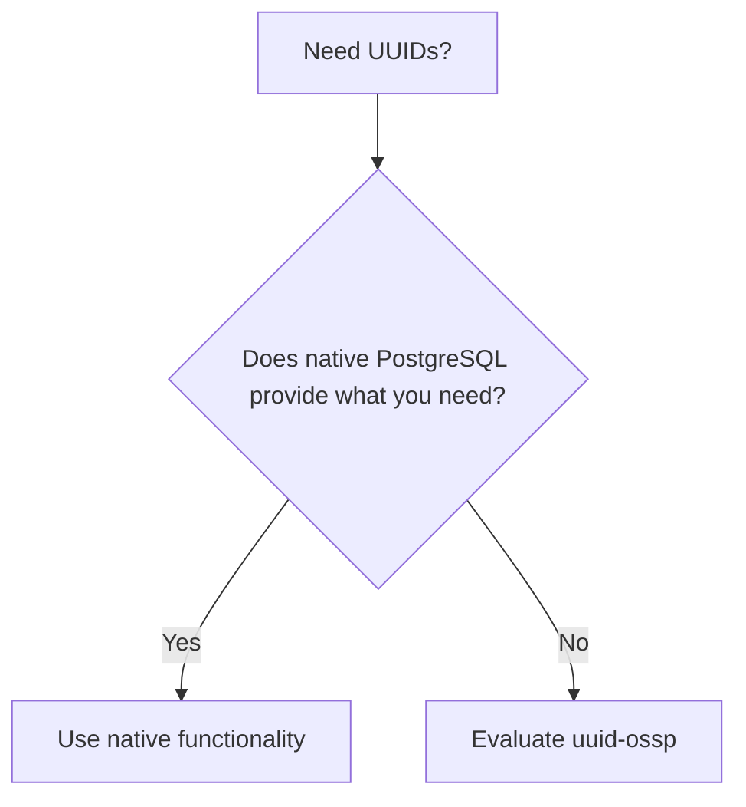

`uuid-ossp` remains useful, particularly for specific UUID algorithms and compatibility requirements.

However, for new systems, **do not automatically install it** if native PostgreSQL UUID functionality already meets the requirement.

**IDRM fit:** ⭐⭐⭐⭐⭐

---

# ⭐ `unaccent`

## More Forgiving Search

Users may search:

```text
Resume
```

while the stored text is:

```text
Résumé
```

`unaccent` helps normalize such differences for search.

A powerful search combination can be:


### Useful for

* International names
* Multilingual systems
* Accent-insensitive search

**IDRM fit:** ⭐⭐⭐⭐

---

# Specialized Extensions

The following extensions are powerful—but should be driven by actual requirements.

## PostGIS — Location Intelligence

Use PostGIS when **where something is** matters.

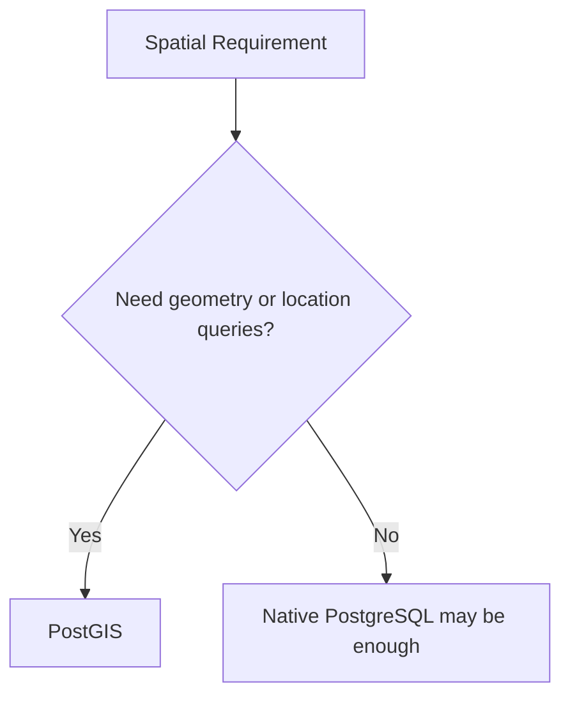

Examples:

* Maps
* Proximity search
* Geofencing
* Regions
* Boundaries

**IDRM fit:** ⭐⭐⭐⭐⭐ when spatial capabilities are core.

---

## TimescaleDB — Time-Series Workloads

Use when the dominant data shape is:

```text
timestamp + measurement
```

Examples:

* Metrics
* Telemetry
* Events
* Sensors

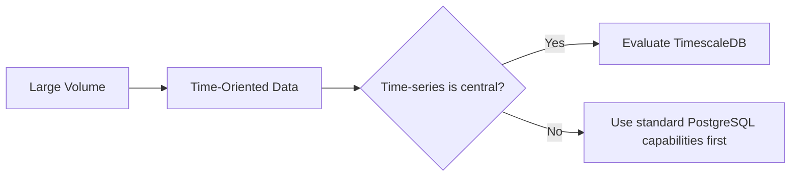

**IDRM fit:** ⭐⭐⭐⭐ when large-scale time-series processing is needed.

---

## `pg_partman` — Partition Automation

Useful for large tables such as:

```text
Audit Events
Event History
Activity Logs
Time-Based Records
```

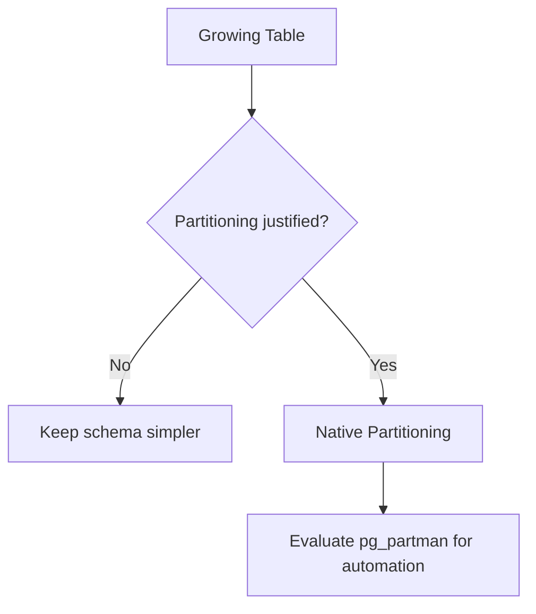

**IDRM fit:** ⭐⭐⭐⭐ as data volume grows.

---

## `pg_repack` — Online Maintenance

Useful for reorganizing tables and indexes with less disruption than more invasive maintenance approaches.

Think of it as part of:

```text
Production Database Operations
        +
Maintenance Strategy
        +
Capacity Management
```

**IDRM fit:** ⭐⭐⭐⭐ for mature, large deployments.

---

# Engineering Extensions

## `pgtap` — Test the Database

Databases contain logic too:

* Functions
* Procedures
* Constraints
* Business rules

They should be tested.

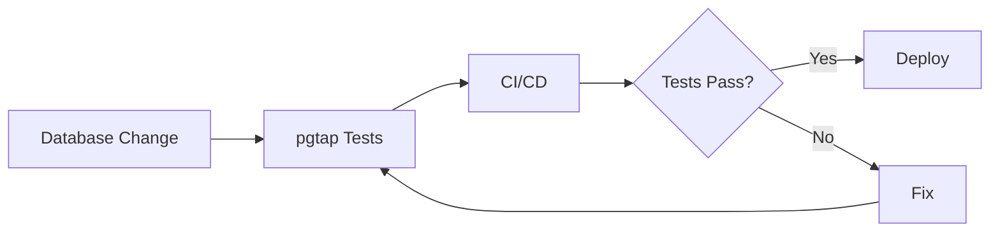

**IDRM fit:** ⭐⭐⭐⭐

---

## `hypopg` — Test an Index Before Creating It

Suppose a query is slow.

You think:

> "Maybe this index will help."

Instead of immediately building the index, `hypopg` helps evaluate **hypothetical indexes**.

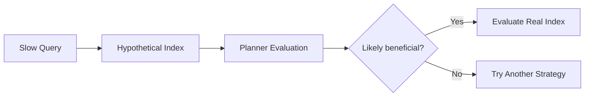

**IDRM fit:** ⭐⭐⭐⭐

---

## `pg_ivm` — Incremental Materialized Views

Potentially useful when derived data supports:

* Reporting
* Dashboards
* Aggregations
* Read-heavy views

Instead of always rebuilding derived results completely, incremental maintenance may be valuable.

**IDRM fit:** ⭐⭐⭐⭐ when reporting complexity justifies it.

---

## `hll` — Approximate Distinct Counting

Useful when:

```text
Fast estimate > Perfectly exact result
```

Typical use:

```sql
COUNT(DISTINCT user_id)
```

over very large datasets.

**IDRM fit:** ⭐⭐⭐ for specialized analytics.

---

## `hstore`

A lightweight key-value data type.

For many modern use cases, compare it carefully with native `jsonb`.

> Do not install `hstore` automatically. First determine whether `jsonb` already models your data more naturally.
> {: .prompt-tip }

**IDRM fit:** ⭐⭐⭐

---

## `file_fdw`

Allows suitable external files to be represented as foreign tables.


Useful for controlled:

* Imports
* Staging
* Integration
* Analytical workflows

**IDRM fit:** ⭐⭐⭐

---

# Recommended IDRM Architecture

A sensible extension strategy is to use tiers.

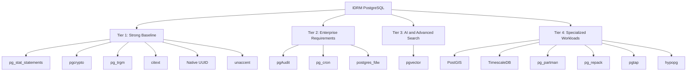

## Tier 1 — Start Here

```text
⭐ pg_stat_statements
⭐ pgcrypto
⭐ pg_trgm
⭐ citext
⭐ Native UUID functionality
⭐ unaccent
```

This provides a strong foundation for:

```text
Performance
+
Security
+
Identity Data
+
Forgiving Search
+
Internationalization
```

## Tier 2 — Add for Enterprise Needs

```text
⭐ pgAudit
⭐ pg_cron
⭐ postgres_fdw
```

These address:

```text
Governance
+
Automation
+
Integration
```

## Tier 3 — Add for AI

```text
⭐ pgvector
```

Use when semantic search, RAG, AI assistants, or vector similarity become genuine product requirements.

## Tier 4 — Add Only When the Workload Demands It

```text
PostGIS       → Location
TimescaleDB   → Time-series
pg_partman    → Partition lifecycle automation
pg_repack     → Online maintenance
pgtap         → Database testing
hypopg        → Index experimentation
pg_ivm        → Incremental derived data
hll           → Approximate analytics
```

---

# From Novice to Mastery

## Level 1 — Learn the Basics

Understand:

```sql
CREATE EXTENSION
```

and inspect:

```sql
SELECT * FROM pg_available_extensions;
```

Learn the difference between:

* Available
* Installed
* Enabled
* Supported by your platform

---

## Level 2 — Master the Production Basics

Focus on:

```text
pg_stat_statements
pg_trgm
citext
pgcrypto
unaccent
Native UUID functionality
```

Build a small project using each.

---

## Level 3 — Learn Enterprise Capabilities

Study:

```text
pgAudit
pg_cron
postgres_fdw
```

Focus on:

* Governance
* Automation
* Integration

---

## Level 4 — Learn Specialized Workloads

Choose based on your requirements:

```text
pgvector     → AI and semantic search
PostGIS      → Spatial data
TimescaleDB  → Time-series
pg_partman   → Very large tables
```

---

## Level 5 — Think Like a Database Engineer

Master:

```text
pgtap
hypopg
pg_repack
pg_ivm
hll
```

Focus on:


---

# Common Mistakes

## ❌ Installing everything popular

More extensions mean:

* More dependencies
* More compatibility concerns
* More upgrade complexity
* More operational knowledge

> Install the smallest set that solves your actual problems.
> {: .prompt-tip }

---

## ❌ Ignoring native PostgreSQL

Always ask first:

> Can PostgreSQL already do this?

The answer may prevent an unnecessary dependency.

---

## ❌ Confusing fuzzy search with semantic search

```mermaid
flowchart LR
    A[pg_trgm] --> B[Similar spelling / characters]
    C[pgvector] --> D[Similar meaning]
```

They solve different problems.

---

## ❌ Ignoring operations

Some extensions may require:

* Server configuration
* Preloading
* Extra privileges
* Background workers
* Restarts

Read the operational requirements **before** adopting them.

---

## ❌ Ignoring upgrades

Think in terms of:

```mermaid
flowchart LR
    A[PostgreSQL Upgrade] --> D[Upgrade Plan]
    B[Extension Compatibility] --> D
    C[Application Compatibility] --> D
    D --> E[Test]
    E --> F[Backup]
    F --> G[Upgrade]
    G --> H[Monitor]
```

An extension is part of your production architecture.

---

# Final Recommendation

For IDRM, begin with:

```text
🥇 Foundation
⭐ pg_stat_statements
⭐ pgcrypto
⭐ pg_trgm
⭐ citext
⭐ Native UUID functionality
⭐ unaccent
```

Then add:

```text
🥈 Enterprise
⭐ pgAudit
⭐ pg_cron
⭐ postgres_fdw
```

Then:

```text
🥉 Advanced
⭐ pgvector
```

Finally, add specialized capabilities only when justified by real workloads:

```text
PostGIS
TimescaleDB
pg_partman
pg_repack
pgtap
hypopg
pg_ivm
hll
```

> **The path to PostgreSQL mastery is not knowing every extension. It is knowing which problem each extension solves—and knowing when not to use one.**
> {: .prompt-tip }

---

# Quick Reference

| If You Need...                 | Start With...           |
| ------------------------------ | ----------------------- |
| Find expensive SQL             | `pg_stat_statements`    |
| Fuzzy / typo-tolerant search   | `pg_trgm`               |
| Semantic AI search             | `pgvector`              |
| Cryptographic functions        | `pgcrypto`              |
| Detailed auditing              | `pgAudit`               |
| Case-insensitive identifiers   | `citext`                |
| Accent-insensitive search      | `unaccent`              |
| UUIDs                          | Native PostgreSQL first |
| Scheduled SQL jobs             | `pg_cron`               |
| Another PostgreSQL database    | `postgres_fdw`          |
| Maps and location              | PostGIS                 |
| Large time-series data         | TimescaleDB             |
| Partition automation           | `pg_partman`            |
| Database testing               | `pgtap`                 |
| Index experimentation          | `hypopg`                |
| Approximate distinct analytics | `hll`                   |

---

# REFERENCES

The following sources were used to validate extension popularity, capabilities, availability, and current PostgreSQL ecosystem practices.

1. **PostgreSQL Official Documentation — Additional Supplied Modules and Extensions**
   Official documentation covering PostgreSQL extensions and extension management.
   [https://www.postgresql.org/docs/current/contrib.html](https://www.postgresql.org/docs/current/contrib.html)

2. **PostgreSQL Official Documentation — Appendix: Extensions**
   Official catalogue of PostgreSQL-supplied extensions.
   [https://www.postgresql.org/docs/current/appendixes.html](https://www.postgresql.org/docs/current/appendixes.html)

3. **PostgreSQL Official Documentation — `pg_stat_statements`**
   Official reference for collecting and analyzing SQL planning and execution statistics.
   [https://www.postgresql.org/docs/current/pgstatstatements.html](https://www.postgresql.org/docs/current/pgstatstatements.html)

4. **PostgreSQL Official Documentation — `uuid-ossp`**
   Official reference for UUID generation functions and extension usage.
   [https://www.postgresql.org/docs/current/uuid-ossp.html](https://www.postgresql.org/docs/current/uuid-ossp.html)

5. **Neon — The 10 Most Popular Postgres Extensions**
   Real-world platform usage perspective on popular PostgreSQL extensions.
   [https://neon.com/blog/ten-most-popular-postgres-extensions](https://neon.com/blog/ten-most-popular-postgres-extensions)

6. **Tiger Data — Top PostgreSQL Extensions Used by Customers**
   Production usage perspective covering observability, time-series, AI, vector, cryptographic, and spatial workloads.
   [https://www.tigerdata.com/blog/top-8-postgresql-extensions](https://www.tigerdata.com/blog/top-8-postgresql-extensions)

7. **Bytebase — Top PostgreSQL Extensions**
   Practical overview of major PostgreSQL extensions and modern usage considerations.
   [https://www.bytebase.com/blog/top-postgres-extension/](https://www.bytebase.com/blog/top-postgres-extension/)

8. **PostgreSQL Extensions Reference — Joel on SQL**
   Broad community-maintained reference to the wider PostgreSQL extension ecosystem.
   [https://gist.github.com/joelonsql/e5aa27f8cc9bd22b8999b7de8aee9d47](https://gist.github.com/joelonsql/e5aa27f8cc9bd22b8999b7de8aee9d47)
