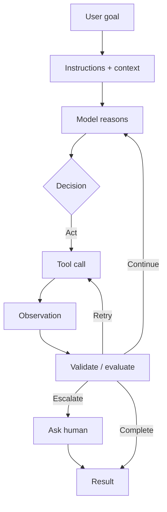
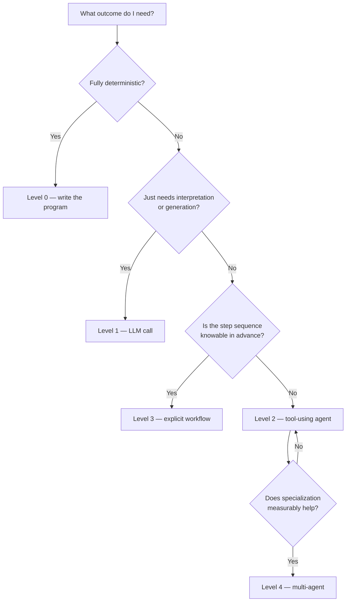

Most writing about AI agents starts with architecture — orchestrators, memory layers, agent swarms. That is the wrong end of the problem. The useful question is not *how do I build an agent?* but *what outcome am I trying to produce, and is an agent the cheapest reliable way to produce it?*

Agents add cost, latency, non-determinism, and entirely new failure modes. They earn their place only when their flexibility buys back more than it charges.

> **Don't build an agent because you can. Build one because it can reliably accomplish something valuable that simpler software cannot.**
{: .prompt-tip }

## Start with the objective

Before frameworks, before orchestration patterns, name the outcome. Agents tend to pay off on problems shaped like these:

- Researching a question across many sources and reconciling them
- Reading documents and extracting structured insight
- Writing code, running it, reading the failure, and fixing it
- Handling customer requests that branch unpredictably
- Operating tools and software on someone's behalf

What these share is that **the path to the answer isn't known in advance**. If a function, a SQL query, an API call, or a deterministic workflow gets you there reliably, use that. It will be faster, cheaper, testable, and it will not surprise you at 2 a.m.

## What actually makes an agent

Five parts, and each one is a place where real systems break.

| Component | Role | Fails as |
|---|---|---|
| **Model** | Interprets the goal, decides the next step, judges results | Confident wrong decisions |
| **Instructions** | Objective, permissions, prohibitions, when to escalate | Vague scope, silent drift |
| **Tools** | The ability to *act* — search, query, execute, write | Intelligent but powerless |
| **Loop** | Act → observe → adjust → repeat | Infinite loops, runaway cost |
| **Safety** | Validation, permissions, limits, logging, human approval | The expensive kind of failure |

### The model is the reasoning, not the system

The LLM interprets context and decides what to do next. That is a component, not an architecture. Everything around it — the validation, the retries, the logging — is ordinary software engineering, and it is where most of the reliability lives.

### Instructions are a contract

Good agent instructions state the objective, what the agent may do, what it must not do, how it should behave, and — the part most often skipped — **when it should stop and ask a human**. An agent that never escalates isn't autonomous; it's unsupervised.

### Tools turn text into action

On its own, a model produces information. Tools let it search, read files, query databases, call APIs, execute code, and manipulate documents. Tool design is where most agent quality is won or lost: a well-named tool with a tight schema and a clear error message will outperform a clever prompt wrapped around a vague one.

### The loop is the actual distinction

A conventional program runs `input → rules → output`. An agent runs something closer to this:



In code, the skeleton is unglamorous — and that is the point:

```python
while not done and steps < MAX_STEPS and cost < BUDGET:
    decision = model.decide(goal, context)

    if decision.needs_human:
        return escalate(decision, context)

    result = tools.run(decision.tool, decision.args)   # permissioned + validated
    context.append(result)

    done = evaluate(goal, context)
    steps += 1
```

Note what is doing the work: the step ceiling, the budget, the permission check, the evaluation. The model picks the move. The scaffolding keeps the game finite.

### Safety is not a later phase

An autonomous system should not be trusted simply because it is capable. At minimum: input validation, output validation, tool-level checks, scoped permissions, hard limits, logging, human approval for irreversible actions, and a defense posture against prompt injection — because any content your agent reads is content someone else may have written for it.

> Treat every tool call as untrusted input to your infrastructure and every fetched document as untrusted input to your model.
{: .prompt-warning }

## The one principle that matters most

**Start simple → measure → add complexity only when justified.**

Do not begin with ten agents, elaborate memory, layered orchestration, and every framework on the shortlist. Begin with:

> One objective → one agent → a few well-designed tools → clear instructions → evaluation.

Then ask the only question that earns you the right to add complexity: **where does it actually fail?** Add the component that fixes *that* failure. Anthropic's guidance on this is blunt — the most successful agent systems are usually not the most sophisticated ones. Complexity should be a response to evidence, not to ambition.

## Think in levels

Most "agent" projects belong on a lower rung than their authors assume.

| Level | Shape | Use when | Example |
|---|---|---|---|
| **0 — Ordinary software** | Rules → output | The problem is deterministic | Compute tax from known rules |
| **1 — LLM application** | Prompt + context → response | Interpretation or generation is the hard part | Summarize this document |
| **2 — Tool-using agent** | Goal → reason → act → observe | The *sequence* of steps can't be known upfront | Research a company across sources, produce a report |
| **3 — Agentic workflow** | Orchestrated stages | The process is predictable but multi-step | Research → analyze → verify → write → review |
| **4 — Multi-agent system** | Specialists + coordination | Specialization and delegation genuinely improve results | Planner delegating to researcher, analyst, coder, reviewer |

Level 3 deserves more attention than it gets. When the process *is* reasonably predictable, an explicit workflow beats an autonomous loop: it is easier to control, easier to debug, and easier to explain when it goes wrong. Level 4 is real and useful — modern frameworks support handoffs and agents-as-tools — but it is a destination, not a starting point.

Here is the decision in one picture:



## What a beginner should actually learn

In this order. Frameworks come last, not first — they are an implementation of these ideas, and they change faster than the ideas do.

1. **LLM fundamentals** — prompts, context, tokens, structured output, reasoning, and above all the model's limitations.
2. **Tool calling** — how a model selects and invokes functions, APIs, databases, and services.
3. **Agent loops** — decide, act, observe, repeat, and how to terminate.
4. **Context and state** — what the agent carries across steps, and when it needs to carry something across sessions.
5. **Workflows** — sequential and parallel execution, routing, retries, evaluation, human approval.
6. **Guardrails and security** — permissions, validation, prompt-injection defense, tool restrictions, sensitive-action approval.
7. **Evaluation and observability** — the discipline that separates a demo from a system.

That last one deserves its own question: **how do you know your agent works?** Measure task success, accuracy, tool-call correctness, latency, cost, failure rate, and safety violations. Agent runtimes increasingly ship tracing for exactly this reason — debugging an autonomous system is impossible without visibility into what it actually did.

## When you should *not* build an agent

This is the most valuable list in the article, so it is worth stating plainly. Skip the agent when:

- The workflow is completely deterministic
- A single API call or database query solves it
- A conventional program would be more reliable
- The cost of a mistake is unacceptable and you don't yet have the controls
- The agent adds complexity without a measurable benefit

**Automation is not the same thing as an agent.** A traditional workflow can be superb automation. An agent becomes worth its overhead only when the system genuinely needs flexible, model-driven decisions about *how* to reach a goal.

## The mental model to keep

Stop thinking *"I am building an AI agent."*

Start thinking *"I am building a reliable software system that uses an LLM at the points where flexible reasoning is valuable."*

That shift changes what you build. It puts validation, permissions, budgets, evaluation, and escalation paths on the critical path — where they belong — and it demotes the model to what it actually is: one component among several, and rarely the one that determines whether the system is trustworthy.

## The objective, restated

The goal of agent engineering is not maximum autonomy, maximum agents, maximum tools, or the most impressive architecture diagram. It is:

> **Maximum useful outcome with minimum necessary complexity.**
{: .prompt-info }

Or, as a working checklist:

- Give the system a **valuable goal**
- Give it enough **intelligence** to reason
- Give it the **right tools** to act
- Let it **adapt** when the path is unclear
- Keep it inside **safe boundaries**
- **Measure** whether it actually works
- Add complexity **only when the evidence demands it**

Everything else is detail.
