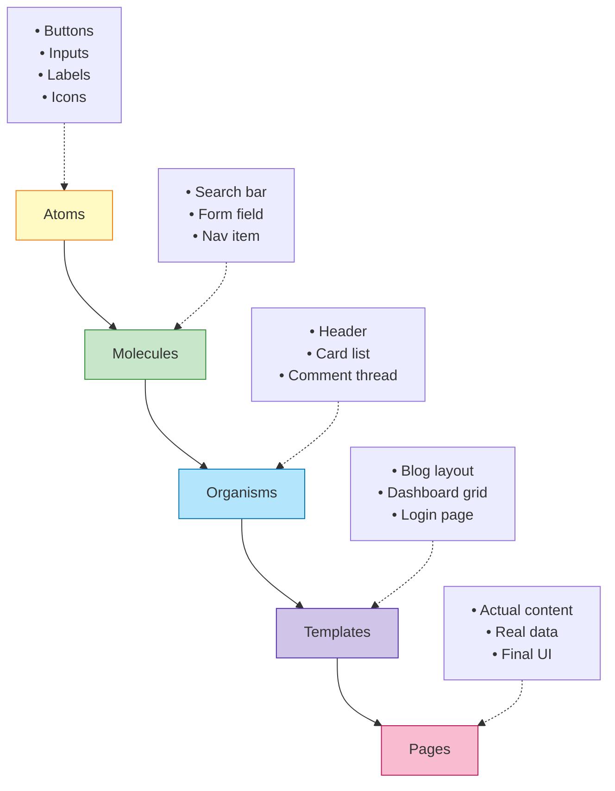
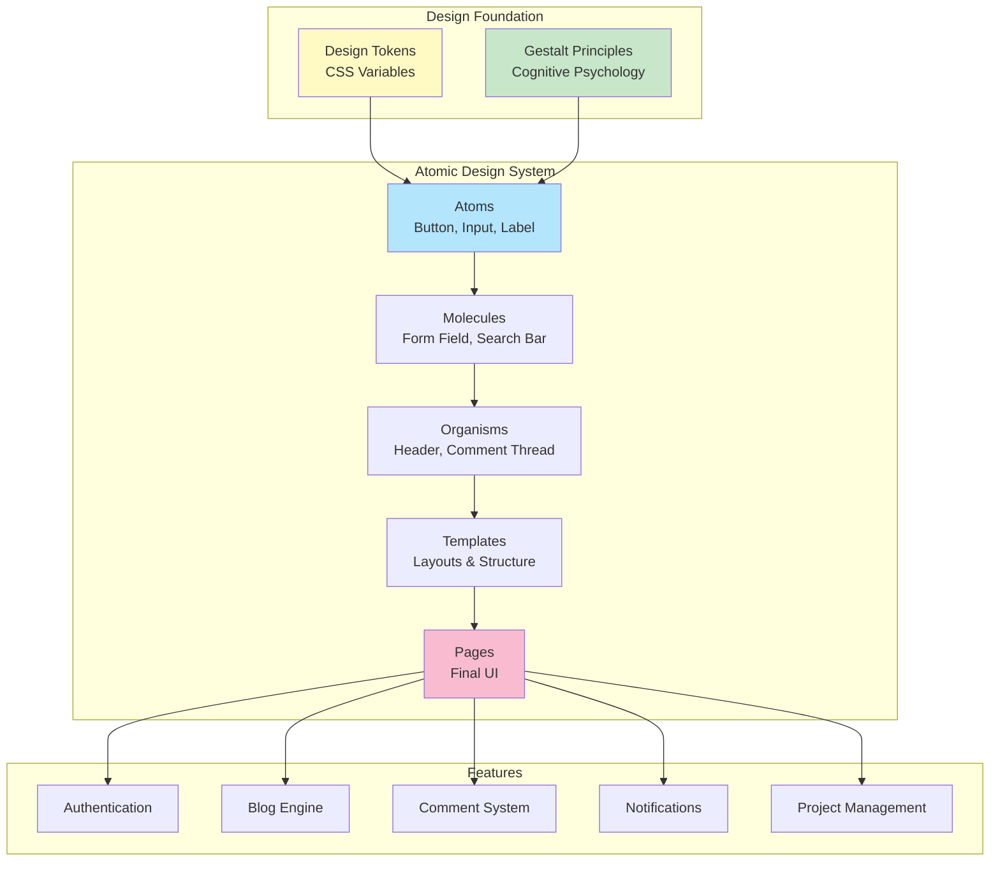

<!--
# image: 
#  path: /assets/img/posts/visual-hierarchy-design-system.webp
#  alt: "Complete Design System Architecture - From Psychology to Production"
-->

## Introduction: The Science Behind Beautiful Interfaces

{: width="800" height="450" }
_Visual Designer Skills Illustrated!_

You've seen it happen: you land on a website and within a fraction of a second—before you've consciously read a single word—your brain has already judged it. Beautiful or ugly. Trustworthy or sketchy. Professional or amateur.

Research shows this judgment happens in **just 50 milliseconds**. That's faster than a single eye blink.

But here's the fascinating part: this instantaneous reaction isn't random. It's driven by fundamental principles of human perception—principles that have been studied by psychologists, neuroscientists, and designers for over a century. Your brain isn't actually judging "beauty" in some abstract sense. It's evaluating **cognitive efficiency**: how easily can it parse the information on screen?

When you build enterprise applications—platforms with authentication, blogging, comments, real-time notifications, project management, and team collaboration—visual consistency isn't just aesthetic polish. It's the difference between an interface that feels effortless and one that exhausts users mentally.

**This guide will teach you:**

- The **psychological principles** that govern how humans perceive interfaces (Gestalt theory, cognitive load)
- The **scientific foundation** of visual hierarchy (why size, contrast, and spacing work the way they do)
- The **systematic methodology** for building scalable component libraries (Atomic Design)
- The **technical implementation** using design tokens, CSS variables, and modern frameworks
- The **accessibility standards** (WCAG 2.1/2.2) that make interfaces usable for everyone
- The **governance patterns** that keep design systems maintainable at scale

We'll build everything from first principles, using **TechHub Enterprise**—a complete B2B platform with authentication, blogging, comments, notifications, and project management—as our comprehensive case study.

By the end, you won't just know *what* design systems are. You'll understand *why* they work the way they do, rooted in human psychology and cognitive science.

---

## Part 1: The Psychology of Visual Perception

Before we write a single line of code, we need to understand how human perception works. These aren't design opinions—they're scientific principles discovered through decades of research.

### 1.1 Gestalt Principles: How the Brain Groups Information

In the 1920s, German psychologists Max Wertheimer, Kurt Koffka, and Wolfgang Köhler discovered something remarkable: the human brain doesn't see individual elements. It automatically organizes visual information into **meaningful patterns**.

These principles, collectively called **Gestalt psychology** ("Gestalt" means "unified whole" in German), explain why certain designs feel intuitive while others feel chaotic.

#### Principle 1: Proximity (Law of Nearness)

**The Science:** Objects close to each other are perceived as related, even if they look different.

**Why It Matters:** Proximity is the **strongest grouping principle**. It can override other visual cues like color or shape.

```html
<!-- Visual Grouping Through Proximity -->

<!-- POOR PROXIMITY: Elements equally spaced -->
<div style="display: flex; gap: 20px;">
  <div>Name:</div>
  <div><input /></div>
  <div>Email:</div>
  <div><input /></div>
</div>
<!-- Brain perceives: Four separate, unrelated items -->

<!-- GOOD PROXIMITY: Related elements grouped -->
<div style="display: flex; flex-direction: column; gap: 30px;">
  
  <div style="display: flex; flex-direction: column; gap: 8px;">
    <label>Name:</label>
    <input />
  </div>
  
  <div style="display: flex; flex-direction: column; gap: 8px;">
    <label>Email:</label>
    <input />
  </div>
  
</div>
<!-- Brain perceives: Two clear form fields -->
```

**CSS Implementation:**

```css
/* Using spacing tokens to create proximity groups */

.form-field {
  display: flex;
  flex-direction: column;
  gap: var(--spacing-2); /* 8px - tight coupling */
  margin-bottom: var(--spacing-6); /* 24px - separation between groups */
}

.form-field__label {
  /* Visually bound to input below through proximity */
}

.form-field__input {
  /* Perceived as part of label above */
}
```

**Real Example: Login Form**

```html
<form class="login-form">
  
  <!-- Group 1: Email field (label + input closely spaced) -->
  <div class="form-group">
    <label>Email Address</label>
    <input type="email" />
    <span class="helper-text">We'll never share your email</span>
  </div>
  
  <!-- Larger gap indicates new group -->
  
  <!-- Group 2: Password field -->
  <div class="form-group">
    <label>Password</label>
    <input type="password" />
  </div>
  
  <!-- Even larger gap before actions -->
  
  <!-- Group 3: Actions -->
  <div class="form-actions">
    <button type="submit">Sign In</button>
    <a href="/forgot">Forgot password?</a>
  </div>
  
</form>
```

```css
.form-group {
  display: flex;
  flex-direction: column;
  gap: var(--spacing-2);           /* 8px - Elements within group */
  margin-bottom: var(--spacing-6);  /* 24px - Separation between groups */
}

.form-group__helper {
  margin-top: var(--spacing-1);    /* 4px - Still part of group */
  font-size: var(--text-xs);
  color: var(--color-gray-500);
}

.form-actions {
  margin-top: var(--spacing-8);    /* 32px - Clear separation from fields */
  display: flex;
  gap: var(--spacing-4);           /* 16px - Related actions */
}
```

#### Principle 2: Similarity (Law of Resemblance)

**The Science:** Elements sharing visual characteristics (shape, color, size, orientation) are perceived as related or belonging to the same group.

**Why It Matters:** Users learn patterns. When all clickable buttons share the same blue color, users immediately recognize future blue elements as interactive.

**Real Example: Button Variants**

```css
/* Primary buttons - Similar appearance signals similar function */
.btn-primary,
.btn-submit,
.btn-confirm {
  background: var(--color-primary-600);
  color: var(--color-gray-50);
  border-radius: var(--radius-md);
  /* Users learn: Blue filled = main action */
}

/* Secondary buttons - Different appearance = different importance */
.btn-secondary,
.btn-cancel {
  background: transparent;
  border: 2px solid var(--color-primary-600);
  color: var(--color-primary-600);
  /* Users learn: Outlined = alternative action */
}

/* Danger buttons - Red signals destructive action */
.btn-danger,
.btn-delete {
  background: var(--color-error);
  color: var(--color-gray-50);
  /* Users learn: Red = be careful */
}
```

**Consistency Creates Predictability:**

```html
<!-- Throughout the application, users see patterns -->

<!-- Blog Post Editor -->
<button class="btn-primary">Publish Post</button>
<button class="btn-secondary">Save Draft</button>
<button class="btn-danger">Delete Post</button>

<!-- Comment System -->
<button class="btn-primary">Post Comment</button>
<button class="btn-secondary">Cancel</button>

<!-- User learns: Primary (blue filled) = main action, everywhere -->
```

#### Principle 3: Continuity (Law of Good Continuation)

**The Science:** The eye naturally follows lines, curves, and paths. Elements arranged along a continuous line or curve are perceived as related.

**Why It Matters:** Guides users through interfaces naturally, creating "visual flow."

**Real Example: Navigation Breadcrumbs**

```html
<nav aria-label="Breadcrumb" class="breadcrumb">
  <a href="/">Home</a>
  <span class="separator">›</span>
  <a href="/blog">Blog</a>
  <span class="separator">›</span>
  <a href="/blog/design-systems">Design Systems</a>
  <span class="separator">›</span>
  <span aria-current="page">Introduction</span>
</nav>
```

```css
.breadcrumb {
  display: flex;
  align-items: center;
  gap: var(--spacing-2);
  /* Elements form a continuous horizontal line */
}

.breadcrumb a {
  color: var(--color-primary-600);
  text-decoration: none;
}

.separator {
  color: var(--color-gray-400);
  /* Visual continuation markers */
}
```

**Timeline Implementation:**

```html
<div class="timeline">
  <div class="timeline-item">
    <div class="timeline-marker"></div>
    <div class="timeline-content">Account Created</div>
  </div>
  <div class="timeline-connector"></div>
  <div class="timeline-item">
    <div class="timeline-marker"></div>
    <div class="timeline-content">Email Verified</div>
  </div>
  <div class="timeline-connector"></div>
  <div class="timeline-item">
    <div class="timeline-marker"></div>
    <div class="timeline-content">Profile Completed</div>
  </div>
</div>
```

```css
.timeline {
  position: relative;
  padding-left: 40px;
}

/* Continuous vertical line guides the eye */
.timeline::before {
  content: '';
  position: absolute;
  left: 15px;
  top: 0;
  bottom: 0;
  width: 2px;
  background: var(--color-gray-300);
  /* Vertical continuity */
}

.timeline-marker {
  position: absolute;
  left: -25px;
  width: 12px;
  height: 12px;
  border-radius: 50%;
  background: var(--color-primary-600);
  border: 2px solid var(--color-gray-50);
  /* Points along the continuous line */
}
```

#### Principle 4: Closure (Law of Completeness)

**The Science:** The brain automatically completes incomplete shapes, filling in missing information to perceive a whole object.

**Why It Matters:** You don't need to fully enclose elements—the brain will "close" the shape mentally, reducing visual clutter.

**Real Example: Card Design**

```css
/* Minimal card - brain completes the boundary */
.card-minimal {
  padding: var(--spacing-4);
  border-left: 4px solid var(--color-primary-600);
  background: var(--color-gray-50);
  /* No full border needed - brain perceives a complete card */
}

/* Loading skeleton - incomplete shapes suggest content */
.skeleton-text {
  height: 16px;
  background: linear-gradient(
    90deg,
    var(--color-gray-200) 0%,
    var(--color-gray-300) 50%,
    var(--color-gray-200) 100%
  );
  border-radius: var(--radius-sm);
  /* Brain fills in "this will be text" */
}

.skeleton-avatar {
  width: 40px;
  height: 40px;
  border-radius: 50%;
  background: var(--color-gray-300);
  /* Circular shape + position suggests "profile picture coming" */
}
```

**Icon Design Using Closure:**

```html
<!-- Hamburger menu icon - three lines, brain sees "menu" -->
<button class="menu-toggle" aria-label="Open menu">
  <span class="menu-line"></span>
  <span class="menu-line"></span>
  <span class="menu-line"></span>
</button>
```

#### Principle 5: Figure-Ground (Foreground-Background Separation)

**The Science:** The brain distinguishes objects (figure) from their surroundings (ground). Clear figure-ground relationships reduce cognitive load.

**Why It Matters:** Ambiguous figure-ground relationships confuse users—they can't tell what's interactive vs. decorative.

**Real Example: Modal Dialogs**

```html
<div class="modal-overlay">
  <!-- Ground: Semi-transparent backdrop -->
  
  <div class="modal-dialog">
    <!-- Figure: Elevated, clear foreground -->
    <h2>Confirm Deletion</h2>
    <p>Are you sure you want to delete this post?</p>
    <div class="modal-actions">
      <button class="btn-danger">Delete</button>
      <button class="btn-secondary">Cancel</button>
    </div>
  </div>
  
</div>
```

```css
/* Ground: Recedes into background */
.modal-overlay {
  position: fixed;
  inset: 0;
  background: rgba(0, 0, 0, 0.6); /* Semi-transparent black */
  backdrop-filter: blur(4px);      /* Blurs background content */
  z-index: var(--z-modal-backdrop);
}

/* Figure: Advances to foreground */
.modal-dialog {
  position: relative;
  background: var(--color-gray-50);  /* Solid, opaque */
  padding: var(--spacing-6);
  border-radius: var(--radius-lg);
  box-shadow: var(--shadow-2xl);     /* Strong shadow = elevation */
  z-index: var(--z-modal);
  /* Clear separation from ground */
}
```

#### Principle 6: Common Region (Law of Enclosure)

**The Science:** Elements within a defined boundary (border, background, container) are perceived as a group, even if they differ visually.

**Why It Matters:** The most powerful grouping tool. Overrides proximity and similarity.

**Real Example: Card Components**

```css
/* Card creates a common region */
.card {
  padding: var(--spacing-4);
  background: var(--color-gray-50);
  border: 1px solid var(--color-gray-300);
  border-radius: var(--radius-md);
  box-shadow: var(--shadow-sm);
}

/* Everything inside perceived as related, regardless of appearance */
.card__image {
  /* Could be an image */
}

.card__title {
  font-size: var(--text-xl);
  color: var(--color-gray-900);
  /* Different size/color from image */
}

.card__description {
  font-size: var(--text-sm);
  color: var(--color-gray-600);
  /* Different from title */
}

.card__action {
  /* Button with different styling */
}

/* Despite visual differences, the border groups them */
```

**Dashboard Widget Example:**

```html
<div class="dashboard">
  
  <!-- Each widget is a common region -->
  <div class="widget">
    <h3 class="widget__title">Revenue This Month</h3>
    <div class="widget__value">$42,350</div>
    <div class="widget__change">+12.5%</div>
  </div>
  
  <div class="widget">
    <h3 class="widget__title">Active Users</h3>
    <div class="widget__value">1,240</div>
    <div class="widget__change">+8.3%</div>
  </div>
  
  <!-- Clear regions = clear mental grouping -->
  
</div>
```

#### Principle 7: Symmetry (Law of Symmetrical Balance)

**The Science:** Symmetrical elements are perceived as unified, stable, and belonging together. Asymmetry draws attention and signals importance.

**Real Example: Centered Login Forms vs. Asymmetric Dashboards**

```css
/* Symmetrical login - signals stability and focus */
.login-container {
  display: flex;
  justify-content: center;  /* Centered horizontally */
  align-items: center;      /* Centered vertically */
  min-height: 100vh;
  /* Perfect symmetry = calm, focused experience */
}

/* Asymmetric dashboard - signals information density */
.dashboard-layout {
  display: grid;
  grid-template-columns: 250px 1fr;  /* Sidebar + main content */
  /* Asymmetry = active, information-rich */
}
```

### 1.2 Cognitive Load Theory: Why Hierarchy Reduces Mental Effort

**Cognitive Load Theory** (developed by psychologist John Sweller) explains that humans have limited **working memory** capacity. When an interface overwhelms this capacity, users experience mental exhaustion.

**Three Types of Cognitive Load:**

1. **Intrinsic Load:** The inherent complexity of the task
2. **Extraneous Load:** Unnecessary mental effort caused by poor design ← **We control this**
3. **Germane Load:** Productive mental effort (learning, understanding)

**Visual hierarchy reduces extraneous load** by making information processing automatic rather than conscious.

```html
<!-- HIGH EXTRANEOUS LOAD: No hierarchy -->
<div>
  <span>Welcome to TechHub</span>
  <span>Dashboard</span>
  <span>You have 3 new notifications</span>
  <span>Recent Activity</span>
  <span>Project Alpha updated 2 hours ago</span>
  <span>Sarah Chen commented on your post</span>
</div>
<!-- User's brain: "I have to read everything to understand what's important" -->

<!-- LOW EXTRANEOUS LOAD: Clear hierarchy -->
<div class="dashboard">
  
  <!-- Level 1: Primary - Scanned first -->
  <h1 class="page-title">Dashboard</h1>
  
  <!-- Level 2: Secondary - Scanned second -->
  <p class="welcome-message">Welcome to TechHub</p>
  
  <!-- Level 3: Alert - Draws attention -->
  <div class="notification-badge">3 new notifications</div>
  
  <!-- Level 4: Section header -->
  <h2 class="section-title">Recent Activity</h2>
  
  <!-- Level 5: Content items -->
  <ul class="activity-list">
    <li>Project Alpha updated 2 hours ago</li>
    <li>Sarah Chen commented on your post</li>
  </ul>
  
</div>
<!-- User's brain: "I immediately see: main heading, welcome, alert, section, items" -->
```

**The 50-Millisecond Rule:**

Research by Gitte Lindgaard (2006) found users form aesthetic judgments in 50ms. In that time, the brain is performing:

1. **Pattern recognition** (Gestalt principles activate automatically)
2. **Hierarchy scanning** (largest, highest-contrast elements first)
3. **Familiarity matching** ("Have I seen this pattern before?")

Your design system's job: make these 50ms work in your favor.

---

## Part 2: Visual Hierarchy — The Eight Foundational Principles

Visual hierarchy is the arrangement of elements to communicate their order of importance. It's not subjective aesthetics—it's applied cognitive psychology.

### 2.1 The Eight Core Principles

#### Principle 1: Size & Scale (Visual Weight)

**The Science:** Larger objects command more attention. This is called the **size-importance correlation**—our brains evolved to notice larger objects first (potential threats/opportunities in nature).

**Typographic Scale (Modular Scale Ratio: 1.25)**

```css
/* Hierarchical type scale */
:root {
  --text-xs: 0.75rem;    /* 12px - Metadata, timestamps */
  --text-sm: 0.875rem;   /* 14px - Helper text, captions */
  --text-base: 1rem;     /* 16px - Body text (baseline) */
  --text-lg: 1.125rem;   /* 18px - Emphasized body */
  --text-xl: 1.25rem;    /* 20px - Subheadings */
  --text-2xl: 1.5rem;    /* 24px - Section headings */
  --text-3xl: 1.875rem;  /* 30px - Page headings */
  --text-4xl: 2.25rem;   /* 36px - Hero headings */
  --text-5xl: 3rem;      /* 48px - Display headings */
}

/* Blog post hierarchy using scale */
.post-title {
  font-size: var(--text-4xl);    /* 36px - PRIMARY focus */
  font-weight: var(--font-bold);
  line-height: var(--leading-tight);
  margin-bottom: var(--spacing-4);
}

.post-subtitle {
  font-size: var(--text-xl);     /* 20px - SECONDARY */
  font-weight: var(--font-medium);
  color: var(--color-gray-700);
  margin-bottom: var(--spacing-6);
}

.post-content {
  font-size: var(--text-base);   /* 16px - CONTENT */
  line-height: var(--leading-relaxed);
}

.post-metadata {
  font-size: var(--text-sm);     /* 14px - METADATA */
  color: var(--color-gray-500);
}
```

**Why 1.25 ratio?** It creates noticeable but harmonious size jumps. Each level is 25% larger than the previous, which the eye registers as a clear hierarchy step.

#### Principle 2: Color & Contrast (Attention Direction)

**The Science:** High-contrast elements draw attention first. The **Weber-Fechner Law** states that the noticeable difference in a stimulus is proportional to the magnitude of the original stimulus.

**Practical Translation:** Dark text on light background (or vice versa) = high contrast = noticed first.

**WCAG 2.1 Standards (Precise Requirements):**

```css
/* WCAG AA Requirements */

/* Normal text (< 18pt or < 14pt bold) */
.text-normal {
  color: var(--color-gray-900);      /* #1A202C */
  background: var(--color-gray-50);  /* #FFFFFF */
  /* Contrast ratio: 16.1:1 ✓ (exceeds 4.5:1 minimum) */
}

/* Large text (≥ 18pt or ≥ 14pt bold) */
.text-large {
  color: var(--color-gray-700);      /* #2D3748 */
  background: var(--color-gray-50);
  /* Contrast ratio: 10.7:1 ✓ (exceeds 3:1 minimum) */
}

/* UI Components (WCAG 2.1 addition) */
.button-primary {
  background: var(--color-primary-600);  /* #2C5282 */
  border: 2px solid var(--color-primary-700);
  /* Component contrast: 3.2:1 ✓ (exceeds 3:1 minimum) */
}

/* WCAG AAA Requirements (Enhanced) */
.text-enhanced {
  color: var(--color-gray-900);
  background: var(--color-gray-50);
  /* Contrast ratio: 16.1:1 ✓ (exceeds 7:1 minimum for normal text) */
}
```

**Color Hierarchy Implementation:**

```css
/* Primary CTA - Highest contrast, most attention */
.cta-primary {
  background: var(--color-primary-600);
  color: var(--color-gray-50);
  /* Contrast: 7.2:1 - Passes WCAG AAA */
}

/* Secondary CTA - Medium contrast */
.cta-secondary {
  background: transparent;
  border: 2px solid var(--color-primary-600);
  color: var(--color-primary-600);
  /* Reduced visual weight through less contrast */
}

/* Tertiary/Ghost - Minimal contrast until hover */
.cta-ghost {
  background: transparent;
  color: var(--color-primary-600);
  /* Lowest hierarchy */
}

.cta-ghost:hover {
  background: var(--color-primary-50);
  /* Gains contrast on interaction */
}
```

**Semantic Color System:**

```css
/* Intent-based color tokens */
:root {
  --color-success: #38A169;   /* Green - positive actions */
  --color-warning: #D69E2E;   /* Amber - caution */
  --color-error: #E53E3E;     /* Red - destructive/errors */
  --color-info: #3182CE;      /* Blue - informational */
}

/* Notification hierarchy through color */
.notification--success {
  border-left: 4px solid var(--color-success);
  background: #F0FFF4;  /* Light green tint */
  /* Success = green = positive association */
}

.notification--error {
  border-left: 4px solid var(--color-error);
  background: #FFF5F5;  /* Light red tint */
  /* Error = red = universal warning signal */
}
```

#### Principle 3: Whitespace (Negative Space)

**The Science:** The **Law of Proximity** (Gestalt) — elements close together = related; far apart = separate. Whitespace is how you control proximity.

**8-Point Grid System (Material Design Standard):**

```css
:root {
  /* Base unit: 8px */
  --spacing-1: 0.25rem;   /* 4px  - Micro spacing */
  --spacing-2: 0.5rem;    /* 8px  - Base unit */
  --spacing-3: 0.75rem;   /* 12px - Tight groups */
  --spacing-4: 1rem;      /* 16px - Standard spacing */
  --spacing-6: 1.5rem;    /* 24px - Section spacing */
  --spacing-8: 2rem;      /* 32px - Major sections */
  --spacing-12: 3rem;     /* 48px - Page sections */
  --spacing-16: 4rem;     /* 64px - Hero spacing */
}
```

**Why 8px?** Most screen densities are divisible by 8, ensuring sharp rendering. Also creates a rhythm that's intuitive.

**Hierarchy Through Spacing:**

```html
<article class="blog-post">
  
  <!-- Tight spacing = closely related -->
  <h1 class="post__title">Understanding Design Systems</h1>
  <p class="post__subtitle">A comprehensive guide for beginners</p>
  <!-- Gap: 12px (--spacing-3) - Title and subtitle are related -->
  
  <div class="post__meta">
    <span>By Alex Chen</span>
    <span>March 15, 2024</span>
  </div>
  <!-- Gap: 32px (--spacing-8) - Meta separated from title group -->
  
  <div class="post__content">
    <p>First paragraph...</p>
    <!-- Gap: 16px (--spacing-4) - Paragraphs are separate thoughts -->
    <p>Second paragraph...</p>
  </div>
  <!-- Gap: 48px (--spacing-12) - Content separated from next section -->
  
  <section class="post__comments">
    <h2>Comments</h2>
    <!-- New major section -->
  </section>
  
</article>
```

```css
.blog-post {
  max-width: 720px;
  margin: 0 auto;
  padding: var(--spacing-8);
}

.post__title {
  margin-bottom: var(--spacing-3);  /* 12px - Tight coupling with subtitle */
}

.post__subtitle {
  margin-bottom: var(--spacing-2);  /* 8px - Still part of title group */
}

.post__meta {
  margin-bottom: var(--spacing-8);  /* 32px - Clear separation from content */
  display: flex;
  gap: var(--spacing-4);
}

.post__content p {
  margin-bottom: var(--spacing-4);  /* 16px - Standard paragraph spacing */
}

.post__content {
  margin-bottom: var(--spacing-12); /* 48px - Major section break */
}
```

**Visual Rhythm Pattern:**

```
Tight (8-12px)    → Elements within a component
Standard (16-24px) → Between components
Wide (32-48px)     → Between sections
Extra Wide (64px+) → Between major page areas
```

#### Principle 4: Typography (Weight, Style, Family)

**The Science:** **Typographic hierarchy** uses weight, style, and font choice to create visual differentiation without relying solely on size.

**Weight Hierarchy:**

```css
:root {
  --font-regular: 400;    /* Body text */
  --font-medium: 500;     /* Subtle emphasis */
  --font-semibold: 600;   /* Subheadings, labels */
  --font-bold: 700;       /* Headings */
  --font-extrabold: 800;  /* Display headings (rare) */
}

/* Hierarchy through weight */
.heading-primary {
  font-weight: var(--font-bold);      /* 700 */
  /* Heavy weight = important */
}

.heading-secondary {
  font-weight: var(--font-semibold);  /* 600 */
  /* Medium weight = less important than primary */
}

.body-text {
  font-weight: var(--font-regular);   /* 400 */
  /* Light weight = content */
}

.emphasized {
  font-weight: var(--font-medium);    /* 500 */
  /* Slight emphasis within body text */
}
```

**Line Height (Leading):**

```css
:root {
  --leading-none: 1;        /* 100% - Tight display text */
  --leading-tight: 1.25;    /* 125% - Headings */
  --leading-snug: 1.375;    /* 137.5% - UI text */
  --leading-normal: 1.5;    /* 150% - Body text */
  --leading-relaxed: 1.75;  /* 175% - Long-form reading */
  --leading-loose: 2;       /* 200% - Very relaxed (rare) */
}

.display-heading {
  font-size: var(--text-4xl);
  line-height: var(--leading-tight);  /* 1.25 - Headings need less space */
  letter-spacing: -0.02em;            /* Negative tracking for large text */
}

.blog-content {
  font-size: var(--text-base);
  line-height: var(--leading-relaxed); /* 1.75 - Comfortable reading */
  letter-spacing: 0;
}
```

**Why different line heights?** Larger text needs less line spacing (already has vertical space). Smaller text, especially in long-form content, needs more line height for readability.

#### Principle 5: Position & Layout (F-Pattern, Z-Pattern)

**The Science:** Eye-tracking studies by **Nielsen Norman Group** discovered predictable scanning patterns:

- **F-Pattern:** Used for text-heavy content (articles, search results)

  - Eyes move horizontally across top
  - Drop down vertically on left side
  - Scan horizontally again (shorter)
  - Results in an "F" shape heat map
- **Z-Pattern:** Used for sparse content (landing pages, ads)

  - Top-left → Top-right
  - Diagonal to bottom-left
  - Bottom-left → Bottom-right
  - Results in a "Z" shape

**F-Pattern Implementation (Blog Post):**

```html
<article class="article-layout">
  
  <!-- TOP HORIZONTAL BAR - Scanned first -->
  <header class="article-header">
    <h1>The Complete Guide to Design Systems</h1>
    <p class="subtitle">Everything you need to know</p>
  </header>
  
  <!-- LEFT EDGE - Scanned second (vertical) -->
  <div class="article-body">
  
    <!-- Each paragraph's first few words get attention -->
    <p><strong>Design systems</strong> are the foundation...</p>
  
    <p><strong>Visual hierarchy</strong> determines what...</p>
  
    <p><strong>Components</strong> are reusable building...</p>
  
  </div>
  
  <!-- RIGHT SIDEBAR - Least attention (falls outside F) -->
  <aside class="article-sidebar">
    <div class="related-posts">Related Articles</div>
  </aside>
  
</article>
```

```css
.article-layout {
  display: grid;
  grid-template-columns: 1fr 300px;  /* Content + sidebar */
  gap: var(--spacing-8);
  max-width: 1200px;
  margin: 0 auto;
}

/* Optimize for F-pattern */
.article-header {
  grid-column: 1 / -1;  /* Spans full width - top horizontal bar */
}

.article-body {
  /* Left column - main scanning area */
}

.article-sidebar {
  /* Right column - peripheral vision only */
}

/* Make first words of paragraphs stand out */
.article-body p strong:first-child {
  font-weight: var(--font-semibold);
  color: var(--color-gray-900);
}
```

**Z-Pattern Implementation (Landing Page):**

```html
<div class="hero-section">
  
  <!-- TOP-LEFT: Logo (first fixation) -->
  <div class="hero-header">
    
  
    <!-- TOP-RIGHT: CTA (second fixation) -->
    <button class="cta-primary">Get Started</button>
  </div>
  
  <!-- CENTER: Main message (diagonal path) -->
  <h1 class="hero-title">Build Better Products Faster</h1>
  <p class="hero-subtitle">Enterprise design system platform</p>
  
  <!-- BOTTOM-RIGHT: Secondary CTA (final fixation) -->
  <div class="hero-actions">
    <button class="cta-primary">Start Free Trial</button>
    <button class="cta-secondary">Watch Demo</button>
  </div>
  
</div>
```

```css
.hero-section {
  min-height: 100vh;
  display: flex;
  flex-direction: column;
  justify-content: space-between;
  padding: var(--spacing-8);
}

.hero-header {
  display: flex;
  justify-content: space-between;  /* Logo left, CTA right */
  align-items: center;
}

.hero-title {
  font-size: var(--text-5xl);
  text-align: center;
  margin-top: auto;  /* Pushes to vertical center */
}

.hero-actions {
  display: flex;
  justify-content: flex-end;  /* Aligns to bottom-right */
  gap: var(--spacing-4);
  margin-top: auto;
}
```

#### Principle 6: Depth & Elevation (Material Design Z-Axis)

**The Science:** The physical world has depth. Objects closer to us appear more important. **Material Design's elevation system** applies this to digital interfaces.

**Elevation Scale (Density-Independent Pixels):**

```css
:root {
  /* Elevation through shadows */
  --elevation-0: none;                                    /* Flat surface */
  --elevation-1: 0 1px 3px rgba(0,0,0,0.12);            /* Cards, slight lift */
  --elevation-2: 0 3px 6px rgba(0,0,0,0.15);            /* Raised buttons */
  --elevation-3: 0 10px 20px rgba(0,0,0,0.15);          /* Dropdowns */
  --elevation-4: 0 15px 25px rgba(0,0,0,0.15);          /* Navigation drawers */
  --elevation-5: 0 20px 40px rgba(0,0,0,0.15);          /* Modal dialogs */
  
  /* Resting elevations (default states) */
  --z-flat: 0;
  --z-raised: 1;
  --z-overlay: 2;
  --z-dropdown: 3;
  --z-sticky: 4;
  --z-modal: 5;
}
```

**Component Elevation Hierarchy:**

```css
/* Flat - No elevation */
.page-background {
  box-shadow: var(--elevation-0);
  /* Base layer - no depth */
}

/* Raised - Slight elevation (1dp) */
.card {
  box-shadow: var(--elevation-1);
  transition: box-shadow var(--duration-base) var(--easing-out);
}

.card:hover {
  box-shadow: var(--elevation-2);
  /* Lifts on hover - interactive feedback */
}

/* Floating - Medium elevation (8dp) */
.floating-action-button {
  box-shadow: var(--elevation-3);
  /* Always elevated - signals primary action */
}

/* Modal - High elevation (24dp) */
.modal {
  box-shadow: var(--elevation-5);
  /* Highest elevation - demands attention */
}
```

**Depth Creates Hierarchy:**

```html
<!-- Layered interface showing depth hierarchy -->

<!-- Layer 0: Page background -->
<div class="page-container">
  
  <!-- Layer 1: Content cards -->
  <div class="card">
    <h3>Project Alpha</h3>
    <p>Status: In Progress</p>
  
    <!-- Layer 2: Button (raised above card) -->
    <button class="btn-raised">View Details</button>
  </div>
  
  <!-- Layer 3: Floating action button (above all content) -->
  <button class="fab">+</button>
  
  <!-- Layer 4: Modal (when opened - above everything) -->
  <div class="modal">
    <h2>Add New Project</h2>
  </div>
  
</div>
```

**Motion Reinforces Elevation:**

```css
.card {
  transform: translateY(0);
  box-shadow: var(--elevation-1);
  transition: transform var(--duration-base) var(--easing-out),
              box-shadow var(--duration-base) var(--easing-out);
}

.card:hover {
  transform: translateY(-4px);  /* Physically lifts */
  box-shadow: var(--elevation-2);
  /* Higher elevation = moves faster (closer to user) */
}

.card:active {
  transform: translateY(-1px);  /* Presses down */
  box-shadow: var(--elevation-1);
}
```

#### Principle 7: Alignment (Grid Systems)

**The Science:** **Law of Common Fate** (Gestalt) — elements aligned along a common axis are perceived as related.

**12-Column Grid (Material Design/Bootstrap Standard):**

```css
.container {
  display: grid;
  grid-template-columns: repeat(12, 1fr);
  gap: var(--spacing-6);
  max-width: 1200px;
  margin: 0 auto;
}

/* Span different column widths */
.sidebar {
  grid-column: span 3;  /* 3 columns = 25% width */
}

.main-content {
  grid-column: span 9;  /* 9 columns = 75% width */
}

/* Feature grid */
.feature-card {
  grid-column: span 4;  /* 4 columns = 33.33% width */
}
```

**Alignment Creates Visual Order:**

```html
<!-- Misaligned - chaotic -->
<div class="poorly-aligned">
  <h1>Welcome</h1>
  <p style="margin-left: 10px;">Description here</p>
  <button style="margin-left: 25px;">Click Me</button>
</div>
<!-- Different left edges = feels disorganized -->

<!-- Well-aligned - orderly -->
<div class="well-aligned">
  <h1>Welcome</h1>
  <p>Description here</p>
  <button>Click Me</button>
</div>
<!-- Common left edge = feels intentional -->
```

```css
.well-aligned {
  display: flex;
  flex-direction: column;
  align-items: flex-start;  /* All align to left edge */
  gap: var(--spacing-4);
}

/* Or center-aligned for symmetrical layouts */
.center-aligned {
  display: flex;
  flex-direction: column;
  align-items: center;  /* All align to center axis */
  text-align: center;
}
```

#### Principle 8: Repetition & Rhythm (Pattern Recognition)

**The Science:** The brain is a **pattern-recognition machine**. Repeated elements become predictable, reducing cognitive load.

**Establishing Rhythm:**

```html
<!-- Repeated card pattern -->
<div class="card-grid">
  
  <div class="card">
    <div class="card__header">Project Alpha</div>
    <div class="card__body">Description...</div>
    <div class="card__footer">Updated 2h ago</div>
  </div>
  
  <div class="card">
    <div class="card__header">Project Beta</div>
    <div class="card__body">Description...</div>
    <div class="card__footer">Updated 5h ago</div>
  </div>
  
  <div class="card">
    <div class="card__header">Project Gamma</div>
    <div class="card__body">Description...</div>
    <div class="card__footer">Updated 1d ago</div>
  </div>
  
</div>
<!-- Repeated structure = user learns the pattern instantly -->
```

```css
.card-grid {
  display: grid;
  grid-template-columns: repeat(auto-fill, minmax(300px, 1fr));
  gap: var(--spacing-6);
  /* Consistent gaps create rhythm */
}

.card {
  /* Consistent internal structure */
  display: flex;
  flex-direction: column;
  padding: var(--spacing-4);
  border-radius: var(--radius-md);
  background: var(--color-gray-50);
}

.card__header {
  font-size: var(--text-lg);
  font-weight: var(--font-semibold);
  margin-bottom: var(--spacing-3);
  /* Same across all cards */
}

.card__body {
  flex: 1;  /* Grows to fill space */
  margin-bottom: var(--spacing-3);
}

.card__footer {
  font-size: var(--text-sm);
  color: var(--color-gray-500);
  /* Consistent metadata styling */
}
```

**Rhythm in Spacing:**

```css
/* Vertical rhythm using consistent multipliers of base unit */
.content-flow > * + * {
  margin-top: var(--spacing-4);  /* Base rhythm: 16px */
}

.content-flow > h2 + * {
  margin-top: var(--spacing-6);  /* Headings get more space: 24px */
}

.content-flow > h1 + * {
  margin-top: var(--spacing-8);  /* Page titles get most: 32px */
}
```

---

## Part 3: Design Tokens — The Atomic Foundation

Design tokens are named entities that store visual design attributes. They're the **single source of truth** for all design decisions.

### 3.1 What Are Design Tokens? (Technical Definition)

Think of design tokens as **design constants** or **variables** that can be consumed across platforms (web, iOS, Android, etc.).

```javascript
// Conceptual representation
const designTokens = {
  // Instead of using #2C5282 directly everywhere...
  colorPrimary600: '#2C5282',
  
  // ...you reference the token name
  // If brand changes, update once, changes everywhere
};
```

**Why Tokens Matter:**

```css
/* ❌ WITHOUT TOKENS: Hard-coded values */
.button-primary {
  background: #2C5282;
  color: #FFFFFF;
  padding: 12px 16px;
  border-radius: 8px;
}

.card-header {
  background: #2C5282;
  color: #FFFFFF;
}

.link-active {
  color: #2C5282;
}

/* Problem: If brand blue changes, find/replace 30+ files */

/* ✅ WITH TOKENS: Named references */
.button-primary {
  background: var(--color-primary-600);
  color: var(--color-gray-50);
  padding: var(--spacing-3) var(--spacing-4);
  border-radius: var(--radius-md);
}

.card-header {
  background: var(--color-primary-600);
  color: var(--color-gray-50);
}

.link-active {
  color: var(--color-primary-600);
}

/* Solution: Change one value in tokens.css, updates everywhere */
```

### 3.2 Token Tier System (Global → Alias → Component)

**Three-Tier Token Architecture:**

```css
/* ============================================
   TIER 1: GLOBAL/PRIMITIVE TOKENS
   - Raw values
   - Never change based on context
   ============================================ */
:root {
  /* Color primitives */
  --color-blue-900: #0A2540;
  --color-blue-600: #2C5282;
  --color-blue-100: #EBF8FF;
  
  --color-gray-900: #1A202C;
  --color-gray-50: #FFFFFF;
  
  --color-green-600: #38A169;
  --color-red-600: #E53E3E;
  
  /* Spacing primitives */
  --spacing-2: 0.5rem;   /* 8px */
  --spacing-4: 1rem;     /* 16px */
  --spacing-6: 1.5rem;   /* 24px */
}

/* ============================================
   TIER 2: SEMANTIC/ALIAS TOKENS
   - Reference primitives
   - Add meaning/context
   ============================================ */
:root {
  /* Brand colors */
  --color-brand-primary: var(--color-blue-600);
  --color-brand-secondary: var(--color-blue-900);
  
  /* Semantic colors */
  --color-success: var(--color-green-600);
  --color-error: var(--color-red-600);
  
  /* Text colors */
  --color-text-primary: var(--color-gray-900);
  --color-text-inverse: var(--color-gray-50);
  
  /* Spacing semantic */
  --spacing-component-padding: var(--spacing-4);
  --spacing-section-gap: var(--spacing-6);
}

/* ============================================
   TIER 3: COMPONENT-SPECIFIC TOKENS
   - Reference semantic tokens
   - Component context
   ============================================ */
:root {
  /* Button tokens */
  --button-primary-bg: var(--color-brand-primary);
  --button-primary-text: var(--color-text-inverse);
  --button-padding-y: var(--spacing-3);
  --button-padding-x: var(--spacing-4);
  
  /* Card tokens */
  --card-background: var(--color-gray-50);
  --card-padding: var(--spacing-component-padding);
  --card-border-radius: var(--radius-md);
}
```

**Why Three Tiers?**

1. **Global tokens** = "what colors exist"
2. **Semantic tokens** = "what this color means"
3. **Component tokens** = "what this component uses"

**Theme Switching Example:**

```css
/* Light theme (default) */
:root {
  --color-background: var(--color-gray-50);
  --color-text: var(--color-gray-900);
  --color-border: var(--color-gray-300);
}

/* Dark theme */
[data-theme="dark"] {
  /* Change semantic tokens, components update automatically */
  --color-background: var(--color-gray-900);
  --color-text: var(--color-gray-50);
  --color-border: var(--color-gray-700);
}

/* Components use semantic tokens */
.card {
  background: var(--color-background);
  color: var(--color-text);
  border: 1px solid var(--color-border);
  /* Adapts to theme automatically */
}
```

### 3.3 Complete Token System

```css
/* /styles/tokens.css - Complete Design Token System */

:root {
  /* ===== COLOR TOKENS ===== */
  
  /* Brand Palette (10-shade scale) */
  --color-primary-50: #EBF8FF;
  --color-primary-100: #BEE3F8;
  --color-primary-200: #90CDF4;
  --color-primary-300: #63B3ED;
  --color-primary-400: #4299E1;
  --color-primary-500: #3182CE;   /* Base brand color */
  --color-primary-600: #2C5282;   /* Primary buttons */
  --color-primary-700: #1A365D;   /* Hover states */
  --color-primary-800: #123456;
  --color-primary-900: #0A2540;
  
  /* Neutral Palette */
  --color-gray-50: #FFFFFF;
  --color-gray-100: #F7FAFC;
  --color-gray-200: #EDF2F7;
  --color-gray-300: #E2E8F0;
  --color-gray-400: #CBD5E0;
  --color-gray-500: #A0AEC0;
  --color-gray-600: #718096;
  --color-gray-700: #4A5568;
  --color-gray-800: #2D3748;
  --color-gray-900: #1A202C;
  
  /* Semantic Colors */
  --color-success-light: #9AE6B4;
  --color-success: #38A169;
  --color-success-dark: #276749;
  
  --color-warning-light: #FAF089;
  --color-warning: #D69E2E;
  --color-warning-dark: #B7791F;
  
  --color-error-light: #FC8181;
  --color-error: #E53E3E;
  --color-error-dark: #C53030;
  
  --color-info-light: #90CDF4;
  --color-info: #3182CE;
  --color-info-dark: #2C5282;
  
  /* ===== TYPOGRAPHY TOKENS ===== */
  
  /* Font Families */
  --font-sans: 'Inter', -apple-system, BlinkMacSystemFont, 'Segoe UI', sans-serif;
  --font-serif: 'Georgia', 'Times New Roman', serif;
  --font-mono: 'Fira Code', 'Courier New', Consolas, monospace;
  
  /* Font Sizes (Modular scale 1.25) */
  --text-xs: 0.75rem;      /* 12px */
  --text-sm: 0.875rem;     /* 14px */
  --text-base: 1rem;       /* 16px */
  --text-lg: 1.125rem;     /* 18px */
  --text-xl: 1.25rem;      /* 20px */
  --text-2xl: 1.5rem;      /* 24px */
  --text-3xl: 1.875rem;    /* 30px */
  --text-4xl: 2.25rem;     /* 36px */
  --text-5xl: 3rem;        /* 48px */
  --text-6xl: 3.75rem;     /* 60px */
  
  /* Font Weights */
  --font-thin: 100;
  --font-extralight: 200;
  --font-light: 300;
  --font-regular: 400;
  --font-medium: 500;
  --font-semibold: 600;
  --font-bold: 700;
  --font-extrabold: 800;
  --font-black: 900;
  
  /* Line Heights */
  --leading-none: 1;
  --leading-tight: 1.25;
  --leading-snug: 1.375;
  --leading-normal: 1.5;
  --leading-relaxed: 1.75;
  --leading-loose: 2;
  
  /* Letter Spacing */
  --tracking-tighter: -0.05em;
  --tracking-tight: -0.025em;
  --tracking-normal: 0;
  --tracking-wide: 0.025em;
  --tracking-wider: 0.05em;
  --tracking-widest: 0.1em;
  
  /* ===== SPACING TOKENS (8pt grid) ===== */
  
  --spacing-px: 1px;
  --spacing-0: 0;
  --spacing-1: 0.25rem;    /* 4px */
  --spacing-2: 0.5rem;     /* 8px */
  --spacing-3: 0.75rem;    /* 12px */
  --spacing-4: 1rem;       /* 16px */
  --spacing-5: 1.25rem;    /* 20px */
  --spacing-6: 1.5rem;     /* 24px */
  --spacing-7: 1.75rem;    /* 28px */
  --spacing-8: 2rem;       /* 32px */
  --spacing-10: 2.5rem;    /* 40px */
  --spacing-12: 3rem;      /* 48px */
  --spacing-16: 4rem;      /* 64px */
  --spacing-20: 5rem;      /* 80px */
  --spacing-24: 6rem;      /* 96px */
  --spacing-32: 8rem;      /* 128px */
  
  /* ===== SIZING TOKENS ===== */
  
  /* Container widths */
  --container-xs: 20rem;    /* 320px */
  --container-sm: 24rem;    /* 384px */
  --container-md: 28rem;    /* 448px */
  --container-lg: 32rem;    /* 512px */
  --container-xl: 36rem;    /* 576px */
  --container-2xl: 42rem;   /* 672px */
  --container-3xl: 48rem;   /* 768px */
  --container-4xl: 56rem;   /* 896px */
  --container-5xl: 64rem;   /* 1024px */
  --container-6xl: 72rem;   /* 1152px */
  --container-7xl: 80rem;   /* 1280px */
  
  /* ===== BORDER TOKENS ===== */
  
  /* Border Widths */
  --border-0: 0;
  --border-1: 1px;
  --border-2: 2px;
  --border-4: 4px;
  --border-8: 8px;
  
  /* Border Radius */
  --radius-none: 0;
  --radius-sm: 0.125rem;    /* 2px */
  --radius-base: 0.25rem;   /* 4px */
  --radius-md: 0.5rem;      /* 8px */
  --radius-lg: 0.75rem;     /* 12px */
  --radius-xl: 1rem;        /* 16px */
  --radius-2xl: 1.5rem;     /* 24px */
  --radius-3xl: 2rem;       /* 32px */
  --radius-full: 9999px;    /* Circular */
  
  /* ===== SHADOW TOKENS (Elevation) ===== */
  
  --shadow-none: none;
  --shadow-xs: 0 1px 2px 0 rgba(0, 0, 0, 0.05);
  --shadow-sm: 0 1px 3px 0 rgba(0, 0, 0, 0.1), 0 1px 2px -1px rgba(0, 0, 0, 0.1);
  --shadow-base: 0 4px 6px -1px rgba(0, 0, 0, 0.1), 0 2px 4px -2px rgba(0, 0, 0, 0.1);
  --shadow-md: 0 10px 15px -3px rgba(0, 0, 0, 0.1), 0 4px 6px -4px rgba(0, 0, 0, 0.1);
  --shadow-lg: 0 20px 25px -5px rgba(0, 0, 0, 0.1), 0 8px 10px -6px rgba(0, 0, 0, 0.1);
  --shadow-xl: 0 25px 50px -12px rgba(0, 0, 0, 0.25);
  --shadow-2xl: 0 30px 60px -15px rgba(0, 0, 0, 0.3);
  
  /* Inner Shadows */
  --shadow-inner: inset 0 2px 4px 0 rgba(0, 0, 0, 0.05);
  
  /* ===== ANIMATION TOKENS ===== */
  
  /* Duration */
  --duration-75: 75ms;
  --duration-100: 100ms;
  --duration-150: 150ms;
  --duration-200: 200ms;
  --duration-300: 300ms;
  --duration-500: 500ms;
  --duration-700: 700ms;
  --duration-1000: 1000ms;
  
  /* Easing Functions */
  --ease-linear: linear;
  --ease-in: cubic-bezier(0.4, 0, 1, 1);
  --ease-out: cubic-bezier(0, 0, 0.2, 1);
  --ease-in-out: cubic-bezier(0.4, 0, 0.2, 1);
  --ease-bounce: cubic-bezier(0.68, -0.55, 0.265, 1.55);
  --ease-elastic: cubic-bezier(0.68, -0.6, 0.32, 1.6);
  
  /* ===== Z-INDEX TOKENS ===== */
  
  --z-0: 0;
  --z-10: 10;
  --z-20: 20;
  --z-30: 30;
  --z-40: 40;
  --z-50: 50;
  --z-dropdown: 1000;
  --z-sticky: 1020;
  --z-fixed: 1030;
  --z-modal-backdrop: 1040;
  --z-modal: 1050;
  --z-popover: 1060;
  --z-tooltip: 1070;
  
  /* ===== OPACITY TOKENS ===== */
  
  --opacity-0: 0;
  --opacity-5: 0.05;
  --opacity-10: 0.1;
  --opacity-20: 0.2;
  --opacity-30: 0.3;
  --opacity-40: 0.4;
  --opacity-50: 0.5;
  --opacity-60: 0.6;
  --opacity-70: 0.7;
  --opacity-80: 0.8;
  --opacity-90: 0.9;
  --opacity-100: 1;
}
```

---

## Part 4: Atomic Design — Building Systems Methodically

In 2013, Brad Frost introduced **Atomic Design**: a methodology for creating design systems inspired by chemistry. Instead of designing full pages, you build a system of reusable components that progressively combine into complete interfaces.

### 4.1 The Five Stages of Atomic Design



#### Stage 1: Atoms

**Definition:** The smallest functional building blocks. HTML elements that can't be broken down further without losing functionality.

**Examples:**

- `<button>`
- `<input>`
- `<label>`
- `<h1>` through `<h6>`
- `<p>`
- Icons
- Color swatches
- Font choices

**Code Example:**

```html
<!-- ATOM: Button -->
<button class="btn">Click Me</button>

<!-- ATOM: Input -->
<input type="text" class="input" />

<!-- ATOM: Label -->
<label class="label">Email Address</label>

<!-- ATOM: Heading -->
<h1 class="heading-1">Page Title</h1>

<!-- ATOM: Icon -->
<svg class="icon" width="20" height="20">
  <path d="M..." />
</svg>
```

```css
/* Atom Styles - Single Responsibility */

.btn {
  /* Base button atom */
  padding: var(--spacing-3) var(--spacing-4);
  border: none;
  border-radius: var(--radius-md);
  font-size: var(--text-base);
  font-weight: var(--font-semibold);
  cursor: pointer;
  transition: all var(--duration-150) var(--ease-out);
}

.input {
  /* Base input atom */
  padding: var(--spacing-3);
  border: 1px solid var(--color-gray-300);
  border-radius: var(--radius-md);
  font-size: var(--text-base);
}

.label {
  /* Base label atom */
  display: block;
  font-size: var(--text-sm);
  font-weight: var(--font-medium);
  color: var(--color-gray-700);
}
```

**Why Atoms Matter:**

1. **Single Responsibility:** Each atom does one thing well
2. **Reusability:** Used across multiple molecules
3. **Consistency:** Same button styling everywhere
4. **Testability:** Easy to test in isolation

#### Stage 2: Molecules

**Definition:** Groups of atoms bonded together to form functional units. Simple components with a specific purpose.

**Examples:**

- Search bar = label + input + button
- Form field = label + input + error message
- Navigation item = icon + text + badge

**Code Example: Search Molecule**

```html
<!-- MOLECULE: Search Bar -->
<form class="search-bar">
  <!-- Atoms combined -->
  <label for="search" class="label visually-hidden">Search</label>
  <input 
    type="search" 
    id="search"
    class="input search-bar__input"
    placeholder="Search posts..."
  />
  <button type="submit" class="btn btn--primary search-bar__button">
    <svg class="icon"><!-- Search icon --></svg>
    Search
  </button>
</form>
```

```css
.search-bar {
  display: flex;
  gap: var(--spacing-2);
  max-width: 500px;
  /* Molecule combines atoms with specific layout */
}

.search-bar__input {
  flex: 1;
  /* Uses base input atom styles, adds specific behavior */
}

.search-bar__button {
  /* Uses base button atom styles */
  display: flex;
  align-items: center;
  gap: var(--spacing-2);
}

.visually-hidden {
  /* Accessibility pattern */
  position: absolute;
  width: 1px;
  height: 1px;
  overflow: hidden;
  clip: rect(0, 0, 0, 0);
}
```

**More Molecule Examples:**

```html
<!-- MOLECULE: Form Field -->
<div class="form-field">
  <label for="email" class="label">Email Address</label>
  <input 
    type="email" 
    id="email" 
    class="input"
    placeholder="you@company.com"
  />
  <span class="form-field__helper">We'll never share your email</span>
</div>

<!-- MOLECULE: Avatar with Name -->
<div class="user-badge">
  
  <div class="user-badge__info">
    <span class="user-badge__name">Alex Chen</span>
    <span class="user-badge__role">Engineering</span>
  </div>
</div>

<!-- MOLECULE: Stat Card -->
<div class="stat-card">
  <span class="stat-card__label">Page Views</span>
  <span class="stat-card__value">1,240</span>
  <span class="stat-card__change">+12.5%</span>
</div>
```

**Single Responsibility Principle:**

```javascript
// ✅ GOOD: Molecule with single purpose
function SearchBar({ onSearch }) {
  return (
    <form className="search-bar" onSubmit={onSearch}>
      <label htmlFor="search" className="visually-hidden">Search</label>
      <input type="search" id="search" />
      <button type="submit">Search</button>
    </form>
  );
}

// ❌ BAD: Molecule doing too much
function SearchBarWithResultsAndFiltersAndPagination() {
  // Too complex - this is an organism, not a molecule
}
```

#### Stage 3: Organisms

**Definition:** Complex UI components composed of groups of molecules and/or atoms. Form distinct sections of an interface.

**Examples:**

- Header = logo + navigation + search + user menu
- Product card = image + title + description + price + buttons
- Comment thread = multiple comment molecules + reply forms
- Blog post list = multiple post card organisms

**Code Example: Site Header Organism**

```html
<!-- ORGANISM: Site Header -->
<header class="site-header">
  
  <!-- Molecule: Logo -->
  <div class="site-header__logo">
    
  </div>
  
  <!-- Molecule: Primary Navigation -->
  <nav class="site-header__nav" aria-label="Primary navigation">
    <a href="/dashboard" class="nav-item">Dashboard</a>
    <a href="/blog" class="nav-item">Blog</a>
    <a href="/projects" class="nav-item">Projects</a>
  </nav>
  
  <!-- Molecule: Search Bar -->
  <form class="site-header__search">
    <input type="search" placeholder="Search..." />
    <button type="submit">Search</button>
  </form>
  
  <!-- Molecule: User Menu -->
  <div class="site-header__user">
    <button class="notification-bell">
      <span class="badge">3</span>
    </button>
    <div class="user-menu">
      
      <span>Alex Chen</span>
    </div>
  </div>
  
</header>
```

```css
.site-header {
  display: flex;
  align-items: center;
  gap: var(--spacing-6);
  padding: var(--spacing-4) var(--spacing-6);
  background: var(--color-gray-50);
  border-bottom: 1px solid var(--color-gray-300);
  box-shadow: var(--shadow-sm);
  /* Organism combines multiple molecules into cohesive section */
}

.site-header__logo {
  /* Logo molecule */
}

.site-header__nav {
  flex: 1;
  display: flex;
  gap: var(--spacing-4);
  /* Navigation molecule */
}

.site-header__search {
  /* Search molecule */
}

.site-header__user {
  display: flex;
  align-items: center;
  gap: var(--spacing-3);
  /* User menu molecule */
}
```

**React Organism Example:**

```jsx
// ORGANISM: BlogPostCard
const BlogPostCard = ({ post }) => {
  return (
    <article className="blog-post-card">
    
      {/* Atom: Image */}
      
    
      {/* Molecule: Post Meta */}
      <div className="blog-post-card__meta">
        <span className="category-badge">{post.category}</span>
        <time dateTime={post.date}>{formatDate(post.date)}</time>
      </div>
    
      {/* Atoms: Title & Description */}
      <h2 className="blog-post-card__title">{post.title}</h2>
      <p className="blog-post-card__excerpt">{post.excerpt}</p>
    
      {/* Molecule: Author Info */}
      <div className="blog-post-card__author">
        
        <span>{post.author.name}</span>
      </div>
    
      {/* Atom: CTA Button */}
      <button className="btn btn--primary">Read More</button>
    
    </article>
  );
};
```

#### Stage 4: Templates

**Definition:** Page-level objects that place organisms into a layout. Focus on content structure, not actual content. Often start as wireframes.

**Examples:**

- Blog post template (header + sidebar + content area + comments)
- Dashboard template (sidebar + main grid + widgets)
- Login template (centered form on branded background)

**Template Example:**

```html
<!-- TEMPLATE: Blog Post Layout -->
<div class="template-blog-post">
  
  <!-- Organism: Header -->
  <header class="template-blog-post__header">
    [Header Organism Placeholder]
  </header>
  
  <div class="template-blog-post__container">
  
    <!-- Main content area -->
    <main class="template-blog-post__main">
    
      <!-- Article organism placeholder -->
      <article class="article-content">
        <h1>[Article Title]</h1>
        <div class="article-meta">[Author] • [Date] • [Read Time]</div>
        <div class="article-body">
          [Article Content Lorem Ipsum...]
        </div>
      </article>
    
      <!-- Comments organism placeholder -->
      <section class="comments-section">
        <h2>[X Comments]</h2>
        [Comment Thread Organism]
      </section>
    
    </main>
  
    <!-- Sidebar -->
    <aside class="template-blog-post__sidebar">
    
      <!-- Related posts organism -->
      <div class="related-posts">
        <h3>[Related Posts]</h3>
        [Post Cards...]
      </div>
    
      <!-- Author bio organism -->
      <div class="author-bio">
        [Author Card]
      </div>
    
    </aside>
  
  </div>
  
  <!-- Organism: Footer -->
  <footer class="template-blog-post__footer">
    [Footer Organism Placeholder]
  </footer>
  
</div>
```

```css
.template-blog-post {
  min-height: 100vh;
  display: flex;
  flex-direction: column;
}

.template-blog-post__header {
  /* Sticky header */
  position: sticky;
  top: 0;
  z-index: var(--z-sticky);
}

.template-blog-post__container {
  flex: 1;
  display: grid;
  grid-template-columns: 1fr 300px;  /* Main + sidebar */
  gap: var(--spacing-8);
  max-width: var(--container-6xl);
  margin: 0 auto;
  padding: var(--spacing-8);
}

.template-blog-post__main {
  /* Main content column */
}

.template-blog-post__sidebar {
  /* Sidebar column */
}

.template-blog-post__footer {
  /* Site footer */
}

/* Responsive: Stack on mobile */
@media (max-width: 768px) {
  .template-blog-post__container {
    grid-template-columns: 1fr;
  }
}
```

**Templates Focus on:**

- Layout structure
- Content areas and proportions
- Responsive behavior
- Placeholder content

#### Stage 5: Pages

**Definition:** Specific instances of templates with real, representative content. This is the final UI users see.

**Page vs. Template:**

- Template: "Blog post layout with placeholder content"
- Page: "How to Build Design Systems" actual article with real text, images, comments

**Why Pages Matter:**

1. **Test System Resilience:** Does layout break with long titles? Short descriptions? No author image?
2. **Reveal Edge Cases:** What if comment has no replies? What if article has 50 tags?
3. **Stakeholder Review:** Clients/teams naturally focus on pages (concrete) rather than atoms (abstract)

**Page Example:**

```jsx
// PAGE: Specific Blog Post
function BlogPostPage_DesignSystemsGuide() {
  const post = {
    title: "Design Systems Demystified: The Complete Technical Guide",
    subtitle: "Master design tokens, Gestalt principles, and Atomic Design",
    author: {
      name: "Alex Chen",
      role: "Engineering Team",
      avatar: "/avatars/alex-chen.jpg"
    },
    date: "2024-03-15T10:00:00Z",
    readTime: "25 min read",
    category: "Frontend Development",
    tags: ["Design Systems", "CSS", "React", "Atomic Design"],
    coverImage: "/images/design-systems-banner.jpg",
    content: `
      <p>When you build enterprise applications—platforms with authentication,
      blogging, comments, real-time notifications...</p>
      <!-- Full actual content -->
    `,
    comments: [
      {
        id: "1",
        author: "Sarah Martinez",
        avatar: "/avatars/sarah.jpg",
        content: "This is exactly what I needed! The Gestalt principles...",
        timestamp: "2024-03-15T11:30:00Z",
        likes: 12,
        replies: [
          {
            id: "2",
            author: "Alex Chen",
            role: "Author",
            content: "Glad it helped! Let me know if...",
            timestamp: "2024-03-15T12:00:00Z"
          }
        ]
      }
      // More real comments...
    ],
    relatedPosts: [
      {
        title: "Building Accessible Components",
        excerpt: "WCAG 2.1 standards explained...",
        slug: "accessible-components"
      }
      // More related posts...
    ]
  };
  
  return (
    <BlogPostTemplate post={post} />
  );
}
```

**Testing with Pages:**

```jsx
// Test: What if title is extremely long?
const edgeCase1 = {
  title: "Understanding the Comprehensive Implementation of Enterprise-Grade Design Systems in Modern Full-Stack Web Applications with React, TypeScript, and Tailwind CSS",
  // Does layout break?
};

// Test: What if there are no comments?
const edgeCase2 = {
  comments: [],
  // Does empty state show correctly?
};

// Test: What if author has no avatar?
const edgeCase3 = {
  author: {
    name: "John Doe",
    avatar: null  // Fallback to initials?
  }
};
```

### 4.2 The Power of Atomic Design: Traversing Between Abstract and Concrete

**Brad Frost's Key Insight:**

> "One of the biggest advantages atomic design provides is the ability to quickly traverse between abstract and concrete."

**What this means:**

```
ABSTRACT (Atoms)
    ↓
    Can zoom out to see system-wide patterns
    Can zoom in to fix specific implementation
    ↓
CONCRETE (Pages)
```

**Example:**

```
// Spot a problem on a page
Page: "Login button looks wrong on mobile"

// Trace to organism
Organism: LoginForm component

// Trace to molecule
Molecule: Form actions group

// Trace to atom
Atom: Primary button

// Fix at atom level
.btn-primary {
  /* Add min-width for mobile */
  min-width: 120px;
}

// Fix automatically propagates up
Atom → Molecule → Organism → Template → ALL Pages

// Every button in every form on every page updates
```

---

## Part 5: Building the TechHub Enterprise Platform

Let's apply everything we've learned by building a complete enterprise platform with authentication, blogging, comments, notifications, and project management.

### 5.1 System Architecture Overview



### 5.2 Component Inventory (Atomic Breakdown)

#### ATOMS

```jsx
// Button Atom
export const Button = ({ 
  variant = 'primary',
  size = 'md',
  children,
  ...props 
}) => {
  return (
    <button 
      className={`btn btn--${variant} btn--${size}`}
      {...props}
    >
      {children}
    </button>
  );
};

// Input Atom
export const Input = ({
  type = 'text',
  ...props
}) => {
  return (
    <input
      className="input"
      type={type}
      {...props}
    />
  );
};

// Label Atom
export const Label = ({ children, htmlFor }) => {
  return (
    <label className="label" htmlFor={htmlFor}>
      {children}
    </label>
  );
};

// Avatar Atom
export const Avatar = ({ src, alt, size = 'md', fallback }) => {
  const [imgError, setImgError] = useState(false);
  
  if (imgError || !src) {
    return (
      <div className={`avatar avatar--${size} avatar--fallback`}>
        {fallback}
      </div>
    );
  }
  
  return (
     setImgError(true)}
    />
  );
};

// Badge Atom
export const Badge = ({ children, variant = 'default' }) => {
  return (
    <span className={`badge badge--${variant}`}>
      {children}
    </span>
  );
};
```

#### MOLECULES

```jsx
// Form Field Molecule (Label + Input + Helper/Error)
export const FormField = ({
  label,
  id,
  error,
  helperText,
  required,
  ...inputProps
}) => {
  return (
    <div className="form-field">
      <Label htmlFor={id}>
        {label}
        {required && <span className="required-indicator">*</span>}
      </Label>
    
      <Input
        id={id}
        aria-invalid={error ? 'true' : 'false'}
        aria-describedby={error ? `${id}-error` : helperText ? `${id}-helper` : undefined}
        {...inputProps}
      />
    
      {error && (
        <span id={`${id}-error`} className="form-field__error" role="alert">
          {error}
        </span>
      )}
    
      {!error && helperText && (
        <span id={`${id}-helper`} className="form-field__helper">
          {helperText}
        </span>
      )}
    </div>
  );
};

// User Badge Molecule (Avatar + Name + Role)
export const UserBadge = ({ user }) => {
  return (
    <div className="user-badge">
      <Avatar 
        src={user.avatar}
        alt={user.name}
        fallback={user.name.charAt(0)}
      />
      <div className="user-badge__info">
        <span className="user-badge__name">{user.name}</span>
        {user.role && (
          <span className="user-badge__role">{user.role}</span>
        )}
      </div>
    </div>
  );
};

// Notification Card Molecule
export const NotificationCard = ({ notification, onDismiss }) => {
  const icons = {
    success: '✓',
    error: '✗',
    warning: '⚠',
    info: 'ℹ'
  };
  
  return (
    <div className={`notification notification--${notification.type}`}>
      <span className="notification__icon">
        {icons[notification.type]}
      </span>
      <div className="notification__content">
        <h4 className="notification__title">{notification.title}</h4>
        {notification.message && (
          <p className="notification__message">{notification.message}</p>
        )}
      </div>
      <button 
        className="notification__close"
        onClick={onDismiss}
        aria-label="Dismiss notification"
      >
        ×
      </button>
    </div>
  );
};
```

#### ORGANISMS

```jsx
// Comment Organism (Complex, recursive structure)
export const Comment = ({ 
  comment, 
  depth = 0,
  onReply,
  onLike,
  onReport
}) => {
  const [showReplyForm, setShowReplyForm] = useState(false);
  const maxDepth = 3;
  
  return (
    <div className={`comment ${depth > 0 ? 'comment--nested' : ''}`}>
    
      <div className="comment__main">
        {/* Avatar Atom */}
        <Avatar 
          src={comment.author.avatar}
          alt={comment.author.name}
          size="md"
          fallback={comment.author.name.charAt(0)}
        />
      
        <div className="comment__content">
          {/* Header with author info */}
          <div className="comment__header">
            <span className="comment__author">{comment.author.name}</span>
          
            {comment.authorRole && (
              <Badge variant={comment.authorRole.toLowerCase()}>
                {comment.authorRole}
              </Badge>
            )}
          
            <time className="comment__timestamp">
              {formatDistanceToNow(new Date(comment.timestamp))} ago
            </time>
          </div>
        
          {/* Comment text */}
          <div className="comment__body">
            <p>{comment.content}</p>
          </div>
        
          {/* Actions */}
          <div className="comment__actions">
            <button 
              className={`comment__action ${comment.isLiked ? 'active' : ''}`}
              onClick={() => onLike(comment.id)}
            >
              ♥ {comment.likes > 0 ? comment.likes : 'Like'}
            </button>
          
            {depth < maxDepth && (
              <button 
                className="comment__action"
                onClick={() => setShowReplyForm(!showReplyForm)}
              >
                Reply
              </button>
            )}
          
            <button 
              className="comment__action comment__action--danger"
              onClick={() => onReport(comment.id)}
            >
              Report
            </button>
          </div>
        
          {/* Reply form */}
          {showReplyForm && (
            <div className="comment__reply-form">
              <CommentForm 
                onSubmit={(data) => {
                  onReply(comment.id, data);
                  setShowReplyForm(false);
                }}
                onCancel={() => setShowReplyForm(false)}
                placeholder={`Reply to ${comment.author.name}...`}
              />
            </div>
          )}
        </div>
      </div>
    
      {/* Recursive nested replies */}
      {comment.replies && comment.replies.length > 0 && (
        <div className="comment__replies">
          {comment.replies.map(reply => (
            <Comment
              key={reply.id}
              comment={reply}
              depth={depth + 1}
              onReply={onReply}
              onLike={onLike}
              onReport={onReport}
            />
          ))}
        </div>
      )}
    
    </div>
  );
};

// Header Organism (Site navigation)
export const SiteHeader = ({ user, notifications }) => {
  const [showNotifications, setShowNotifications] = useState(false);
  const [showUserMenu, setShowUserMenu] = useState(false);
  
  const unreadCount = notifications.filter(n => !n.read).length;
  
  return (
    <header className="site-header">
    
      {/* Logo */}
      <div className="site-header__logo">
        <Link to="/">
          
        </Link>
      </div>
    
      {/* Primary Navigation */}
      <nav className="site-header__nav">
        <NavLink to="/dashboard" className="nav-link">Dashboard</NavLink>
        <NavLink to="/blog" className="nav-link">Blog</NavLink>
        <NavLink to="/projects" className="nav-link">Projects</NavLink>
      </nav>
    
      {/* Search Bar Molecule */}
      <SearchBar className="site-header__search" />
    
      {/* User Actions */}
      <div className="site-header__actions">
      
        {/* Notifications */}
        <div className="notification-dropdown">
          <button 
            className="icon-button"
            onClick={() => setShowNotifications(!showNotifications)}
            aria-label={`Notifications (${unreadCount} unread)`}
          >
            🔔
            {unreadCount > 0 && (
              <span className="badge badge--notification">{unreadCount}</span>
            )}
          </button>
        
          {showNotifications && (
            <div className="dropdown-menu">
              <h3>Notifications</h3>
              {notifications.map(notification => (
                <NotificationCard key={notification.id} notification={notification} />
              ))}
            </div>
          )}
        </div>
      
        {/* User Menu */}
        <div className="user-menu-dropdown">
          <button 
            className="user-menu-trigger"
            onClick={() => setShowUserMenu(!showUserMenu)}
          >
            <UserBadge user={user} />
          </button>
        
          {showUserMenu && (
            <div className="dropdown-menu">
              <Link to="/profile">Profile</Link>
              <Link to="/settings">Settings</Link>
              <button onClick={handleLogout}>Logout</button>
            </div>
          )}
        </div>
      
      </div>
    
    </header>
  );
};
```

### 5.3 Complete Feature: Authentication Flow

```jsx
// TEMPLATE: Authentication Layout
export const AuthTemplate = ({ children, title, subtitle }) => {
  return (
    <div className="auth-template">
    
      {/* Background with gradient */}
      <div className="auth-template__background" />
    
      <div className="auth-template__container">
      
        {/* Logo */}
        
      
        {/* Title */}
        <h1 className="auth-template__title">{title}</h1>
        {subtitle && (
          <p className="auth-template__subtitle">{subtitle}</p>
        )}
      
        {/* Content (Form) */}
        <div className="auth-template__content">
          {children}
        </div}
      
      </div>
    
    </div>
  );
};

// PAGE: Login
export function LoginPage() {
  const navigate = useNavigate();
  const [formData, setFormData] = useState({ email: '', password: '' });
  const [errors, setErrors] = useState({});
  const [isLoading, setIsLoading] = useState(false);
  
  const handleSubmit = async (e) => {
    e.preventDefault();
  
    // Validation
    const newErrors = {};
    if (!formData.email) {
      newErrors.email = 'Email is required';
    } else if (!/^[^\s@]+@[^\s@]+\.[^\s@]+$/.test(formData.email)) {
      newErrors.email = 'Please enter a valid email address';
    }
  
    if (!formData.password) {
      newErrors.password = 'Password is required';
    } else if (formData.password.length < 8) {
      newErrors.password = 'Password must be at least 8 characters';
    }
  
    if (Object.keys(newErrors).length > 0) {
      setErrors(newErrors);
      return;
    }
  
    // Submit
    setIsLoading(true);
    try {
      await login(formData);
      navigate('/dashboard');
    } catch (error) {
      setErrors({ form: error.message });
    } finally {
      setIsLoading(false);
    }
  };
  
  return (
    <AuthTemplate
      title="Welcome Back to TechHub"
      subtitle="Sign in to access your dashboard"
    >
      <form onSubmit={handleSubmit} className="auth-form">
      
        {/* Form-level error */}
        {errors.form && (
          <NotificationCard 
            notification={{
              type: 'error',
              title: 'Login Failed',
              message: errors.form
            }}
          />
        )}
      
        {/* Email Field Molecule */}
        <FormField
          label="Email Address"
          id="email"
          type="email"
          value={formData.email}
          onChange={(e) => setFormData({ ...formData, email: e.target.value })}
          error={errors.email}
          helperText="We'll never share your email"
          required
        />
      
        {/* Password Field Molecule */}
        <FormField
          label="Password"
          id="password"
          type="password"
          value={formData.password}
          onChange={(e) => setFormData({ ...formData, password: e.target.value })}
          error={errors.password}
          required
        />
      
        {/* Remember Me + Forgot Password */}
        <div className="auth-form__options">
          <label className="checkbox">
            <input type="checkbox" />
            <span>Remember me</span>
          </label>
          <Link to="/forgot-password" className="link">
            Forgot password?
          </Link>
        </div>
      
        {/* Submit Button Atom */}
        <Button
          type="submit"
          variant="primary"
          size="lg"
          disabled={isLoading}
          fullWidth
        >
          {isLoading ? 'Signing in...' : 'Sign In'}
        </Button>
      
      </form>
    
      {/* Sign up link */}
      <p className="auth-template__footer">
        Don't have an account? <Link to="/signup">Sign up</Link>
      </p>
    
    </AuthTemplate>
  );
}
```

```css
/* AUTH TEMPLATE STYLES */

.auth-template {
  min-height: 100vh;
  display: flex;
  align-items: center;
  justify-content: center;
  position: relative;
  overflow: hidden;
}

.auth-template__background {
  position: absolute;
  inset: 0;
  background: linear-gradient(
    135deg,
    var(--color-primary-700) 0%,
    var(--color-primary-500) 100%
  );
  z-index: 0;
}

.auth-template__container {
  position: relative;
  z-index: 1;
  width: 100%;
  max-width: 440px;
  padding: var(--spacing-8);
  background: var(--color-gray-50);
  border-radius: var(--radius-lg);
  box-shadow: var(--shadow-2xl);
}

.auth-template__logo {
  display: block;
  width: 64px;
  height: 64px;
  margin: 0 auto var(--spacing-6);
}

.auth-template__title {
  font-size: var(--text-3xl);
  font-weight: var(--font-bold);
  text-align: center;
  color: var(--color-gray-900);
  margin-bottom: var(--spacing-2);
}

.auth-template__subtitle {
  font-size: var(--text-base);
  text-align: center;
  color: var(--color-gray-700);
  margin-bottom: var(--spacing-8);
}

.auth-form {
  display: flex;
  flex-direction: column;
  gap: var(--spacing-6);
}

.auth-form__options {
  display: flex;
  justify-content: space-between;
  align-items: center;
  font-size: var(--text-sm);
}

.auth-template__footer {
  text-align: center;
  margin-top: var(--spacing-6);
  font-size: var(--text-sm);
  color: var(--color-gray-700);
}
```

---

## Part 6: Accessibility & Inclusive Design (WCAG 2.1/2.2 Standards)

Accessibility isn't optional—it's a fundamental requirement. **WCAG (Web Content Accessibility Guidelines)** provides testable criteria for accessible interfaces.

### 6.1 WCAG Contrast Requirements (Precise Standards)

#### Level AA (Minimum Legal Requirement - Most Jurisdictions)

**Normal Text:**

- **Requirement:** 4.5:1 minimum contrast ratio
- **Definition:** Text smaller than 18pt (24px) or smaller than 14pt bold (18.66px bold)

**Large Text:**

- **Requirement:** 3:1 minimum contrast ratio
- **Definition:** Text 18pt (24px) or larger, OR 14pt bold (18.66px bold) or larger

**UI Components (WCAG 2.1 Addition):**

- **Requirement:** 3:1 minimum contrast ratio
- **Applies to:** Form inputs, buttons, focus indicators, icons
- **Against:** Adjacent colors

#### Level AAA (Enhanced - Recommended)

**Normal Text:** 7:1 minimum
**Large Text:** 4.5:1 minimum

**Testing Tools:**

```bash
# Install WCAG contrast checker
npm install wcag-contrast

# Or use online tools:
# - WebAIM Contrast Checker
# - Accessible Colors
# - Stark (Figma plugin)
```

**Implementation Example:**

```css
/* ✓ PASSES AA for normal text */
.text-on-white {
  color: var(--color-gray-900);    /* #1A202C */
  background: var(--color-gray-50); /* #FFFFFF */
  /* Contrast: 16.1:1 (far exceeds 4.5:1) */
}

/* ✓ PASSES AA for large text */
.large-text-on-primary {
  font-size: var(--text-2xl);        /* 24px = large text */
  color: var(--color-gray-50);
  background: var(--color-primary-600);
  /* Contrast: 4.8:1 (exceeds 3:1 minimum) */
}

/* ✗ FAILS AA */
.light-gray-text {
  color: #999999;                    /* Light gray */
  background: #FFFFFF;
  /* Contrast: 2.8:1 (below 4.5:1 minimum) */
}

/* ✓ FIX: Darken text */
.accessible-gray-text {
  color: var(--color-gray-700);      /* #4A5568 */
  background: var(--color-gray-50);
  /* Contrast: 10.7:1 (passes AAA!) */
}
```

### 6.2 Keyboard Navigation Requirements

**All interactive elements must be:**

1. **Focusable** via Tab key
2. **Activatable** via Enter or Space
3. **Visibly focused** with clear indicator

**Focus Indicator Standards:**

```css
/* WCAG 2.2 Enhanced Focus Indicator */
:focus-visible {
  outline: 2px solid var(--color-primary-500);
  outline-offset: 2px;
  /* Contrast: 3:1 minimum against background */
}

/* Remove default outline (only when replacing with custom) */
:focus:not(:focus-visible) {
  outline: none;
}

/* Button focus */
.btn:focus-visible {
  outline: 2px solid var(--color-primary-500);
  outline-offset: 2px;
  box-shadow: 0 0 0 4px rgba(49, 130, 206, 0.2);
  /* Multiple indicators = better visibility */
}

/* Input focus */
.input:focus {
  border-color: var(--color-primary-500);
  box-shadow: 0 0 0 3px rgba(49, 130, 206, 0.1);
  /* Focus ring + border color change */
}
```

**Keyboard Navigation Example:**

```jsx
// Modal Dialog with Keyboard Navigation
export function Modal({ isOpen, onClose, children }) {
  const modalRef = useRef(null);
  
  // Trap focus inside modal
  useEffect(() => {
    if (!isOpen) return;
  
    const focusableElements = modalRef.current.querySelectorAll(
      'button, [href], input, select, textarea, [tabindex]:not([tabindex="-1"])'
    );
  
    const firstElement = focusableElements[0];
    const lastElement = focusableElements[focusableElements.length - 1];
  
    // Focus first element when opened
    firstElement?.focus();
  
    // Handle Tab key
    const handleTabKey = (e) => {
      if (e.key !== 'Tab') return;
    
      if (e.shiftKey) {
        // Shift+Tab: Going backwards
        if (document.activeElement === firstElement) {
          e.preventDefault();
          lastElement.focus();
        }
      } else {
        // Tab: Going forwards
        if (document.activeElement === lastElement) {
          e.preventDefault();
          firstElement.focus();
        }
      }
    };
  
    // Handle Escape key
    const handleEscapeKey = (e) => {
      if (e.key === 'Escape') {
        onClose();
      }
    };
  
    document.addEventListener('keydown', handleTabKey);
    document.addEventListener('keydown', handleEscapeKey);
  
    return () => {
      document.removeEventListener('keydown', handleTabKey);
      document.removeEventListener('keydown', handleEscapeKey);
    };
  }, [isOpen, onClose]);
  
  if (!isOpen) return null;
  
  return (
    <div className="modal-overlay" onClick={onClose}>
      <div 
        ref={modalRef}
        className="modal"
        role="dialog"
        aria-modal="true"
        onClick={(e) => e.stopPropagation()}
      >
        {children}
      </div>
    </div>
  );
}
```

### 6.3 Screen Reader Support (ARIA)

**Semantic HTML First:**

```html
<!-- ✓ GOOD: Semantic HTML -->
<nav>
  <ul>
    <li><a href="/dashboard">Dashboard</a></li>
    <li><a href="/blog">Blog</a></li>
  </ul>
</nav>

<!-- ✗ BAD: Div soup -->
<div class="nav">
  <div class="nav-item" onclick="navigate('/dashboard')">Dashboard</div>
  <div class="nav-item" onclick="navigate('/blog')">Blog</div>
</div>
```

**ARIA When Semantic HTML Isn't Enough:**

```jsx
// Dropdown Menu with ARIA
export function Dropdown({ trigger, items }) {
  const [isOpen, setIsOpen] = useState(false);
  const dropdownRef = useRef(null);
  
  return (
    <div ref={dropdownRef} className="dropdown">
    
      {/* Trigger button */}
      <button
        className="dropdown__trigger"
        aria-haspopup="true"
        aria-expanded={isOpen}
        onClick={() => setIsOpen(!isOpen)}
      >
        {trigger}
      </button>
    
      {/* Dropdown menu */}
      {isOpen && (
        <ul
          className="dropdown__menu"
          role="menu"
          aria-orientation="vertical"
        >
          {items.map((item, index) => (
            <li key={index} role="none">
              <button
                role="menuitem"
                onClick={() => {
                  item.onClick();
                  setIsOpen(false);
                }}
              >
                {item.label}
              </button>
            </li>
          ))}
        </ul>
      )}
    
    </div>
  );
}

// Form with Error Announcements
export function FormField({ label, id, error, ...props }) {
  return (
    <div className="form-field">
      <label htmlFor={id}>{label}</label>
    
      <input
        id={id}
        aria-invalid={error ? 'true' : 'false'}
        aria-describedby={error ? `${id}-error` : undefined}
        {...props}
      />
    
      {error && (
        <span 
          id={`${id}-error`}
          className="form-field__error"
          role="alert"
          aria-live="polite"
        >
          {error}
        </span>
      )}
    </div>
  );
}

// Loading State Announcement
export function LoadingButton({ isLoading, children, ...props }) {
  return (
    <button
      {...props}
      aria-busy={isLoading}
      disabled={isLoading}
    >
      {isLoading && (
        <span className="spinner" aria-hidden="true" />
      )}
      <span className={isLoading ? 'visually-hidden' : undefined}>
        {children}
      </span>
      {isLoading && (
        <span aria-live="polite" aria-atomic="true">
          Loading...
        </span>
      )}
    </button>
  );
}
```

### 6.4 Accessibility Checklist (Per Component)

```markdown
## Component Accessibility Checklist

Before marking a component "done":

### Keyboard
- [ ] Focusable if interactive (Tab reaches it)
- [ ] Activatable via Enter/Space
- [ ] Focus indicator visible (2px outline, 2px offset minimum)
- [ ] Tab order logical
- [ ] Escape closes dialogs/dropdowns
- [ ] Arrow keys navigate within component (where applicable)

### Screen Readers
- [ ] Semantic HTML used (`<button>`, `<nav>`, `<main>`, etc.)
- [ ] ARIA roles only when semantic HTML unavailable
- [ ] ARIA labels on icon-only buttons (`aria-label`)
- [ ] Form inputs have associated `<label>` (via `htmlFor`)
- [ ] Errors linked to inputs (`aria-describedby`)
- [ ] Status changes announced (`aria-live`)
- [ ] Hidden decorative elements (`aria-hidden="true"`)

### Color & Contrast
- [ ] Text contrast ≥ 4.5:1 (normal) or ≥ 3:1 (large)
- [ ] UI component contrast ≥ 3:1 vs adjacent colors
- [ ] Focus indicator contrast ≥ 3:1 vs background
- [ ] Information not conveyed by color alone
- [ ] Icons paired with text labels

### Visual & Motion
- [ ] Text resizable to 200% without breaking layout
- [ ] Component works without CSS (progressive enhancement)
- [ ] Animations respect `prefers-reduced-motion`
- [ ] No flashing content (≤3 times/second)

### Testing
- [ ] Keyboard-only navigation tested
- [ ] Screen reader tested (NVDA/JAWS/VoiceOver)
- [ ] 200% zoom tested
- [ ] High contrast mode tested
- [ ] Automated tests pass (axe-core/Pa11y)
```

**Automated Testing Example:**

```javascript
// Using jest-axe for accessibility testing
import { render } from '@testing-library/react';
import { axe, toHaveNoViolations } from 'jest-axe';

expect.extend(toHaveNoViolations);

test('Button component has no accessibility violations', async () => {
  const { container } = render(
    <Button variant="primary">Click me</Button>
  );
  
  const results = await axe(container);
  expect(results).toHaveNoViolations();
});

test('Form field announces errors to screen readers', async () => {
  const { container } = render(
    <FormField
      label="Email"
      id="email"
      error="Please enter a valid email"
    />
  );
  
  const results = await axe(container);
  expect(results).toHaveNoViolations();
  
  // Check error is linked to input
  const input = container.querySelector('#email');
  const errorId = input.getAttribute('aria-describedby');
  expect(container.querySelector(`#${errorId}`)).toHaveTextContent(
    'Please enter a valid email'
  );
});
```

---

## Part 7: Documentation & Governance

### 7.1 Component Documentation Template

Every component needs comprehensive documentation:

````markdown
# Button Component

## Overview
The Button component triggers actions or navigation. It comes in multiple variants to communicate hierarchy and intent.

## Atomic Classification
**Type:** Atom  
**Category:** Interactive Element  
**Dependencies:** None (base component)

## When to Use

### ✓ Use buttons for:
- Primary actions that change state (Submit, Save, Delete)
- Triggering operations (Send Email, Export Data)
- Opening modals or dialogs
- Form submissions

### ✗ Don't use buttons for:
- Navigation between pages → use `<Link>` component
- Opening external URLs → use `<a>` tag
- Purely decorative elements

## Variants

### Primary
**Purpose:** Main call-to-action  
**Rule:** Maximum ONE per visible screen section  
**Examples:** "Sign In", "Publish Post", "Create Project"

```jsx
<Button variant="primary">Sign In</Button>
```

### Secondary
**Purpose:** Alternative or less critical actions  
**Examples:** "Cancel", "Go Back", "Save Draft"

```jsx
<Button variant="secondary">Cancel</Button>
```

### Danger
**Purpose:** Destructive actions that cannot be easily undone  
**Examples:** "Delete Account", "Remove Post", "Revoke Access"

```jsx
<Button variant="danger">Delete Account</Button>
```

### Ghost
**Purpose:** Tertiary actions, low visual weight  
**Examples:** "View Details", "Learn More", "Skip"

```jsx
<Button variant="ghost">View Details</Button>
```

## Props

| Prop | Type | Default | Description |
|------|------|---------|-------------|
| `variant` | `'primary' \| 'secondary' \| 'danger' \| 'ghost'` | `'primary'` | Visual style variant |
| `size` | `'sm' \| 'md' \| 'lg'` | `'md'` | Button size |
| `disabled` | `boolean` | `false` | Disables the button |
| `loading` | `boolean` | `false` | Shows loading spinner |
| `fullWidth` | `boolean` | `false` | Makes button full width |
| `icon` | `ReactNode` | `undefined` | Optional icon element |
| `onClick` | `function` | - | Click event handler |
| `type` | `'button' \| 'submit' \| 'reset'` | `'button'` | HTML button type |

## Usage Examples

```jsx
// Basic primary button
<Button variant="primary" onClick={handleSubmit}>
  Submit Form
</Button>

// With loading state
<Button variant="primary" loading={isSubmitting}>
  {isSubmitting ? 'Creating...' : 'Create Account'}
</Button>

// With icon
<Button variant="primary" icon={<PlusIcon />}>
  Add New
</Button>

// Full width
<Button variant="primary" fullWidth>
  Continue
</Button>

// Disabled state
<Button variant="primary" disabled={!isFormValid}>
  Submit
</Button>
```

## Accessibility

### Keyboard
- **Focusable:** Yes (Tab key)
- **Activatable:** Enter or Space key
- **Focus Indicator:** 2px blue outline with 2px offset

### Screen Readers
- Button label announced clearly
- Loading state announced via `aria-busy="true"`
- Disabled state announced automatically

### Color Contrast
- **Primary:** 7.2:1 (Exceeds WCAG AAA)
- **Secondary:** 4.8:1 (Exceeds WCAG AA)
- **Danger:** 6.1:1 (Exceeds WCAG AAA)
- **Ghost:** 4.5:1 (Meets WCAG AA)

### Focus Indicator
- Contrast ratio: 3.5:1 against background
- Visible on all variants
- 2px thickness, 2px offset

## Design Tokens Used

```css
/* Primary variant */
--button-primary-bg: var(--color-primary-600);
--button-primary-text: var(--color-gray-50);
--button-primary-hover: var(--color-primary-700);

/* Spacing */
--button-padding-sm: var(--spacing-2) var(--spacing-3);
--button-padding-md: var(--spacing-3) var(--spacing-4);
--button-padding-lg: var(--spacing-4) var(--spacing-6);

/* Typography */
--button-font-size: var(--text-base);
--button-font-weight: var(--font-semibold);

/* Border radius */
--button-radius: var(--radius-md);

/* Shadows */
--button-shadow: var(--shadow-sm);
--button-shadow-hover: var(--shadow-md);
```

## Figma Component

**Library:** TechHub Design System  
**Component:** `Button/Primary`, `Button/Secondary`, etc.  
**Variants:** Size (sm, md, lg), State (default, hover, active, disabled, loading)

## Related Components

- **IconButton:** For icon-only actions
- **Link:** For navigation
- **ButtonGroup:** For multiple related buttons

## Changelog

**v3.0.0** - Added `loading` prop with spinner animation  
**v2.1.0** - Added `icon` prop support  
**v2.0.0** - Redesigned with new design tokens, improved accessibility  
**v1.0.0** - Initial release
````

### 7.2 Contribution Guidelines

```markdown
# Contributing to TechHub Design System

## Before You Start

1. **Search first:** Check if component already exists
2. **Ask in Slack:** Post in #design-system channel
3. **Consider composition:** Can existing components be combined?

## Proposal Process

### Step 1: Create RFC (Request for Comments)

Use the RFC template:

```markdown
## Component Name
SearchableCombobox

## Problem Statement
Users need to filter long lists (500+ items) with search capability.

## Why Existing Components Don't Work
- Current Dropdown: No search functionality
- Current Input: No dropdown selection
- Current Select: Doesn't scale to large lists

## Use Cases
1. Country selector (195 options)
2. Technology tag selector (1000+ options)
3. User mention system (@username)

## Proposed API
\`\`\`jsx
<Combobox
  items={countries}
  onSelect={handleSelect}
  searchable
  placeholder="Select country..."
/>
\`\`\`

## Mockups
[Link to Figma prototype]

## Affected Teams
Frontend, Design, Accessibility

## Open Questions
- Virtualization for large lists?
- Multi-select variant needed?
```

### Step 2: Design System Review

Weekly review meeting checks:

- [ ] Solves genuine, recurring problem
- [ ] Can't be achieved with existing components
- [ ] Follows design system principles
- [ ] Has documented use cases

### Step 3: Build & Document

**Designer Responsibilities:**

1. Create Figma component with all states
2. Define design tokens used
3. Document usage guidelines
4. Provide accessibility specifications
5. Create visual examples

**Developer Responsibilities:**

1. Build component following coding standards
2. Write PropTypes/TypeScript definitions
3. Add Storybook stories
4. Write unit tests (>80% coverage)
5. Add integration tests
6. Document props and usage
7. Test accessibility (axe-core)

### Step 4: Code Review Checklist

```markdown
## Code Review Checklist

### Functionality
- [ ] Component works as documented
- [ ] All props work correctly
- [ ] No console errors or warnings
- [ ] Edge cases handled (empty states, long text, etc.)

### Code Quality
- [ ] Follows naming conventions
- [ ] No hardcoded values (uses design tokens)
- [ ] PropTypes/TypeScript types defined
- [ ] Proper error handling
- [ ] No unnecessary re-renders (React.memo where appropriate)

### Testing
- [ ] Unit tests pass
- [ ] Coverage >80%
- [ ] Integration tests for complex interactions
- [ ] Visual regression tests (Chromatic/Percy)

### Accessibility
- [ ] Keyboard navigation works
- [ ] Screen reader tested
- [ ] Focus management correct
- [ ] ARIA attributes appropriate
- [ ] Color contrast passes WCAG AA
- [ ] Automated tests pass (axe-core)

### Documentation
- [ ] Component documentation complete
- [ ] Props documented
- [ ] Usage examples provided
- [ ] Storybook stories added
- [ ] Changelog updated

### Design Review
- [ ] Matches Figma specification
- [ ] Uses correct design tokens
- [ ] Responsive behavior correct
- [ ] States (hover, active, disabled) implemented
```

## Coding Standards

### File Structure

```
components/
  ComponentName/
    ComponentName.jsx          # Main component
    ComponentName.module.css   # Styles (CSS Modules)
    ComponentName.test.jsx     # Unit tests
    ComponentName.stories.jsx  # Storybook stories
    index.js                   # Re-export
    README.md                  # Documentation
```

### Naming Conventions

```javascript
// Components: PascalCase
Button, SearchBar, UserProfile

// Props: camelCase
onClick, isDisabled, maxLength

// CSS classes: BEM
.component__element--modifier

// CSS variables: kebab-case
--color-primary-600, --spacing-md

// Files: Match component name
Button.jsx, Button.module.css
```

### Component Template

```jsx
import React from 'react';
import PropTypes from 'prop-types';
import styles from './ComponentName.module.css';

/**
 * Component description
 * 
 * @component
 * @example
 * <ComponentName prop="value" />
 */
export const ComponentName = ({
  prop1,
  prop2,
  children,
  ...restProps
}) => {
  return (
    <div className={styles.component} {...restProps}>
      {children}
    </div>
  );
};

ComponentName.propTypes = {
  /** Prop description */
  prop1: PropTypes.string.isRequired,
  /** Another prop */
  prop2: PropTypes.bool,
  /** Child elements */
  children: PropTypes.node
};

ComponentName.defaultProps = {
  prop2: false
};

export default ComponentName;
```

```

### 7.3 Versioning Strategy

```markdown
# Design System Versioning

We follow **Semantic Versioning (SemVer)**: MAJOR.MINOR.PATCH

## Version Numbers

### MAJOR (3.x.x)
Breaking changes:
- Removed components
- Renamed props (breaking API)
- Changed design tokens names
- Removed CSS classes

**Migration guide required**

### MINOR (x.4.x)
New features (backwards compatible):
- New components
- New component variants
- Additional props (with defaults)
- New design tokens

**No migration needed**

### PATCH (x.x.1)
Bug fixes and documentation:
- Bug fixes
- Documentation updates
- Internal refactoring
- Performance improvements

**No changes required**

## Release Process

1. **Branch:** `release/v3.0.0`
2. **Update:** CHANGELOG.md
3. **Test:** Full test suite + manual QA
4. **Review:** Design + Engineering leads
5. **Tag:** `v3.0.0`
6. **Publish:** npm + Storybook
7. **Announce:** Slack + email
8. **Document:** Migration guide (if major)

## Changelog Format

```markdown
# Changelog

## [3.0.0] - 2024-03-15

### Breaking Changes
- **Button:** Removed `size="xs"` variant (use `size="sm"` instead)
- **Input:** Renamed `error` prop to `errorMessage` for consistency
- **Tokens:** Renamed `--color-brand` to `--color-primary-600`

### Added
- **SearchableCombobox:** New component for large filterable lists
- **Button:** Added `loading` prop with spinner animation
- **Tokens:** Added elevation scale (--shadow-xs through --shadow-2xl)

### Changed
- **Card:** Improved shadow on hover (--shadow-sm → --shadow-md)
- **FormField:** Error messages now use role="alert"

### Fixed
- **Dropdown:** Fixed keyboard navigation on nested menus
- **Modal:** Fixed focus trap when multiple modals open

### Deprecated
- **OldButton:** Use new `Button` component instead (will be removed in v4.0.0)

## [2.5.0] - 2024-02-01
...
```

```

---

## Part 8: Advanced Topics & Best Practices

### 8.1 Performance Optimization

```jsx
// Code Splitting (Lazy Loading)
import React, { lazy, Suspense } from 'react';

// Only load heavy components when needed
const CommentThread = lazy(() => import('./CommentThread'));
const RichTextEditor = lazy(() => import('./RichTextEditor'));
const DataVisualization = lazy(() => import('./DataVisualization'));

function BlogPost() {
  return (
    <article>
      <h1>Post Title</h1>
      <div className="content">...</div>
    
      {/* Lazy load comments */}
      <Suspense fallback={<LoadingSpinner />}>
        <CommentThread postId="123" />
      </Suspense>
    </article>
  );
}

// CSS Code Splitting
// Import only what you need
import './Button.module.css';  // ✓ Component-scoped
// NOT: import './all-styles.css';  // ✗ Everything at once

// Tree Shaking (Remove Unused Code)
// Named imports enable tree shaking
import { Button, Input } from '@techhub/design-system';  // ✓
// NOT: import * as DS from '@techhub/design-system';  // ✗

// Memoization
import React, { memo, useMemo, useCallback } from 'react';

// Prevent unnecessary re-renders
const ExpensiveComponent = memo(({ data }) => {
  const processedData = useMemo(
    () => heavyCalculation(data),
    [data]  // Only recalculate when data changes
  );
  
  return <div>{processedData}</div>;
});

// Prevent function recreation
function Parent() {
  const handleClick = useCallback(() => {
    // Handle click
  }, []);  // Function stable across renders
  
  return <Child onClick={handleClick} />;
}
```

### 8.2 Responsive Design Patterns

```css
/* Mobile-First Approach */

/* Base styles (mobile) */
.card {
  padding: var(--spacing-4);
  grid-template-columns: 1fr;
}

/* Tablet and up */
@media (min-width: 768px) {
  .card {
    padding: var(--spacing-6);
    grid-template-columns: repeat(2, 1fr);
  }
}

/* Desktop and up */
@media (min-width: 1024px) {
  .card {
    padding: var(--spacing-8);
    grid-template-columns: repeat(3, 1fr);
  }
}

/* Container Queries (Modern Approach) */
.sidebar {
  container-type: inline-size;
  container-name: sidebar;
}

.widget {
  padding: var(--spacing-4);
}

/* When sidebar is wide enough */
@container sidebar (min-width: 400px) {
  .widget {
    display: grid;
    grid-template-columns: auto 1fr;
  }
}

/* Responsive Typography */
:root {
  --text-base: clamp(1rem, 0.95rem + 0.25vw, 1.125rem);
  /* Scales from 16px to 18px based on viewport */
}
```

### 8.3 Common Pitfalls & Solutions

```markdown
## Common Design System Mistakes

### ❌ Mistake 1: Over-Engineering Too Early
**Problem:** Building 50 components before you have 5 pages

**Solution:** Start small
- Build components as you need them
- Extract patterns after you've used them 3+ times
- Resist premature abstraction

### ❌ Mistake 2: Hardcoded Values Everywhere
**Problem:**
\`\`\`css
.button {
  padding: 12px 16px;  /* Hardcoded */
  color: #2C5282;      /* Hardcoded */
}
\`\`\`

**Solution:** Use tokens
\`\`\`css
.button {
  padding: var(--spacing-3) var(--spacing-4);
  color: var(--color-primary-600);
}
\`\`\`

### ❌ Mistake 3: Inconsistent Naming
**Problem:**
- `Button`, `submit-button`, `BtnPrimary`, `button_secondary`

**Solution:** Pick one convention (PascalCase for components)
- `Button`, `SubmitButton`, `ButtonPrimary`, `ButtonSecondary`

### ❌ Mistake 4: No Component Documentation
**Problem:** "How do I use this?"

**Solution:** Document everything
- Props and their types
- Usage examples
- When to use / when not to use
- Accessibility notes

### ❌ Mistake 5: Ignoring Accessibility
**Problem:** Build first, accessibility later (never happens)

**Solution:** Accessibility from day 1
- Keyboard navigation
- Screen reader support
- Color contrast
- Focus indicators
```

---

## Further Reading & Resources

To deepen your understanding of design systems and continue your learning journey, we've curated authoritative resources organized by topic. Each resource has been selected for its practical value and alignment with the principles covered in this guide.

### Foundation: Design System Philosophy & Structure

#### [DesignSystems.com](https://www.designsystems.com/)

**Publisher:** Figma
**What It Is:** The definitive design systems publication featuring in-depth guides, case studies, and industry insights from leading practitioners. This is your go-to resource for understanding how companies like Spotify, Airbnb, and Adobe approach design systems at scale.

**Why It Matters:** Figma's design systems hub provides real-world perspectives from teams who've built and maintained systems in production. You'll learn not just theory, but practical lessons from failures and successes across the industry.

**Best For:** Understanding the strategic and organizational aspects of design systems beyond just the technical implementation.

---

### Color Theory & Application

#### [Design Systems Color Guides](https://www.designsystems.com/color-guides/)

**Focus:** Color palette creation, accessibility compliance, semantic color systems

**Key Topics:**

- Building accessible color palettes that meet WCAG standards
- Creating semantic color tokens (success, warning, error, info)
- Brand color integration with UI requirements
- Color contrast testing methodologies
- Dark mode and theme switching strategies

**Why Read This:** Color is one of the first design decisions you'll make, and getting it wrong affects everything downstream. This guide walks you through creating color systems that are both beautiful and accessible, with practical examples of how to handle edge cases like brand colors that don't meet contrast requirements.

**Applies to Document Sections:** Part 1 (Visual Hierarchy - Principle 2), Part 3 (Design Tokens - Color System)

---

### Typography Systems

#### [Design Systems Typography Guides](https://www.designsystems.com/typography-guides/)

**Contributors:** Dan Mall, Sebastiano Guerriero

**Key Topics:**

- Choosing typefaces for screen readability
- Creating modular type scales with mathematical ratios
- Font loading performance optimization
- Responsive typography strategies
- Canonical presets vs. semantic naming

**Featured Approach:** Dan Mall's numeric preset system—instead of naming type styles "Heading 1" or "Body Large," use neutral numbers (Type 1, Type 2, etc.) that can be mapped to any component. This prevents semantic confusion and makes systems more flexible.

**Why Read This:** Typography accounts for 85-90% of what users see on screen. This guide teaches you how to create harmonious type systems using CSS custom properties and modular scales, ensuring readability across devices while maintaining visual hierarchy.

**Applies to Document Sections:** Part 2 (Visual Hierarchy - Principle 4: Typography), Part 3 (Design Tokens - Typography Tokens)

---

### Layout, Spacing & Grid Systems

#### [Design Systems Space, Grids, and Layouts](https://www.designsystems.com/space-grids-and-layouts/)

**Focus:** Spatial systems, grid structures, responsive layouts

**Key Topics:**

- 8-point grid systems and why they matter
- Spacing token architecture
- 12-column grid vs. flexbox vs. CSS grid
- Responsive layout patterns
- Container queries and modern layout techniques

**Why Read This:** Spacing and grids create the invisible structure that makes interfaces feel organized. This guide explains how to create systematic spacing scales (like our 8pt grid) and when to use different layout methodologies.

**Practical Value:** You'll learn why spacing-4 (16px) feels more natural than 15px, and how to create spacing systems that work harmoniously across breakpoints.

**Applies to Document Sections:** Part 2 (Visual Hierarchy - Principle 3: Whitespace, Principle 7: Alignment), Part 3 (Design Tokens - Spacing System)

---

### Iconography & Visual Language

#### [Design Systems Iconography Guide](https://www.designsystems.com/iconography-guide/)

**Focus:** Icon design, consistency, accessibility

**Key Topics:**

- Icon size and spacing standards
- Stroke width consistency
- Semantic vs. decorative icons
- Icon accessibility (ARIA labels, alt text)
- Building vs. buying icon libraries

**Why Read This:** Icons are visual atoms in your design system. Inconsistent icon styling (mixing outlined and filled icons, varying stroke weights) creates visual noise that undermines hierarchy.

**Key Insight:** This guide teaches you when icons need text labels (always for primary actions), when they can stand alone (common actions like search or close), and how to ensure they're accessible to screen readers.

**Applies to Document Sections:** Part 4 (Atomic Design - Atoms), Part 6 (Accessibility - Screen Reader Support)

---

### Content Strategy & Microcopy

#### [Guide to Content Strategy in Design Systems](https://www.designsystems.com/guide-to-content-strategy-in-design-systems/)

**Focus:** Content patterns, microcopy, voice and tone

**Key Topics:**

- Standardizing button labels (Delete vs. Remove vs. Discard)
- Error message patterns and tone
- Empty state content guidelines
- Tooltip and help text strategies
- When to inject personality vs. stay neutral

**Critical Question Answered:** How do you decide between "Delete," "Remove," and "Discard"? This guide provides frameworks for making these content decisions systematically rather than case-by-case.

**Why Read This:** Technical teams often overlook content strategy, but inconsistent microcopy ("Sign In" vs. "Log In" vs. "Login") creates cognitive friction. This guide shows you how to document content patterns alongside visual components.

**Practical Example:** Should error messages say "We couldn't process your request" or "Your request couldn't be processed"? Learn how to define voice (first person vs. passive) at the system level.

**Applies to Document Sections:** Part 7 (Documentation & Governance - Component Documentation)

---

### Utility-First CSS & Tailwind Approach

#### [Tailwind CSS Plus](https://tailwindcss.com/plus)

**What It Is:** Production-ready UI component library and templates built by the creators of Tailwind CSS

**Key Topics:**

- Utility-first CSS methodology
- Component composition with Tailwind
- Design token implementation via tailwind.config.js
- Pre-built component examples (500+ components)
- React/Next.js integration patterns

**Philosophy:** Instead of writing custom CSS for every component, compose interfaces using pre-defined utility classes. Design tokens are defined in configuration, generating thousands of utility classes automatically.

**Critical Perspective:** While this guide teaches token-based systems with CSS custom properties, Tailwind offers an alternative approach. Understanding both methodologies helps you choose the right tool for your context.

**Comparison:**

- **CSS Custom Properties (this guide):** Semantic naming, runtime theming, design-tool friendly
- **Tailwind Utilities:** Faster development, constraint-based, requires build step

**When to Use Tailwind:**

- Rapid prototyping with established constraints
- Teams comfortable with utility-first methodology
- Projects prioritizing development speed over design tool integration

**When to Use Custom Properties:**

- Complex theming requirements (multiple themes)
- Close designer-developer collaboration via Figma
- Need for runtime dynamic styling

**Why Explore Both:** Modern design systems increasingly use hybrid approaches—Tailwind for rapid development, custom properties for dynamic theming.

**Applies to Document Sections:** Part 3 (Design Tokens), Part 8 (Advanced Topics - Alternative Approaches)

---

### Practical Application Order

**Recommended Reading Path for Beginners:**

1. **Start Here:** [DesignSystems.com](https://www.designsystems.com/) - Get the big picture
2. **Then:** [Color Guides](https://www.designsystems.com/color-guides/) - Build your palette
3. **Next:** [Typography Guides](https://www.designsystems.com/typography-guides/) - Create your type scale
4. **After:** [Space &amp; Grids](https://www.designsystems.com/space-grids-and-layouts/) - Establish spatial rhythm
5. **Then:** [Iconography](https://www.designsystems.com/iconography-guide/) - Standardize visual elements
6. **Finally:** [Content Strategy](https://www.designsystems.com/guide-to-content-strategy-in-design-systems/) - Define your voice
7. **Explore:** [Tailwind CSS Plus](https://tailwindcss.com/plus) - See alternative approaches

**For Experienced Developers:**

Start with Tailwind CSS Plus to understand utility-first approaches, then compare against the token-based methodology in this guide. Understanding both paradigms makes you a more versatile systems architect.

---

### Additional Learning Resources

#### Books

- **Atomic Design** by Brad Frost - The foundational methodology
- **Refactoring UI** by Adam Wathan & Steve Schoger - Practical design decisions
- **Design Systems Handbook** by Marco Suarez, Jina Anne, Katie Sylor-Miller, Diana Mounter, Roy Stanfield

#### Documentation Systems

- **Material Design 3** - Google's comprehensive design language
- **Apple Human Interface Guidelines** - Platform-specific design patterns
- **Shopify Polaris** - E-commerce-focused design system
- **IBM Carbon** - Enterprise design system with extensive code examples

#### Tools & Communities

- **Figma Community** - Thousands of design system files to study
- **Design Systems Slack** - Active community of practitioners
- **Storybook** - Component documentation and testing
- **Style Dictionary** - Design token transformation tool

---

## Conclusion: Building Sustainable Design Systems

### Key Takeaways

1. **Psychology First**

   - Gestalt principles explain why designs feel intuitive
   - Cognitive load theory guides hierarchy decisions
   - 50ms first impressions matter—make them count
2. **Design Tokens Are Foundation**

   - Three-tier system (global → semantic → component)
   - Single source of truth for all design decisions
   - Enable theming, consistency, and scale
3. **Visual Hierarchy Is Science**

   - Eight principles: Size, Color, Whitespace, Typography, Position, Depth, Alignment, Repetition
   - Material Design elevation system adds dimension
   - F/Z patterns guide natural eye movement
4. **Atomic Design Provides Structure**

   - Atoms → Molecules → Organisms → Templates → Pages
   - Traverse between abstract and concrete
   - Focus on composition over categorization
5. **Accessibility Is Non-Negotiable**

   - WCAG AA minimum: 4.5:1 text, 3:1 UI components
   - Keyboard navigation mandatory
   - Screen readers need semantic HTML + ARIA
6. **Documentation Enables Scale**

   - Every component needs "when to use" guidance
   - Code examples reduce implementation time
   - Accessibility standards baked in from start
7. **Governance Maintains Quality**

   - RFC process prevents duplication
   - Code review ensures standards
   - Semantic versioning communicates changes

### Your Next Steps

**Week 1: Study Existing Systems**

- Analyze Material Design, Apple HIG, Shopify Polaris
- Identify their token systems, component hierarchies
- Notice how they apply Gestalt principles

**Week 2: Audit a Real Product**

- Pick any website (GitHub, Airbnb, Stripe)
- Extract their design tokens (colors, spacing, typography)
- Identify inconsistencies and missing patterns

**Week 3: Build a Mini System**

- Create 5 atoms (Button, Input, Label, Avatar, Badge)
- Combine into 3 molecules (FormField, UserCard, SearchBar)
- Build 1 organism (Header with navigation)
- Define 20 design tokens to support them

**Week 4: Implement in Code**

- Convert your Figma components to React/Vue
- Use CSS custom properties for tokens
- Add Storybook for documentation
- Write accessibility tests

**Month 2: Scale Up**

- Add more components as you need them
- Extract patterns after 3rd use (Rule of Three)
- Document everything
- Get feedback from other developers

### Resources for Continued Learning

**Books:**

- *Atomic Design* by Brad Frost
- *Refactoring UI* by Adam Wathan & Steve Schoger
- *The Design of Everyday Things* by Don Norman

**Online:**

- [Material Design Guidelines](https://m3.material.io/)
- [Apple Human Interface Guidelines](https://developer.apple.com/design/human-interface-guidelines/)
- [Shopify Polaris](https://polaris.shopify.com/)
- [Brad Frost&#39;s Blog](https://bradfrost.com/)
- [Nielsen Norman Group Articles](https://www.nngroup.com/articles/)

**Tools:**

- **Design:** Figma, Sketch
- **Development:** React, Vue, Svelte
- **Documentation:** Storybook, Docusaurus
- **Testing:** Jest, Testing Library, axe-core
- **Accessibility:** WAVE, Lighthouse, Stark

---

## Appendix A: Complete Token Reference

```css
/* Complete TechHub Design Token System v3.0 */

:root {
  /* ============================================
     COLOR SYSTEM
     ============================================ */
  
  /* Primary Brand (Blue) */
  --color-primary-50: #EBF8FF;
  --color-primary-100: #BEE3F8;
  --color-primary-200: #90CDF4;
  --color-primary-300: #63B3ED;
  --color-primary-400: #4299E1;
  --color-primary-500: #3182CE;
  --color-primary-600: #2C5282;
  --color-primary-700: #1A365D;
  --color-primary-800: #123456;
  --color-primary-900: #0A2540;
  
  /* Neutral Grays */
  --color-gray-50: #FFFFFF;
  --color-gray-100: #F7FAFC;
  --color-gray-200: #EDF2F7;
  --color-gray-300: #E2E8F0;
  --color-gray-400: #CBD5E0;
  --color-gray-500: #A0AEC0;
  --color-gray-600: #718096;
  --color-gray-700: #4A5568;
  --color-gray-800: #2D3748;
  --color-gray-900: #1A202C;
  
  /* Semantic Status Colors */
  --color-success: #38A169;
  --color-success-light: #9AE6B4;
  --color-success-dark: #276749;
  
  --color-warning: #D69E2E;
  --color-warning-light: #FAF089;
  --color-warning-dark: #B7791F;
  
  --color-error: #E53E3E;
  --color-error-light: #FC8181;
  --color-error-dark: #C53030;
  
  --color-info: #3182CE;
  --color-info-light: #90CDF4;
  --color-info-dark: #2C5282;
  
  /* ============================================
     TYPOGRAPHY
     ============================================ */
  
  /* Font Families */
  --font-sans: 'Inter', -apple-system, BlinkMacSystemFont, 'Segoe UI', sans-serif;
  --font-serif: 'Georgia', 'Times New Roman', serif;
  --font-mono: 'Fira Code', 'Courier New', Consolas, monospace;
  
  /* Font Sizes (1.25 modular scale) */
  --text-xs: 0.75rem;      /* 12px */
  --text-sm: 0.875rem;     /* 14px */
  --text-base: 1rem;       /* 16px */
  --text-lg: 1.125rem;     /* 18px */
  --text-xl: 1.25rem;      /* 20px */
  --text-2xl: 1.5rem;      /* 24px */
  --text-3xl: 1.875rem;    /* 30px */
  --text-4xl: 2.25rem;     /* 36px */
  --text-5xl: 3rem;        /* 48px */
  --text-6xl: 3.75rem;     /* 60px */
  
  /* Font Weights */
  --font-regular: 400;
  --font-medium: 500;
  --font-semibold: 600;
  --font-bold: 700;
  --font-extrabold: 800;
  
  /* Line Heights */
  --leading-none: 1;
  --leading-tight: 1.25;
  --leading-snug: 1.375;
  --leading-normal: 1.5;
  --leading-relaxed: 1.75;
  --leading-loose: 2;
  
  /* Letter Spacing */
  --tracking-tighter: -0.05em;
  --tracking-tight: -0.025em;
  --tracking-normal: 0;
  --tracking-wide: 0.025em;
  --tracking-wider: 0.05em;
  --tracking-widest: 0.1em;
  
  /* ============================================
     SPACING (8pt grid)
     ============================================ */
  
  --spacing-0: 0;
  --spacing-px: 1px;
  --spacing-1: 0.25rem;    /* 4px */
  --spacing-2: 0.5rem;     /* 8px */
  --spacing-3: 0.75rem;    /* 12px */
  --spacing-4: 1rem;       /* 16px */
  --spacing-5: 1.25rem;    /* 20px */
  --spacing-6: 1.5rem;     /* 24px */
  --spacing-8: 2rem;       /* 32px */
  --spacing-10: 2.5rem;    /* 40px */
  --spacing-12: 3rem;      /* 48px */
  --spacing-16: 4rem;      /* 64px */
  --spacing-20: 5rem;      /* 80px */
  --spacing-24: 6rem;      /* 96px */
  --spacing-32: 8rem;      /* 128px */
  
  /* ============================================
     BORDERS
     ============================================ */
  
  --border-width-0: 0;
  --border-width-1: 1px;
  --border-width-2: 2px;
  --border-width-4: 4px;
  
  --radius-none: 0;
  --radius-sm: 0.125rem;   /* 2px */
  --radius-base: 0.25rem;  /* 4px */
  --radius-md: 0.5rem;     /* 8px */
  --radius-lg: 0.75rem;    /* 12px */
  --radius-xl: 1rem;       /* 16px */
  --radius-2xl: 1.5rem;    /* 24px */
  --radius-full: 9999px;
  
  /* ============================================
     SHADOWS (Elevation)
     ============================================ */
  
  --shadow-none: none;
  --shadow-xs: 0 1px 2px 0 rgba(0, 0, 0, 0.05);
  --shadow-sm: 0 1px 3px 0 rgba(0, 0, 0, 0.1), 0 1px 2px -1px rgba(0, 0, 0, 0.1);
  --shadow-base: 0 4px 6px -1px rgba(0, 0, 0, 0.1), 0 2px 4px -2px rgba(0, 0, 0, 0.1);
  --shadow-md: 0 10px 15px -3px rgba(0, 0, 0, 0.1), 0 4px 6px -4px rgba(0, 0, 0, 0.1);
  --shadow-lg: 0 20px 25px -5px rgba(0, 0, 0, 0.1), 0 8px 10px -6px rgba(0, 0, 0, 0.1);
  --shadow-xl: 0 25px 50px -12px rgba(0, 0, 0, 0.25);
  --shadow-2xl: 0 30px 60px -15px rgba(0, 0, 0, 0.3);
  --shadow-inner: inset 0 2px 4px 0 rgba(0, 0, 0, 0.05);
  
  /* ============================================
     ANIMATION
     ============================================ */
  
  --duration-75: 75ms;
  --duration-100: 100ms;
  --duration-150: 150ms;
  --duration-200: 200ms;
  --duration-300: 300ms;
  --duration-500: 500ms;
  --duration-700: 700ms;
  --duration-1000: 1000ms;
  
  --ease-linear: linear;
  --ease-in: cubic-bezier(0.4, 0, 1, 1);
  --ease-out: cubic-bezier(0, 0, 0.2, 1);
  --ease-in-out: cubic-bezier(0.4, 0, 0.2, 1);
  
  /* ============================================
     Z-INDEX
     ============================================ */
  
  --z-0: 0;
  --z-10: 10;
  --z-20: 20;
  --z-30: 30;
  --z-40: 40;
  --z-50: 50;
  --z-dropdown: 1000;
  --z-sticky: 1020;
  --z-fixed: 1030;
  --z-modal-backdrop: 1040;
  --z-modal: 1050;
  --z-popover: 1060;
  --z-tooltip: 1070;
}
```

---

**Author:** TechHub Engineering Team
**Version:** 2.0.0
**Last Updated:** May 2, 2024
**License:** MIT
**Contributors:** Design Systems Working Group

---

_This comprehensive guide is part of the TechHub Engineering Blog series. For more technical deep-dives, visit [techhub.dev/blog](https://techhub.dev/blog)._

_Special thanks to Brad Frost (Atomic Design), the Gestalt psychologists, Nielsen Norman Group, and the W3C Accessibility Guidelines working group for the foundational research that makes this guide possible._
